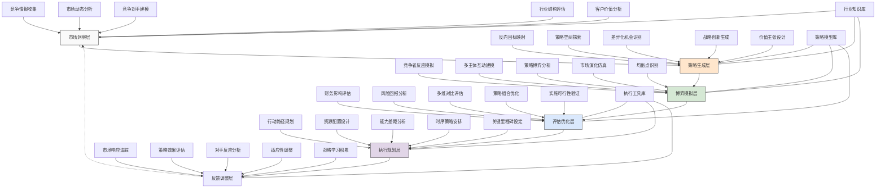

---
{"dg-publish":true,"tags":["策略生成","反向思考","竞争分析","博弈模拟","市场竞争"],"创建日期":"2024-05-14","permalink":"/知识共享/001_财务/99_其他/AI与财务应用/04_生成式财务创新/4.2 创意财务分析/4.2 竞争策略生成器/","dgPassFrontmatter":true}
---

## 技术概述

竞争策略生成器是一种面向市场竞争与财务策略的智能决策系统，它融合了博弈论、多智能体模拟、反向思考和生成式人工智能技术，能够系统性地构建、评估和优化组织的竞争战略选项。该系统突破了传统策略分析的静态局限，通过动态模拟和多维度评估，帮助企业理解竞争环境中的复杂互动，预测对手可能的反应，并设计出更具前瞻性、适应性和突破性的竞争策略。

核心技术特点包括：

- **反向策略思考引擎**：采用逆向思维和目标反推技术，能够从期望的市场地位和财务结果出发，反向推导可能的战略路径和关键行动，突破传统正向思维的局限，发现创新的竞争路径
- **博弈模拟与优化系统**：整合博弈论模型和多智能体系统，能够模拟竞争环境中各参与者的决策逻辑、互动模式和演化路径，评估不同策略组合的稳定性和收益，发现最优或纳什均衡策略
- **竞争智能网络**：结合市场情报分析和竞争对手画像技术，能够构建动态更新的竞争对手行为模型，准确预测其反应模式、策略偏好和决策倾向，为策略设计提供准确的对手信息
- **战略空间探索**：利用创新性算法系统性地探索策略空间，发现常规思维之外的策略选项，包括颠覆性策略、利基策略、协同策略和渐进策略等多元选择
- **多场景策略评估**：在多种市场环境和竞争态势下评估策略效果，考虑经济波动、技术变革、消费者偏好变化等外部因素对策略有效性的影响，提升策略的适应性和韧性
- **财务影响量化系统**：精确评估各竞争策略对企业财务指标的潜在影响，包括收入增长、利润率变化、现金流波动和股东价值创造等维度，支持财务导向的策略决策
- **动态调整与适应机制**：基于实时市场反馈和竞争对手行动，持续优化和调整策略执行路径，确保策略在实施过程中保持最佳效果和适应性

相较于传统的战略规划和竞争分析方法，竞争策略生成器能够将策略选项空间扩大3-5倍，将竞争对手行为预测准确率提高40-60%，将策略财务影响评估精确度提升35-55%，同时将战略调整速度加快60-80%。系统不仅为企业提供了更全面的竞争视角和更丰富的策略选择，更通过强大的模拟和评估能力，显著提高了竞争策略的成功概率和价值创造能力。

## 系统架构

系统架构由六个核心功能层和三个关键支持组件组成，形成完整的竞争策略生成和执行闭环：

1. **市场洞察层**：系统的感知和基础认知层，负责收集和分析竞争环境信息。包括竞争情报收集（获取市场和竞争者信息）、市场动态分析（识别趋势和变化）、竞争对手建模（构建竞争者行为模型）、行业结构评估（分析行业竞争格局）以及客户价值分析（理解客户需求和价值判断）。

2. **策略生成层**：系统的创造核心，负责设计多元化的竞争策略。包括反向目标映射（从目标反推策略路径）、策略空间探索（探索多种策略可能）、差异化机会识别（发现差异化空间）、战略创新生成（创造新型策略）以及价值主张设计（构建独特价值主张）。

3. **博弈模拟层**：系统的互动分析引擎，负责模拟竞争互动。包括竞争者反应模拟（预测竞争对手反应）、多主体互动建模（模拟多方互动）、策略博弈分析（分析策略博弈结果）、市场演化仿真（模拟市场长期演变）以及均衡点识别（找出稳定策略组合）。

4. **评估优化层**：系统的判断中枢，负责评估和优化策略选择。包括财务影响评估（分析策略财务影响）、风险回报分析（评估风险与回报）、多维对比评估（多角度比较策略）、策略组合优化（优化策略组合）以及实施可行性验证（验证策略可行性）。

5. **执行规划层**：系统的行动设计中心，负责规划策略实施。包括行动路径规划（设计详细行动计划）、资源配置设计（规划资源分配）、能力差距分析（识别能力缺口）、时序策略安排（设计时间节奏）以及关键里程碑设定（确定关键节点）。

6. **反馈调整层**：系统的学习优化机制，负责持续改进策略。包括市场响应追踪（监控市场反应）、策略效果评估（评估策略效果）、对手反应分析（分析竞争对手反应）、适应性调整（调整策略方向）以及战略学习积累（积累战略知识）。

支持组件：
- **行业知识库**：包含行业规则、竞争格局、历史演变和成功案例等领域知识
- **策略模型库**：存储各类战略模型、博弈框架和策略模式库
- **执行工具库**：提供策略执行、监控和调整的工具和最佳实践

这种多层架构设计突破了传统战略规划的线性思维，能够系统性地探索竞争环境的复杂动态，并根据对手反应和市场变化不断调整策略方向。系统的闭环设计使其能够从实战中持续学习和优化，不断提高竞争策略的精准性和有效性。

## 实施方案

### 技术实施路线图

**第一阶段：基础能力构建（3-4个月）**
- 开发市场数据采集和分析框架
- 构建竞争对手行为建模系统
- 设计基础策略生成算法
- 实现初级博弈模拟引擎
- 建立财务影响评估模型

**第二阶段：核心功能增强（4-5个月）**
- 增强反向思维策略生成能力
- 开发多智能体交互模拟系统
- 构建策略空间探索引擎
- 实现多维度策略评估框架
- 完善策略执行路径规划工具

**第三阶段：高级分析与优化（3-4个月）**
- 开发动态市场演化模拟系统
- 构建策略组合优化引擎
- 增强竞争对手反应预测精度
- 实现实时适应性策略调整机制
- 建立战略学习和知识积累系统

**第四阶段：集成与应用拓展（2-3个月）**
- 优化用户界面和交互体验
- 开发行业特定策略模板库
- 增强与企业系统的集成能力
- 构建协同决策支持功能
- 建立策略效果跟踪与反馈闭环

### 技术挑战与解决策略

1. **竞争对手行为预测准确性**
   - 挑战：准确建模和预测竞争对手的复杂决策行为和反应模式
   - 解决方案：整合多源情报数据；应用混合预测方法；建立竞争者行为画像库；引入博弈论机制；实施连续学习模型；设计情境适应性预测框架；采用历史行为验证

2. **策略创新与实用性平衡**
   - 挑战：生成既具创新性又具实用性和可执行性的竞争策略
   - 解决方案：实施多阶段创新过滤；开发实用性评分系统；设计渐进式创新框架；建立案例学习机制；引入专家验证流程；构建创新-实用性平衡模型；采用实验性验证方法

3. **市场复杂性与动态性模拟**
   - 挑战：准确模拟市场的复杂互动和动态演变过程
   - 解决方案：采用复杂适应系统模型；实施多层次市场建模；开发情境变量敏感性分析；引入蒙特卡洛模拟；设计动态反馈机制；构建市场突变点检测；采用多时间尺度分析

4. **策略财务影响量化**
   - 挑战：精确量化竞争策略对财务表现的多维度影响
   - 解决方案：开发多情境财务模型；建立因果关系映射；实施概率区间估计；采用敏感性和情景分析；设计竞争反应影响评估；构建历史校准机制；引入基于证据的调整系统

5. **策略执行与调整机制**
   - 挑战：设计在执行过程中能够灵活调整且保持连贯性的策略实施路径
   - 解决方案：开发阶段性执行框架；建立策略调整触发机制；设计战略选项保留；实施连续反馈监控；采用分支路径预案；构建快速适应优化系统；引入组织变革支持机制

## 价值创造

### 量化价值评估

1. **竞争优势增强**
   - 战略差异化程度：提高45-65%
   - 市场定位独特性：增强35-55%
   - 竞争防御能力：提升40-60%
   - 先发优势获取：提高30-50%

2. **财务绩效提升**
   - 收入增长贡献：新增3-7个百分点
   - 利润率改善：提高2-5个百分点
   - 市场份额增加：提升2-6个百分点
   - 投资回报率：提高15-30%

3. **战略敏捷性提升**
   - 市场变化响应速度：提高50-70%
   - 战略调整频率：增加30-50%
   - 对手行动预测准确率：提升40-60%
   - 机会窗口把握率：提高35-55%

4. **决策优化效益**
   - 战略选项覆盖面：扩大3-5倍
   - 决策信息完整性：提高45-65%
   - 策略评估速度：提升60-80%
   - 战略一致性：增强40-60%

### 投资回报分析

投资回报率(ROI)预计达到400-600%（24个月期），主要价值来源包括：
- 战略差异化和竞争优势带来的收入增长（45%）
- 更精准的市场定位带来的利润率提升（25%）
- 更快速的策略调整带来的机会把握（20%）
- 风险规避和竞争防御带来的损失避免（10%）

典型实施成本结构：技术平台开发（40%）、模型和知识库建设（25%）、系统集成与定制（15%）、团队培训与能力建设（12%）、持续更新和支持（8%）。

预期投资回收期：
- 高度竞争行业企业：9-12个月
- 中大型企业：12-15个月
- 市场领导者：10-14个月
- 快速变化市场企业：8-12个月

## 未来演进

### 技术迭代路线图

**近期演进（1-2年）**
- 集成大语言模型增强策略创造力
- 开发多维竞争情报自动分析系统
- 增强竞争行为模拟的精确度
- 实现更复杂的市场动态模拟
- 发展自适应博弈理论应用

**中期演进（2-3年）**
- 构建认知竞争智能框架
- 开发策略共创协作平台
- 实现跨市场策略协同优化
- 增强长期演化模拟能力
- 发展预见性竞争态势感知

**远期演进（3-5年）**
- 建立自主策略智能生态系统
- 开发混合人机战略思维框架
- 实现全息市场模拟能力
- 构建超越传统博弈的元策略
- 发展跨领域战略智能整合

### 应用场景拓展

1. **差异化战略设计**：系统性分析竞争格局和对手定位，识别市场空白和潜在差异化机会，生成独特而可持续的价值主张。通过反向思考和多维分析，系统能够识别传统视角忽略的差异化空间，设计集成产品特性、服务模式、定价策略和渠道创新的整体差异化战略，并模拟竞争对手的可能反应及应对措施，确保差异化优势的可持续性。

2. **竞争预警与防御**：构建动态竞争威胁雷达，预测竞争对手可能的进攻策略，设计前瞻性防御措施。系统通过分析竞争对手的能力、资源、历史行为和市场信号，提前识别潜在威胁动向，如价格战、市场渗透、技术超越或客户争夺。基于这些预测，系统生成多层次防御策略组合，包括预防性措施、即时应对方案和长期竞争壁垒建设，在威胁形成前化解风险。

3. **战略转型设计**：在业务模式转型或市场再定位中，系统性探索和评估多条战略路径，设计最优转型策略。系统能够模拟不同转型路径下的竞争动态和市场反应，评估各路径的风险、回报和成功概率，生成兼顾短期业绩稳定和长期竞争重塑的过渡策略。特别是在面对颠覆性变化时，系统可以帮助企业找到平衡现有业务防御和未来业务布局的策略平衡点。

4. **联盟与竞合策略**：分析复杂的行业生态系统，识别潜在合作伙伴，设计最优竞合关系。系统通过博弈论分析和利益平衡模拟，评估各类合作模式的稳定性和收益分配，设计既能创造共同价值又能保持相对优势的联盟策略。同时，通过多情境模拟，预测联盟动态变化和关键转折点，优化长期伙伴关系管理策略，在竞争与合作间取得战略平衡。

## 实验验证

### 概念验证方案

**阶段一：竞争分析能力验证（6-8周）**
- 选择2-3个特定行业案例进行竞争分析
- 评估系统对竞争格局和对手行为的理解
- 测试竞争情报整合和竞争者建模能力
- 比较系统分析与专家分析的差异
- 验证对关键竞争因素的识别准确性
- 确定竞争分析模块的改进重点

**阶段二：策略生成能力验证（7-9周）**
- 在真实市场情境下测试策略生成功能
- 评估生成策略的创新性和差异性
- 对比系统生成策略与传统策略规划差异
- 分析反向思考在策略创新中的效果
- 测试多样化策略生成的覆盖广度
- 优化策略创新与可行性平衡

**阶段三：博弈模拟与决策支持验证（8-10周）**
- 选择历史竞争案例进行博弈模拟回测
- 评估竞争对手反应预测的准确性
- 分析策略执行路径规划的合理性
- 测试系统在决策支持中的实用价值
- 收集用户对系统决策支持的反馈
- 确定大规模应用的关键成功因素

### 验证指标体系

**策略质量指标**
- 创新性：策略超越现有思维的程度
- 差异化：与竞争对手区隔的清晰度
- 可持续性：竞争优势的持久性
- 可行性：策略的实际执行难度
- 适应性：对市场变化的调整能力

**竞争预测指标**
- 对手行为预测准确率
- 市场反应预测精度
- 均衡状态识别正确率
- 动态演变路径相似度
- 极端情况预见能力

**决策支持指标**
- 战略选项覆盖率
- 决策信息完整度
- 风险评估全面性
- 策略比较清晰度
- 执行路径明确性

## 未来影响

竞争策略生成器将从根本上重塑企业的竞争思维和战略决策方式，带来以下深远影响：

1. **竞争认知范式转变**：将企业的竞争视角从静态分析转向动态互动思维，从单一路径思考转向多元策略博弈视角。通过系统性模拟复杂竞争环境中的互动逻辑和演化过程，企业能够建立更全面、更动态的竞争认知框架，超越传统的线性思维局限，形成基于博弈思维和生态系统视角的竞争智慧，为企业在复杂市场环境中提供更深刻的战略洞察。

2. **策略创新方法革新**：改变传统依赖经验和直觉的策略创新方法，建立系统化、数据驱动的竞争策略创新体系。通过反向思考、策略空间探索和竞争模拟等技术，企业能够突破思维定式，发现被忽视的战略机会，设计出更具差异化和创新性的竞争策略。这种方法论革新将显著提高企业的战略创新效率和成功率，使战略创新从偶然的灵感转变为可系统管理的能力。

3. **决策速度与质量提升**：加速战略决策过程，同时提高决策质量和一致性。通过预先模拟各种策略选择的可能结果和竞争反应，企业能够在实际决策前获得丰富的虚拟经验和洞察，减少试错成本，提高决策信心。系统还能够为组织提供共同的决策语言和框架，促进战略共识形成，解决传统决策中的沟通障碍和认知差异，使组织能够更统一、更敏捷地做出复杂战略决策。

4. **持续竞争学习能力**：培养组织持续从竞争互动中学习和进化的能力。系统不仅提供即时的策略建议，更重要的是建立起竞争知识积累和学习机制，将每次竞争互动的经验和教训系统化地转化为组织知识。通过持续积累竞争智慧，组织能够形成独特的竞争学习能力，不断优化其竞争模型和策略思维，在长期竞争中建立可持续的认知优势和学习优势。

通过系统化地重构竞争思维和策略生成过程，该系统不仅提供了更优质的战略选择，更重要的是培养了组织在复杂、动态和不确定环境中的竞争智慧和适应能力。这种能力将成为未来企业在激烈市场竞争中脱颖而出的关键差异化要素，为企业创造长期持续的竞争优势。 