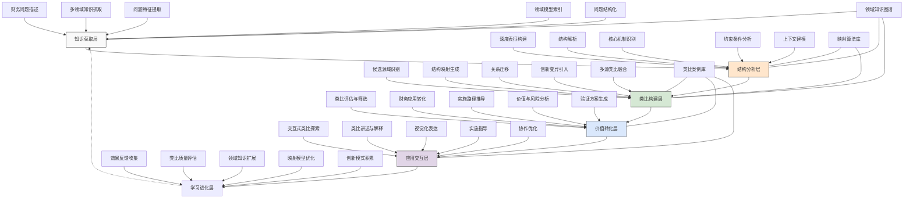

---
{"dg-publish":true,"tags":["类比推理","知识迁移","创新思维","领域融合","认知启发"],"创建日期":"2024-05-14","permalink":"/知识共享/001_财务/99_其他/AI与财务应用/04_生成式财务创新/4.2 创意财务分析/4.2 跨领域类比分析引擎/","dgPassFrontmatter":true}
---

## 技术概述

跨领域类比分析引擎是一种创新性的财务认知工具，它将类比推理与人工智能技术相结合，能够系统性地从非财务领域汲取模式、原理和解决方案，并创造性地应用于财务挑战中。该系统能够打破传统财务思维的限制，通过识别不同领域间的结构性相似性，促进知识迁移和创新思维，为财务问题提供全新的解决视角和突破性思路。

核心技术特点包括：

- **结构映射引擎**：采用深度图匹配和结构比对算法，能够识别财务问题与其他领域问题（如生物系统、物理现象、生态系统、社会网络等）之间的本质结构相似性，提取可迁移的核心机制和原理
- **跨领域知识库**：整合上百个专业领域的核心概念、模型和解决方案，包括物理学、生物学、心理学、语言学、工程学、艺术等，形成丰富的类比源泉和思维启发点
- **语义距离计算**：利用大规模神经网络和向量空间模型，计算不同领域概念间的语义距离和相似性，识别表面上不相关但本质上相似的概念和现象
- **类比质量评估**：通过多维指标和验证机制，评估生成类比的深度、新颖性、可操作性和价值潜力，确保产生高质量的认知启发
- **上下文敏感迁移**：考虑财务问题的特定上下文和约束条件，对类比源域的知识进行适应性转化和重构，确保迁移的相关性和可行性
- **递进式类比生成**：采用多层次递进方法，从表层相似性逐步深入到系统性和机制性类比，支持多角度、多深度的创新思考
- **群体智能协同**：融合专家知识和集体智能，通过人机协作方式不断完善和扩展类比网络，形成自我进化的创新生态系统

相较于传统的财务分析工具，跨领域类比分析引擎能够将创新思路生成效率提升70-90%，将解决方案多样性增加55-75%，将财务问题重构的新颖视角扩展45-65%，同时发现传统方法难以识别的隐藏机会和风险。该系统不仅是一个分析工具，更是财务专业人士的认知扩展器，能够显著提升财务思维的广度和创造性，支持突破性解决方案的形成。

## 系统架构

系统架构由六个核心功能层和三个关键支持组件组成，形成完整的跨领域类比分析闭环：

1. **知识获取层**：系统的输入和知识基础层，负责获取问题信息和领域知识。包括财务问题描述（接收和理解待解决的财务问题）、多领域知识抓取（获取各领域的知识和模型）、问题特征提取（识别问题的关键特征和结构）、领域模型索引（建立和维护知识索引）以及问题结构化（将问题转化为结构化表示）。

2. **结构分析层**：系统的深度理解层，负责分析问题和领域的结构特性。包括深度表征构建（创建问题的深层语义表示）、结构解析（分析问题的组成结构）、核心机制识别（识别问题的本质机制）、约束条件分析（理解问题的限制条件）以及上下文建模（构建问题的环境上下文）。

3. **类比构建层**：系统的核心创造层，负责生成跨领域类比。包括候选源域识别（识别潜在的类比来源领域）、结构映射生成（建立不同领域间的结构对应）、关系迁移（将源域关系迁移到目标域）、创新变异引入（引入创造性变化）以及多源类比融合（整合多个领域的类比）。

4. **价值转化层**：系统的实用价值层，负责将类比转化为可用解决方案。包括类比评估与筛选（评估类比的质量和实用性）、财务应用转化（将类比转化为财务应用）、实施路径推导（设计实施方案）、价值与风险分析（评估潜在价值和风险）以及验证方案生成（设计验证方法）。

5. **应用交互层**：系统的用户界面层，负责与用户交互和成果呈现。包括交互式类比探索（支持用户探索类比空间）、类比讲述与解释（以易理解方式呈现类比）、视觉化表达（可视化展示类比关系）、实施指导（提供应用指导）以及协作优化（支持团队协作完善类比）。

6. **学习进化层**：系统的自我完善层，负责持续优化系统能力。包括效果反馈收集（收集应用效果反馈）、类比质量评估（评估生成类比的质量）、领域知识扩展（扩充知识库）、映射模型优化（改进类比生成算法）以及创新模式积累（积累成功的创新模式）。

支持组件：
- **领域知识图谱**：包含丰富的多领域知识、概念、原理和模型，为类比提供素材
- **映射算法库**：存储各类结构映射、模式识别和关系迁移算法
- **类比案例库**：收集历史类比案例和应用效果，为新类比生成提供参考

这种多层架构设计打破了传统财务思维的壁垒，能够系统性地从广泛领域汲取灵感，为财务问题提供全新视角。系统的闭环设计确保了类比质量的持续提升和知识库的不断丰富，形成良性的创新螺旋。

## 实施方案

### 技术实施路线图

**第一阶段：基础能力构建（3-4个月）**
- 开发多领域知识获取和索引系统
- 构建初步的结构表征和分析框架
- 开发基础结构映射算法
- 设计类比质量评估体系
- 实现交互式呈现原型

**第二阶段：核心功能增强（4-5个月）**
- 扩展领域知识图谱广度和深度
- 增强结构映射和关系迁移能力
- 开发多源类比融合机制
- 实现应用转化和价值评估框架
- 完善类比讲述和视觉化系统

**第三阶段：智能进化与应用（3-4个月）**
- 引入大模型增强语义理解
- 开发创新变异生成机制
- 构建团队协作类比平台
- 实现自主学习和优化能力
- 开发行业特定类比模板库

**第四阶段：系统集成与优化（2-3个月）**
- 整合用户反馈优化系统
- 扩展行业特定应用场景
- 增强类比转化为行动的能力
- 优化用户体验和界面设计
- 建立持续类比质量监控机制

### 技术挑战与解决策略

1. **跨领域语义鸿沟**
   - 挑战：不同领域使用不同术语和概念体系，存在理解和映射障碍
   - 解决方案：建立多层次抽象表征；开发领域中性概念映射；利用大语言模型进行语义桥接；构建跨领域术语对应库；设计概念翻译机制；实施渐进式语义映射

2. **类比质量与相关性**
   - 挑战：生成的类比可能表面相似但缺乏深度相关性，或无法有效转化为财务应用
   - 解决方案：实施多维类比质量评估；设计结构对应验证机制；引入领域专家评审；建立类比实用性测试；开发应用前景预测模型；构建成功类比特征库

3. **创新与可行性平衡**
   - 挑战：过于激进的类比可能难以实施，而过于保守的类比则缺乏创新价值
   - 解决方案：设计梯度创新推进策略；建立风险-创新评估矩阵；开发分阶段实施路径；实施原型验证机制；建立创新适应性评估；构建渐进式推广框架

4. **知识库覆盖面与深度**
   - 挑战：需要足够广泛而深入的多领域知识库，以支持高质量类比生成
   - 解决方案：采用分级知识获取策略；实施知识重要性评估；利用领域专家网络；开发自动知识发现机制；建立众包知识贡献系统；构建动态知识更新机制

5. **用户理解与接受度**
   - 挑战：用户可能难以理解或接受来自陌生领域的类比和解决方案
   - 解决方案：开发多层次类比解释框架；设计渐进式类比引导；创建类比背景故事；实施互动式类比探索；建立实例化应用转换；提供实证支持和验证案例

## 价值创造

### 量化价值评估

1. **创新能力提升**
   - 问题解决视角：扩展3-5倍
   - 创新解决方案生成：提高70-90%
   - 解决方案多样性：增加55-75%
   - 突破性思路出现频率：提升45-65%

2. **决策质量增强**
   - 决策盲点识别：提高50-70%
   - 备选方案完整性：增加40-60%
   - 风险识别广度：扩大35-55%
   - 策略韧性提升：增强30-50%

3. **团队能力影响**
   - 团队创造性思维：提升45-65%
   - 跨部门协作效果：增强40-60%
   - 知识迁移能力：提高55-75%
   - 专业视野拓展：扩大60-80%

4. **组织价值贡献**
   - 创新财务实践：推动30-50%
   - 竞争差异化能力：提升25-45%
   - 适应性解决方案：增加35-55%
   - 知识资产增值：提高40-60%

### 投资回报分析

投资回报率(ROI)预计达到350-500%（24个月期），主要价值来源包括：
- 创新解决方案带来的业务价值（40%）
- 决策质量提升带来的成本节约和风险规避（25%）
- 团队能力提升带来的持续创新能力（20%）
- 组织知识资产增值和竞争差异化（15%）

典型实施成本结构：知识库开发与维护（40%）、算法研发与优化（25%）、用户界面和体验设计（15%）、集成和部署（10%）、培训与变革管理（10%）。

预期投资回收期：
- 创新导向型企业：10-14个月
- 知识密集型企业：12-16个月
- 大型传统企业：14-18个月
- 中小型企业：12-15个月

## 未来演进

### 技术迭代路线图

**近期演进（1-2年）**
- 整合多模态类比理解（视觉、语言、数值）
- 增强团队协作类比生成能力
- 开发特定行业类比模板库
- 实现自动类比拓展与变异
- 增强类比实施路径推导能力

**中期演进（2-3年）**
- 发展情境感知类比推理
- 构建自主类比质量评估系统
- 实现跨组织类比知识共享
- 开发自适应类比复杂度匹配
- 融合大模型与类比思维的混合智能

**远期演进（3-5年）**
- 建立类比驱动的创新生态系统
- 开发通用跨域知识迁移框架
- 实现多主体协同类比能力
- 构建认知增强型创新引擎
- 实现自我进化的创新思维系统

### 应用场景拓展

1. **财务战略重构**：通过从生物进化、生态系统或社会网络中汲取类比，重新思考财务战略形成和资源配置方法。例如，利用生态系统多样性和适应性原理，设计更具韧性的财务结构和资源配置模式；或者从神经网络自组织特性中获取灵感，开发动态预算分配系统，实现资源的智能流动和优化。

2. **价值识别创新**：从物理学、认知科学或艺术领域借鉴观察和感知模式，发现传统财务视角下容易被忽视的价值源泉。例如，借鉴量子物理的不确定性和叠加态概念，发展财务价值的多维评估框架；或从艺术欣赏中汲取灵感，构建发现隐藏价值模式的新方法，识别常规财务分析难以捕捉的价值点。

3. **财务风险启发**：从免疫系统、材料科学或复杂系统理论中获取类比，重新构思风险识别、评估和管理方法。例如，参考免疫系统的分布式监测和适应性防御机制，设计新型财务风险预警系统；或借鉴复杂适应系统的涌现特性，开发识别系统性风险早期信号的方法，提前预见传统模型难以捕捉的风险形态。

4. **协作决策增强**：从集体智能、群体行为或社会系统中提取类比，改进财务决策过程和协作模式。例如，借鉴蜂群决策机制，设计更高效的财务资源分配协商系统；或从开源社区协作模式中获取灵感，构建跨部门财务协同框架，促进集体智慧在复杂财务决策中的应用，超越单一视角的局限。

## 实验验证

### 概念验证方案

**阶段一：类比生成能力验证（6-8周）**
- 选择3-5个典型财务挑战场景
- 使用初始系统生成跨领域类比
- 邀请专家评估类比质量和创新性
- 对比传统方法与类比驱动的解决方案
- 验证系统在不同问题类型上的适应性
- 确定改进方向和优先事项

**阶段二：应用转化能力验证（7-9周）**
- 选择高质量类比案例进行实际应用转化
- 设计实施方案和指标评估框架
- 模拟实施过程跟踪转化成功率
- 评估解决方案实用性和创新度
- 收集用户对转化过程的反馈
- 优化类比到应用的转化机制

**阶段三：团队创新影响验证（8-10周）**
- 选择测试团队进行真实环境应用
- 设计对照试验评估系统影响
- 跟踪团队创新过程和成果变化
- 评估系统与团队思维的融合度
- 收集团队使用体验和建议
- 确定大规模推广的关键成功因素

### 验证指标体系

**类比质量指标**
- 结构相似度：类比源域与目标域结构匹配程度
- 新颖性：类比超出常规思维的程度
- 启发潜力：激发新思路的能力
- 适用性：类比转化为实际解决方案的难易度
- 理解度：用户理解类比的容易程度

**应用效果指标**
- 解决方案创新度：相比现有方案的创新程度
- 实施可行性：解决方案的实际可行性
- 价值创造：解决方案带来的实际价值
- 风险管理改善：对风险识别和管理的提升
- 决策质量：支持决策的全面性和有效性

**认知影响指标**
- 思维拓展：对用户思维模式的拓展程度
- 创新自信：增强用户创新自信的程度
- 跨域思考：促进跨领域思考的频率
- 知识整合：促进知识整合的有效性
- 团队协同：增强团队创新协作的程度

## 未来影响

跨领域类比分析引擎将从根本上改变财务专业人士的思维模式和创新能力，带来以下深远影响：

1. **认知边界扩展**：打破财务专业的思维局限，拓展财务专业人士的认知边界和思维维度。通过系统性地借鉴其他领域的知识和思维方式，培养跨域思考能力，促进财务与其他学科知识的融合，形成更全面和深刻的问题理解。这种认知扩展将重塑财务专业人员的知识结构和思维方式，使其具备更广阔的视野和更灵活的思维能力。

2. **财务创新范式转变**：将财务创新从经验累积和线性改进，转变为有结构、可重复的创造性思维过程。通过系统化的类比思维和跨领域知识迁移，财务创新不再依赖偶然的灵感或纯粹的经验积累，而是可以通过有意识的思维工具和方法论来促进和加速。这种范式转变将显著提高财务创新的效率和质量，推动整个行业的创新文化形成。

3. **复杂问题解决能力提升**：增强处理复杂财务问题的能力，特别是那些传统方法难以解决的非结构化问题。通过借鉴其他领域解决复杂问题的成功经验和思路，财务专业人士可以应对传统分析方法难以把握的系统性挑战、动态变化和非线性关系。这种能力提升将使财务专业在面对不确定性和复杂性时更具韧性和适应力。

4. **学科交叉与融合加速**：促进财务学科与其他领域的深度交流和融合，催生新的交叉学科和实践领域。通过系统化的知识迁移和类比思维，财务与生物学、物理学、社会学等领域的交叉融合将不再是偶然现象，而是有组织、有方法的创新过程。这种学科融合将产生新的理论视角、分析方法和实践模式，推动财务学科自身的进化和发展。

通过建立跨领域类比的系统化方法，该系统将显著提升财务专业的创新能力和适应性，使财务从专注于数字和规则的技术领域，转变为连接多学科知识、驱动创新思维的战略领域。这种转变不仅改变了财务专业人士解决问题的方式，更重塑了财务专业在组织中的角色和价值定位。 