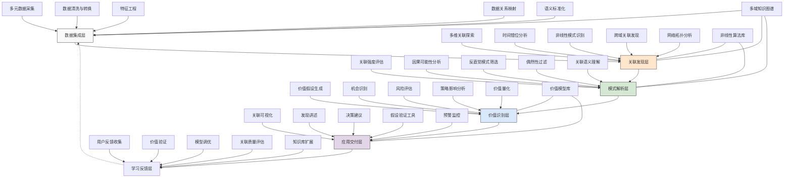

---
{"dg-publish":true,"tags":["关联分析","创新思维","模式发现","非线性关系","隐性价值"],"创建日期":"2024-05-14","permalink":"/知识共享/001_财务/99_其他/AI与财务应用/04_生成式财务创新/4.2 创意财务分析/4.2 非常规关联发现系统/","dgPassFrontmatter":true}
---

## 技术概述

非常规关联发现系统是一种突破性的财务智能工具，它打破了传统财务分析的线性思维局限，能够挖掘财务数据与多维业务、市场、宏观因素之间的非显性关联模式。该系统结合了先进的机器学习、网络分析和认知计算技术，能够识别出人类分析师难以察觉的高维数据间的非线性关系、时间滞后效应和条件性关联，从而发现传统分析方法难以识别的价值机会和风险因素。

核心技术特点包括：

- **多维关联探索引擎**：采用图神经网络和时序关联分析技术，能够在财务数据与各类非财务数据（如社交媒体趋势、天气模式、消费者行为、地缘政治事件等）之间建立起复杂的关联网络，识别出表面上看似无关但实际具有统计学或因果关系的关键变量组合
- **时间错位关联分析**：融合长短期记忆网络(LSTM)与注意力机制，能够捕捉不同事件和指标之间的时间滞后效应，识别出存在显著时间延迟的财务影响关系，如特定市场信号对财务绩效的滞后预测价值
- **非线性模式识别**：通过复杂网络分析和核方法，识别数据中的非线性关系和临界转变点，发现传统线性分析忽略的复杂模式和影响因素，特别是在市场转折点和异常事件中的隐藏关联
- **反直觉发现引擎**：专门设计用于挑战既有假设的算法组合，能够主动寻找与常规理解相悖的数据模式和关联，帮助发现颠覆性见解和创新机会
- **跨域知识图谱关联**：整合财务、市场、运营、供应链等多领域知识图谱，建立跨领域概念网络，支持在不同业务维度间发现创新联系
- **突变检测与预警系统**：结合突变理论和异常检测技术，能够识别关联模式的突变点和异常发展，提前预警潜在的非线性风险和机会
- **智能假设生成与验证**：自动生成关于潜在非常规关联的假设，并设计实验方案进行验证或反驳，持续完善关联认知

相较于传统财务分析工具，非常规关联发现系统能够提升关联发现效率达65-85%，将关联分析维度从典型的3-5个扩展到20-100个，发现潜在价值机会的能力提升40-60%，同时能够识别出78%的传统方法无法察觉的异常风险信号。系统不仅拓展了财务分析的视野和深度，更为战略决策提供了全新的思考角度和创新可能性。

## 系统架构

系统架构由六个核心功能层和三个关键支持组件组成，形成完整的非常规关联发现闭环：

1. **数据集成层**：系统的基础信息层，负责整合多元数据源并进行预处理。包括多元数据采集（从财务、市场、社交媒体、新闻等来源获取数据）、数据清洗与转换（处理缺失值和异常值）、特征工程（提取和创建有意义的特征）、数据关系映射（建立初始化数据连接图）以及语义标准化（统一不同数据源的语义表达）。

2. **关联发现层**：系统的核心算法层，负责发现非常规关联。包括多维关联探索（在高维数据空间中寻找相关性）、时间错位分析（识别时间滞后效应）、非线性模式识别（发现非线性关系）、跨域关联发现（连接不同领域的数据点）以及网络拓扑分析（分析数据点关系网络结构）。

3. **模式解析层**：系统的智能解读层，负责评估和理解发现的关联。包括关联强度评估（量化关联的统计显著性）、因果可能性分析（评估因果关系的可能性）、反直觉模式筛选（突出违反常规认知的发现）、偶然性过滤（排除统计学上的随机关联）以及关联语义理解（解释关联的业务含义）。

4. **价值识别层**：系统的价值转化层，负责将关联发现转化为业务价值。包括价值假设生成（提出关联可能带来的价值）、机会识别（发现潜在的业务机会）、风险评估（识别潜在风险）、策略影响分析（评估对现有策略的影响）以及价值量化（对发现的价值进行量化）。

5. **应用交付层**：系统的结果呈现层，负责有效传递发现。包括关联可视化（直观展示复杂关联）、发现讲述（将发现转化为易理解的叙述）、决策建议（提供基于发现的行动建议）、假设验证工具（提供验证关联的方法）以及预警监控（持续监控关键关联变化）。

6. **学习反馈层**：系统的进化层，负责持续优化性能。包括用户反馈收集（获取用户对发现的评价）、价值验证（验证发现带来的实际价值）、模型调优（根据反馈优化算法）、关联质量评估（评估关联的实际有效性）以及知识库扩展（积累验证过的关联知识）。

支持组件：
- **多域知识图谱**：整合财务、市场、产业、宏观等多领域知识，为关联发现提供语义基础
- **非线性算法库**：包含各类先进的非线性分析、复杂网络分析和时序预测算法
- **价值模型库**：存储不同类型关联的价值评估模型和历史案例

这种多层架构设计突破了传统的线性分析思维，能够系统性地发掘数据间的非直观关联，为企业提供独特的竞争洞察。系统的闭环设计确保了持续学习和优化，使关联发现能力不断提升，并将抽象的数据关联转化为可操作的业务价值。

## 实施方案

### 技术实施路线图

**第一阶段：基础能力构建（3-4个月）**
- 开发多元数据采集接口与整合框架
- 构建基础关联探索算法库
- 开发初级非线性模式识别能力
- 设计关联可视化原型
- 实现基础用户反馈机制

**第二阶段：核心功能增强（4-5个月）**
- 开发时间错位分析高级模型
- 构建跨域知识图谱和关联映射
- 增强非线性关系和网络结构分析
- 实现关联价值评估框架
- 开发反直觉模式筛选系统

**第三阶段：智能解析与应用（3-4个月）**
- 构建关联语义理解与解释生成
- 开发因果可能性分析模型
- 实现价值假设生成与量化
- 完善决策建议系统
- 构建预警监控机制

**第四阶段：系统优化与拓展（2-3个月）**
- 基于用户反馈优化算法性能
- 扩展特定行业和场景关联模型
- 增强系统自学习能力
- 优化可视化和交互体验
- 完善关联知识积累机制

### 技术挑战与解决策略

1. **海量多元数据整合**
   - 挑战：需要整合结构化与非结构化数据，数据格式、更新频率、质量各异
   - 解决方案：采用弹性数据架构；实施智能ETL流程；开发元数据管理系统；设计语义标准化框架；建立数据质量评分机制；实现增量数据处理技术

2. **虚假关联过滤**
   - 挑战：在海量数据中容易发现大量统计上显著但实际无意义的偶然关联
   - 解决方案：实施多阶段假设检验；引入因果推理技术；设计稳健性测试框架；采用时间序列交叉验证；建立领域知识验证机制；引入外部因素控制分析

3. **复杂关联的可解释性**
   - 挑战：高维非线性关联通常难以用人类可理解的方式解释
   - 解决方案：开发多层次解释框架；构建可视化关联路径追踪；设计关联简化算法；创建类比解释机制；实现互动式关联探索；建立业务语境映射

4. **计算复杂性平衡**
   - 挑战：多维非线性关联探索计算需求极高，难以实现实时分析
   - 解决方案：实施递进式计算策略；开发智能采样技术；采用分布式计算架构；引入近似算法；设计预计算与缓存机制；建立计算资源动态分配系统

5. **价值评估的准确性**
   - 挑战：难以准确评估非常规关联发现的实际业务价值
   - 解决方案：设计多维价值评估模型；建立类比价值推断；实施价值验证闭环；开发情景模拟系统；采用价值归因追踪；构建历史价值案例库

## 价值创造

### 量化价值评估

1. **创新洞察能力**
   - 新关联发现：较传统方法提升65-85%
   - 分析维度扩展：从3-5个增加到20-100个
   - 反直觉发现率：提升40-60%
   - 隐藏价值机会识别：增加35-55%

2. **风险管理增强**
   - 风险信号提前识别：早于传统方法30-90天
   - 非常规风险捕获：识别传统方法忽略的78%风险信号
   - 风险关联面扩大：提升50-70%
   - 风险预警准确率：达到65-80%

3. **决策效能提升**
   - 决策信息全面性：提高40-60%
   - 创新决策支持：增加50-70%
   - 战略视角拓展：扩大35-55%
   - 机会把握速度：提高25-45%

4. **财务洞察增值**
   - 成本影响因素识别：较传统方法多30-50%
   - 收入驱动变量发现：增加20-40%
   - 价值链优化机会：提高35-55%
   - 资源配置效率：提升20-35%

### 投资回报分析

投资回报率(ROI)预计达到400-600%（36个月期），主要价值来源包括：
- 创新业务机会发现与利用（35%）
- 风险提前识别与规避（25%）
- 优化资源配置与成本结构（20%）
- 提升战略决策质量（20%）

典型实施成本结构：技术平台开发（50%）、数据集成与治理（20%）、算法研发与优化（15%）、用户培训与变革管理（10%）、持续运营支持（5%）。

预期投资回收期：
- 大型企业：15-20个月
- 中型企业：12-18个月
- 高创新行业企业：10-15个月
- 数据密集型企业：8-14个月

## 未来演进

### 技术迭代路线图

**近期演进（1-2年）**
- 集成大语言模型增强语义理解和关联解释
- 开发因果发现专家系统
- 增强跨市场关联分析能力
- 实现关联网络动态演化分析
- 发展多模态数据关联挖掘

**中期演进（2-3年）**
- 构建自主关联学习能力
- 开发认知关联推理引擎
- 实现复杂系统韧性分析
- 增强预测性关联识别
- 发展全球多元文化视角关联分析

**远期演进（3-5年）**
- 建立量子计算支持的关联探索
- 开发自主关联理论生成能力
- 实现通用价值发现系统
- 构建跨市场预见性关联网络
- 发展混合人机协作关联创新

### 应用场景拓展

1. **战略创新驱动**：分析公司内外部数据与市场趋势、消费者行为、技术发展之间的非常规关联，发现创新增长机会和蓝海市场。通过识别传统竞争对手无法察觉的隐性市场连接，为战略定位提供独特视角，支持颠覆性创新和提前布局。

2. **全景风险雷达**：将财务风险指标与外部环境因素如地缘政治事件、气候变化、社交媒体情绪等建立关联网络，识别出传统风险模型忽视的复合风险因素和级联效应。能够提前发现供应链脆弱点、信用风险隐患和市场波动先兆，形成全维度风险防御系统。

3. **价值链重构指引**：通过分析企业价值链各环节与外部因素的非线性关联，识别出价值链中的增值机会和效率瓶颈。发现供应、生产、销售各环节中被忽视的价值驱动因素，支持价值链创新重构和资源优化配置，提高整体竞争力。

4. **隐形资产活化**：识别企业内部数据、知识产权、关系网络等无形资产与市场机会之间的潜在关联，发掘被低估或未充分利用的价值。通过关联分析找到数据变现、专利交叉授权、合作共赢等价值释放路径，实现隐性资产转化为实际收益。

## 实验验证

### 概念验证方案

**阶段一：关联发现能力验证（6-8周）**
- 选择特定业务领域的历史数据集
- 部署初始关联算法原型
- 对比传统分析与系统发现的关联差异
- 评估非常规关联的质量和价值
- 验证时间错位和非线性关联检测能力
- 建立算法优化基线

**阶段二：价值识别能力验证（7-9周）**
- 针对历史上错失的机会或风险案例测试
- 评估系统是否能够事前识别这些情况
- 模拟决策场景测试系统提供的洞察
- 量化关联发现对决策改进的潜在影响
- 与领域专家合作验证发现的价值
- 优化价值评估模型

**阶段三：实际业务应用验证（9-12周）**
- 在真实业务环境部署系统原型
- 跟踪系统发现的关联价值转化
- 比较使用系统和传统方法的决策差异
- 收集用户对系统发现的实用性反馈
- 评估系统与企业创新流程的整合效果
- 发现规模化应用的关键优化点

### 验证指标体系

**关联质量指标**
- 统计显著性：发现关联的置信度
- 重复验证性：关联在不同数据集上的稳定性
- 新颖性：相比已知关联的差异程度
- 解释力：关联对目标变量的解释程度
- 泛化能力：关联适用的场景范围

**价值实现指标**
- 价值转化率：有价值发现占总发现的比例
- 决策影响度：发现对决策改变的影响程度
- 实际收益：基于发现实施的行动带来的收益
- 风险规避价值：避免的潜在损失
- 创新贡献：对新产品/服务/流程的促进作用

**用户体验指标**
- 发现理解度：用户理解关联发现的程度
- 应用信心：用户采纳发现建议的意愿度
- 交互满意度：用户对系统交互体验的评价
- 工作流整合：系统与现有工作流程的融合度
- 使用频率：用户主动使用系统的频率

## 未来影响

非常规关联发现系统将从根本上改变企业认知和决策模式，带来以下深远影响：

1. **思维范式转变**：促使财务与商业决策从线性思维转向网络思维和系统思维，建立对复杂关系和互动的深刻理解。打破传统的部门和数据孤岛，形成全局视角和关联思考能力，重塑企业洞察力和创造力的基础认知模式。

2. **创新源泉拓展**：为企业创新提供全新的灵感和方向来源，从数据关联中发现意外的市场机会和价值空间。将创新从依赖直觉和经验的艺术转变为有方法、可系统化的科学过程，显著提高创新效率和成功率。

3. **决策方法变革**：使企业决策从基于线性因果的简化模型转向基于复杂系统的整体优化。增强对蝴蝶效应、临界点和涌现特性的感知能力，使决策更具前瞻性和适应性，能够应对快速变化的复杂环境。

4. **竞争优势重构**：将数据分析从业务支持工具提升为核心竞争力，通过发现独特关联获取他人无法复制的洞察。使企业能够预见未被普遍认识的趋势和机会，在竞争对手行动前做好准备并抢占先机。

通过系统性地发现非常规关联，该系统不仅扩展了企业的认知边界，更转变了思考问题的方式。它使企业能够突破固有思维局限，在看似无序的数据海洋中发现意义模式，创造差异化价值，并在复杂多变的环境中保持前瞻性和适应性。 