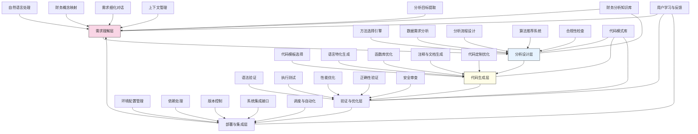

---
{"dg-publish":true,"tags":["代码生成","定制分析","财务编程","分析自动化","低代码工具"],"创建日期":"2024-05-14","permalink":"/知识共享/001_财务/99_其他/AI与财务应用/04_生成式财务创新/4.3 自定义分析工具/4.3 代码生成分析助手/","dgPassFrontmatter":true}
---

## 技术概述

代码生成分析助手是一个革命性系统，通过先进的人工智能技术，使财务专业人员能够直接从自然语言描述生成高质量的分析代码。该平台弥合了财务领域专业知识与技术实现之间的鸿沟，使财务专家无需深入编程技能，即可快速开发定制化分析模型和自动化工作流程。系统采用领先的代码生成AI技术，经过财务领域专门优化，可精确理解财务术语、分析需求和计算逻辑，生成符合行业标准的高效代码。核心技术特点包括：

- **财务特化的语言理解**：通过针对财务术语、概念和分析模式的专门训练，系统精确理解资产定价、风险管理、财务报表分析等专业需求，将专业描述转化为精确程序逻辑
- **多范式代码生成**：支持从简单的数据转换到复杂的统计建模的广泛分析需求，生成Python、R、SQL等多种语言的代码，以及Excel公式、Power BI脚本和财务专用分析工具脚本
- **交互式代码构建**：采用人机协作方式，通过自然对话式交互，引导用户逐步精确分析需求，解释技术选择，并根据反馈调整生成代码
- **知识增强分析设计**：集成财务理论、行业实践和分析最佳范例，提供方法论建议，确保生成的分析流程在统计上合理且财务上有意义
- **代码解释与学习**：为生成的代码提供详细解释和教育内容，帮助用户理解技术原理，逐步培养编程能力，实现从辅助到赋能的过渡

相较于传统开发方法，代码生成分析助手将定制分析工具的开发周期缩短75-90%，降低了技术依赖性，同时提高了代码质量和一致性。重要的是，系统保持了分析的可解释性和可审计性，确保在自动化效率提升的同时，满足财务领域对透明度和准确性的严格要求。通过将先进AI与财务专业知识深度融合，系统实现了财务分析从标准化到个性化、从依赖外部技术支持到财务专业人员自主实现的根本转变。

## 系统架构

系统架构由五个核心功能层和三个关键支持组件构成，形成从需求理解到代码部署的完整闭环：

1. **需求理解层**：系统的认知前端，负责理解用户的分析意图。包括自然语言处理（解析用户描述）、财务概念映射（将财务术语转换为技术概念）、需求细化对话（交互式精确需求）、上下文管理（维护会话历史和项目背景）以及分析目标提取（识别关键绩效指标和决策目标）。

2. **分析设计层**：系统的方法论中枢，负责设计分析方案。包括方法选择引擎（选择适当的统计或分析方法）、数据需求分析（确定所需数据和格式）、分析流程设计（构建端到端工作流程）、算法推荐系统（建议最适合的算法）以及合规性检查（确保符合财务规范和标准）。

3. **代码生成层**：系统的技术核心，负责产生高质量代码。包括代码模板选择（选择最适合的代码框架）、语言特化生成（为目标编程语言优化）、函数库优化（选择最高效库）、注释与文档生成（创建详细说明）以及代码定制优化（针对特定环境优化）。

4. **验证与优化层**：系统的质量保障中心，确保代码可靠性。包括语法验证（检查代码语法）、执行测试（验证功能正确性）、性能优化（改进执行效率）、正确性验证（确保分析准确性）以及安全审查（检查安全漏洞）。

5. **部署与集成层**：系统的实现接口，负责代码的实际应用。包括环境配置管理（准备运行环境）、依赖处理（管理外部依赖）、版本控制（代码版本管理）、系统集成接口（与现有系统连接）以及调度与自动化（设置自动执行）。

支持组件：
- **财务分析知识库**：存储财务理论、方法论、行业标准和最佳实践
- **代码模式库**：收集经验证的代码模板、组件和解决方案模式
- **用户学习与反馈**：捕获用户反馈、记录学习曲线和适应用户偏好

整体架构设计围绕"理解-设计-生成-验证-部署"的完整闭环，不仅关注代码生成，还涵盖了从需求分析到实际应用的全流程，确保生成的分析代码既技术上合理，又满足实际业务需求。系统通过持续学习用户交互和分析实践，不断优化生成过程和结果质量。

## 实施方案

### 技术实施路线图

**第一阶段：基础能力构建（3-4个月）**
- 开发财务领域特化的自然语言理解模型
- 构建基础代码生成引擎与模板库
- 实现主要分析类型的代码生成能力（描述统计、时间序列、回归分析）
- 开发核心编程语言支持（Python、SQL）
- 构建基础验证与测试框架

**第二阶段：分析深度提升（4-5个月）**
- 增强高级财务分析方法支持（风险模型、资产定价、财务建模）
- 扩展编程语言与平台覆盖（R、Excel高级公式、Power BI/Tableau脚本）
- 开发方法论推荐与优化系统
- 增强交互式需求精确化功能
- 构建代码解释和教育内容生成

**第三阶段：系统整合与优化（3-4个月）**
- 实现企业系统集成框架
- 开发完整的代码版本控制与管理
- 增强代码优化与性能调优能力
- 构建高级安全性和合规性验证
- 实现自适应学习与个性化系统

**第四阶段：扩展与应用优化（2-3个月）**
- 开发协作与团队功能
- 构建分析资产库与共享机制
- 实现高级工作流自动化与调度
- 优化用户体验与界面设计
- 建立企业级权限与治理框架

### 技术挑战与解决策略

1. **财务分析逻辑的准确转换**
   - 挑战：财务分析包含复杂计算逻辑和领域规则，难以从自然语言准确转换为代码
   - 解决方案：构建财务特化的语义解析模型；开发财务计算逻辑形式化表示；建立财务概念到代码结构的映射库；设计交互式逻辑确认机制；实现渐进式需求精确化；构建分析逻辑验证系统

2. **生成代码的质量与性能**
   - 挑战：自动生成的代码需满足专业水准，包括效率、可读性和可维护性
   - 解决方案：建立高质量代码模板库；实现多级代码优化引擎；采用财务分析专用库和优化模式；设计代码质量评估框架；实现自动重构与优化；建立专家审核反馈循环

3. **分析正确性保障**
   - 挑战：确保生成的财务分析在统计学和财务理论上的正确性和可靠性
   - 解决方案：整合财务理论验证规则；实现假设检验和边界条件测试；建立结果可视化与验证系统；设计多模型对比机制；构建敏感性分析自动化；实现结果合理性检查

4. **技术和业务语言的鸿沟**
   - 挑战：财务用户和技术语言之间存在概念和表达差异，影响需求转换准确性
   - 解决方案：开发双向翻译层；构建财务-技术概念映射词典；实现交互式概念澄清；设计可视化需求确认；建立领域特定语言；提供多层次解释系统

5. **系统集成与环境复杂性**
   - 挑战：生成的代码需在多样化技术环境中无缝运行，并与现有系统集成
   - 解决方案：开发环境检测与适配系统；建立多平台部署框架；实现依赖管理自动化；设计API集成模板库；构建隔离测试环境；提供渐进式集成路径

## 价值创造

### 量化价值评估

1. **效率与速度提升**
   - 分析工具开发时间：减少75-90%
   - 从需求到实现周期：缩短80-95%
   - 代码迭代与优化速度：提高65-85%
   - 定制分析实现成功率：提升50-70%

2. **分析质量与复杂度**
   - 可实现分析复杂度：提高40-60%
   - 错误与缺陷率：降低45-65%
   - 分析一致性与可复制性：提升60-80%
   - 代码性能与效率：提高35-55%

3. **资源与依赖优化**
   - 对专业开发人员依赖：减少70-90%
   - IT部门工作负荷：降低40-60%
   - 技术培训需求：减少35-50%
   - 系统维护成本：降低30-45%

4. **创新与业务价值**
   - 分析创新实施速度：提高55-75%
   - 定制分析应用频率：增加60-80%
   - 数据驱动决策范围：扩大45-65%
   - 财务见解深度：提升40-60%

### 投资回报分析

投资回报率(ROI)预计达到300-500%（24个月期），主要价值来源包括：
- 开发成本与时间节省（40%）
- 分析范围与深度扩展（25%）
- 决策质量与速度提升（20%）
- 资源优化与重新分配（15%）

典型实施成本结构：技术平台开发（45%）、模型训练与优化（25%）、系统集成与定制（15%）、培训与变革管理（10%）、持续支持与维护（5%）。

预期投资回收期：
- 大型企业：9-15个月
- 中型企业：6-12个月
- 小型企业：5-9个月
- 金融服务企业：7-12个月
- 技术密集型组织：6-10个月

## 未来演进

### 技术迭代路线图

**近期演进（1-2年）**
- 扩展高级财务分析方法库（衍生品定价、资产负债管理、信用风险建模）
- 增强多语言支持与跨平台代码生成
- 开发端到端分析流程自动化
- 实现自适应学习与个性化代码生成
- 构建可视化分析流程设计

**中期演进（2-3年）**
- 建立模型驱动的代码生成架构
- 开发智能代码重构与持续优化
- 实现多用户协作与知识共享功能
- 构建高级分析解释与可解释性工具
- 融合模拟与优化技术于代码生成

**远期演进（3-5年）**
- 发展基于意图的全自动分析系统
- 实现认知增强的财务分析助手
- 开发自主学习与适应性代码生成
- 构建跨系统分析整合与协同
- 创建高度个性化的分析生态系统

### 扩展应用场景

1. **财务研究实验室**：为财务研究人员提供快速实验环境，通过简单描述即可生成复杂分析脚本，测试新理论和方法，加速研究周期，降低技术壁垒，促进财务理论创新与验证

2. **监管报告自动化工厂**：开发专门针对金融监管需求的代码生成系统，自动生成满足不断变化的监管报告要求的代码，确保合规性，减少手动调整，提高报告准确性和效率

3. **投资策略原型工具**：为投资专业人员创建专用环境，快速从投资理念生成策略测试代码，支持回测、风险评估和优化，缩短投资策略从概念到实施的周期，增强策略迭代能力

4. **财务教育与能力建设平台**：将系统扩展为学习工具，通过代码生成与解释帮助财务专业人员理解编程概念，提供渐进式学习路径，将系统从代码生成工具转变为全面能力建设平台

## 实验验证

### 概念验证方案

**阶段一：核心功能验证（6-8周）**
- 选择3-5个典型财务分析场景（如投资组合分析、财务预测、风险评估）
- 收集相关分析需求描述样本
- 测试需求理解和代码生成准确性
- 评估生成代码的质量和功能完整性
- 与手动编写代码对比分析
- 收集初步用户反馈并调整模型

**阶段二：用户交互与适应性验证（8-10周）**
- 招募不同技术水平的财务专业人员参与
- 设计真实分析任务测试场景
- 评估系统交互性和需求精确化能力
- 测试不同分析复杂度的处理能力
- 收集用户体验数据和改进建议
- 优化对话流程和用户界面

**阶段三：企业环境集成验证（10-12周）**
- 在选定业务部门部署试点系统
- 连接企业数据源和分析环境
- 测试与现有系统的集成效果
- 评估实际业务问题解决能力
- 测量工作流程改进和效率提升
- 制定全面部署和培训计划

### 评估指标框架

**技术性能指标**
- 需求理解准确率：系统正确理解分析需求的比例
- 代码生成成功率：成功生成可执行代码的比例
- 代码质量评分：基于可读性、效率和结构的综合评分
- 功能实现完整度：满足原始需求的功能覆盖率
- 执行效率：生成代码的运行性能评估

**用户体验指标**
- 使用满意度：用户体验和结果满意程度
- 学习曲线斜率：用户熟练使用系统所需时间
- 交互效率：完成需求到代码转换的交互次数
- 自主使用率：用户无需支持独立使用系统的能力
- 持续使用意愿：用户继续使用系统的意向强度

**业务价值指标**
- 开发时间节省：相比传统方法节省的时间百分比
- 分析应用扩展：新增定制分析应用的数量和范围
- 技术依赖减少：对专业开发资源请求的减少率
- 创新速度：从概念到实现分析创新的周期缩短
- 决策支持改进：基于系统分析的决策质量提升

## 未来影响

代码生成分析助手将从根本上改变财务分析的技术实现模式，带来以下深远影响：

1. **分析民主化与能力解放**：消除编程技能壁垒，使所有财务专业人员都能实现其分析愿景，将分析能力从技术精英扩展到整个财务组织，释放被技术限制所抑制的创新潜能

2. **财务与技术融合加速**：缩小财务专业知识与技术实现之间的鸿沟，加速先进分析技术在财务领域的应用，创造更深层次的学科交叉创新，推动财务职能数字化转型

3. **分析敏捷性与个性化**：从依赖标准化工具向高度定制化分析模式转变，使财务团队能快速响应新问题和情境，提高组织对市场变化和机会的响应能力，增强竞争优势

4. **知识累积与组织学习**：将个人分析知识转化为可共享的数字资产，促进组织级知识管理和最佳实践传播，建立自我学习和不断进化的分析能力，提升整体财务智能

通过重新定义谁能创建分析代码以及如何创建，代码生成分析助手不仅解决了技术实现问题，更改变了财务与技术的关系模式。它将使财务专业人员从被动接受预设工具的用户，转变为积极定义和创造分析解决方案的主导者，从而推动财务职能从事务处理向战略价值创造的根本转型。 