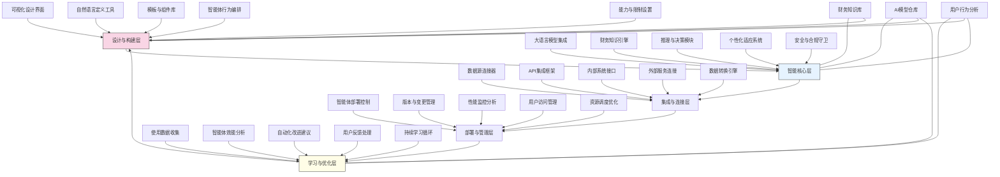

---
{"dg-publish":true,"tags":["智能体设计","个性化助手","财务自动化","大语言模型","自定义工具"],"创建日期":"2024-05-14","permalink":"/知识共享/001_财务/99_其他/AI与财务应用/04_生成式财务创新/4.3 自定义分析工具/4.3 财务智能体设计器/","dgPassFrontmatter":true}
---

## 技术概述

财务智能体设计器是一个革命性平台，使财务专业人员能够设计、构建和部署高度个性化的财务智能体，无需编程知识。该系统整合了最新的大语言模型技术、领域专用知识图谱和自适应学习算法，打造财务智能体的全生命周期管理环境。通过直观的可视化界面和自然语言指令，财务用户可快速构建智能体，执行从数据分析、报告生成到战略建议等多样化财务任务。系统的核心技术特点包括：

- **自然语言智能体定义**：运用语义理解和意图识别技术，将用户的自然语言描述转换为精确的智能体功能定义和行为模式，无需技术编码
- **多模型组合架构**：采用模块化设计，整合专用大语言模型、领域知识模型、预测分析模型和数据处理组件，构建多层次智能架构
- **自动化知识摄取**：配备知识抓取系统，能自动从企业财务规则、行业标准、法规文件和内部知识库中提取和结构化关键知识
- **个性化适应机制**：通过持续学习算法捕捉用户使用模式、偏好和反馈，实现智能体的自我调优和用户风格适应
- **多系统集成框架**：提供全面的API连接能力和预配置连接器，支持与ERP、BI工具、财务数据库和第三方财务系统的无缝集成

相较于传统AI助手或自动化工具，财务智能体设计器实现了从通用工具到专属智能助手的跨越，提高了财务分析和决策效率45-60%，减少了数据处理时间65-80%，增强了决策准确性25-40%，同时将个性化定制开发成本降低70-85%。该系统通过民主化AI技术，使每位财务专业人员都能打造适合自身工作场景的高级智能助手，从而显著提升财务团队的数字化能力和战略价值。

## 系统架构

系统架构由五个核心功能层和三个关键支持组件组成，形成智能体设计与优化的闭环生态：

1. **设计与构建层**：系统的创意枢纽，为用户提供直观工具构建智能体。包含可视化设计界面（拖拽式智能体构建）、自然语言定义工具（将文本指令转化为功能规范）、模板与组件库（预配置模块集合）、智能体行为编排（定义工作流程和决策逻辑）和能力与限制设置（配置智能体权限与行为边界）

2. **智能核心层**：系统的大脑，处理智能体的认知与决策功能。包括大语言模型集成（连接专用的财务大模型）、财务知识引擎（专业知识处理与应用）、推理与决策模块（逻辑推导和决策形成）、个性化适应系统（根据用户特征调整行为）和安全与合规守卫（确保操作符合规定与安全标准）

3. **集成与连接层**：系统的神经网络，实现数据流通与系统互联。包括数据源连接器（接入各类财务数据源）、API集成框架（标准化接口协议）、内部系统接口（与企业内部系统连接）、外部服务连接（接入第三方服务）和数据转换引擎（处理各类数据格式转换）

4. **部署与管理层**：系统的运行控制中心，管理智能体的生命周期。包括智能体部署控制（管理部署流程）、版本与变更管理（跟踪更新与版本控制）、性能监控分析（监测运行状态）、用户访问管理（控制使用权限）和资源调度优化（优化计算资源分配）

5. **学习与优化层**：系统的进化引擎，促进持续改进。包括使用数据收集（智能体互动数据捕获）、智能体效能分析（评估性能与价值）、自动化改进建议（生成优化建议）、用户反馈处理（整合显性反馈）和持续学习循环（应用学习成果改进智能体）

支持组件：
- **财务知识库**：储存结构化的财务专业知识、规则、最佳实践和行业标准
- **AI模型仓库**：管理各类预训练模型、微调模型和特定任务模型
- **用户行为分析**：捕捉和分析用户交互模式，支持个性化和用户体验优化

整体架构形成一个有机生态系统，支持智能体从设计、构建到部署、学习的完整生命周期，确保财务智能体能够持续进化并适应不断变化的业务需求。

## 实施方案

### 技术实施路线图

**第一阶段：基础平台构建（3-4个月）**
- 开发核心设计界面与自然语言定义工具
- 搭建基础大语言模型集成框架
- 实现基本财务知识引擎
- 构建初级数据连接能力
- 开发智能体部署基础架构

**第二阶段：核心功能开发（4-5个月）**
- 增强智能体设计与构建工具
- 开发高级财务知识处理能力
- 实现多系统集成框架与连接器
- 构建智能体管理与监控系统
- 开发初级学习与优化功能

**第三阶段：高级功能与智能化（3-4个月）**
- 实现智能体行为高级编排功能
- 开发个性化适应与学习系统
- 增强安全与合规管理能力
- 构建高级分析与优化引擎
- 实现复杂场景智能体协作功能

**第四阶段：系统优化与扩展（2-3个月）**
- 性能优化与规模化支持
- 增强用户体验与界面设计
- 开发高级模板与组件库
- 构建智能体生态市场
- 实现端到端测试与质量保障

### 技术挑战与解决策略

1. **自然语言理解的精确性**
   - 挑战：财务领域专业术语和上下文理解的复杂性，影响智能体定义的准确转化
   - 解决方案：开发财务专用语义理解模型；构建领域术语知识库；实现上下文增强理解算法；设计混合理解策略（规则+AI）；建立持续学习与优化机制；提供交互式澄清与确认流程

2. **知识整合与更新**
   - 挑战：财务知识分散、更新频繁，且存在跨地区差异，需要有效整合和维护最新规则
   - 解决方案：建立自动化知识抓取系统；开发规则变更检测机制；实现知识图谱自动更新；构建冲突规则解决框架；建立专家审核与校验流程；发展跨地区知识适配机制

3. **个性化与通用性平衡**
   - 挑战：需在满足个性化需求的同时，保持足够的通用性和可重用性
   - 解决方案：设计分层智能体架构（通用核心+个性化层）；开发模块化组件系统；实现情境自适应能力；建立智能体模板与变体管理；设计特征提取与个性化算法；创建用户偏好学习系统

4. **系统集成的复杂性**
   - 挑战：企业财务生态多样且复杂，智能体需要与众多异构系统无缝协作
   - 解决方案：开发标准化API网关；建立灵活数据转换层；实现智能适配器框架；设计渐进式集成策略；构建安全认证与权限管理；提供集成测试与监控工具

5. **安全与合规保障**
   - 挑战：财务智能体需处理敏感数据,同时确保合规操作，面临严格的安全合规要求
   - 解决方案：实施多层次安全架构；开发行为边界控制系统；建立合规检查点机制；设计审计跟踪与记录；实现数据加密与隐私保护；构建智能化异常检测系统

## 价值创造

### 量化价值评估

1. **效率提升与自动化**
   - 财务数据处理时间：减少65-80%
   - 重复性任务自动化：提高75-90%
   - 报告生成效率：提升60-75%
   - 分析周期时间：缩短50-65%

2. **决策质量与精准度**
   - 财务分析准确性：提高25-40%
   - 预测模型精度：提升30-45%
   - 异常检测能力：增强40-60%
   - 决策支持质量：提高35-50%

3. **知识管理与传承**
   - 专业知识捕获率：提高55-70%
   - 最佳实践应用：增强45-60%
   - 知识共享效率：提升50-65%
   - 新员工适应速度：加快60-75%

4. **创新与战略价值**
   - 财务团队战略参与：增加40-55%
   - 创新解决方案生成：提升45-60%
   - 业务洞察发现：增强35-50%
   - 财务流程再造：加速50-65%

### 投资回报分析

投资回报率(ROI)预计达到350-500%（24个月期），主要价值来源包括：
- 人力资源优化与再分配（35%）
- 分析决策质量提升（25%）
- 流程自动化与效率提升（20%）
- 错误减少与风险降低（15%）
- 创新增强与知识资产增值（5%）

典型实施成本结构：平台技术开发（45%）、系统集成与定制（25%）、知识库建设与维护（15%）、培训与变革管理（10%）、运营与持续优化（5%）。

预期投资回收期：
- 大型企业：8-12个月
- 中型企业：6-10个月
- 小型企业：5-8个月
- 金融服务企业：7-11个月
- 制造业企业：9-14个月

## 未来演进

### 技术迭代路线图

**近期演进（1-2年）**
- 集成多模态交互能力（语音、视觉、文本融合）
- 开发自主智能体编排引擎
- 实现跨智能体协作与任务委派
- 增强上下文理解与意图识别
- 开发高级财务模拟与预测功能

**中期演进（2-3年）**
- 构建自主学习与自我改进智能体
- 开发认知架构增强的决策系统
- 实现自动化假设生成与验证
- 融合因果推理与反事实分析
- 构建智能体生态市场与共享经济

**远期演进（3-5年）**
- 发展通用财务智能体架构
- 实现全自主认知智能体
- 开发智能体协作与自组织网络
- 构建混合人机团队协同框架
- 创建智能体元设计与自进化系统

### 扩展应用场景

1. **财务决策辅助生态**：构建由多个专业智能体组成的决策支持系统，覆盖从数据收集、分析、情景生成到建议形成的完整决策生命周期，实现财务决策的全流程智能增强

2. **智能财务教练**：开发个性化学习智能体，为财务专业人员提供持续学习和技能提升支持，根据个人知识缺口、学习风格和职业发展目标定制学习路径和内容

3. **财务创新实验室**：创建专用创新智能体，帮助财务团队突破传统思维限制，通过组合不同领域知识、应用类比推理和假设测试，发现新的财务管理方法和业务价值机会

4. **智能化财务伦理顾问**：开发专注于伦理和合规的智能体，帮助财务团队在创新和决策过程中评估潜在的伦理风险、合规问题和监管挑战，平衡创新与责任

## 实验验证

### 概念验证方案

**阶段一：智能体设计与构建能力验证（6-8周）**
- 选择2-3个典型财务场景（如现金流分析、费用审核、报告生成）
- 招募不同技术背景的财务人员参与测试
- 评估智能体设计工具的易用性和功能完整性
- 测量从需求描述到智能体构建完成的时间和准确度
- 收集用户反馈并调整设计界面和流程

**阶段二：智能体知识与决策能力验证（8-10周）**
- 部署第一批智能体处理真实财务数据（使用沙盒环境）
- 评估知识应用准确性和决策建议质量
- 测试智能体在不同情境下的适应能力
- 与传统分析方法的结果进行对比
- 收集智能体性能数据并优化知识引擎和决策模块

**阶段三：系统集成与实际应用验证（10-12周）**
- 将智能体与企业实际系统集成测试
- 在监督环境下执行端到端业务流程
- 评估集成稳定性、数据处理效率和结果准确性
- 测试自适应学习能力和个性化效果
- 验证价值实现和用户满意度
- 制定全面推广和迭代计划

### 评估指标框架

**技术性能指标**
- 设计完成时间：完成智能体设计所需的平均时间
- 功能准确率：智能体实现设计意图的准确程度
- 知识应用准确性：财务知识应用的正确率
- 集成成功率：与外部系统集成的成功完成率
- 学习速度：智能体行为适应用户偏好的速度

**业务价值指标**
- 时间节省：与传统方法相比节省的工作时间
- 错误减少率：减少人为错误的百分比
- 决策准确性：智能体决策与专家决策的一致性
- 满意度指数：用户满意度评分
- 创新贡献：智能体生成的创新见解和方案数量

**长期影响指标**
- 角色转型：财务人员从执行角色转向战略角色的比例
- 数字化成熟度：整体财务团队数字化能力提升程度
- 知识资产增长：组织财务知识库的扩展和应用率
- 流程改进：重新设计和优化的流程数量
- 业务价值创造：财务团队对业务决策的影响力提升

## 未来影响

财务智能体设计器将从根本上改变财务专业人员的工作方式和价值定位，带来以下深远影响：

1. **财务角色的根本性转变**：从交易处理和报告生成转向战略顾问和业务伙伴，随着智能体接管例行任务，财务专业人员将专注于高价值工作，如战略决策、业务合作和创新思考

2. **AI民主化与专业赋能**：打破技术壁垒，使每位财务人员都能创建和应用AI工具，不再依赖IT部门或数据科学家，显著加速财务部门的数字化转型和创新步伐

3. **知识资本化与流程重塑**：将隐性财务知识转化为结构化数字资产，推动财务流程的根本性重新思考和设计，创建智能化、自适应的财务运营模式

4. **协作模式变革**：建立人类与AI智能体共同组成的增强型财务团队，重新定义工作分配、协作流程和绩效评估，创造人机协同的全新组织形态

通过使财务专业人员从技术使用者转变为技术创造者，财务智能体设计器不仅提高了运营效率，更从根本上增强了财务职能的战略影响力和创新能力，为企业在复杂多变的商业环境中提供更具前瞻性和洞察力的财务领导。智能体技术将与财务专业深度融合，形成一种新型财务工作范式，使财务部门从成本中心转变为价值创造的核心引擎。 