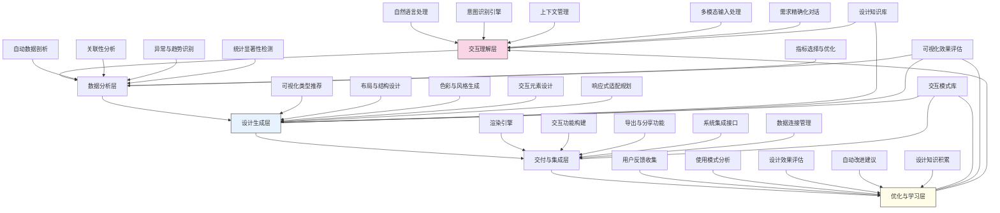

---
{"dg-publish":true,"tags":["仪表板生成","自动设计","数据可视化","交互分析","自适应界面"],"创建日期":"2024-05-14","permalink":"/知识共享/001_财务/99_其他/AI与财务应用/04_生成式财务创新/4.3 自定义分析工具/动态仪表板生成器/","dgPassFrontmatter":true}
---

## 技术概述

动态仪表板生成器是一个智能化平台，通过AI和生成式设计技术，彻底改变了财务数据可视化和仪表板构建方式。该系统能根据用户需求、数据特征和分析目标，自动设计并生成高度交互式的财务仪表板，无需专业可视化技能。平台整合自然语言处理、自动化数据分析和设计智能，使财务专业人员只需描述所需见解，即可获得专业级数据可视化和分析界面。系统的核心技术特点包括：

- **语义理解与意图识别**：应用先进的自然语言理解技术，将用户的对话式请求转化为精确的可视化需求和分析目标，支持复杂查询和多层次分析意图
- **智能数据分析与见解提取**：自动识别数据特性、关联性和异常，提炼关键见解和模式，确定最具价值的可视化方向和焦点
- **生成式可视化设计**：基于视觉认知原理和数据可视化最佳实践，自动生成最适合特定数据和分析目标的图表类型、布局和交互设计
- **上下文感知与用户适应**：根据用户角色、历史交互和偏好，动态调整可视化复杂度、详细程度和专业术语，提供个性化体验
- **实时交互与深度探索**：支持自然语言驱动的动态交互，包括数据钻取、筛选、比较和假设分析，实现无代码的深度数据探索

相较于传统BI工具，动态仪表板生成器将仪表板创建时间缩短80-95%，降低了专业技能要求，同时提高分析深度和见解发现率35-60%。系统通过自适应设计确保所有财务受众都能有效参与数据分析，不论其技术背景如何，实现了数据驱动决策的全面民主化。特别是在财务环境中，系统能够理解并正确处理专业财务概念、计算逻辑和行业标准，使生成的仪表板既符合业务需求，又满足财务规范和实践。

## 系统架构

系统架构由五个核心功能层和三个支持组件组成，形成智能化仪表板设计与优化的闭环系统：

1. **交互理解层**：系统的输入处理中心，负责解析和理解用户需求。包括自然语言处理（解析用户描述和命令）、意图识别引擎（识别分析目标和期望洞察）、上下文管理（维护对话和分析连贯性）、多模态输入处理（处理文本、语音和草图输入）以及需求精确化对话（通过引导性问题澄清需求）。

2. **数据分析层**：系统的智能分析核心，负责深入理解数据并提取关键信息。包括自动数据剖析（识别数据特征和结构）、关联性分析（发现变量间关系）、异常与趋势识别（检测重要模式）、统计显著性检测（验证发现的有效性）和指标选择与优化（确定最具信息量的指标）。

3. **设计生成层**：系统的创意中心，负责设计视觉表达和用户体验。包括可视化类型推荐（选择最适合的图表类型）、布局与结构设计（安排界面元素）、色彩与风格生成（创建视觉主题）、交互元素设计（设计筛选和探索界面）和响应式适配规划（确保多设备兼容性）。

4. **交付与集成层**：系统的实现中心，负责将设计转化为实际产品。包括渲染引擎（生成最终可视界面）、交互功能构建（实现用户交互功能）、导出与分享功能（支持多格式输出）、系统集成接口（与其他系统连接）和数据连接管理（维护数据源连接）。

5. **优化与学习层**：系统的进化引擎，负责持续改进和适应。包括用户反馈收集（捕获显性和隐性反馈）、使用模式分析（识别使用习惯）、设计效果评估（评估可视化效果）、自动改进建议（提出优化方案）和设计知识积累（丰富系统知识库）。

支持组件：
- **设计知识库**：存储可视化设计原则、财务数据表达规范和行业最佳实践
- **交互模式库**：收集有效的用户交互模式、探索路径和分析流程
- **可视化效果评估**：提供客观评估仪表板效果的框架和指标

整体架构形成闭环反馈系统，通过持续学习用户交互和偏好，不断优化设计能力，同时积累财务领域专用的可视化知识，确保生成的仪表板既美观专业，又符合财务分析的实际需求。

## 实施方案

### 技术实施路线图

**第一阶段：基础能力建设（3-4个月）**
- 开发核心自然语言理解组件
- 构建基本数据分析引擎
- 开发初级可视化推荐系统
- 实现标准仪表板渲染功能
- 开发基础数据连接适配器

**第二阶段：智能设计增强（4-5个月）**
- 优化意图识别与分析需求解析
- 增强数据洞察自动提取能力
- 开发高级布局与美学设计引擎
- 实现交互式探索界面生成
- 构建设计知识库与学习系统

**第三阶段：高级交互与适应（3-4个月）**
- 开发多模态输入理解系统
- 增强上下文感知与连续对话能力
- 实现个性化与用户适应机制
- 开发高级数据钻取与探索功能
- 构建实时仪表板调整能力

**第四阶段：系统整合与优化（2-3个月）**
- 实现多系统集成与数据源扩展
- 优化性能与响应速度
- 完善反馈收集与质量评估机制
- 开发使用模式分析与智能建议
- 构建企业级部署与管理功能

### 技术挑战与解决策略

1. **需求理解的歧义性**
   - 挑战：财务用户描述的可视化需求通常含糊不清，存在多种解释可能性
   - 解决方案：实现多轮澄清对话；构建财务领域专用意图模型；开发基于示例的需求推断；建立财务术语映射库；实施假设验证机制；提供可视化预览与快速反馈

2. **数据复杂性与质量挑战**
   - 挑战：财务数据通常复杂多样，存在缺失值、异常值和不同粒度问题
   - 解决方案：开发智能数据预处理流水线；实现自动数据质量评估；建立缺失值和异常处理策略；开发跨粒度数据整合技术；构建财务数据特征识别模型；提供数据限制透明度提示

3. **可视化设计的专业性**
   - 挑战：有效的财务可视化需要平衡专业性、美观性和可理解性
   - 解决方案：构建财务专用可视化模式库；开发基于财务认知研究的设计规则；实现竞争性设计生成与评估；建立行业标准符合性检查；设计角色适应性表达系统；提供设计理由解释机制

4. **交互复杂度与用户体验**
   - 挑战：提供足够强大的交互能力，又不增加使用复杂度
   - 解决方案：实现渐进式功能展示；开发上下文敏感的交互提示；建立使用行为模型与预测；设计自适应界面复杂度；实现自然语言驱动的交互；构建引导式探索路径

5. **企业系统集成与安全**
   - 挑战：需与现有财务系统安全集成，处理敏感数据的同时确保性能
   - 解决方案：开发标准化连接器框架；实现数据访问权限管理；建立本地计算与缓存策略；设计增量数据更新机制；构建数据隐私保护层；提供审计跟踪与使用监控

## 价值创造

### 量化价值评估

1. **效率与生产力提升**
   - 仪表板创建时间：减少80-95%
   - 数据可视化迭代周期：缩短70-85%
   - 报告生成效率：提高65-80%
   - 分析准备工作：减少50-70%

2. **分析质量与深度改进**
   - 数据洞察发现率：提高35-60%
   - 异常与机会识别：增强40-65%
   - 决策支持质量：提升30-50%
   - 分析深度与广度：拓展45-70%

3. **知识民主化与访问**
   - 数据分析参与度：提高60-80%
   - 自助分析能力：增强70-90%
   - 跨部门数据共享：提升50-75%
   - 分析技能门槛：降低75-90%

4. **敏捷响应与决策加速**
   - 分析需求响应时间：缩短65-85%
   - 数据更新到洞察周期：减少55-75%
   - 财务情境变化适应：提高45-65%
   - 决策周期：缩短35-55%

### 投资回报分析

投资回报率(ROI)预计达到280-450%（18个月期），主要价值来源包括：
- 分析师时间节省与重新分配（40%）
- 决策质量提升与风险降低（25%）
- 机会识别与价值发现（20%）
- IT开发与维护成本降低（15%）

典型实施成本结构：技术平台开发（50%）、数据连接与集成（20%）、培训与变革管理（15%）、运营与支持（10%）、持续优化（5%）。

预期投资回收期：
- 大型企业：7-10个月
- 中型企业：5-8个月
- 小型企业：3-6个月
- 金融服务企业：6-9个月
- 数据密集型组织：4-7个月

## 未来演进

### 技术迭代路线图

**近期演进（1-2年）**
- 开发多模态输入系统（语音、草图识别）
- 实现实时协作仪表板环境
- 增强预测性和规范性分析生成
- 开发拖放式深度定制能力
- 实现增强现实(AR)可视化预览

**中期演进（2-3年）**
- 构建自主学习设计引擎
- 开发情感感知与响应系统
- 实现跨设备沉浸式体验
- 融合高级模拟与情景分析
- 建立可视化叙事自动生成

**远期演进（3-5年）**
- 发展认知增强型可视化
- 实现意图预测与先发分析
- 开发自主设计转型能力
- 构建多感官数据体验
- 创建适应性财务智能环境

### 扩展应用场景

1. **决策情境仿真环境**：创建融合历史数据、市场趋势和预测模型的交互式决策环境，允许财务团队在安全空间测试不同决策方案，可视化评估潜在结果和风险，优化战略与策略选择

2. **融合物理-数字财务体验**：通过增强现实技术，将数字化财务仪表板与物理会议空间融合，创造团队协作的沉浸式数据体验，支持直观手势交互和空间化数据探索，增强团队决策过程

3. **嵌入式数据叙事生成**：为业务文档、演示和报告自动生成上下文相关的交互式数据可视化，将静态报告转变为动态探索工具，根据受众和目标自适应调整复杂度和焦点

4. **个人财务顾问界面**：为财务顾问和客户之间的互动创建定制化可视化界面，使复杂财务概念、投资组合表现和风险评估变得直观可理解，增强顾问-客户沟通和信任建立

## 实验验证

### 概念验证方案

**阶段一：基础能力验证（6-8周）**
- 选择3-5个典型财务分析场景（如预算分析、趋势报告、差异分析）
- 收集真实财务数据集（脱敏处理）
- 测试自然语言到可视化的转化准确性
- 评估自动生成仪表板的质量和相关性
- 与手动创建的专业仪表板进行对比
- 收集初步用户反馈并优化核心功能

**阶段二：用户体验与有效性验证（8-10周）**
- 招募不同角色的财务用户（分析师、管理者、利益相关者）
- 安排引导式和自主探索测试
- 评估不同技能水平用户的使用效果
- 测试交互功能和探索能力
- 对比传统方法与新系统在洞察发现效率上的差异
- 收集详细用户反馈并优化交互和设计

**阶段三：实际业务环境验证（10-12周）**
- 在选定业务单位部署试点系统
- 连接实际生产数据源
- 观察日常业务决策中的应用情况
- 评估长期使用价值和适应性
- 测量业务影响和效率提升
- 制定全面推广策略和优化路线图

### 评估指标框架

**技术性能指标**
- 需求理解准确率：系统正确理解用户意图的比例
- 设计生成速度：从需求到仪表板生成的平均时间
- 可视化合理性：生成设计符合专业标准的比例
- 数据洞察准确性：自动提取的洞察与专家分析的匹配度
- 系统响应性：交互操作的响应时间和流畅度

**用户体验指标**
- 使用难度评分：不同用户群体的学习曲线评估
- 满意度指数：用户对生成结果的满意程度
- 功能充分性：系统功能满足需求的覆盖率
- 交互效率：完成分析任务所需的步骤和时间
- 采纳意愿：用户继续使用和推荐系统的意愿

**业务价值指标**
- 时间节省：与传统方法相比节省的工作时间
- 分析频率：使用数据分析支持决策的频率变化
- 洞察质量：发现有价值业务洞察的数量和质量
- 决策信心：使用系统后决策者信心水平的变化
- 财务影响：通过改进分析带来的可量化财务收益

## 未来影响

动态仪表板生成器将从根本上改变财务数据分析和决策的方式，带来以下深远影响：

1. **分析民主化与能力扩展**：彻底消除技术障碍，使每个财务专业人员都能创建专业级分析工具，释放组织中被技术限制所抑制的分析潜能，形成更广泛的数据驱动文化

2. **从被动报告到主动探索**：改变财务可视化的基本范式，从静态、预定义的报告转向动态、交互式的探索环境，鼓励好奇心驱动的分析和深入发现

3. **缩短洞察到行动的周期**：显著缩短从数据到决策的时间，通过消除技术瓶颈和简化分析流程，实现近实时的业务响应能力，增强组织敏捷性

4. **认知增强与人机协同**：建立人类分析师与AI系统的新型协作关系，融合人类的领域专业知识与AI的模式识别能力，创造超越单独人类或机器能力的分析成果

通过重新定义财务数据如何被呈现、探索和理解，动态仪表板生成器不仅是工具创新，更是思维方式的变革。它将数据可视化从技术专家的专属领域转变为普遍可用的认知工具，使每位财务专业人员都能将注意力从"如何创建可视化"转向"从数据中发现什么"，从而释放组织的集体智慧和创新潜能。 