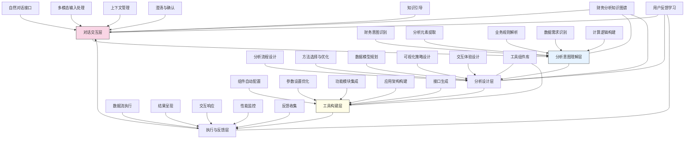

---
{"dg-publish":true,"tags":["工具生成","自定义分析","自然语言","分析构建","无代码分析"],"创建日期":"2024-05-14","permalink":"/知识共享/001_财务/99_其他/AI与财务应用/04_生成式财务创新/4.3 自定义分析工具/自然语言定义分析工具/","dgPassFrontmatter":true}
---

## 技术概述

自然语言定义分析工具是一个创新平台，使财务专业人员能够完全通过自然语言对话创建复杂的财务分析应用，彻底消除技术障碍。该系统将对话式指令直接转化为功能完整的分析工具，无需任何编程或技术配置，使专业财务知识能够立即实现为实用分析解决方案。平台融合了尖端对话理解技术、财务领域特化模型和自动化应用构建引擎，使普通的对话转变为精确的分析定义与执行。系统的核心技术特点包括：

- **意图驱动的分析定义**：采用深度语义理解技术识别用户描述中的分析意图、数据需求和业务规则，将模糊表述转化为精确的分析结构，无需专业术语或格式化输入
- **自动化分析流构建**：基于用户描述自动设计和构建分析流程，包括数据准备、转换、计算、汇总和可视化环节，形成完整的端到端分析应用
- **递进式精确化对话**：通过智能引导和提问，帮助用户逐步明确和完善分析需求，解决分析设计中的歧义性和不确定性问题
- **上下文感知分析演进**：维护对话历史和分析背景，支持渐进式定义和修改，使复杂分析能够通过多轮对话逐步构建和完善
- **可视化确认与反馈**：提供即时视觉反馈和交互式确认，使用户能够验证系统对需求的理解并引导后续分析定义

相较于传统分析工具开发方法，自然语言定义分析工具将分析应用创建时间缩短90-98%，使没有技术背景的财务专业人员能够独立创建复杂分析，同时保持了分析的专业质量和业务适用性。系统不仅是创建工具的工具，更是重新定义了财务分析从概念到实现的整个流程，将传统的技术开发转变为直接的专业表达，使财务专家真正掌握分析应用的定义权和创造力。

## 系统架构

系统架构由五个核心功能层和三个关键支持组件组成，形成从对话到工具生成的完整闭环：

1. **对话交互层**：系统的用户界面，负责处理与用户的自然交流。包括自然对话接口（处理文本对话）、多模态输入处理（接收语音和图像输入）、上下文管理（维护对话历史和状态）、澄清与确认（处理歧义和不确定性）以及知识引导（提供专业建议和最佳实践）。

2. **分析意图理解层**：系统的认知核心，负责解读用户的专业需求。包括财务意图识别（理解分析目标）、分析元素提取（识别关键指标和维度）、业务规则解析（理解约束和条件）、数据需求识别（确定所需数据源和字段）以及计算逻辑构建（形成计算和转换规则）。

3. **分析设计层**：系统的方法论引擎，负责设计分析解决方案。包括分析流程设计（规划分析步骤和顺序）、方法选择与优化（确定最佳分析方法）、数据模型规划（设计数据结构和关系）、可视化策略设计（选择最有效的可视化方式）以及交互体验设计（规划用户交互元素）。

4. **工具构建层**：系统的实现中心，负责创建实际分析工具。包括组件自动配置（设置分析组件参数）、参数设置优化（优化性能和准确度）、功能模块集成（组合功能模块）、应用架构构建（创建整体应用结构）以及接口生成（设计用户界面）。

5. **执行与反馈层**：系统的运行与评估环节，负责工具运行和反馈收集。包括数据流执行（运行分析流程）、结果呈现（展示分析结果）、交互响应（处理用户交互）、性能监控（评估运行状况）以及反馈收集（获取用户评价）。

支持组件：
- **财务分析知识图谱**：包含财务概念、分析方法、业务规则和最佳实践的结构化知识库
- **工具组件库**：预配置的分析组件、可视化模块和功能构建块的集合
- **用户反馈学习**：捕获用户反馈并用于持续优化系统理解和生成能力

整体架构设计实现了从用户自然语言描述到功能完整分析工具的无缝转换，系统通过持续学习和知识积累，不断提高对财务领域需求的理解能力和工具生成的准确性。闭环设计确保用户反馈直接影响未来的工具生成，形成持续改进的良性循环。

## 实施方案

### 技术实施路线图

**第一阶段：基础能力构建（3-4个月）**
- 开发财务领域特化的自然语言理解模型
- 构建财务分析知识图谱初版
- 实现基础分析流程自动设计功能
- 开发核心工具组件库和集成机制
- 建立初步对话交互框架

**第二阶段：智能理解增强（4-5个月）**
- 优化财务意图和需求提取能力
- 扩展财务分析知识图谱广度和深度
- 增强上下文理解和多轮对话能力
- 开发智能澄清和引导机制
- 实现复杂业务规则解析功能

**第三阶段：工具生成高级化（3-4个月）**
- 开发高级分析流程自动设计能力
- 增强组件选择和参数优化机制
- 实现复杂分析应用架构生成
- 开发自适应界面设计和交互生成
- 构建端到端的应用测试和验证框架

**第四阶段：系统优化与完善（2-3个月）**
- 实现高级个性化和适应性功能
- 优化系统性能和响应速度
- 增强多模态输入处理能力
- 完善用户反馈和持续学习机制
- 开发企业级集成和治理功能

### 技术挑战与解决策略

1. **财务分析需求表达的多样性**
   - 挑战：不同用户使用不同表达方式和专业术语描述分析需求，增加理解难度
   - 解决方案：建立财务术语同义词库；开发上下文感知的语义理解；实现表达规范化引擎；设计多样化示例学习；构建表达模式识别模型；提供交互式澄清机制

2. **分析复杂性与完整性平衡**
   - 挑战：自然语言描述通常不够完整和精确，难以直接转化为严谨的分析定义
   - 解决方案：设计递进式对话策略；开发智能默认值推断；实现分析完整性检查；建立基于知识的补充机制；构建分析模式库；提供可视化需求确认

3. **工具生成的质量保障**
   - 挑战：自动生成的工具需要满足专业质量和性能标准，确保分析结果可靠
   - 解决方案：建立多层质量验证框架；开发内置测试案例生成；实现自动优化引擎；设计结果合理性检查；构建业务规则验证系统；提供人工监督与干预机制

4. **用户体验与专业性平衡**
   - 挑战：既要保持简单直观的对话式交互，又要支持复杂专业分析的定义
   - 解决方案：设计分层交互模式；开发适应性对话流程；实现渐进式复杂度展示；建立专业概念解释机制；构建可视化辅助理解；提供多级用户模式

5. **知识更新与系统适应**
   - 挑战：财务分析方法和实践不断演进，系统需与时俱进
   - 解决方案：构建持续学习架构；开发知识自动更新机制；实现使用模式分析；设计分布式知识贡献；建立专家反馈通道；提供定期知识库更新

## 价值创造

### 量化价值评估

1. **效率与响应性提升**
   - 分析工具创建时间：减少90-98%
   - 分析需求响应周期：缩短85-95%
   - 分析迭代速度：提高70-90%
   - 创新实施速度：加快60-80%

2. **专业能力扩展**
   - 自主分析能力：提高75-90%
   - 复杂分析可达性：增强60-80%
   - 分析方法应用范围：扩大50-75%
   - 专业深度探索：提升45-65%

3. **资源优化与成本降低**
   - 技术开发依赖：减少80-95%
   - 分析开发成本：降低70-85%
   - 培训投入需求：减少50-70%
   - 维护与支持成本：降低55-75%

4. **决策质量与业务价值**
   - 数据驱动决策频率：提高55-75%
   - 分析深度与准确性：提升40-60%
   - 业务洞察发现率：增加45-65%
   - 决策响应时间：缩短50-70%

### 投资回报分析

投资回报率(ROI)预计达到350-550%（24个月期），主要价值来源包括：
- 分析工具创建效率提升（35%）
- 技术开发成本减少（30%）
- 决策效率与质量改善（20%）
- 创新能力与应用扩展（15%）

典型实施成本结构：技术平台开发（40%）、知识库与组件构建（25%）、系统集成与定制（15%）、培训与变革管理（12%）、持续优化与支持（8%）。

预期投资回收期：
- 大型企业：8-12个月
- 中型企业：6-9个月
- 小型企业：4-7个月
- 金融服务企业：6-10个月
- 分析密集型组织：5-8个月

## 未来演进

### 技术迭代路线图

**近期演进（1-2年）**
- 增强多模态输入理解（语音、文档、图示）
- 开发协作式分析定义功能
- 实现预测意图识别与主动建议
- 增强跨系统分析整合能力
- 构建分析模板共享市场

**中期演进（2-3年）**
- 开发认知增强型对话体验
- 实现高度个性化的适应学习
- 构建自主优化分析引擎
- 增强情境感知和业务敏感性
- 发展跨领域分析创新能力

**远期演进（3-5年）**
- 实现自主分析探索与发现
- 开发完全自主的分析生态系统
- 构建混合智能分析协作环境
- 实现认知级业务理解与应用
- 创建财务智能助手网络

### 扩展应用场景

1. **跨部门分析协作平台**：使不同专业背景(财务、营销、运营、人力)的团队成员能够通过自然语言共同定义综合性分析应用，各方只需表达专业领域需求，系统自动整合为统一分析工具，打破传统分析孤岛，促进多维度业务优化

2. **灵活监管报告生成系统**：为金融机构建立能快速适应监管变化的报告系统，通过对新规则的自然语言描述，自动调整报告结构和计算逻辑，确保合规性的同时显著降低适应成本和实施时间

3. **财务情景模拟实验室**：创建基于对话的"假设检验"环境，使财务团队能通过简单语言表述提出假设情景和变量关系，系统自动构建模拟模型，实现快速业务假设验证和风险评估

4. **个性化投资分析平台**：为投资顾问构建能根据自然语言需求定义的客户分析工具，根据客户特定情况和目标，快速生成定制化的投资分析应用，提升客户服务个性化程度和响应速度

## 实验验证

### 概念验证方案

**阶段一：基础理解能力验证（6-8周）**
- 收集100-150个典型财务分析需求描述样本
- 测试系统对分析元素和意图的提取准确性
- 评估系统对不同表达方式的理解能力
- 测量需求理解与澄清能力
- 对比人工理解与系统理解的差异
- 根据结果优化语义理解模型

**阶段二：工具生成能力验证（8-10周）**
- 选择25-30个代表性分析场景
- 测试从自然语言到分析工具的转换完整性
- 评估生成工具的功能准确性和完整性
- 检验生成工具的用户界面和交互设计
- 对比生成工具与专业开发工具的质量差异
- 收集用户反馈并改进工具生成引擎

**阶段三：实际业务应用验证（10-12周）**
- 在3-5个财务团队中部署试用系统
- 支持真实业务分析需求的实现
- 评估系统在实际环境中的适应性和实用性
- 测量生产力提升和用户满意度
- 收集长期使用反馈和改进建议
- 制定全面推广和持续优化计划

### 评估指标框架

**技术性能指标**
- 需求理解准确率：系统正确识别分析意图和元素的比例
- 工具生成完整性：生成工具满足需求的功能覆盖率
- 澄清效率：解决需求歧义所需的交互轮数
- 生成时间：从需求描述到工具生成的平均时间
- 运行可靠性：生成工具的稳定性和错误率

**用户体验指标**
- 表达自由度：用户表达需求的灵活性和自然程度
- 学习曲线：用户掌握系统使用的时间和难度
- 满意度评分：用户对系统功能和生成结果的评价
- 交互顺畅度：对话流程的连贯性和自然程度
- 功能发现率：用户能成功表达和实现的功能比例

**业务价值指标**
- 开发效率提升：与传统方法相比的时间节省
- 自主分析能力：无需技术支持完成的分析比例
- 分析应用扩展：新增分析应用的数量和类型
- 决策支持改善：基于生成工具做出决策的频率
- 创新实施速度：从想法到分析实现的周期缩短

## 未来影响

自然语言定义分析工具将从根本上改变财务分析应用的创建方式，带来以下深远影响：

1. **创新表达方式的转变**：从"如何实现"到"想要什么"的范式转变，使分析创新直接以业务思维表达，无需转换为技术需求，大幅提高创意实现率，缩短创新周期

2. **分析民主化与技能再定义**：彻底打破技术壁垒，使分析能力取决于业务理解而非技术掌握程度，重新定义财务分析师角色，强调财务洞察和业务理解而非工具使用能力

3. **组织决策流程重塑**：通过即时创建分析工具的能力，使决策过程从预先定义的指标转向动态探索模式，支持更灵活、精准的业务决策，提高组织对变化的响应速度

4. **集体智慧的释放与捕获**：使每位财务专业人员的分析理念都能转化为实用工具，促进知识共享和最佳实践传播，将个人专业知识转变为组织数字资产，形成持续积累的分析资产库

通过使分析工具的创建过程与专业表达合为一体，自然语言定义分析工具不仅解决了技术实现的问题，更从根本上改变了财务专业人员与数据、分析和决策的关系。这种转变将推动财务部门从报告和控制中心向价值创造引擎的转型，在数据驱动的商业环境中发挥更核心的战略作用。 