---
{"dg-publish":true,"tags":["数据管道","实时处理","批处理","Lambda架构","数据流编排"],"创建日期":"2024-05-14","permalink":"/知识共享/001_财务/99_其他/AI与财务应用/05_财务人工智能系统架构/5.1 技术架构设计/5.1 实时-批处理混合管道/","dgPassFrontmatter":true}
---

## 技术概述

实时-批处理混合管道是一种高度专业化的财务数据处理架构，通过融合批处理与流处理技术，为现代财务AI系统提供统一、灵活且强大的数据基础。该架构突破了传统财务数据处理的限制，将历史数据的全面分析能力与实时数据的即时洞察融为一体，使财务部门能够同时获得数据完整性和时效性的双重优势，满足从合规报告到实时决策的全谱系需求。

核心技术特点包括：

- **统一语义层架构**：建立跨批处理和流处理的统一数据模型和语义定义，解决了两种处理模式间的数据不一致问题，确保无论是历史分析还是实时监控，都基于相同的业务定义和计算逻辑
- **智能管道编排系统**：采用声明式配置与智能编排引擎，自动根据数据特性、处理需求和系统负载，决定数据处理路径和计算策略，优化整体处理效率
- **增量计算引擎**：针对财务数据特有的累积性和时间敏感性，开发专用增量计算模型，实现大规模历史数据与新增数据的高效融合计算
- **多精度处理框架**：支持同一数据流的多种精度级别处理，可根据场景需求平衡计算速度与准确性，如交易欺诈检测优先实时近似结果，财务报表则确保完整准确
- **弹性一致性模型**：提供从最终一致性到强一致性的可配置一致性级别，根据不同财务场景的合规与时效需求，灵活调整数据处理策略
- **端到端可追溯性**：实现从数据源到结果应用的全链路血缘追踪，满足财务数据审计与合规要求，支持任何数据点的处理来源与计算过程验证
- **适应性处理调度**：基于负载感知和优先级策略的智能调度系统，在资源有限的情况下确保关键财务处理优先完成，同时最大化整体吞吐量

相较于传统分离的批处理或单纯的流处理方案，实时-批处理混合管道降低了40-60%的端到端数据延迟，提高了30-50%的数据处理资源效率，减少了50-70%的数据不一致率，同时增强了系统的扩展性和可靠性。这一架构特别适合需要同时进行历史数据全面分析与实时监控预警的现代财务场景，如实时财务状况监控、动态风险评估和智能财务预测等。

## 系统架构

```mermaid
graph TD
    A[数据源层] --> B[摄取与预处理层]
    B --> C1[批处理路径]
    B --> C2[流处理路径]
    C1 --> D[融合与协调层]
    C2 --> D
    D --> E[服务与交付层]
    
    A1[企业财务系统] --> A
    A2[交易处理系统] --> A
    A3[外部市场数据] --> A
    A4[业务运营系统] --> A
    A5[实时传感数据] --> A
    
    B1[数据质量验证] --> B
    B2[格式转换] --> B
    B3[路径智能分流] --> B
    B4[优先级分配] --> B
    B5[元数据提取] --> B
    
    C11[分布式存储] --> C1
    C12[大规模并行处理] --> C1
    C13[复杂聚合计算] --> C1
    C14[历史数据整合] --> C1
    C15[完整性校验] --> C1
    
    C21[实时消息队列] --> C2
    C22[流处理引擎] --> C2
    C23[窗口化计算] --> C2
    C24[状态管理] --> C2
    C25[实时阈值监控] --> C2
    
    D1[结果协调引擎] --> D
    D2[数据合并策略] --> D
    D3[一致性保证] --> D
    D4[冲突解决] --> D
    D5[版本控制] --> D
    
    E1[查询服务] --> E
    E2[可视化接口] --> E
    E3[分析API] --> E
    E4[报表生成] --> E
    E5[事件触发器] --> E
    
    F[管道治理框架] --- A
    F --- B
    F --- C1
    F --- C2
    F --- D
    F --- E
    
    G[弹性计算资源层] --- B
    G --- C1
    G --- C2
    G --- D
    G --- E
    
    H[端到端监控系统] --- A
    H --- B
    H --- C1
    H --- C2
    H --- D
    H --- E
    
    I[数据血缘与审计] --- B
    I --- C1
    I --- C2
    I --- D
    I --- E
    
    style A fill:#f9f9f9,stroke:#333,stroke-width:1px
    style B fill:#e1d5e7,stroke:#333,stroke-width:1px
    style C1 fill:#d5e8d4,stroke:#333,stroke-width:1px
    style C2 fill:#dae8fc,stroke:#333,stroke-width:1px
    style D fill:#ffe6cc,stroke:#333,stroke-width:1px
    style E fill:#fff2cc,stroke:#333,stroke-width:1px
```

系统架构由五个核心层次和四个贯穿性服务组成，形成完整的混合数据处理框架：

1. **数据源层**：负责连接和获取各类财务相关数据。包括企业财务系统（如ERP、会计系统）、交易处理系统（如支付系统、银行交易）、外部市场数据（如汇率、股价）、业务运营系统（如CRM、销售系统）以及实时传感数据（如POS终端、物联网设备）。

2. **摄取与预处理层**：负责数据的初步处理和路由分配。包括数据质量验证（确保数据的完整性和有效性）、格式转换（统一数据格式）、路径智能分流（决定数据走批处理还是流处理路径）、优先级分配（设定处理优先级）以及元数据提取（记录数据特征和处理要求）。

3. **批处理路径**：处理高容量、非实时敏感的数据。包括分布式存储（高效存储大规模数据）、大规模并行处理（高吞吐量计算）、复杂聚合计算（支持深度分析）、历史数据整合（完整数据视图构建）以及完整性校验（确保数据完整无误）。

4. **流处理路径**：处理实时性要求高的数据流。包括实时消息队列（数据流传输）、流处理引擎（实时计算逻辑）、窗口化计算（时间和事件窗口处理）、状态管理（维护计算状态）以及实时阈值监控（异常情况检测）。

5. **融合与协调层**：整合批处理和流处理的结果。包括结果协调引擎（合并不同路径结果）、数据合并策略（批流结果融合逻辑）、一致性保证（确保数据一致性）、冲突解决（处理批流结果冲突）以及版本控制（维护数据版本）。

6. **服务与交付层**：向下游应用提供处理结果。包括查询服务（支持灵活查询）、可视化接口（数据可视化）、分析API（应用程序接口）、报表生成（自动化报告）以及事件触发器（基于结果触发行动）。

贯穿性服务：
- **管道治理框架**：确保整个数据管道的治理、合规和安全，包括数据处理策略、访问控制和合规检查
- **弹性计算资源层**：为各处理环节提供动态可扩展的计算资源，确保处理能力能够应对峰值负载
- **端到端监控系统**：提供从数据摄取到服务交付的全过程监控，确保系统健康和性能最优
- **数据血缘与审计**：跟踪数据全生命周期的来源和转换过程，支持财务审计和合规需求

这种多层次融合架构既保留了批处理的大规模数据处理能力和完整性保证，又结合了流处理的实时响应能力，通过融合层的智能协调实现了最佳的财务数据处理平衡点，为财务AI应用提供了既全面又及时的数据基础。

## 实施方案

### 技术实施路线图

**第一阶段：基础设施与框架部署（2-3个月）**
- 评估现有数据流和处理需求
- 建立批处理基础架构和框架
- 部署流处理引擎和消息系统
- 设计统一数据模型和语义层
- 实施基础监控和日志系统

**第二阶段：路径开发与整合（3-4个月）**
- 开发批处理核心组件和计算模型
- 实现流处理逻辑和状态管理
- 构建路径分流和优先级策略
- 开发数据融合与协调机制
- 实施数据血缘追踪系统

**第三阶段：高级功能与优化（2-3个月）**
- 实现多精度处理框架
- 开发增量计算引擎
- 构建适应性调度系统
- 实施弹性一致性模型
- 开发端到端可追溯性功能

**第四阶段：集成与应用连接（2-3个月）**
- 集成财务数据源系统
- 开发服务层API和交付接口
- 构建报表和可视化功能
- 实施事件触发和告警系统
- 完成性能调优和压力测试

### 技术挑战与解决策略

1. **数据一致性保障**
   - 挑战：确保批处理和流处理结果之间的数据一致性，避免分析结果的偏差和矛盾
   - 解决方案：实施统一语义层和计算模型；采用"流为增量，批为基准"的计算策略；建立批流结果定期对账机制；实现版本控制和数据血缘追踪；设计冲突检测和解决算法；建立一致性预警和自动修正系统；开发跨路径数据验证框架

2. **处理延迟优化**
   - 挑战：在保证数据质量和完整性的前提下，最小化端到端数据处理延迟，满足实时财务决策需求
   - 解决方案：实施数据分层优先级处理；采用内存计算加速关键路径；引入预计算和缓存策略；优化数据序列化和传输格式；实现增量更新和局部处理；采用并行计算和资源动态分配；建立处理时间预算和超时监控

3. **系统可扩展性**
   - 挑战：支持从小规模到大规模企业的数据量级跨度，适应业务增长和季节性峰值
   - 解决方案：采用微服务分解复杂处理逻辑；实施横向扩展架构；使用无状态设计简化扩展；引入自动扩缩容机制；实现数据分区和处理并行化；采用资源池化管理；建立负载预测和资源预热机制

4. **资源利用优化**
   - 挑战：高效管理计算资源，避免批处理和流处理峰值需求叠加导致的资源短缺
   - 解决方案：建立批流处理资源智能分配机制；开发处理任务优先级调度引擎；实现批处理错峰执行策略；采用资源使用预测和管理；引入处理成本评估和优化建议；实施资源使用配额和超限控制；设计弹性计算资源动态申请框架

5. **监控与故障恢复**
   - 挑战：在复杂的混合处理环境中实现有效的监控和快速故障恢复
   - 解决方案：构建端到端处理状态可视化；实施多层次健康检查机制；开发智能异常检测算法；设计处理拓扑感知监控；实现自动故障隔离和恢复；建立处理路径自动切换机制；提供处理历史重放和结果验证工具

## 价值创造

### 量化价值评估

1. **效率与性能价值**
   - 数据处理延迟：减少40-60%
   - 计算资源利用率：提高30-50%
   - 系统吞吐量：增加35-55%
   - 峰值处理能力：提高45-65%

2. **数据质量价值**
   - 数据一致性错误：减少50-70%
   - 数据可用性：提高25-40%
   - 分析结果准确性：提高30-45%
   - 数据完整性：增强20-35%

3. **敏捷性与适应性**
   - 新数据源集成时间：减少55-75%
   - 处理逻辑变更周期：缩短40-60%
   - 扩展能力响应时间：缩短60-80%
   - 业务需求响应速度：提高45-65%

4. **可靠性与韧性**
   - 系统可用性：提高至99.95-99.99%
   - 故障恢复时间：减少65-85%
   - 数据丢失风险：降低50-70%
   - 异常检测效率：提高55-75%

### 投资回报分析

投资回报率(ROI)预计达到250-380%（24个月期），主要价值来源包括：
- 减少重复数据处理和存储的直接成本节约（30%）
- 实时洞察带来的决策质量提升和风险规避（25%）
- 系统可靠性提高减少的业务中断损失（20%）
- 开发效率提升和运维复杂度降低（15%）
- 数据一致性提高带来的合规成本降低（10%）

典型实施成本结构：核心框架开发（40%）、集成与连接器（25%）、高级功能开发（20%）、监控与管理工具（10%）、培训与知识转移（5%）。

预期投资回收期：
- 大规模财务机构：14-18个月
- 中等规模企业：10-14个月
- 高频交易处理企业：8-12个月
- 实时财务监控需求强的组织：6-10个月

## 未来演进

### 技术迭代路线图

**近期演进（1-2年）**
- 实现自适应处理路径动态优化
- 增强极端负载下的弹性伸缩能力
- 开发高级增量计算框架
- 实现更精细的资源预测与调度
- 构建内置的数据质量评估引擎

**中期演进（2-3年）**
- 实现跨边缘-云的混合处理架构
- 构建意图驱动的处理管道配置
- 开发智能化的数据处理建议系统
- 实现自监控和自优化能力
- 建立学习型数据一致性保障机制

**远期演进（3-5年）**
- 发展完全自治的数据处理生态系统
- 实现跨组织的安全数据处理协作
- 构建认知数据管道与业务自动对齐
- 实现量子计算增强的混合处理
- 建立处理模式自动发现与优化系统

### 应用场景拓展

1. **实时财务健康监控系统**：构建企业财务生命体征实时监控平台，通过混合数据管道实现对关键财务指标、现金流、负债状况和财务风险的连续监测。系统利用流处理路径捕获实时交易、收支和市场波动，同时通过批处理路径分析历史趋势和模式，生成全面且及时的财务健康评估。当关键指标超出预设阈值或出现异常模式时，系统可立即触发预警和干预建议，为财务团队和高管提供持续的财务状况感知，大幅提高财务风险防范能力和资金使用效率，避免潜在的流动性危机和财务损失。

2. **动态预算与资源分配系统**：创建响应业务变化的智能预算管理平台，通过实时-批处理混合管道将历史预算执行数据与当前业务表现实时融合。系统利用流处理即时捕获销售业绩、成本波动和资源使用情况，通过批处理分析季节性模式和长期趋势，实现预算执行的动态可视化和预测。基于实时性能指标，系统可自动建议资源重新分配和预算调整，实现从静态年度预算向动态连续预算的转变，显著提高资源分配效率，使企业能够更敏捷地响应市场变化和业务机会，优化整体财务表现。

3. **财务异常与欺诈实时检测**：构建新一代财务异常与欺诈检测系统，融合实时交易监控与历史模式分析。系统通过流处理路径实时分析每笔交易和财务活动，检测明显异常；同时利用批处理路径进行深度历史模式学习，识别复杂的欺诈模式和异常序列。这种双模式结合使系统能够在保持低误报率的同时提供实时保护，既能立即阻止明显的异常交易，又能识别出精心设计的长期欺诈计划。对金融机构而言，这可显著降低欺诈损失（25-40%）并减少合规风险，同时减轻调查团队负担，提高整体安全水平。

4. **智能财务预测与情景规划**：建立融合历史分析与实时数据的高级财务预测系统，通过混合管道处理历史财务数据、当前业务指标和外部市场信息。批处理路径建立基础预测模型和识别关键影响因素，而流处理路径则实时更新预测参数和调整情景概率。这使财务团队能够获得持续更新的预测视图和动态调整的情景规划，而非传统的静态月度或季度预测。系统可自动识别预测偏差并进行原因分析，形成闭环学习机制，显著提高预测准确性（30-50%）和决策支持能力，使企业能更有效地应对市场变化和预见潜在风险与机会。

## 实验验证

### 概念验证方案

**阶段一：框架验证（6-8周）**
- 建立小规模混合处理管道原型
- 测试基本批处理和流处理集成
- 验证数据路由和分流机制
- 评估初步融合结果一致性
- 测试简单的端到端处理场景
- 验证基础监控和可视化功能

**阶段二：功能测试（7-9周）**
- 测试多种财务数据处理场景
- 验证增量计算与全量计算一致性
- 评估不同负载下的系统性能
- 测试故障恢复和数据完整性
- 验证不同一致性级别配置
- 评估血缘追踪和审计功能

**阶段三：生产就绪验证（6-8周）**
- 进行大规模数据处理测试
- 验证与企业系统的集成能力
- 测试高级分析和报表功能
- 评估安全性和访问控制
- 验证资源动态调配能力
- 进行全面性能和稳定性测试

### 验证指标体系

**性能与效率指标**
- 端到端延迟：数据从摄取到可查询的时间
- 批处理时间窗口：完成全量批处理的周期
- 流处理响应时间：实时数据处理的平均延迟
- 资源利用率：计算和存储资源的使用效率
- 峰值处理能力：系统在负载峰值下的表现

**数据质量指标**
- 批流一致性率：批处理和流处理结果的一致程度
- 数据完整性：数据处理过程中的完整性保持程度
- 处理准确性：与基准系统结果的差异率
- 数据新鲜度：数据更新到可查询的时间差
- 血缘完整性：数据处理链路追踪的完整程度

**可靠性指标**
- 系统可用性：系统正常运行时间比例
- 故障恢复时间：系统从故障中恢复的平均时间
- 数据丢失率：处理过程中丢失的数据比例
- 故障隔离有效性：故障影响范围控制效果
- 异常检测准确性：正确识别系统异常的能力

## 未来影响

实时-批处理混合管道将彻底改变财务数据处理的模式和财务系统的运作方式，带来以下深远影响：

1. **财务数据从静态向动态转变**：根本改变财务数据的性质和使用方式。传统财务运作基于"时点数据"和周期性报告，如月结、季报或年报，这些是过去状态的静态快照。混合数据管道通过将历史完整数据与实时数据流无缝融合，创造了"持续财务状态感知"的新范式，使财务状况和业绩评估从离散的时间点转变为连续的动态视图。这种转变使财务从被动报告转向主动管理，能够实时识别趋势、检测异常并调整策略，从根本上增强了财务职能对业务的支持能力和战略价值。

2. **预测性财务模式的兴起**：催生基于混合数据的预测性财务运营模式。通过同时掌握历史全面视图和实时业务脉搏，财务系统可以构建更精准、更动态的预测模型，不断根据实时数据自动调整预测参数和结果。这种预测性模式将改变预算编制、资源分配和财务规划的本质，从基于历史数据的静态预测转向融合实时数据的动态调整，使企业能够更敏捷地适应市场变化。长期来看，这将推动财务从传统的记录者和报告者角色，转变为业务趋势预见者和战略方向指引者。

3. **财务决策的实时化与分散化**：重塑企业财务决策模式和权力结构。混合数据管道使财务信息实时可得且广泛分布，推动财务决策权从中央财务部门向业务单元分散，使运营经理能够在拥有实时财务视角的同时做出更及时的决策。这种变革将改变组织结构和决策流程，催生更敏捷、更分散但又财务合规的决策模式。企业需要重新设计财务控制机制，平衡集中监督与分散决策的需要，形成既保障财务纪律又支持业务敏捷性的新型治理框架。

4. **财务与业务边界的模糊化**：推动财务系统与业务系统的深度融合。混合数据管道打破了财务数据与运营数据的传统分隔，创造了财务和业务数据的实时双向流动，使财务分析能够直接融入业务流程，而业务决策也能即时获得财务影响评估。这种融合将改变企业信息系统的架构设计，从分立的财务系统和业务系统，转向集成的企业数据平台，其中财务维度成为业务数据的内在属性，而非分离的后端处理。这一趋势将重塑企业软件市场和架构设计理念，推动更加整合的企业系统生态发展。

通过重新定义财务数据处理方式，实时-批处理混合管道不仅解决了技术层面的效率和一致性挑战，更从根本上变革了财务职能的时间维度和战略定位。它使企业能够在保持财务完整性和准确性的基础上，获得前所未有的时效性和洞察力，最终推动财务从周期性的业务支持功能，向持续性的战略驱动力量转型，为数字时代的企业竞争力带来全新维度。 