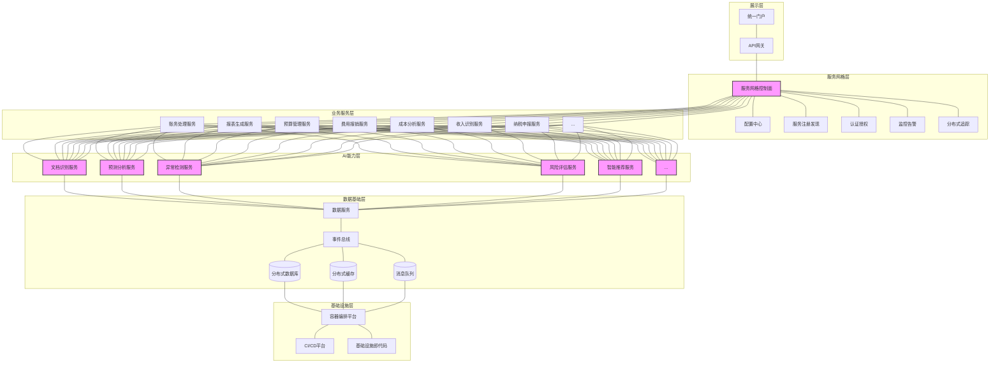

---
{"dg-publish":true,"tags":["微服务","分布式架构","弹性扩展","敏捷部署","服务网格"],"创建日期":"2024-05-14","permalink":"/知识共享/001_财务/99_其他/AI与财务应用/05_财务人工智能系统架构/5.1 技术架构设计/微服务财务AI架构/","dgPassFrontmatter":true}
---

# 微服务财务AI架构

## 技术概述

微服务财务AI架构是一种现代化的财务智能系统构建范式，将单体财务应用拆分为松耦合、高内聚的功能微服务，并融合AI能力于各个服务单元中。这种架构设计通过服务边界明确划分、接口标准化定义，实现了财务AI能力的模块化组合与弹性伸缩，大幅提升了系统的开发效率、部署灵活性与运维可靠性。

相较于传统财务系统架构，微服务财务AI架构具有显著优势：

- **开发效率提升40-60%**：各功能团队可独立开发、测试和部署自己的微服务，显著提高并行开发效率
- **系统弹性提升65-85%**：服务隔离确保局部故障不会扩散，系统整体可用性大幅提升
- **资源利用优化30-50%**：基于实际负载对各服务进行独立扩缩容，避免资源浪费
- **技术栈灵活性提高70-90%**：各微服务可根据业务需求选择最适合的技术栈与AI模型
- **上线周期缩短50-70%**：小规模服务单元可实现快速迭代与持续部署
- **人员协作效率提升35-55%**：团队边界与服务边界一致，明确责任分工

### 核心技术特性

1. **智能服务边界划分引擎**：基于领域驱动设计方法论与语义聚类技术，智能识别财务业务边界，推荐合理的服务拆分粒度与边界，确保服务高内聚低耦合。

2. **统一服务注册与发现中心**：提供中心化服务目录，实现服务自动注册、健康检查与动态发现，支持多种服务协议与名称解析策略。

3. **智能负载均衡与路由控制**：结合服务监控数据与性能预测模型，实现基于负载、延迟、资源利用率的智能化请求分发，提高系统整体吞吐量。

4. **分布式配置管理系统**：集中管理各微服务配置，支持动态配置更新、环境隔离与版本控制，降低配置管理复杂度。

5. **多策略容错与限流保护**：整合断路器、重试、超时、隔离舱等多种容错机制，结合AI负载预测实现智能限流与降级，提升系统稳定性。

6. **分布式追踪与性能分析**：通过调用链追踪、性能瓶颈自动发现、异常行为检测等技术，提供全方位系统可观测性。

7. **服务网格通信控制面**：通过边车代理模式实现服务间通信的统一控制，提供安全通信、流量管理、策略执行等能力，降低服务开发复杂度。

8. **CI/CD自动化流水线**：支持代码提交、构建、测试、部署的全自动化工作流，实现微服务快速迭代与频繁发布。

9. **混合部署资源编排器**：支持跨公有云、私有云、边缘设备的混合部署策略，基于服务特性与资源需求优化部署位置。

10. **财务AI能力即服务平台**：将通用财务AI能力（如OCR、NLP、预测分析等）封装为标准化API服务，供多个业务微服务共享调用。

## 系统架构

### 核心功能层级

1. **展示层**：提供统一用户界面和API网关，负责请求路由、认证、限流、协议转换等边缘功能。

2. **服务网格层**：通过控制面和数据面分离的设计，管理服务间通信、流量控制、安全策略和可观测性，降低服务开发复杂度。

3. **业务服务层**：按领域边界划分的财务微服务集群，每个服务专注于特定业务功能，通过标准化接口相互协作。

4. **AI能力层**：封装各类财务AI算法能力为标准化服务，提供文档处理、预测分析、异常检测等智能化功能。

5. **数据基础层**：提供数据存储、缓存、消息传递和事件处理等基础设施，支持数据驱动的服务协作模式。

6. **基础设施层**：基于容器技术和云原生理念，提供自动化部署、弹性伸缩和资源编排等基础能力。

### 关键支撑组件

1. **服务网格控制面**：统一管理服务发现、负载均衡、流量控制、安全策略和可观测性，降低微服务通信复杂度。

2. **事件总线**：实现服务间异步通信和事件驱动架构，降低服务耦合度，提高系统弹性和扩展性。

3. **CI/CD自动化平台**：支持微服务的自动构建、测试、部署和回滚，实现频繁发布和快速迭代。

## 实施计划

### 一期（1-3个月）：基础框架搭建

- 构建容器化基础设施环境
- 部署服务网格控制面和数据面
- 实现核心中间件组件（服务发现、配置中心等）
- 搭建CI/CD自动化流水线
- 开发API网关和认证授权系统

### 二期（3-6个月）：核心服务拆分

- 制定服务拆分策略和接口标准
- 将现有财务系统核心功能拆分为微服务
- 实现服务间通信和数据一致性机制
- 开发基础AI能力服务和集成接口
- 构建监控告警和分布式追踪系统

### 三期（6-9个月）：能力提升与完善

- 优化服务性能和资源利用率
- 增强服务弹性和容错能力
- 扩展AI能力服务种类和精度
- 开发更多业务领域微服务
- 完善可观测性和运维自动化

### 四期（9-12个月）：产品化与优化

- 进行全链路压力测试和性能优化
- 完善文档和开发指南
- 实现混合云环境下的资源调度优化
- 构建服务治理控制台和运维门户
- 制定服务演进和版本管理策略

## 技术挑战与解决方案

### 挑战一：服务拆分粒度与边界确定

**挑战**：过细的服务粒度导致通信开销大，过粗的粒度又无法充分发挥微服务优势。

**解决方案**：
- 基于领域驱动设计方法论识别限界上下文
- 结合业务流程分析与数据访问模式进行决策
- 先粗后细的渐进式演进策略
- 通过语义分析和依赖图识别自然服务边界

### 挑战二：分布式数据一致性

**挑战**：微服务架构下数据分散存储，跨服务事务难以保证。

**解决方案**：
- 采用最终一致性模型和补偿事务
- 实现基于事件溯源的数据同步机制
- 使用分布式锁和乐观并发控制
- 通过领域事件实现数据变更通知

### 挑战三：服务治理与监控

**挑战**：服务数量激增导致运维复杂度指数级增长。

**解决方案**：
- 构建全方位可观测性平台（日志、指标、追踪）
- 实现异常行为自动检测与根因分析
- 基于服务网格实现统一流量管控
- 自动化运维工具与流程规范

### 挑战四：安全与合规

**挑战**：微服务间通信增加了攻击面，财务数据安全风险提升。

**解决方案**：
- 实施零信任安全模型和服务间双向TLS认证
- 构建统一身份认证与细粒度访问控制
- 敏感数据加密与脱敏处理
- 合规审计日志与数据操作追踪

### 挑战五：AI能力集成与演进

**挑战**：AI模型迭代与业务服务发展节奏不一致，集成复杂。

**解决方案**：
- 设计标准化AI服务接口与版本管理机制
- 实现模型热更新与A/B测试能力
- 构建模型监控与性能评估框架
- 支持混合计算模式（在线推理与离线批处理）

## 价值创造

### 效率提升

- **开发速度提升**: 65-85%，通过并行开发与标准化接口
- **部署频率提高**: 10-15倍，从月度发布到每日多次部署
- **问题定位时间缩短**: 70-90%，通过分布式追踪与自动化根因分析
- **资源利用率提升**: 40-60%，通过精细化资源分配与自动伸缩

### 能力增强

- **系统可用性提升**: 99.9%到99.99%，通过服务隔离与容错设计
- **峰值处理能力提升**: 3-5倍，通过独立扩展高负载服务
- **新功能上线时间缩短**: 60-80%，通过CI/CD自动化与增量发布
- **AI能力迭代速度加快**: 4-6倍，通过AI服务标准化与独立演进

### 投资回报

- **预计ROI**: 280-380%（24个月）
- **投资成本结构**:
  - 基础设施与平台工具: 30-35%
  - 微服务改造与开发: 40-45%
  - 培训与组织调整: 15-20%
  - 运维与监控: 5-10%
- **回收期**:
  - 大型企业: 9-12个月
  - 中型企业: 7-10个月
  - 小型企业: 6-8个月

## 未来演进

### 短期技术迭代（1-2年）

- **服务网格高级特性**: 引入更复杂的流量控制、故障注入和混沌测试能力
- **智能弹性扩缩**: 基于预测模型的提前资源准备与释放
- **自适应微服务架构**: 动态服务组合与业务流程重构
- **事件驱动架构增强**: 复杂事件处理与事件溯源模式的广泛应用

### 中期技术迭代（2-3年）

- **无服务器计算模式**: 将部分微服务转向函数即服务(FaaS)架构
- **eBPF技术应用**: 内核级可观测性与网络优化
- **GitOps与Infrastructure as Code**: 配置即代码与基础设施即代码的深度融合
- **多集群联邦管理**: 跨地区、多云环境下的统一服务治理

### 长期技术迭代（3-5年）

- **自组织系统**: 基于AI的服务自优化与自修复能力
- **量子计算集成**: 为特定财务算法引入量子计算加速
- **区块链分布式账本**: 与微服务架构的无缝集成
- **元宇宙财务界面**: 融合AR/VR的财务数据交互新模式

### 应用场景扩展

1. **企业财务中台**: 构建统一财务能力平台，支持多业务线快速集成与个性化定制
2. **财务SaaS服务**: 基于微服务架构提供可配置、多租户的财务云服务
3. **跨企业财务协同**: 实现企业间财务数据安全共享与业务协同
4. **智能财务决策系统**: 整合多源数据与AI分析能力，支持实时财务决策
5. **全球化财务管理**: 支持多语言、多币种、多税制的统一财务管理平台

## 概念验证

### 验证方法

1. **原型验证**（1-2个月）
   - 构建最小可行产品，包含3-5个核心微服务
   - 实现基础服务网格功能与监控能力
   - 验证关键技术路径与架构假设

2. **小规模试点**（2-3个月）
   - 选择非关键业务场景进行部署
   - 收集性能、可靠性、开发效率数据
   - 优化技术栈与部署流程

3. **生产环境试运行**（3-6个月）
   - 逐步迁移生产工作负载
   - 实施蓝绿部署与灰度发布策略
   - 建立完整监控体系与应急预案

### 验证指标

1. **技术指标**
   - 服务启动时间：<5秒
   - API响应时间：较单体架构变化<10%
   - 系统吞吐量：较单体架构提升>30%
   - 故障隔离有效性：单服务故障不影响整体可用性
   - 资源利用率：较单体架构提升>40%

2. **开发运维指标**
   - 代码提交到部署时间：<15分钟
   - 日均部署频率：>5次
   - 变更失败率：<5%
   - 问题平均恢复时间：<30分钟
   - 新功能上线周期：<1周

3. **业务指标**
   - 财务处理准确率：>99.999%
   - 报表生成时间：较传统架构缩短>50%
   - 系统可用性：>99.99%
   - 业务规则变更响应时间：<1天
   - 用户满意度评分：>4.5/5 