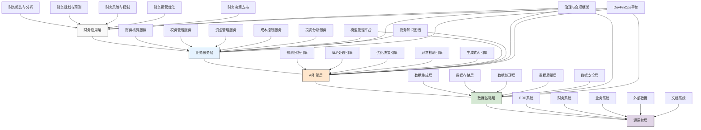

---
{"dg-publish":true,"tags":["系统设计","架构模式","集成框架","分层系统","技术标准"],"创建日期":"2024-05-14","permalink":"/知识共享/001_财务/99_其他/AI与财务应用/05_财务人工智能系统架构/5.1 技术架构设计/财务AI系统参考架构/","dgPassFrontmatter":true}
---

## 技术概述

财务AI系统参考架构是一套针对财务领域人工智能应用的全面架构框架，它系统性地定义了财务AI系统从数据获取到价值实现的完整技术栈、组件关系和最佳实践。该架构框架融合了现代数据架构、分布式计算、AI工程和财务领域专业知识，为企业构建高性能、可扩展、安全合规且业务价值导向的财务AI系统提供了标准化蓝图和实施指南。

核心技术特点包括：

- **领域驱动分层设计**：采用财务领域特性驱动的多层架构设计，将系统划分为数据基础层、AI引擎层、业务服务层和财务应用层，每层具有明确的职责边界和接口规范，确保系统具备高内聚低耦合的架构特性
- **多模态数据融合框架**：整合结构化财务数据（如交易记录、会计分录）、半结构化数据（如报表文件、Excel）和非结构化数据（如合同文档、财报解读）的统一处理框架，支持多源异构数据在保持语义一致性的前提下实现无缝融合
- **智能算法编排系统**：提供模块化、可组合的AI算法组件库和智能编排引擎，支持根据不同财务场景需求动态组装预测、分类、异常检测、优化和生成式AI等算法能力，实现"算法即服务"的灵活调用
- **财务知识增强机制**：将财务领域知识（会计准则、税法规定、行业基准等）以知识图谱、规则引擎和语义网络等形式编码到系统中，增强AI模型的专业理解能力和领域适应性
- **可解释性基础设施**：内置全面的模型可解释性框架，从特征归因、决策路径到业务语言转换等多维度支持AI决策的透明度需求，满足财务场景特有的高合规性和高可信度要求
- **渐进式部署架构**：支持从传统系统到AI驱动系统的平滑过渡，通过外挂模式、混合增强模式到全面集成模式的渐进式部署路径，降低实施风险和变革阻力
- **完整治理框架**：集成数据治理、模型治理、安全治理和价值治理的全面治理架构，确保AI系统在高度监管的财务环境中安全、合规、高效运行

相较于通用AI系统架构，财务AI系统参考架构专门针对财务领域特性进行了深度优化，包括提升数据质量控制标准(99.99%以上)、增强审计追溯能力、强化财务特定安全合规机制和明确财务价值度量框架。系统架构支持企业根据自身数字化成熟度、业务优先级和资源条件，采用渐进式实施路径，从试点场景拓展到全面应用，提供了从概念到落地的完整实施路线图。

## 系统架构

系统架构由五个核心层次和四个贯穿性支持组件组成，形成完整的财务AI系统技术栈：

1. **源系统层**：系统的数据来源层，负责接入各类数据源。包括ERP系统（企业资源计划系统数据）、财务系统（专业财务软件数据）、业务系统（销售、采购等运营系统数据）、外部数据（市场、宏观经济等外部数据）以及文档系统（各类结构化和非结构化文档）。

2. **数据基础层**：系统的数据管理层，负责数据的全生命周期管理。包括数据集成层（负责多源数据提取和整合）、数据存储层（结构化和非结构化数据存储机制）、数据处理层（数据清洗、转换和预处理）、数据质量层（数据质量监控和管理）以及数据安全层（数据访问控制和隐私保护）。

3. **AI引擎层**：系统的智能计算核心，负责各类AI算法和模型的运行。包括预测分析引擎（时间序列预测和回归分析）、NLP处理引擎（文本分析和自然语言处理）、优化决策引擎（约束优化和运筹学算法）、异常检测引擎（异常模式识别）以及生成式AI引擎（基于大语言模型的内容生成）。

4. **业务服务层**：系统的财务业务封装层，负责将AI能力转化为财务专业服务。包括财务核算服务（自动化会计和报告服务）、税务管理服务（税务优化和合规服务）、资金管理服务（现金流和资金优化）、成本控制服务（成本分析和优化服务）以及投资分析服务（投资评估和组合管理）。

5. **财务应用层**：系统的用户交互层，负责面向最终用户的应用场景实现。包括财务报告与分析（内外部报告生成和分析）、财务规划与预测（预算编制和预测）、财务风险与控制（风险监测和控制）、财务运营优化（流程优化和效率提升）以及财务决策支持（战略和战术决策支持）。

贯穿性支持组件：
- **模型管理平台**：负责AI模型的全生命周期管理，包括模型训练、评估、部署、监控和更新
- **财务知识图谱**：封装财务专业知识和业务规则，增强AI模型的领域理解和推理能力
- **治理与合规框架**：确保系统在数据使用、算法公平性、决策透明度等方面符合合规要求
- **DevFinOps平台**：支持财务AI应用的敏捷开发、快速部署和持续优化的专业化DevOps平台

这种分层架构设计兼顾了技术合理性和财务专业特性，通过明确的责任分离和标准化接口，实现了系统的模块化和可扩展性。贯穿各层的支持组件确保了系统在财务专业特性、治理合规和敏捷迭代方面的能力，为不同规模和成熟度的企业提供了可参考的标准架构模板。

## 实施方案

### 技术实施路线图

**第一阶段：基础能力构建（3-4个月）**
- 设计数据集成接口和财务数据模型
- 建立基础数据质量控制机制
- 搭建核心AI引擎技术原型
- 实现关键业务服务API设计
- 构建基础治理框架和安全控制

**第二阶段：核心功能实现（4-5个月）**
- 完成多源数据融合与处理系统
- 开发预测和分类核心算法模块
- 实现财务知识图谱初级版本
- 构建模型管理基础平台
- 完善主要财务服务封装

**第三阶段：系统能力提升（3-4个月）**
- 增强高级算法能力（优化、异常检测）
- 实现生成式AI引擎集成
- 开发完整模型治理机制
- 构建全面财务知识图谱
- 实现高级财务应用场景

**第四阶段：集成与优化（2-3个月）**
- 完成系统整体集成与端到端测试
- 优化系统性能和资源利用
- 增强安全控制和合规机制
- 实现DevFinOps自动化流程
- 构建系统监控和优化机制

### 技术挑战与解决策略

1. **财务数据整合复杂性**
   - 挑战：财务数据往往分散在多个系统中，格式不一，质量参差不齐，集成难度大
   - 解决方案：实施元数据管理驱动的数据整合；建立财务专用数据质量规则；开发智能数据映射工具；采用渐进式数据集成策略；建立数据血缘追踪；实施财务数据湖架构；开发专业化数据适配器库

2. **模型精度与稳定性平衡**
   - 挑战：财务场景要求高精度预测，同时又需要长期稳定性和鲁棒性
   - 解决方案：采用多模型集成方法；实施漂移检测和自适应更新；建立财务专用预测基准；开发场景特化校准方法；增强时间维度验证；实现模型退化防护机制；构建置信区间动态估计

3. **合规可解释性要求**
   - 挑战：财务决策必须能够清晰解释，满足审计和合规要求
   - 解决方案：构建多层次解释框架；开发财务语言解释生成器；实施决策证据链追踪；建立规则与模型混合系统；设计合规友好的模型结构；创建审计导向的记录机制；开发可视化解释工具

4. **系统性能与实时性需求**
   - 挑战：财务流程同时存在批处理和实时处理的双重需求
   - 解决方案：实施Lambda架构融合方案；开发分层缓存策略；采用微批次处理技术；优化计算资源动态分配；建立优先级调度机制；实现增量计算框架；设计并行处理优化

5. **财务专业知识融合**
   - 挑战：将财务专业知识有效融入AI系统以提升准确性和适用性
   - 解决方案：构建结构化财务知识图谱；开发财务规则编码引擎；实施专家知识提取方法；创建财务本体模型；设计知识与数据融合架构；建立知识验证机制；开发财务常识推理系统

## 价值创造

### 量化价值评估

1. **财务效率提升**
   - 报告生成时间：减少65-85%
   - 分析周期：缩短50-70%
   - 数据处理效率：提高70-90%
   - 财务闭环速度：提升40-60%

2. **决策质量改善**
   - 预测准确率：提高30-50%
   - 风险识别率：提升40-60%
   - 机会发现速度：加快45-65%
   - 决策响应时间：减少50-70%

3. **财务团队转型**
   - 例行工作自动化：提高55-75%
   - 高价值工作占比：提升40-60%
   - 团队协作效率：增强35-55%
   - 创新能力指数：提高40-60%

4. **系统价值**
   - 技术债务降低：减少45-65%
   - 系统适应性提升：增强50-70%
   - 开发迭代速度：加快55-75%
   - 维护成本：降低35-55%

### 投资回报分析

投资回报率(ROI)预计达到350-500%（36个月期），主要价值来源包括：
- 自动化和流程优化带来的运营效率提升（35%）
- 决策质量提高和风险降低产生的业务收益（30%）
- 财务人力资源优化和重组带来的成本节约（20%）
- 技术架构现代化和整合产生的IT效益（15%）

典型实施成本结构：基础设施投资（30%）、技术开发（25%）、数据治理与模型开发（20%）、系统集成（15%）、团队培训与变革管理（10%）。

预期投资回收期：
- 大型企业：18-24个月
- 中型企业：14-20个月
- 高频财务决策行业：12-18个月
- 数据成熟度高的组织：10-16个月

## 未来演进

### 技术迭代路线图

**近期演进（1-2年）**
- 集成大型语言模型增强分析能力
- 开发低代码/无代码财务AI开发平台
- 增强API生态系统和第三方集成
- 实现多租户SaaS架构支持
- 构建边缘计算增强的分布式架构

**中期演进（2-3年）**
- 发展认知财务引擎和语义推理能力
- 构建自适应学习型架构
- 实现区块链与AI融合的财务保障机制
- 开发跨组织财务协作与分析框架
- 建立预测性资源调配系统

**远期演进（3-5年）**
- 实现财务认知计算和自主代理系统
- 发展量子计算支持的财务优化引擎
- 构建元宇宙财务协作环境
- 开发完全自动化的财务智能系统
- 建立生成式财务全栈系统

### 应用场景拓展

1. **智能财务决策中枢**：建立企业级财务决策中心，整合所有财务数据和分析能力，提供从战略到运营的多层次决策支持。系统基于全域数据视图，自动识别价值机会和风险因素，生成情景模拟和优化建议，支持从日常运营决策到长期战略规划的全谱系财务决策。这种中枢不仅提供建议，还能追踪决策执行状况和结果评估，形成完整的决策闭环，持续优化企业资源配置和价值创造能力。

2. **财务智能流程编排平台**：重新定义企业财务流程，从固定流程转变为动态、自适应的智能流程网络。系统能够根据业务事件、数据特征和环境变化，自动调整流程路径、参与角色和执行规则，实现财务流程的实时优化和个性化配置。平台整合RPA、流程挖掘和AI决策技术，不仅自动化执行流程，还持续优化流程设计，发现效率瓶颈和改进机会，打造自进化的财务流程生态系统。

3. **财务知识协作系统**：建立融合人类专业知识和AI洞察的协作平台，打破财务知识孤岛。系统将显性知识（规则、政策、报告模板）和隐性知识（经验、判断、最佳实践）进行结构化编码和智能提取，形成动态成长的财务知识网络。通过情境感知技术，系统能够在用户工作流程中智能推荐相关知识和见解，支持跨团队知识共享和协作分析，加速组织学习和知识创新，提升整体财务智能。

4. **预见性财务控制系统**：从传统的被动合规控制转向预见性风险管理和主动控制机制。系统融合异常检测、因果推理和预测分析技术，能够在风险事件发生前识别潜在问题和合规挑战。通过持续监测财务行为模式、交易特征和外部环境变化，系统自动调整控制参数和审核强度，在保持业务流畅性的同时确保合规性。这种智能控制架构显著降低了合规成本和风险事件发生率，同时提升了财务运营效率和敏捷性。

## 实验验证

### 概念验证方案

**阶段一：架构验证（6-8周）**
- 构建关键组件的原型实现
- 验证核心层次间的接口设计
- 测试跨层数据流和处理逻辑
- 评估系统扩展性和模块化程度
- 验证关键技术路径的可行性
- 测试安全和合规机制的有效性

**阶段二：场景应用测试（8-10周）**
- 选择2-3个高价值财务场景实现
- 构建端到端功能验证系统
- 在实际数据环境中测试系统表现
- 评估功能完整性和性能指标
- 收集用户体验和功能改进反馈
- 验证与现有系统的集成能力

**阶段三：规模与弹性测试（6-8周）**
- 进行大规模数据和用户负载测试
- 评估系统在峰值条件下的表现
- 测试故障恢复和容错机制
- 分析资源使用效率和扩展性能
- 验证长期运行稳定性和可靠性
- 测试全周期运维和管理能力

### 验证指标体系

**功能完整性指标**
- 架构覆盖率：架构框架覆盖目标场景的完整度
- 功能实现度：关键功能的实现完整性和准确性
- API兼容性：与目标系统和标准的接口兼容性
- 场景适应性：对不同财务场景的适应和支持能力
- 合规覆盖率：满足监管和合规要求的覆盖程度

**性能与可扩展性指标**
- 响应时间：不同操作类型的系统响应速度
- 吞吐能力：单位时间内处理的事务或数据量
- 资源效率：计算资源利用效率和优化程度
- 扩展线性度：系统负载增加时性能扩展的线性程度
- 恢复能力：系统从故障恢复的速度和完整性

**用户价值指标**
- 采纳难度：系统的易用性和学习曲线
- 功能满意度：用户对功能和性能的满意程度
- 业务影响：对关键业务指标的实际改善效果
- 集成便捷性：与现有系统集成的便捷程度
- 长期价值：持续使用的价值增长和可持续性

## 未来影响

财务AI系统参考架构将从根本上改变企业构建和运营财务技术系统的方式，带来以下深远影响：

1. **财务技术融合范式转变**：打破传统财务系统和AI技术的边界，建立统一的财务智能技术体系。这一架构将改变财务技术长期存在的"业务系统+分析工具"的二元分离模式，形成业务、数据和智能深度融合的一体化架构。这种转变不仅简化了系统复杂度，更实现了从交易执行到高级决策的无缝连接，使企业能够建立真正智能化的财务运营体系，提升整体财务功能的响应能力和战略价值。

2. **财务组织能力重构**：促使财务组织从功能型结构向能力中心转型。基于该架构构建的系统将重新定义财务团队的工作方式，从传统的线性流程转向服务化、平台化的能力提供模式。财务专业人员将从数据处理者转变为洞察发现者和价值创造者，专注于利用系统提供的智能能力解决复杂业务问题。这种转变将推动财务组织结构和人才模型的重构，形成更扁平、更敏捷、更专业化的财务能力中心。

3. **财务技术生态系统创新**：催生新型财务技术生态系统和创新市场。标准化的参考架构将降低财务AI技术的进入门槛，促进专业化组件、服务和解决方案提供商的涌现。这将加速从单一供应商大型系统向模块化、可组装的生态系统转变，企业可以根据自身需求灵活选择和组合最佳技术组件。这种开放生态将极大促进财务技术创新，加速专业化解决方案的演进和成熟，最终降低企业的技术采用成本和风险。

4. **数据驱动治理模式变革**：推动企业财务治理从规则驱动转向数据驱动和智能辅助模式。参考架构中内置的治理框架将帮助企业实现从被动合规到主动风险管理和价值优化的转变。通过系统化的数据监控、模式识别和预测分析，财务治理将变得更加前瞻性和精准，能够在问题发生前识别风险信号并采取干预措施。这种智能治理模式不仅提高了风险控制的有效性，还显著降低了合规成本，为企业创造更大的决策空间和创新自由度。

通过提供标准化、可扩展和前瞻性的财务AI系统蓝图，参考架构不仅解决了当前财务技术实施的复杂性和碎片化问题，更为财务功能的数字化转型和智能化升级提供了清晰路径。这一架构将成为连接财务专业实践和前沿技术的关键桥梁，推动企业财务从交易处理中心向战略决策引擎的历史性转变。 