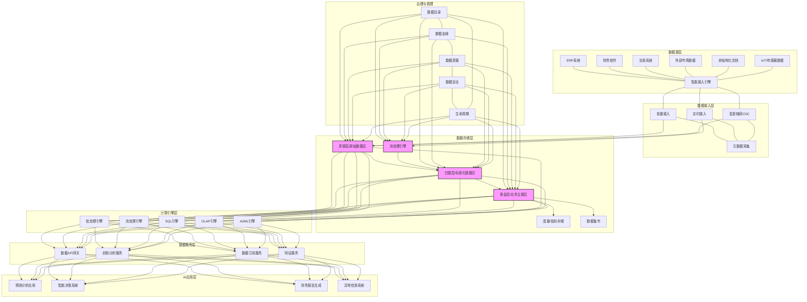

---
{"dg-publish":true,"tags":["数据湖","数据仓库","混合架构","数据整合","实时处理"],"创建日期":"2024-05-14","permalink":"/知识共享/001_财务/99_其他/AI与财务应用/05_财务人工智能系统架构/5.2 数据基础设施/多源数据整合湖仓/","dgPassFrontmatter":true}
---

## 技术概述

多源数据整合湖仓是一种融合数据湖与数据仓库优势的现代化财务数据基础设施，专为财务AI应用提供统一、高效、灵活的数据服务平台。该架构打破传统财务数据孤岛，实现结构化与非结构化数据的无缝整合，支持批处理与流处理的协同工作，满足从历史分析到实时决策的全谱系财务数据需求。

相较于传统财务数据管理模式，多源数据整合湖仓具有显著优势：

- **数据源覆盖广泛**：统一接入ERP、CRM、供应链、市场营销、外部经济指标等50+类数据源
- **数据类型全面**：同时处理结构化交易数据、半结构化报表数据与非结构化文本/图像数据
- **处理模式灵活**：支持批量历史数据分析与毫秒级实时数据处理的混合架构
- **存储成本优化**：通过智能分层存储策略，相比传统架构降低40-60%存储成本
- **分析能力增强**：支持从描述性分析到预测性分析的完整分析链，提升分析深度

### 核心技术特性

1. **智能数据接入与编排引擎**：采用低代码/无代码方式快速连接各类财务数据源，自动提取元数据，构建数据血缘关系，实现数据接入的智能化编排与管理。

2. **数据湖-仓混合架构**：结合数据湖的灵活性与数据仓库的结构化优势，采用Medallion架构（青铜层、白银层、黄金层），实现从原始数据到高质量分析数据的渐进式转换。

3. **实时与批处理双模架构**：整合Lambda架构与Kappa架构的优势，同时支持大规模批量数据处理与毫秒级实时数据分析，满足不同财务场景需求。

4. **智能元数据管理系统**：自动发现、提取和管理技术元数据与业务元数据，构建统一数据目录，支持数据资产的可视化管理与数据血缘追踪。

5. **数据质量自动化监控**：基于规则引擎与机器学习的混合方法，实现数据完整性、准确性、一致性的自动化检测与修复，确保高质量数据供应。

6. **智能数据治理框架**：集成数据安全、隐私保护、合规管理、生命周期管理等能力，确保数据资产的安全、合规与高效利用。

7. **弹性计算资源调度**：基于Kubernetes的容器化部署与动态资源调度，根据工作负载自动扩展计算资源，优化性能与成本平衡。

8. **自助式数据服务平台**：提供数据发现、探索、消费的统一入口，支持拖拽式分析、SQL查询与API调用多种访问方式，降低数据使用门槛。

9. **数据混合计算引擎**：支持SQL、Spark、Python、R等多种计算框架，满足从简单汇总到复杂机器学习的不同计算需求。

10. **数据即服务(DaaS)接口层**：通过标准化API和数据服务契约，为上层AI应用提供统一数据访问接口，实现数据与应用的解耦。

## 系统架构

### 核心功能层级

1. **数据源层**：涵盖企业内外部各类数据源，包括但不限于ERP、财务系统、交易系统、外部市场数据、文档数据和IoT设备数据等，是湖仓的数据来源。

2. **数据接入层**：通过智能接入引擎，以批量、实时和变更捕获(CDC)方式获取各类数据，并在接入过程中自动采集和管理元数据，建立数据谱系关系。

3. **数据存储层**：采用Medallion架构，通过青铜层（原始数据）、白银层（标准化数据）和黄金层（业务主题模型）的渐进式数据处理，形成数据价值提炼链，并提供度量存储和数据集市满足不同使用场景。

4. **计算引擎层**：提供多种计算引擎，包括批处理、流处理、SQL、OLAP和AI/ML引擎，支持从简单查询到复杂分析的多样化计算需求。

5. **数据服务层**：将数据能力封装为服务，通过API网关、自助分析、数据订阅和特征服务等方式，为上层应用提供标准化数据访问接口。

6. **AI应用层**：基于统一数据基础，构建预测分析、智能决策、报告生成和异常检测等财务AI应用，实现数据价值最大化。

### 关键支撑组件

1. **数据治理与管理平台**：提供数据目录、血缘分析、质量监控、安全管理和生命周期管理等治理功能，确保数据资产的可管理、可信赖和高价值。

2. **元数据管理系统**：作为数据湖仓的"神经中枢"，自动采集和管理技术元数据与业务元数据，支持数据发现、理解和使用的全过程。

3. **弹性资源调度平台**：基于容器技术和云原生架构，实现计算资源的动态分配和成本优化，支持工作负载的高峰期扩展和低谷期收缩。

## 实施计划

### 一期（1-3个月）：基础设施构建

- 规划整体数据架构与技术选型
- 部署核心基础设施组件（存储、计算、网络）
- 实现优先级数据源的接入连接器
- 构建基础数据目录与元数据管理系统
- 实现基础数据湖青铜层功能，支持原始数据存储

### 二期（3-6个月）：核心功能开发

- 开发与部署数据处理流水线，实现白银层数据标准化
- 构建关键业务主题模型，形成黄金层数据
- 实现批处理与流处理双模架构
- 开发数据质量监控框架与规则引擎
- 构建基础数据API服务与自助分析平台
- 实现核心数据安全与访问控制机制

### 三期（6-9个月）：能力增强与优化

- 拓展接入多元化数据源，增强数据覆盖面
- 优化数据处理流水线，提升性能与可靠性
- 构建高级分析数据集市与OLAP能力
- 增强元数据管理与数据血缘分析能力
- 开发完整数据生命周期管理功能
- 实现高级数据服务接口，包括特征服务与数据订阅

### 四期（9-12个月）：智能化与成熟度提升

- 引入AI驱动的数据管理与优化功能
- 构建端到端数据流程自动化与编排能力
- 完善数据治理框架，包括策略执行与合规审计
- 优化系统性能与可扩展性
- 实现全面监控与自愈功能
- 建立数据价值评估与优化闭环

## 技术挑战与解决方案

### 挑战一：多源异构数据整合

**挑战**：财务数据来源多样，格式各异，数据质量参差不齐，难以建立统一视图。

**解决方案**：
- 采用ELT（提取-加载-转换）而非传统ETL模式，保留原始数据弹性
- 实现基于元数据驱动的自适应数据连接器，支持多种数据源格式
- 构建标准化的数据处理框架，实现数据结构与语义的规范化
- 采用渐进式转换策略，通过Medallion架构分层处理数据质量问题

### 挑战二：实时与批处理混合需求

**挑战**：财务分析同时需要大规模历史数据处理和毫秒级实时数据分析能力，架构复杂度高。

**解决方案**：
- 采用Lambda与Kappa架构的混合模式，批流统一处理
- 实现批量数据与流数据的统一存储模型，降低数据复制成本
- 构建统一计算抽象层，对应用隐藏底层实现复杂性
- 实施批处理优先、实时需求逐步迁移的演进策略

### 挑战三：数据质量与一致性保障

**挑战**：财务数据要求高精度与一致性，多源数据整合过程中容易产生质量问题。

**解决方案**：
- 实现端到端数据质量控制，从源头到应用的全链路质量管理
- 构建多层次数据质量规则引擎，包括通用规则与领域特定规则
- 开发自动数据质量异常检测与修复流程
- 实现跨系统数据一致性验证与协调机制

### 挑战四：数据治理与合规

**挑战**：财务数据涉及敏感信息，需要严格遵守数据治理规范和合规要求。

**解决方案**：
- 构建细粒度的数据访问控制机制，支持行级与列级安全
- 实现数据加密、脱敏与匿名化处理的自动流水线
- 开发完整的数据血缘与影响分析能力，支持合规追踪
- 建立自动化审计日志与监控系统，及时发现合规风险

### 挑战五：性能与成本平衡

**挑战**：大规模财务数据处理需要平衡系统性能与基础设施成本。

**解决方案**：
- 实现数据智能分层存储策略，冷热数据分离管理
- 采用弹性计算资源池，根据工作负载动态调整资源
- 构建智能查询优化引擎，提升数据访问效率
- 实施数据生命周期自动化管理，优化存储成本

## 价值创造

### 效率提升

- **数据准备时间缩短**: 70-85%，将数据获取与处理时间从周级缩短到日级或小时级
- **数据集成周期压缩**: 60-75%，自动化数据流水线大幅减少人工干预
- **数据可用性提升**: 数据实时性从T+1提升到分钟级甚至秒级
- **分析效率提升**: 55-70%，自助式数据服务减少对IT部门依赖

### 能力增强

- **数据视野扩展**: 可分析数据源从传统10-15个扩展到50+个
- **分析深度增强**: 支持从描述性分析到预测性和规范性分析的全谱系能力
- **数据颗粒度细化**: 从月度/周度汇总分析到日级/交易级明细分析
- **跨域分析能力**: 打通财务与业务、运营、市场等多域数据，实现多维关联分析

### 洞察价值

- **决策响应速度**: 60-80%关键财务决策从天级缩短到小时级或实时
- **预测准确率提升**: 30-50%，基于更全面数据源和更新鲜数据的模型表现更佳
- **异常识别能力**: 提前2-5天发现财务异常和风险信号
- **机会识别速度**: 提升35-55%，快速发现价值优化和业务机会

### 投资回报

- **预计ROI**: 300-400%（24个月）
- **投资成本结构**:
  - 基础设施与平台: 35-40%
  - 开发与集成: 25-30%
  - 数据迁移与治理: 20-25%
  - 培训与变革管理: 10-15%
- **回收期**:
  - 大型企业: 10-14个月
  - 中型企业: 8-12个月
  - 小型企业: 6-9个月

## 未来演进

### 短期技术迭代（1-2年）

- **AI驱动的数据管理**: 引入智能数据编目、质量控制和优化推荐
- **实时决策流支持**: 增强流处理能力，支持复杂事件处理和实时决策
- **自动化数据工程**: 减少手动干预，实现端到端数据流程自动化
- **混合多云支持**: 跨云环境的统一数据管理与数据编排能力

### 中期技术迭代（2-3年）

- **知识图谱增强**: 集成知识图谱技术，提供语义理解和关联分析能力
- **数据网格架构**: 从中心化数据湖仓向分布式数据网格演进
- **数据即产品理念**: 将数据服务打造为内部数据产品，建立数据市场
- **数据合约与SLA管理**: 明确数据服务质量标准与责任边界

### 长期技术迭代（3-5年）

- **自主数据系统**: 具备自我监控、优化和修复能力的智能数据平台
- **量子计算支持**: 为特定财务算法提供量子计算加速能力
- **全局数据编排**: 跨组织边界的数据服务协同与流程编排
- **认知数据服务**: 从被动响应到主动预测数据需求的认知服务模式

### 应用场景扩展

1. **全域财务视图**: 整合内外部所有财务相关数据，构建360度财务全景视图
2. **实时财务驾驶舱**: 提供实时财务状况、风险和机会的可视化监控平台
3. **智能资源规划**: 基于多源数据的资源优化和动态调整能力
4. **精准营收管理**: 整合销售、交付、计费和收款数据，优化收入管理
5. **财务-业务协同分析**: 打通财务与业务数据壁垒，构建业财融合分析能力

## 概念验证

### 验证方法

1. **架构概念验证**（1-2个月）
   - 构建核心数据处理流水线原型
   - 验证批流一体架构的技术可行性
   - 测试关键数据源接入与处理能力
   - 评估性能与可扩展性基线

2. **业务价值验证**（2-3个月）
   - 选择2-3个高价值财务分析场景进行测试
   - 比较现有系统与新架构的效率与洞察能力差异
   - 评估用户体验与自助分析能力
   - 收集业务反馈和改进需求

3. **规模扩展验证**（3-4个月）
   - 逐步扩大数据源覆盖范围与数据量
   - 测试大规模数据处理性能与稳定性
   - 验证治理机制与安全控制有效性
   - 评估技术路径与架构选择的正确性

### 验证指标

1. **技术指标**
   - 数据接入延迟: 批处理<4小时，实时流<10秒
   - 查询性能: 标准报表查询<5秒，复杂分析<30秒
   - 系统可用性: >99.9%
   - 数据质量正确率: >99.5%
   - 横向扩展能力: 线性增长（资源增加2倍，性能提升接近2倍）

2. **业务指标**
   - 数据整合范围: 核心财务数据源100%覆盖
   - 数据鲜度: 从T+1提升到实时或准实时
   - 分析场景支持: 覆盖90%常见财务分析场景
   - 自助服务采用率: >70%分析需求可通过自助完成
   - 新洞察发现: 每月产生至少3个有价值新发现

3. **成本效益指标**
   - 数据管理人力降低: 40-60%
   - 存储成本优化: 30-50%
   - 系统维护成本降低: 35-55%
   - 数据价值提升: ROI>300%
   - 应用开发效率提升: 45-65%
</rewritten_file> 