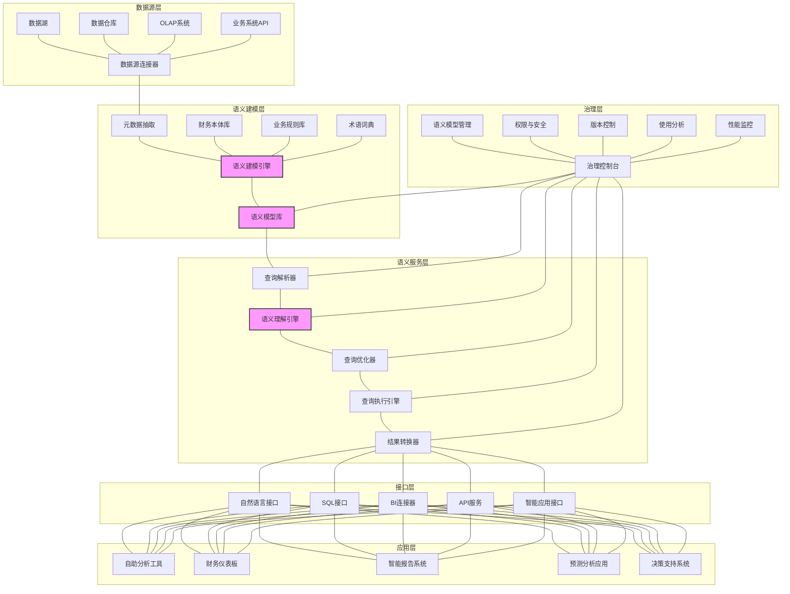

---
{"dg-publish":true,"tags":["语义层","数据访问","业务语义","数据建模","自助分析"],"创建日期":"2024-05-14","permalink":"/知识共享/001_财务/99_其他/AI与财务应用/05_财务人工智能系统架构/5.2 数据基础设施/语义层设计与应用/","dgPassFrontmatter":true}
---

## 技术概述

语义层设计与应用是一种创新的财务数据抽象技术，它在原始数据与业务应用之间构建一个智能中间层，将复杂的技术实现细节与业务语义进行分离和映射，使业务用户能够以熟悉的业务术语和概念访问和分析数据，而无需了解底层数据结构和技术细节。这一技术为财务AI应用提供了统一的业务语义视图，大幅降低了数据访问的复杂性，提高了分析效率和准确性。

相较于传统数据访问方式，财务语义层带来显著优势：

- **业务视角一致性**：统一业务概念定义和指标口径，消除多重解释与歧义，提高分析一致性
- **技术复杂性屏蔽**：隐藏底层数据结构、存储方式和技术实现，降低业务用户使用门槛
- **分析效率提升**：业务用户可直接操作业务概念进行分析，无需IT人员参与，分析周期缩短65-80%
- **跨源数据整合**：在语义层级实现多源数据的逻辑整合，提供统一业务视图
- **分析能力增强**：内置业务规则和计算逻辑，提供高级分析能力，超越简单数据查询

### 核心技术特性

1. **财务领域本体模型**：构建全面的财务领域本体(Ontology)，定义核心财务概念、关系和层次结构，形成一致的语义基础。这一模型涵盖会计科目、财务报表、业务流程、管理视图等财务知识体系，确保语义层的概念映射具有专业准确性。

2. **多层级业务概念映射**：建立从底层数据到高级业务概念的多层次映射体系，支持不同粒度的业务抽象，满足从明细查询到高级汇总分析的多样需求。

3. **智能数据发现与关联**：利用图分析和机器学习技术，自动发现和建立数据元素之间的关联关系，生成数据血缘网络，辅助构建完整准确的语义模型。

4. **上下文感知查询转换**：根据用户角色、分析目的和应用场景，自动调整查询解释和执行策略，提供上下文相关的查询结果，增强分析准确性。

5. **语义层查询优化引擎**：专为复杂财务查询设计的优化引擎，能将业务语义查询智能转换为高效的技术查询，优化执行计划，提高查询性能和资源利用率。

6. **动态计算与派生指标**：支持在语义层定义复杂的计算逻辑和派生指标，包括时间智能计算、跨维度比例、增长率等高级财务指标，避免数据冗余存储。

7. **多语言业务查询支持**：提供自然语言、SQL、可视化拖拽等多种查询接口，满足不同技术背景用户的需求，支持"用户提问-语义层翻译-数据返回"的直观交互模式。

8. **内置财务分析模式库**：预置常用财务分析模式和最佳实践，如趋势分析、方差分析、驱动因素分析等，用户可直接调用模式库快速构建分析。

9. **语义变更与版本管理**：支持语义模型的变更管理、版本控制和影响分析，确保业务规则变化时能平滑过渡，维护历史分析结果的一致性。

10. **跨语言与跨文化语义支持**：建立多语言业务术语映射，支持全球化企业在不同语言环境下保持一致的业务语义理解。

## 系统架构

### 核心功能层级

1. **数据源层**：连接各类数据存储系统，包括数据湖、数据仓库、OLAP系统和业务系统API，为语义层提供原始数据访问能力。

2. **语义建模层**：核心层，负责元数据抽取和语义建模，由财务本体库、业务规则库和术语词典支持，构建完整的语义模型并存储在语义模型库中。

3. **语义服务层**：提供查询解析、语义理解、查询优化、执行和结果转换等核心服务，将业务语义查询转换为高效的技术查询并返回业务友好的结果。

4. **接口层**：提供多种访问接口，包括自然语言接口、SQL接口、BI连接器、API服务和智能应用接口，满足不同场景和用户的需求。

5. **应用层**：基于语义层构建的各类应用，如自助分析工具、财务仪表板、智能报告系统、预测分析应用和决策支持系统等。

6. **治理层**：提供语义模型管理、权限与安全控制、版本控制、使用分析和性能监控等治理功能，确保语义层的稳定可靠和持续优化。

### 关键支撑组件

1. **财务本体库**：包含标准化的财务概念、关系和层次结构定义，是语义建模的知识基础。

2. **语义建模引擎**：核心组件，负责构建和管理语义模型，将技术元数据映射为业务友好的语义概念。

3. **语义理解引擎**：解析用户查询意图，理解业务术语和上下文，是实现业务语言到技术查询转换的关键。

## 实施计划

### 一期（1-3个月）：基础构建

- 梳理关键财务业务概念和指标，建立初步财务本体模型
- 构建核心语义层技术框架和数据源连接能力
- 开发基础语义建模工具和简单映射功能
- 实现基本的SQL接口和查询转换能力
- 设计语义模型管理和版本控制机制
- 开发概念验证应用，验证基本功能可行性

### 二期（3-6个月）：能力扩展

- 扩展财务本体模型，增加更多领域概念和关系
- 增强语义建模引擎，支持复杂业务规则和计算逻辑
- 开发查询优化器，提高复杂查询性能
- 实现自然语言接口和业务术语理解能力
- 构建BI连接器，支持主流BI工具集成
- 开发基础权限管理和安全控制功能
- 建立初步的语义层使用分析机制

### 三期（6-9个月）：智能增强

- 应用机器学习技术增强语义理解和查询解析能力
- 开发智能元数据发现和关联推荐功能
- 构建上下文感知查询引擎，支持个性化查询体验
- 增强动态计算逻辑，支持复杂财务分析模式
- 实现跨数据源语义统一和查询联合能力
- 开发完整的API服务和应用集成框架
- 构建语义层性能监控和优化系统

### 四期（9-12个月）：成熟与优化

- 完善财务分析模式库，增加行业特定模型
- 实现多语言和跨文化语义支持
- 开发高级语义变更管理和影响分析功能
- 构建完整的语义层治理体系和运营流程
- 优化系统性能和用户体验
- 扩展特定业务领域语义模型
- 建立语义层自优化和持续改进机制

## 技术挑战与解决方案

### 挑战一：财务概念的复杂性与多样性

**挑战**：财务概念体系复杂，同一概念在不同业务场景下有不同定义和计算方法，难以建立统一模型。

**解决方案**：
- 采用本体工程方法，构建多层次财务概念体系
- 实现上下文相关的概念映射，支持同一术语在不同场景的差异化定义
- 建立规范的财务术语管理机制，明确概念定义和适用范围
- 引入业务视图机制，基于同一核心本体构建不同业务视角的映射

### 挑战二：复杂业务逻辑的抽象与表达

**挑战**：财务分析涉及复杂的业务规则和计算逻辑，如时间智能、货币转换、特殊处理等，难以灵活表达和有效执行。

**解决方案**：
- 设计财务专用的业务规则表达语言(BREL)，支持复杂逻辑定义
- 实现规则编译器，将业务规则转换为高效执行代码
- 构建可视化规则设计器，降低规则定义门槛
- 引入规则验证和测试框架，确保规则实现与业务预期一致

### 挑战三：查询性能与语义表达力平衡

**挑战**：提高语义表达力通常会增加查询复杂度，导致性能下降，在大数据环境下尤为明显。

**解决方案**：
- 研发智能查询重写引擎，优化语义查询执行计划
- 实现语义级别的查询缓存策略，避免重复计算
- 采用分层查询执行模型，平衡实时与预计算需求
- 开发自适应执行引擎，根据数据规模和查询复杂度动态选择最优执行路径

### 挑战四：语义变更管理与一致性

**挑战**：业务规则和计算逻辑经常变化，难以保持历史数据分析结果与新规则下分析的一致性。

**解决方案**：
- 实现时间感知的语义模型版本控制
- 开发语义变更影响分析工具，评估变更影响范围
- 构建变更迁移工具，支持历史结果重算或映射
- 实施语义模型变更的正式审批和发布流程

### 挑战五：大模型时代的语义理解

**挑战**：用户期望以自然语言方式进行复杂财务查询，要求系统具备深度语义理解能力。

**解决方案**：
- 集成大语言模型增强自然语言理解能力
- 构建财务领域特定的语义解析模型
- 实现交互式查询澄清机制，处理歧义和不明确表达
- 开发查询意图识别和上下文维持功能，支持多轮对话分析

## 价值创造

### 效率提升

- **分析准备时间缩短**: 65-80%，用户直接操作业务概念而非技术数据结构
- **报表开发周期减少**: 70-85%，通过可重用语义组件快速构建报表
- **数据探索效率提高**: 55-75%，直观业务语言交互取代复杂技术查询
- **跨系统分析加速**: 60-80%，统一语义视图消除数据整合障碍

### 质量提升

- **分析一致性改善**: 实现企业范围内的指标口径统一，减少80-95%的歧义争议
- **决策可靠性提升**: 基于统一语义的分析降低45-65%的误解风险
- **数据应用正确性**: 内置业务规则确保分析符合业务逻辑，错误率降低60-80%
- **知识沉淀与共享**: 将分散的财务知识集中固化，提高组织知识利用率40-60%

### 业务赋能

- **自助分析能力**: 使业务用户能独立完成75-90%的常规分析需求，减少对IT依赖
- **业务敏捷性提升**: 新业务需求响应时间缩短55-75%，加速决策循环
- **跨职能协作增强**: 建立共同的业务语言，提高跨部门沟通效率35-55%
- **创新分析促进**: 降低分析门槛，鼓励更多业务创新，分析场景扩展30-50%

### 投资回报

- **预计ROI**: 280-380%（24个月）
- **投资成本结构**:
  - 语义模型开发与维护: 30-35%
  - 技术平台实施: 25-30%
  - 集成与定制开发: 20-25%
  - 培训与变革管理: 15-20%
- **回收期**:
  - 大型企业: 9-14个月
  - 中型企业: 7-12个月
  - 小型企业: 6-10个月

## 未来演进

### 短期技术迭代（1-2年）

- **大语言模型增强语义理解**: 集成专用财务LLM，实现更自然的业务语言交互
- **多模态语义查询**: 支持语音、图像等多种输入方式的语义理解与查询
- **智能语义发现**: 自动从数据使用模式中学习和推荐语义模型优化方向
- **协作语义构建**: 引入众包和协作机制，加速语义知识沉淀与共享

### 中期技术迭代（2-3年）

- **意图驱动分析流**: 从理解单一查询升级到理解完整分析意图，自动构建分析流程
- **自适应语义模型**: 根据用户行为和反馈自动调整语义模型，实现个性化语义理解
- **知识图谱集成**: 将语义层与企业知识图谱深度集成，增强语义网络和推理能力
- **预测性语义服务**: 基于用户历史和上下文预测可能的分析需求，主动提供洞察

### 长期技术迭代（3-5年）

- **认知语义系统**: 发展具备学习、推理和适应能力的认知语义理解系统
- **跨组织语义互操作**: 建立行业语义标准和互操作框架，支持跨组织语义共享
- **自主语义建模**: 实现从数据到语义模型的自动化构建和验证
- **元语义架构**: 开发可在不同抽象层次理解和操作语义本身的元语义系统

### 应用场景扩展

1. **智能财务助手**: 基于语义层构建的自然语言对话式财务分析助手
2. **主动洞察推送**: 从被动查询转向主动洞察发现和推送
3. **场景化决策支持**: 为特定业务场景提供定制化语义视图和决策建议
4. **语义驱动自动化**: 将语义理解与业务流程自动化相结合，实现智能化运营
5. **知识型企业构建**: 通过统一语义基础促进组织整体知识管理与传承

## 概念验证

### 验证方法

1. **语义模型概念验证**（1-2个月）
   - 针对核心财务领域构建原型语义模型
   - 验证业务概念映射和计算逻辑表达能力
   - 测试基础查询转换和执行功能
   - 评估用户理解和接受度

2. **技术可行性验证**（2-3个月）
   - 实现核心组件原型，包括语义建模引擎和查询服务
   - 连接示例数据源，测试端到端功能
   - 评估性能和扩展性潜力
   - 识别关键技术挑战和解决方案

3. **业务价值验证**（3-4个月）
   - 选择2-3个高价值业务场景进行试点
   - 对比传统方法与语义层驱动的分析效率和质量
   - 收集用户反馈和提升建议
   - 量化初步业务价值和投资回报

### 验证指标

1. **技术指标**
   - 语义覆盖率: 核心财务概念覆盖>90%
   - 查询准确率: 语义解释与业务预期一致>95%
   - 查询响应时间: 复杂查询<5秒，简单查询<1秒
   - 并发支持能力: >100用户同时查询
   - 系统可用性: >99.9%

2. **用户体验指标**
   - 学习曲线: <4小时掌握基本使用
   - 满意度评分: >4.2/5分
   - 自助完成率: >85%基础分析无需技术支持
   - 重复使用率: >70%用户成为常规使用者
   - 功能探索度: 用户平均使用>70%可用功能

3. **业务价值指标**
   - 分析周期缩短: >65%
   - 一致性提升: 关键指标定义一致性>95%
   - IT依赖降低: 报表与分析开发对IT依赖降低>75%
   - 创新分析增加: 新分析场景增加>30%
   - 决策效率提升: 数据驱动决策时间缩短>50% 