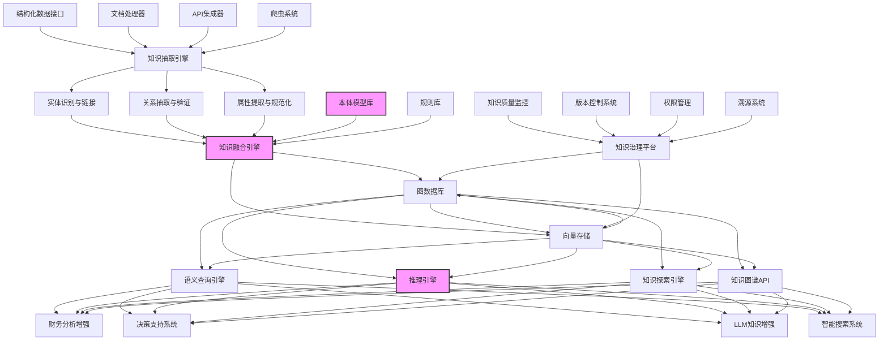

---
{"dg-publish":true,"tags":["知识图谱","语义连接","本体模型","智能推理","知识发现"],"创建日期":"2024-05-14","permalink":"/知识共享/001_财务/99_其他/AI与财务应用/05_财务人工智能系统架构/5.2 数据基础设施/财务知识图谱构建/","dgPassFrontmatter":true}
---

## 技术概述

财务知识图谱构建系统是一种融合知识工程、自然语言处理和图数据库技术的高级数据基础设施，旨在将分散、异构的财务知识以语义网络形式进行结构化组织和关联，形成一个具有丰富语义关系的知识网络。该系统通过建立财务概念、实体、关系的形式化表达，支持财务知识的智能检索、推理和应用，为财务分析和决策提供知识基础。

相较于传统的财务数据管理方式，财务知识图谱具有显著优势：

- **关系显性化**: 将隐含在数据中的复杂关系（如因果关系、依赖关系）显性表达，使关系成为可查询、可分析的一等公民
- **语义整合能力**: 能够整合来自不同来源、不同结构的财务知识，建立统一的语义理解框架
- **推理与发现**: 通过图算法和推理引擎，可发现隐含关系和知识，生成新的洞察
- **适应性强**: 知识图谱结构灵活，易于扩展和演化，能持续吸收新的财务概念和关系
- **与大模型协同**: 为大语言模型提供结构化知识支持，弥补大模型在专业财务领域的知识空缺和幻觉问题

### 核心技术特性

1. **财务本体模型构建引擎**: 采用领域驱动设计方法与本体工程技术，建立财务领域核心概念、关系和约束的形式化模型，包括财务科目体系、报表结构、业务流程、监管规则等核心知识结构。

2. **多源知识抽取集成系统**: 结合规则引擎与深度学习模型，从结构化数据（ERP、财务系统）、半结构化数据（财报、监管文件）和非结构化数据（研报、新闻）中抽取实体与关系，构建完整知识图谱。

3. **知识图谱推理引擎**: 融合传统符号推理与神经网络推理技术，支持事实推理、规则推理、统计推理和类比推理，可进行财务指标关系推导、异常原因追溯、风险传导分析等高级应用。

4. **语义查询与探索界面**: 提供基于自然语言的知识图谱交互界面，财务人员可通过自然语言提问、图形化浏览与探索复杂财务知识网络，降低使用门槛。

5. **知识融合与冲突解决**: 采用基于概率的知识融合算法，自动处理来自不同来源的知识冲突与矛盾，维护知识一致性与可靠性。

6. **动态知识更新机制**: 设计增量式知识获取与图谱演化机制，能够持续吸收最新财务数据、规则变更和市场动态，保持知识时效性。

7. **知识溯源与可解释性**: 为图谱中每个知识点提供来源溯源、置信度评估和证据链，支持可审计和可解释的财务分析。

8. **与大语言模型协同增强**: 通过检索增强生成(RAG)和知识增强微调，将结构化财务知识注入大语言模型，提高生成内容的准确性和专业性。

9. **多层次知识表示**: 支持从宏观财务概念到微观交易细节的多层次知识表示，满足不同粒度的分析需求。

10. **知识安全与权限控制**: 实现基于角色和知识敏感度的多级访问控制，确保敏感财务知识的安全管理。

## 系统架构

### 核心功能层级

1. **知识获取层**: 负责从多种来源获取财务知识，包括结构化数据库连接器、文档处理器、API集成器和网络爬虫，实现全方位知识采集。

2. **知识处理层**: 处理和转换原始数据为知识图谱元素，包括实体识别与链接、关系抽取与验证、属性提取与规范化，并通过知识融合引擎整合为一致性知识。

3. **知识存储层**: 基于图数据库和向量存储的混合架构，实现知识的高效存储、查询和检索，支持结构化知识和非结构化知识的统一管理。

4. **知识服务层**: 提供多种知识服务能力，包括语义查询引擎、推理引擎、知识探索引擎和标准化API接口，满足不同应用场景需求。

5. **应用层**: 基于知识图谱构建多种智能应用，如财务分析增强、决策支持系统、大语言模型知识增强和智能搜索系统。

6. **治理层**: 提供全面的知识治理能力，包括知识质量监控、版本控制、权限管理和溯源系统，确保知识图谱的质量、安全和可管理性。

### 关键支撑组件

1. **财务本体模型库**: 包含预定义的财务概念层次、关系类型和领域约束，作为知识图谱的骨架和语义基础。

2. **知识融合引擎**: 核心组件，负责解决来自不同来源的知识冲突，并将碎片化知识整合为连贯的知识网络。

3. **图计算与推理引擎**: 提供高级图算法和推理能力，支持路径分析、关系挖掘、影响传播和因果推理等高级分析。

## 实施计划

### 一期（1-3个月）：基础构建

- 设计财务领域核心本体模型，包括基本概念层次与关系类型
- 构建知识抽取基础组件，优先连接结构化数据源（如ERP、财务系统）
- 部署基础图数据库环境，实现初步知识存储与查询
- 开发基础知识管理界面，支持手动知识录入与编辑
- 制定知识图谱质量评估标准与指标体系

### 二期（3-6个月）：能力扩展

- 增强知识抽取能力，开发半结构化文档处理器
- 实现初步的图谱推理规则，支持基础财务指标关系推导
- 开发语义查询接口，支持自然语言查询转换
- 构建知识融合算法，解决初步的知识冲突问题
- 开发知识图谱可视化与探索工具
- 建立知识版本控制与溯源机制

### 三期（6-9个月）：智能增强

- 整合深度学习模型，强化非结构化文本知识抽取
- 扩展财务本体模型，增加行业特定知识与高级财务概念
- 增强推理引擎，支持复杂规则推理与统计推理
- 开发知识质量自动评估与修复系统
- 构建知识图谱API服务，支持外部系统集成
- 实现与大语言模型的知识协同机制

### 四期（9-12个月）：生态完善

- 开发高级知识挖掘算法，支持新关系发现与假设验证
- 实现跨领域知识融合，整合市场、供应链等相关领域知识
- 构建完整的知识图谱治理体系与运营流程
- 开发特定业务场景的知识应用解决方案
- 建立知识众包与协作更新机制
- 优化系统性能与扩展性，支持大规模知识图谱运行

## 技术挑战与解决方案

### 挑战一：财务知识复杂性与异构性

**挑战**：财务知识来源多样，存在结构、语义、粒度差异，难以统一整合。

**解决方案**：
- 构建层次化财务本体模型，作为知识整合的语义基础
- 设计灵活的知识表示框架，适应不同类型和粒度的财务知识
- 采用基于嵌入的实体对齐技术，处理跨源实体匹配问题
- 实现基于上下文的关系语义归一化，解决关系表达多样性问题

### 挑战二：隐含知识抽取与关系发现

**挑战**：财务领域中大量关键知识和关系是隐含的，不易从原始数据中直接提取。

**解决方案**：
- 结合领域规则与深度学习的混合知识抽取方法
- 应用远程监督和弱监督学习技术，降低标注需求
- 利用预训练语言模型增强文本理解与隐含关系抽取
- 应用图挖掘算法发现数据中的隐含模式和关系

### 挑战三：知识时效性与更新维护

**挑战**：财务知识随政策法规变化、市场发展和组织调整而快速变化，图谱需要持续更新。

**解决方案**：
- 设计增量式知识更新架构，支持实时和批量更新
- 实现基于时序的知识版本控制，追踪知识变化历史
- 开发知识变更影响分析工具，评估更新对下游应用的影响
- 构建知识更新自动化工作流，减少人工维护成本

### 挑战四：复杂推理与知识应用

**挑战**：财务分析场景需要多步骤、多维度的复杂推理能力，超出简单知识查询范围。

**解决方案**：
- 结合符号推理与神经网络推理的混合推理框架
- 应用路径排序算法，识别最相关因果路径和推理链
- 整合统计分析模型，支持基于历史数据的概率推理
- 开发可视化推理解释工具，使复杂推理过程可理解

### 挑战五：安全性与合规性

**挑战**：财务知识包含大量敏感和保密信息，需要严格的安全控制和合规管理。

**解决方案**：
- 实现基于知识粒度的多级访问控制机制
- 设计知识加密和数据脱敏策略，保护敏感信息
- 构建全面的知识审计和访问日志系统
- 开发合规性检查工具，确保知识管理符合监管要求

## 价值创造

### 效率提升

- **知识检索效率提升**: 75-90%，将财务人员寻找信息的时间从小时级缩短到分钟级
- **数据整合时间缩短**: 60-80%，大幅减少跨系统数据关联与整合的手工工作
- **报告生成速度提升**: 50-70%，自动关联相关知识，加速财务报告编制过程
- **问题解决速度提升**: 40-60%，通过知识关联快速定位问题根因和解决方案

### 能力增强

- **知识发现能力**: 识别传统方法难以发现的隐含关系和模式
- **复杂分析支持**: 支持多步骤、多维度的财务因果分析和影响评估
- **全局视图构建**: 提供跨部门、跨系统的财务知识统一视图
- **知识累积与传承**: 将隐性经验转化为显性知识，减少人员流动带来的知识流失

### 决策提升

- **决策准确性提升**: 30-50%，通过提供全面的相关知识支持
- **决策速度提升**: 40-60%，减少信息收集与验证时间
- **风险识别能力增强**: 35-55%，通过关系网络发现潜在风险传导路径
- **创新洞察生成**: 创造25-45%全新的业务洞察和决策视角

### 投资回报

- **预计ROI**: 320-420%（24个月）
- **投资成本结构**:
  - 技术基础设施: 20-25%
  - 软件开发与集成: 30-35%
  - 知识采集与建模: 25-30%
  - 人员培训与变革管理: 15-20%
- **回收期**:
  - 大型企业: 12-18个月
  - 中型企业: 10-15个月
  - 小型企业: 8-12个月

## 未来演进

### 短期技术迭代（1-2年）

- **大语言模型深度集成**: 将知识图谱作为大语言模型的事实基础，实现更准确的财务文本生成与问答
- **图神经网络应用**: 应用GNN技术增强知识表示与推理能力
- **多模态知识融合**: 整合财务图表、报表图像等多模态信息进入知识图谱
- **知识自学习机制**: 开发半自动化知识获取和验证流程，减少人工干预

### 中期技术迭代（2-3年）

- **认知图谱技术**: 从纯事实图谱升级为包含推理规则、约束条件的认知图谱
- **因果图谱构建**: 建立更精确的财务因果关系网络，支持更复杂的模拟与预测
- **知识-数据双轮驱动**: 实现知识驱动和数据驱动分析的深度融合
- **联邦知识图谱**: 支持多组织间安全知识共享与协作，保持数据隔离

### 长期技术迭代（3-5年）

- **自主知识管理系统**: 发展具备自主学习、验证和演化能力的知识系统
- **复杂事件处理与决策**: 基于图谱的复杂财务事件检测与响应推荐
- **可编程知识网络**: 允许业务用户自定义知识处理和推理逻辑
- **量子计算增强**: 利用量子计算技术加速大规模知识图谱的复杂查询和推理

### 应用场景扩展

1. **智能财务顾问**: 基于知识图谱打造的虚拟财务专家，提供专业建议和解释
2. **高级监管合规**: 将监管规则构建为知识网络，支持自动合规检查和调整
3. **财务情报系统**: 整合内外部财务知识，提供战略洞察和市场预警
4. **场景化决策支持**: 为并购、投资、重组等关键决策提供知识驱动的情景模拟
5. **自动化财务叙事**: 基于知识图谱生成解释性财务报告和业绩分析

## 概念验证

### 验证方法

1. **领域概念验证**（1-2个月）
   - 构建特定财务领域（如成本分析或资金管理）的小型知识图谱
   - 验证本体模型设计和知识表示方法的有效性
   - 测试基础查询和推理功能

2. **技术路径验证**（2-3个月）
   - 实现核心技术组件的原型，包括知识抽取、融合和推理
   - 使用真实数据子集进行端到端功能测试
   - 评估技术路径的可行性和性能表现

3. **业务价值验证**（3-4个月）
   - 选择具体财务分析场景进行应用测试
   - 对比传统方法与知识图谱支持下的效率和质量差异
   - 收集用户反馈和改进建议

### 验证指标

1. **技术指标**
   - 知识覆盖率：核心财务概念覆盖 >90%
   - 知识准确率：实体和关系准确度 >95%
   - 查询响应时间：复杂查询 <3秒
   - 推理准确率：与专家判断一致性 >85%
   - 系统可扩展性：支持每月新增100万+知识点

2. **业务指标**
   - 分析时间缩短：>60%
   - 信息获取准确率提升：>40%
   - 决策支持满意度：>4.2/5分
   - 新洞察发现率：每月至少5个重要新发现
   - 知识重用率：>70%

3. **用户体验指标**
   - 学习曲线：<2天掌握基本操作
   - 查询成功率：>90%
   - 用户满意度：>4.0/5分
   - 日常使用频率：每用户每周>10次
   - 功能采纳率：关键功能采纳率>80% 