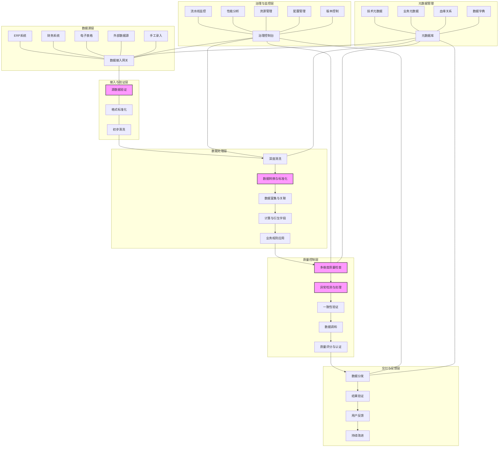

---
{"dg-publish":true,"tags":["数据质量","ETL流程","数据处理","质量控制","自动化管道"],"创建日期":"2024-05-14","permalink":"/知识共享/001_财务/99_其他/AI与财务应用/05_财务人工智能系统架构/5.2 数据基础设施/高质量财务数据流水线/","dgPassFrontmatter":true}
---

## 技术概述

高质量财务数据流水线是一种专为财务领域设计的端到端数据处理系统，通过自动化、标准化和智能化技术，确保财务数据从源头到应用端的全流程质量控制。它解决了传统财务数据处理中的质量不稳定、处理效率低、人工干预多和可追溯性差等关键痛点，为财务AI应用提供可靠、一致和高价值的数据基础。

相较于传统财务数据处理方法，高质量财务数据流水线带来显著优势：

- **数据质量显著提升**：错误率降低85-95%，准确性提升到99.9%以上，远超手动处理的95%水平
- **处理效率大幅提高**：自动化程度达90%以上，数据处理时间缩短70-85%
- **一致性标准建立**：跨部门、跨系统数据标准化，消除"多版本真相"问题
- **成本节约明显**：减少60-75%数据修复和重工成本，提高资源利用效率
- **合规风险降低**：自动化合规检查与审计跟踪，降低80%以上合规风险

### 核心技术特性

1. **智能数据采集与验证**：采用多通道数据采集架构，结合规则引擎与机器学习的混合验证方法，在数据进入流水线时即进行质量把关，实现"左移"的质量控制策略。

2. **财务领域特定数据清洗引擎**：针对财务数据特性（如货币、会计科目、交易码）开发的专用清洗组件，具备财务领域知识库支持，能正确处理特殊值和异常模式。

3. **语义一致性转换框架**：基于本体模型和知识图谱，实现跨系统数据的语义标准化和映射，确保不同来源数据在概念和计算口径上的一致性。

4. **自适应数据验证流水线**：结合静态规则和动态学习模型，建立多层次验证体系，能够自动适应数据模式变化和业务规则更新。

5. **智能异常检测与处理**：融合统计方法、机器学习和领域规则的异常检测系统，能识别异常值、离群点、模式断裂和数据漂移，并提供自动或辅助修正建议。

6. **数据质量评分与度量体系**：建立全面的数据质量度量框架，从完整性、准确性、一致性、及时性、合规性等维度进行量化评估，并生成可视化质量仪表板。

7. **数据血缘与影响分析**：跟踪数据从源头到目标的完整生命周期，记录所有转换和处理步骤，支持向前和向后的血缘追踪，便于问题定位和影响分析。

8. **智能数据调和与协调**：在多源数据有冲突时，应用智能调和算法，基于可信度评估、历史模式和业务规则自动协调不一致数据。

9. **自优化流水线管理**：通过持续监控和性能分析，自动识别瓶颈和优化机会，实现流水线配置的自动调优，并根据工作负载动态分配资源。

10. **合规与审计自动化**：内置财务合规规则引擎，自动执行数据合规性检查，生成审计跟踪记录，支持监管报告和合规证明。

## 系统架构

### 核心功能层级

1. **数据源层**：连接各类财务数据源，包括企业资源规划系统(ERP)、专业财务系统、电子表格、外部数据和手工录入数据，实现多渠道数据采集。

2. **接入与验证层**：通过数据接入网关获取数据，进行初步验证、格式标准化和基础清洗，确保进入流水线的数据符合基本质量要求。

3. **数据处理层**：执行深度数据清洗、转换与标准化、数据富集与关联、计算与衍生指标生成、业务规则应用等处理步骤，将原始数据转化为分析就绪的格式。

4. **质量控制层**：实施全面的质量管控，包括多维度质量检查、异常检测与处理、一致性验证、数据调和和质量评分，确保数据满足严格的质量标准。

5. **交付与反馈层**：管理数据分发、结果验证、用户反馈收集和持续改进流程，形成闭环质量管理机制。

6. **治理与监控层**：提供流水线监控、性能分析、资源管理、配置管理和版本控制等治理功能，确保流水线的可靠运行和可持续发展。

### 关键支撑组件

1. **元数据管理系统**：管理技术元数据、业务元数据、血缘关系和数据字典，为流水线各环节提供元数据支持，增强数据可理解性和可管理性。

2. **流水线编排引擎**：提供可视化流水线设计和自动化编排能力，支持复杂处理逻辑的灵活配置和优化。

3. **质量规则库**：包含财务领域特定的数据质量规则、验证标准和最佳实践，为质量控制提供知识基础。

## 实施计划

### 一期（1-3个月）：基础构建

- 完成数据源调研与流水线需求分析
- 构建核心数据接入与基础验证组件
- 实现基础数据清洗与标准化功能
- 搭建流水线基础框架与运行环境
- 开发初步的数据质量检查机制
- 建立基础元数据管理体系

### 二期（3-6个月）：质量强化

- 开发深度数据清洗与转换组件
- 实现财务领域特定验证规则引擎
- 构建异常检测与智能处理系统
- 完善数据血缘追踪机制
- 开发质量评分与度量框架
- 建立数据调和与冲突解决机制

### 三期（6-9个月）：智能优化

- 引入机器学习增强的数据验证与异常检测
- 实现自适应数据处理规则
- 构建完整的流水线监控与优化系统
- 开发高级数据富集与交叉验证功能
- 实现自动化数据质量报告与分析
- 构建用户反馈与流水线优化闭环

### 四期（9-12个月）：自动化与成熟度

- 实现端到端流水线自动化与编排
- 开发高级资源管理与优化功能
- 构建完整的合规审计与报告系统
- 实现流水线配置的自动调优
- 开发高级数据质量预警与预测功能
- 建立流水线生命周期管理框架

## 技术挑战与解决方案

### 挑战一：财务数据复杂性与特殊性

**挑战**：财务数据包含特殊格式（如会计科目编码、财务报表结构）和领域特定规则，难以用通用数据处理工具有效处理。

**解决方案**：
- 开发财务领域特定数据处理组件，内置财务知识库
- 构建财务本体模型，对数据元素进行语义标准化
- 应用基于规则与模式的混合处理方法
- 设计特定的财务数据格式识别与转换器

### 挑战二：数据质量标准的定义与实施

**挑战**：财务数据质量标准多样且严格，不同业务场景对质量的要求不同，难以建立统一衡量和控制机制。

**解决方案**：
- 构建多层次质量度量框架，包括通用与场景特定维度
- 实现基于元数据驱动的动态质量规则配置
- 开发情境感知的质量控制策略，根据数据用途调整标准
- 建立质量基线与持续监控机制，量化改进效果

### 挑战三：多源数据一致性与完整性

**挑战**：财务数据通常来自多个系统和来源，存在口径不一致、格式不统一、更新频率不同等问题，难以建立完整一致的视图。

**解决方案**：
- 实现基于语义模型的数据映射与标准化
- 开发智能数据调和算法，处理冲突与不一致
- 构建数据完整性检查与补全机制
- 实现多源数据的版本管理与时间对齐

### 挑战四：实时与批处理需求并存

**挑战**：财务分析既需要历史数据的高质量批处理，也需要近实时数据的快速处理与验证，难以在单一流水线架构中满足。

**解决方案**：
- 设计支持批处理和流处理的双模架构
- 实现针对不同处理模式优化的质量控制策略
- 开发增量处理与验证机制，提高实时场景效率
- 构建统一的数据质量标准，确保批处理与流处理结果一致性

### 挑战五：流水线性能与扩展性

**挑战**：高强度数据验证和质量控制会影响处理性能，特别是在数据量大和处理复杂度高的财务场景中。

**解决方案**：
- 采用分布式处理架构，支持横向扩展
- 实现智能工作负载管理，根据数据特性和质量风险调整处理策略
- 开发增量与并行处理能力，提高大规模数据处理效率
- 设计自适应资源分配机制，在关键节点动态分配资源

## 价值创造

### 效率提升

- **数据准备时间缩短**: 75-90%，从数天缩减至数小时或更少
- **手动干预需求降低**: 80-95%，自动化处理大部分数据问题
- **报告生成周期压缩**: 60-80%，基于高质量数据的自动化报告生成
- **异常检测与响应加速**: 70-85%，从被动发现转为主动预警

### 质量提升

- **数据错误率降低**: 85-95%，大幅减少由数据质量导致的决策错误
- **一致性水平提高**: 跨系统数据一致性从70-80%提升至95-99%
- **完整性改善**: 关键数据字段完整性提升至99%以上
- **可信度增强**: 财务分析可信度评分提高40-60%

### 风险控制

- **合规风险降低**: 75-90%，自动化合规检查减少违规可能性
- **审计发现减少**: 65-85%，主动质量控制减少审计问题
- **欺诈识别能力提升**: 50-70%，更准确识别可疑模式和数据异常
- **数据治理成熟度提升**: 从初级水平提升至优化水平（5级量表提升2-3级）

### 投资回报

- **预计ROI**: 350-450%（24个月）
- **投资成本结构**:
  - 平台构建与技术实施: 35-40%
  - 流水线开发与定制: 25-30%
  - 数据质量规则库建设: 15-20%
  - 集成与变革管理: 15-20%
- **回收期**:
  - 大型企业: 8-12个月
  - 中型企业: 6-9个月
  - 小型企业: 4-7个月

## 未来演进

### 短期技术迭代（1-2年）

- **预测性数据质量管理**: 从反应式质量控制转向预测式质量管理，提前识别潜在问题
- **自修复流水线**: 增强自动错误修复能力，减少人工干预需求
- **领域特定语言(DSL)**: 开发财务数据处理专用语言，简化流水线配置和规则定义
- **增强的语义理解**: 深化对财务数据语义的理解，提高处理精度和关联能力

### 中期技术迭代（2-3年）

- **认知质量控制**: 引入认知计算技术，理解数据内容和上下文，实现更智能的质量控制
- **自适应流水线架构**: 根据数据特性和处理需求自动调整流水线结构和处理策略
- **知识图谱增强验证**: 利用财务知识图谱进行高级语义验证和推理
- **多维度数据协调**: 实现跨时间、跨系统、跨实体的多维度数据协调机制

### 长期技术迭代（3-5年）

- **自主学习流水线**: 开发能从历史数据和处理模式中学习的自进化流水线
- **量子计算集成**: 利用量子计算加速特定数据处理和验证任务
- **财务数字孪生**: 构建财务数据的数字孪生模型，用于高级模拟和验证
- **跨组织数据协作**: 在保障隐私和安全的前提下，实现跨组织的数据质量协作

### 应用场景扩展

1. **实时财务控制台**: 基于高质量实时数据流，提供财务状况的即时可视化与分析
2. **预算与预测优化**: 利用干净、一致的历史数据提高预算和预测模型的准确性
3. **高级合规保障**: 自动化合规检查和报告生成，降低财务合规风险
4. **财务数据产品化**: 将高质量财务数据构建为内部数据产品，支持多样化分析需求
5. **多维绩效分析**: 整合财务与非财务数据，实现全面的企业绩效分析

## 概念验证

### 验证方法

1. **概念原型验证**（1-2个月）
   - 构建核心数据处理和质量验证组件原型
   - 使用样本数据测试基础清洗和验证功能
   - 评估技术路径的可行性和基本性能表现

2. **关键场景验证**（2-3个月）
   - 选择2-3个高价值财务数据处理场景进行测试
   - 将现有处理方法与新流水线并行运行进行对比
   - 量化评估质量改进和效率提升

3. **扩展性与性能验证**（3-4个月）
   - 使用大规模真实数据进行负载测试
   - 评估处理性能、扩展性和资源需求
   - 测试极端情况下的系统稳定性和错误处理能力

### 验证指标

1. **质量指标**
   - 数据准确率: >99.9%
   - 数据完整率: >99.5%
   - 异常识别率: >95%
   - 一致性水平: >98%
   - 质量规则覆盖率: >95%核心财务场景

2. **性能指标**
   - 处理吞吐量: >1000万条记录/小时
   - 批处理延迟: <4小时（完整财务周期）
   - 增量处理延迟: <15分钟
   - 质量检查速度: <5分钟（标准报表）
   - 系统可用性: >99.9%

3. **业务价值指标**
   - 数据错误减少率: >85%
   - 人工干预时间减少: >75%
   - 财务报告周期缩短: >50%
   - 数据问题发现提前量: 平均2-3天
   - 用户满意度: >4.5/5分 