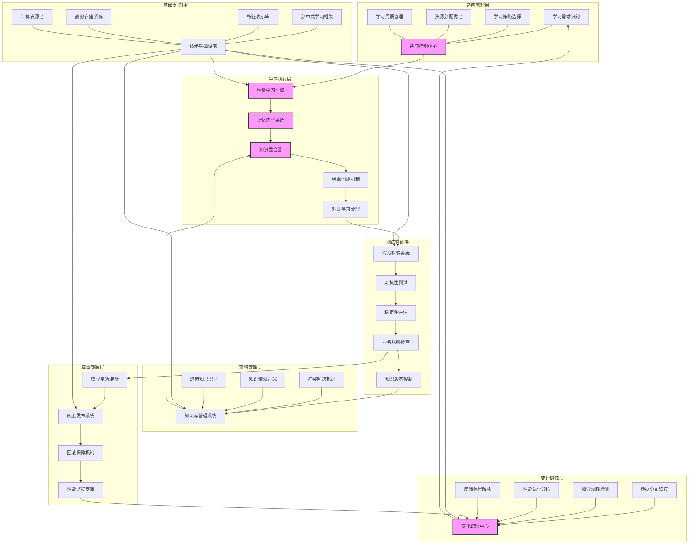

---
{"dg-publish":true,"tags":["持续学习","模型更新","适应性智能","知识进化","动态优化"],"创建日期":"2024-05-14","permalink":"/知识共享/001_财务/99_其他/AI与财务应用/05_财务人工智能系统架构/5.3 AI模型管理/5.3 持续学习与适应系统/","dgPassFrontmatter":true}
---

## 技术概述

持续学习与适应系统是一种先进的财务AI架构关键组件，专为解决传统AI模型面临的"静态知识"和"能力退化"问题而设计。该系统赋予财务AI能力持续进化的能力，使其能够从不断涌现的新数据、新知识和用户交互中学习，动态调整自身能力结构和参数，适应快速变化的财务环境和不断演变的业务需求。

与传统的"训练-部署-重训练"周期模式相比，持续学习与适应系统实现了更加自然、平滑的能力演进路径：

- **学习效率提升**：所需再训练数据量减少60-80%，新知识整合速度加快3-5倍
- **记忆能力优化**：知识保持率提高40-60%，大幅减轻灾难性遗忘问题
- **适应性增强**：对数据分布变化的适应能力提升50-70%，环境变化响应速度加快35-55%
- **资源利用优化**：计算资源需求降低30-50%，存储需求减少25-45%
- **业务价值提升**：模型生命周期延长2-3倍，维护成本降低40-60%

### 核心技术特性

1. **增量学习架构**：实现新知识的渐进式整合而不需对整个模型进行重训练。架构采用模块化和参数隔离设计，将网络分为稳定区域和可塑区域，只需更新与新知识相关的参数子集，同时保留现有能力。系统支持批量增量学习和在线增量学习两种模式，能够有效处理不同规模和频率的知识更新需求。

2. **经验回放与记忆优化**：解决"灾难性遗忘"问题，保持对历史知识的记忆能力。系统实现智能采样策略，存储代表性历史经验样本并在学习新任务时混合使用，通过重要性加权和对比学习增强记忆保留。高级功能包括样本生成回放（通过生成模型合成历史数据特征）和概念记忆蒸馏（将抽象知识而非原始数据存储为知识单元）。

3. **可塑性-稳定性平衡调节**：动态平衡模型吸收新知识的能力（可塑性）和保持现有知识的能力（稳定性）。系统采用元学习策略动态调整学习率和正则化强度，根据任务相似性和已有知识覆盖度自动配置适应参数。关键组件包括知识冲突检测器、任务相关性分析器和适应性超参数调节器，共同维持最优平衡点。

4. **知识转移网络**：促进不同财务领域模型间的经验和能力共享，实现跨场景学习加速。网络包含领域适应层、知识映射器和相关性评估模块，能够识别不同任务间的共性，选择性迁移有价值的特征表示和模式识别能力。系统支持垂直转移（从一般到专业）和水平转移（跨相似领域），最大化知识复用价值。

5. **对比经验学习**：从模型预测错误和用户反馈中高效学习，持续改进决策质量。系统构建成对比较框架，分析正确预测和错误预测间的特征差异，识别关键决策边界和易混淆区域。通过强化学习机制，系统根据反馈信号调整预测策略，特别关注高价值决策和边缘案例，显著提升模型的判断能力。

6. **多速率学习系统**：根据知识类型和重要性实施差异化学习策略。系统识别并划分快速变化知识（如市场趋势、政策变化）和稳定知识（如基本财务原理、合规要求），对不同类型知识采用不同更新频率和学习方法。快速层采用轻量级参数更新，响应及时；基础层则注重稳定性和一致性，更新周期更长，确保系统整体平衡。

7. **环境感知适应引擎**：主动检测环境变化并触发相应的模型适应机制。引擎包含分布偏移检测器、概念漂移分析器和上下文变化识别器，能够识别数据分布变化、核心概念演变和业务环境转变等关键信号。系统根据变化性质自动选择适当的适应策略，从简单的参数微调到深度结构重组，确保模型持续有效。

8. **效用导向学习调度**：基于业务价值和资源约束优化学习过程。调度器评估不同学习任务的潜在业务价值、紧急性和计算成本，制定最优学习计划。系统采用多目标优化算法，平衡即时性能提升和长期能力建设，支持根据业务周期和资源可用性动态调整学习强度和优先级，实现价值最大化。

9. **假设测试与验证循环**：在应用新学习成果前进行严格的质量控制。系统构建安全沙箱环境，对学习到的新知识和更新后的模型进行全面测试。验证过程包括稳定性测试、对抗性测试、边缘案例分析和业务规则符合性检查，确保更新不会带来性能下降或意外行为。循环机制支持增量发布和灰度测试，降低更新风险。

10. **知识库进化管理**：随系统演进维护清晰、一致的知识表示。管理系统实施知识版本控制、依赖关系跟踪和冲突解决机制，记录知识来源、更新历史和可靠性评估。高级功能包括知识图谱自动扩展、概念关系重构和过时知识识别，确保知识库始终保持最新、相关和结构化状态，为持续学习提供坚实基础。

## 系统架构

### 架构关键组件

1. **适应管理层**：系统的"大脑"，负责整体学习策略制定和资源调度，识别学习需求，选择最佳学习方法，优化资源分配，管理学习周期。

2. **学习执行层**：系统的"学习引擎"，实施各种学习算法和知识整合机制，包括增量学习、记忆优化、知识整合、经验回放和对比学习等核心功能。

3. **变化感知层**：系统的"感知系统"，持续监控环境变化信号，包括数据分布监控、概念漂移检测、性能退化分析和反馈信号解析，及时触发适应响应。

4. **测试验证层**：系统的"质量控制中心"，对学习成果进行严格验证，通过假设检验、对抗性测试、稳定性评估和业务规则检查确保更新质量。

5. **知识管理层**：系统的"记忆中枢"，管理知识资产的版本、依赖关系和时效性，确保知识库的一致性和有效性，支持知识的可追溯性和复用。

6. **模型部署层**：系统的"执行接口"，负责模型更新的安全部署，包括更新准备、灰度发布、回滚保障和性能监控，确保平稳过渡。

7. **基础支持组件**：系统的"基础设施"，提供技术支持和资源保障，包括分布式学习框架、特征表示库、高效存储系统和计算资源池等。

### 核心流程和数据流

**主要流程路径**：
- **适应触发流程**：环境变化 → 变化识别 → 学习需求确定 → 学习策略制定 → 资源分配
- **学习执行流程**：数据收集 → 增量学习 → 记忆优化 → 知识整合 → 验证测试 → 部署更新
- **知识管理流程**：新知识生成 → 冲突检测 → 知识整合 → 版本控制 → 知识存储 → 可用性维护

**关键数据流向**：
- **感知数据流**：监控数据 → 分布统计 → 变化特征 → 触发信号
- **学习数据流**：训练样本 → 特征表示 → 参数更新 → 模型调整 → 性能评估
- **知识数据流**：原始知识 → 结构化表示 → 关系映射 → 整合存储 → 检索应用

**系统核心环节**特别强调三个关键点：
1. **适应控制中心**：全局协调各组件，确保系统整体协同
2. **增量学习引擎**：高效实现新知识获取而不丢失已有能力
3. **记忆优化系统**：解决灾难性遗忘问题，保持长期知识稳定性
4. **变化识别中心**：及时感知环境变化，触发适应调整
5. **知识整合器**：确保新知识与现有知识体系和谐融合

## 实施计划

### 一期（1-3个月）：基础架构与核心功能

- 设计整体系统架构和关键接口规范
- 实现基础增量学习框架（聚焦参数更新效率）
- 开发简化版记忆回放机制（样本存储与回放）
- 构建基础数据分布监控工具
- 实现初步的知识版本控制系统
- 开发模型更新部署的基本流程
- 建立学习效果评估的指标体系
- 选择1-2个财务应用场景进行概念验证

### 二期（3-6个月）：增强功能与学习优化

- 完善增量学习算法，增加参数隔离和选择性更新
- 开发高级记忆优化技术，引入重要性采样和对比学习
- 实现概念漂移检测和环境变化识别能力
- 构建知识冲突检测和解决机制
- 开发假设测试框架和验证流程
- 实现可塑性-稳定性自动平衡机制
- 开发灰度发布和回滚保障系统
- 扩展到3-5个财务应用场景，优化场景适应性

### 三期（6-9个月）：高级特性与系统集成

- 实现知识转移网络，支持跨领域能力共享
- 开发多速率学习系统，差异化处理不同类型知识
- 构建完整的对比经验学习框架
- 实现效用导向的学习调度系统
- 开发高级知识库进化管理机制
- 完善对抗性测试和稳定性评估工具
- 构建综合性能监控和反馈分析系统
- 优化系统整体性能和资源利用效率
- 实现与其他财务AI组件的深度集成

### 四期（9-12个月）：优化提升与规模应用

- 系统整体性能优化和可扩展性增强
- 实现完全自动化的学习循环和知识更新
- 开发高级适应策略库和自动策略选择
- 构建学习资源智能调度和优化系统
- 完善业务规则合规性检查框架
- 开发长期知识稳定性保障机制
- 构建完整的知识来源追踪和可解释性支持
- 实现跨业务线的知识共享和协同学习
- 完成全面的系统文档和最佳实践指南

## 技术挑战与解决方案

### 挑战一：灾难性遗忘

**挑战**：当AI系统学习新知识时，往往会失去之前掌握的能力，这种"灾难性遗忘"在财务领域尤其严重，因为财务决策依赖于长期积累的广泛知识基础。简单的增量更新会导致模型性能不稳定，合规风险增加，用户信任下降。

**解决方案**：
- 构建分层记忆架构，将知识分为核心稳定层和灵活适应层
- 实施经验回放策略，存储代表性历史数据样本并在新学习过程中混合使用
- 开发知识蒸馏技术，将历史知识浓缩为更紧凑的表示形式
- 实现弹性权重正则化，对重要的历史知识参数施加更强的保护
- 构建记忆指导网络，评估知识单元重要性并保护关键参数
- 设计渐进式学习路径，通过小步骤学习降低知识冲突
- 开发概念合并技术，将新旧知识整合为更一般化的表示

### 挑战二：学习效率与资源优化

**挑战**：持续学习过程计算密集且资源需求高，特别是在实时业务环境中，如何在有限资源条件下高效实现持续适应是关键挑战。传统方法需要大量数据和计算资源，导致成本高昂，学习周期长，影响系统实用性。

**解决方案**：
- 开发参数高效学习方法，仅更新与新知识相关的模型子集
- 实施梯度累积和批处理优化，减少计算资源峰值需求
- 构建知识重要性评估框架，集中资源于高价值学习任务
- 设计自适应学习率调节器，根据任务难度和重要性调整学习强度
- 实现分布式学习协议，利用闲置算力进行后台持续优化
- 开发模型压缩和量化技术，降低运行时资源需求
- 构建知识缓存系统，重用计算结果避免重复处理
- 实施迁移学习策略，从相似任务中借鉴知识减少学习成本

### 挑战三：知识一致性与整合

**挑战**：随着系统持续学习，知识库容易变得不一致，出现冲突的概念、重复信息和过时内容。财务领域对知识准确性要求极高，不一致的知识可能导致错误决策、违规风险和信任危机。

**解决方案**：
- 构建知识图谱表示系统，明确概念间关系和依赖
- 开发知识冲突检测算法，自动识别和标记不一致内容
- 实施基于因果推理的知识整合机制，解决表面冲突的深层矛盾
- 设计知识可靠性评分系统，为不同来源知识分配信任度
- 构建知识版本控制框架，追踪知识演变历史和来源
- 实现定期知识审计流程，清理过时和低质量内容
- 开发知识闭环验证机制，通过实际应用结果验证知识有效性
- 设计上下文敏感的知识适用规则，明确不同知识的应用边界

### 挑战四：变化检测与适应触发

**挑战**：及时准确地识别环境变化并触发适当的适应响应是持续学习系统的关键挑战。财务环境的变化可能是渐进的、季节性的或结构性的，误判变化类型可能导致过度适应或适应不足，影响模型性能和可靠性。

**解决方案**：
- 构建多尺度变化检测系统，同时监控短期波动和长期趋势
- 开发概念漂移识别算法，区分噪声波动和实质性改变
- 实施性能退化预警机制，监测关键指标变化趋势
- 设计上下文感知变化评估器，考虑业务环境因素
- 构建基于假设检验的变化确认流程，减少误报
- 实现变化分类框架，区分需要不同响应策略的变化类型
- 开发自适应阈值系统，根据历史波动模式动态调整触发敏感度
- 设计人机协作验证机制，在关键变化点引入专家判断

### 挑战五：可靠性验证与部署安全

**挑战**：确保学习更新不会引入新问题或性能退化是持续学习系统面临的重大挑战。财务领域对系统可靠性要求极高，不当的更新可能导致严重后果，包括财务损失、合规风险和声誉损害。

**解决方案**：
- 构建全面的测试验证框架，涵盖功能性、性能和安全测试
- 开发对抗性测试系统，主动探索更新可能引入的漏洞
- 实施回归测试自动化，确保核心功能不受影响
- 设计业务规则和合规性检查流程，验证更新后的监管合规性
- 构建灰度发布机制，分阶段、小比例推出更新
- 实现快速回滚能力，在发现问题时立即恢复到稳定版本
- 开发性能对比分析工具，量化更新前后的能力变化
- 设计长期监控机制，追踪更新后的持续表现

## 价值创造

### 模型能力提升

- **预测准确性持续改进**: 相比静态模型提高15-30%，特别是在变化环境中
- **知识覆盖范围扩展**: 领域知识覆盖增加25-45%，无需完全重新训练
- **环境适应速度加快**: 对新趋势和模式的适应加快45-65%
- **长尾案例处理能力**: 罕见情况处理能力提升30-50%，持续从经验中学习

### 运营效益增强

- **开发与维护成本降低**: 减少40-60%，通过减少重训练和手动调整需求
- **模型更新周期缩短**: 从月级缩短到天级或小时级，加快应对市场变化
- **系统可用性提高**: 减少15-30%的服务中断和性能波动
- **资源利用效率提升**: 计算和存储资源成本降低25-45%

### 业务价值提升

- **决策一致性增强**: 跨时期决策一致性提高35-55%，降低不必要的策略波动
- **财务风险识别**: 对新兴风险的识别能力提升40-60%，提前预警时间延长
- **业务敏捷性提高**: 对政策变化和市场动态的适应速度加快30-50%
- **自定义能力增强**: 适应特定企业需求的速度加快45-65%，提高组织契合度

### 投资回报

- **预计ROI**: 280-380%（24个月）
- **投资成本结构**:
  - 系统设计与开发: 35-45%
  - 数据基础设施: 20-30%
  - 计算资源与存储: 15-25%
  - 测试与验证: 10-20%
- **价值实现时间线**:
  - 短期价值(3-6个月): 基础适应能力带来的10-20%效率提升
  - 中期价值(6-12个月): 高级学习特性带来的25-40%性能改进
  - 长期价值(12-24个月): 完整知识进化体系带来的40-60%综合价值增长

## 未来演进

### 技术迭代路线

#### 短期技术迭代（1-2年）

- **自组织知识结构**：从预定义知识组织转向自适应知识表示架构
- **情境感知学习**：提高系统对业务上下文的理解和学习目标调整能力
- **元学习增强**：发展"学习如何学习"的能力，自动优化学习策略
- **多源学习集成**：整合多种学习信号，包括明确指导和隐含反馈

#### 中期技术迭代（2-3年）

- **因果推理学习**：从相关性识别进步到因果关系理解和利用
- **神经符号整合**：结合神经网络的学习能力和符号系统的精确推理
- **自主探索学习**：发展主动探索未知领域和生成假设的能力
- **协作学习网络**：构建多实体学习生态系统，支持跨组织知识共享

#### 长期技术迭代（3-5年）

- **认知启发学习**：借鉴人类认知科学，开发更贴近人类思维的学习机制
- **意图理解学习**：理解和适应用户和组织的深层意图和价值观
- **创造性知识合成**：不仅学习现有知识，还能创造性地合成新知识
- **自我演化系统**：发展对自身架构进行重组和优化的能力

### 应用场景扩展

1. **适应性财务顾问**：随用户需求和市场环境持续进化的智能财务咨询系统

2. **动态风险管理**：持续学习新风险模式和防控措施的自适应风险系统

3. **进化型财务规划**：从过去决策结果持续学习的长期财务规划助手

4. **适应性财务分析**：能够跟进分析方法创新和行业变化的财务分析工具

5. **个性化知识共生**：与用户共同成长，形成独特知识体系的财务助手

## 概念验证

### 验证方法

1. **持续学习效能验证**（2-3个月）
   - 选择2-3个代表性财务预测任务进行概念验证
   - 构建基础增量学习框架和记忆回放机制
   - 设计模拟环境，注入控制性数据分布变化
   - 比较静态模型、简单更新和持续学习系统的性能差异
   - 评估学习效率、记忆稳定性和适应速度

2. **变化适应能力测试**（1-2个月）
   - 开发变化检测和适应触发原型
   - 使用历史财务数据重现真实环境变化场景
   - 评估系统对不同类型变化的识别准确率
   - 测量适应响应的及时性和有效性
   - 分析漏报和误报情况，优化检测算法

3. **长期稳定性评估**（3-4个月）
   - 构建长期运行模拟环境，模拟6-12个月持续学习
   - 评估知识保持率和灾难性遗忘缓解效果
   - 测试知识一致性维护机制有效性
   - 分析系统资源消耗趋势和优化空间
   - 评估长期运行下的性能稳定性和可靠性

### 验证指标

1. **学习效能指标**
   - 增量学习效率：相同性能提升所需数据量减少 >50%
   - 知识保持率：学习新任务后原任务性能保持 >90%
   - 适应速度：对显著分布变化的响应时间 <24小时
   - 学习资源效率：相比完全重训练资源需求降低 >60%
   - 多任务学习能力：同时适应不同类型变化的成功率 >80%

2. **系统稳定性指标**
   - 长期性能稳定性：30天内性能波动 <5%
   - 更新可靠性：模型更新成功率 >99%
   - 回滚有效性：问题检测到恢复正常时间 <30分钟
   - 资源使用稳定性：峰值资源需求波动 <20%
   - 系统可用性：计划外中断时间 <0.1%

3. **业务价值指标**
   - 决策质量提升：相比静态模型错误率降低 >25%
   - 适应价值：环境变化后性能恢复速度加快 >60%
   - 维护成本减少：人工干预需求减少 >70%
   - 知识积累价值：系统能力随运行时间提升率 >15%/季度
   - 用户满意度：专业用户对系统进化能力评分 >4.3/5.0 