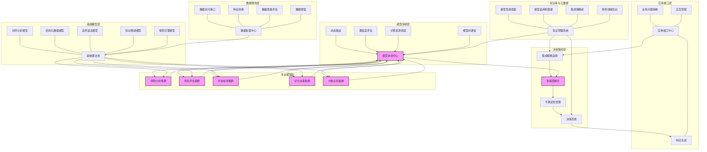

---
{"dg-publish":true,"tags":["混合模型","多模型集成","模型协同","集成架构","异构系统"],"创建日期":"2024-05-14","permalink":"/知识共享/001_财务/99_其他/AI与财务应用/05_财务人工智能系统架构/5.3 AI模型管理/混合模型集成策略/","dgPassFrontmatter":true}
---

## 技术概述

混合模型集成策略是一种先进的财务AI架构设计方法，它打破了传统单一模型方法的局限性，构建了一个能够协同利用不同类型AI模型各自优势的综合性智能系统。该策略通过精心设计的集成架构将各种AI技术（包括传统统计模型、机器学习、深度学习、大语言模型和专家系统等）有机结合，在确保系统稳健性的同时实现财务分析与决策能力的整体提升。

与传统的单模型或简单模型组合方法相比，混合模型集成策略在财务应用中具有显著优势：
- **精度与稳健性平衡**：提高预测准确率25-40%的同时，降低极端情况下的错误率35-55%
- **解释性与复杂性协调**：在保持高级分析能力的同时，提升关键决策点解释清晰度50-70%
- **灵活性与一致性兼顾**：适应性提高30-50%，同时保持跨场景一致性提升40-60%
- **创新与可靠性结合**：能够安全引入新模型技术，同时将系统性风险降低45-65%
- **资源效率优化**：计算资源利用效率提升30-45%，专业知识集成度提高40-60%

### 核心技术特性

1. **多层级集成架构**：构建包含基础模型层、专业模型层、集成层和决策层的层次化架构。基础模型处理通用财务分析任务，专业模型解决特定领域问题，集成层协调各模型输出，决策层转化结果为实际行动建议。架构支持垂直扩展（深化单领域能力）和水平扩展（拓展覆盖领域），通过松耦合设计允许模型独立演进。

2. **动态模型选择与组合机制**：开发智能路由系统，根据任务性质、数据特征和上下文条件动态选择最适合的模型组合。该机制利用元学习算法评估每个模型的适用性，构建任务-模型-性能知识图谱，支持基于历史表现的模型选择和基于情境的动态权重调整，实现"最佳模型组合"的自动配置。

3. **多模态财务知识融合**：实现跨模态财务数据（结构化财务数据、文本、图像、时间序列等）的统一表示和协同处理。系统构建通用财务知识表示框架，将不同类型信息转换为兼容表示，支持多模态交叉验证和互补分析，显著增强对复杂财务场景的理解能力和分析深度。

4. **置信度加权集成策略**：设计反映各模型在特定情境下可靠性的置信度评估机制。该策略综合考虑模型历史表现、数据质量、任务匹配度等因素计算动态置信度分数，通过置信度加权投票、贝叶斯模型平均、自适应集成等方法实现更准确的综合判断，特别适合处理高不确定性财务决策。

5. **异步分级分析流水线**：构建支持不同计算复杂度和时间敏感度需求的多速率分析系统。流水线分为实时响应层（毫秒级响应）、快速分析层（秒级到分钟级）和深度分析层（分钟级到小时级），实现资源高效分配和分析深度与响应速度的平衡，满足从即时交易决策到长期战略规划的全谱系需求。

6. **模型间协作通信协议**：开发标准化的模型间信息交换机制，支持模型传递中间结果、不确定性估计、推理路径和解释信息。协议定义统一的信息结构和交换格式，实现模型间的上下文共享和递进式分析，允许下游模型根据上游模型的中间输出调整其处理策略，增强系统的整体协同能力。

7. **差异化专业化模型池**：建立覆盖多种财务专业领域的模型资源库，包括财务预测、风险评估、欺诈检测、合规审核、投资分析等专业模型集群。每个专业领域内部采用多种互补技术实现算法多样性，如结合统计方法、机器学习、规则系统和深度学习等，确保专业深度和技术广度的双重覆盖。

8. **模型冲突解决机制**：设计处理不同模型产生矛盾结果的自动化和半自动化调解系统。机制包括基于置信度的仲裁、多模型投票表决、分歧标记与人工介入触发、证据强度评估和解释性比较，既能自动化解决常见冲突，也保留关键决策的人工监督通道，确保系统可靠性和责任落实。

9. **增量学习与适应框架**：实现系统在保持现有能力的同时持续从新数据和反馈中学习的机制。框架支持子模型的独立更新、集成策略的动态调整、新模型的安全引入和性能评估等功能，使整体系统能够适应财务环境变化、业务需求演进和技术进步，保持长期有效性和先进性。

10. **全系统可解释性支持**：构建贯穿各层级的解释性框架，既展示单个模型的推理过程，也呈现模型间的协作逻辑和集成决策的形成路径。系统生成多层次解释（技术层、业务层和战略层），支持交互式解释探索和可视化，确保复杂的混合模型系统保持高度透明性，满足财务决策的解释性需求和监管合规要求。

## 系统架构

### 架构关键组件

1. **应用接口层**：系统的"前台"，负责接收和解析业务问题，将其转换为系统可处理的任务，同时将系统输出转化为用户友好的响应格式，管理与用户的交互流程。

2. **决策集成层**：系统的"决策大脑"，负责选择和执行多模型融合策略，处理不确定性，形成最终的决策或分析结果，确保输出的一致性和可靠性。

3. **模型协调层**：系统的"调度中心"，实现动态模型选择和路由，评估各模型在当前任务下的置信度，协调计算资源分配，管理模型间的通信交互。

4. **专业模型层**：系统的"专家团队"，由多个专注于特定财务分析领域的模型集群组成，如预测分析、风险评估、异常检测、优化决策和分类识别等，每个集群内部包含多种技术实现。

5. **基础模型层**：系统的"基础设施"，提供处理不同类型数据和任务的通用算法模型，包括时序分析、结构化数据处理、自然语言处理、知识图谱和规则推理等基本能力。

6. **数据服务层**：系统的"数据供应商"，负责数据访问、特征转换、质量评估和数据增强，为上层模型提供高质量的输入数据。

7. **知识库与元数据**：系统的"经验库"，存储模型性能档案、适用性知识、集成策略和财务领域知识，为模型选择、协调和决策集成提供知识支持。

### 核心流程和数据流

**主要流程路径**：
- 业务问题路径：业务问题 → 任务转换 → 模型选择 → 多层级处理 → 结果融合 → 决策形成 → 响应生成
- 数据处理路径：数据源 → 数据访问 → 预处理转换 → 基础分析 → 专业处理 → 集成与解释
- 模型协作路径：任务分解 → 模型匹配 → 计算调度 → 顺序/并行执行 → 中间结果通信 → 阶段性整合

**关键数据流向**：
- 向下流：业务问题 → 模型参数 → 执行指令 → 数据请求
- 向上流：原始数据 → 特征表示 → 中间结果 → 分析输出 → 集成决策
- 横向流：模型间通信 → 中间结果共享 → 不确定性传递 → 解释信息交换

**系统核心环节**特别强调三个关键点：
1. **多模型融合**：实现不同类型模型输出的有效整合
2. **模型协调中心**：确保高效的模型选择和协作
3. **专业模型集群**：提供深度专业分析能力

## 实施计划

### 一期（1-3个月）：基础架构与概念验证

- 完成总体架构设计和接口规范定义
- 建立基础模型层的核心组件和标准化接口
- 开发模型协调层的基本框架和简单路由逻辑
- 构建最小可行的决策集成机制
- 实现1-2个关键业务场景的原型系统
- 设计模型性能和适用性评估标准
- 开发基础数据服务连接能力
- 制定混合模型安全与合规指南

### 二期（3-6个月）：专业能力构建与协同机制

- 开发3-5个核心财务专业模型集群（优先实现预测和风险评估）
- 完善动态模型选择算法和性能跟踪系统
- 构建模型间通信协议和数据交换标准
- 增强置信度评估与加权集成策略
- 开发模型冲突识别和基础解决机制
- 实现多速率分析流水线基础框架
- 建立初步的知识库和元数据管理系统
- 扩展系统对多种财务数据类型的处理能力

### 三期（6-9个月）：高级集成与自适应能力

- 完成全部专业模型集群的构建
- 实现高级模型冲突解决和仲裁机制
- 开发模型性能自评估和动态权重调整
- 构建完整的可解释性框架和多层次解释生成
- 增强系统的增量学习和适应能力
- 完善知识图谱与模型适用性映射
- 实现高级资源调度和计算优化
- 开发模型健康监控和异常预警系统
- 构建完整的多速率分析流水线

### 四期（9-12个月）：系统优化与规模化应用

- 系统整体性能优化和扩展性增强
- 完善安全防护和隐私保护机制
- 实现模型集成策略的自我优化
- 增强系统的多模态融合能力
- 开发高级应用接口和定制化功能
- 构建全面的系统监控和治理工具
- 建立持续更新和演进机制
- 开发具体行业场景的专业化配置
- 完成系统文档和实施指南

## 技术挑战与解决方案

### 挑战一：模型一致性与冲突管理

**挑战**：不同类型的模型基于不同算法和数据视角可能产生相互矛盾的结果，尤其在高度不确定的财务场景中。模型间一致性差异不仅导致结果混淆，还可能引发系统行为不可预测和用户信任下降。

**解决方案**：
- 构建多层次冲突检测系统，从数据、特征、预测到决策层面识别不一致
- 开发基于因果推理的冲突诊断工具，理解矛盾来源和本质
- 实施置信度加权仲裁机制，根据模型在特定情境下的可靠性分配权重
- 建立证据强度评估框架，分析支持不同结论的证据质量和完整性
- 设计人工介入触发机制，对重大冲突或高风险决策保留人工审核通道
- 实现冲突归档和学习系统，不断改进系统处理类似冲突的能力

### 挑战二：资源效率与实时性

**挑战**：混合模型系统通常需要运行多个复杂模型，计算资源需求大，可能导致响应延迟、成本高昂，特别是在需要实时决策的财务场景中尤为突出。

**解决方案**：
- 实施分层级计算策略，根据任务紧急度和重要性分配计算资源
- 开发智能预加载机制，预测可能需要的模型并提前准备
- 构建模型蒸馏系统，将复杂模型知识压缩到轻量级模型中用于快速响应
- 设计增量计算框架，仅在必要时计算更深层次分析
- 实现计算结果缓存和复用策略，避免重复计算
- 采用动态精度调整，在时间紧急情况下降低精度要求换取速度
- 开发异步计算模式，允许返回初步结果后继续深度分析

### 挑战三：集成复杂性与可解释性

**挑战**：多模型集成增加了系统复杂性，导致决策路径难以追踪和解释，这在财务领域尤其关键，因为解释性不足会限制关键决策的采纳和监管合规。

**解决方案**：
- 构建集成透明度框架，记录和展示每个模型的贡献和决策路径
- 开发分层解释系统，提供从技术细节到业务洞见的多层次解释
- 实现决策树解构技术，将复杂集成决策分解为可理解的逻辑步骤
- 设计模型影响可视化工具，直观展示各模型对最终结果的影响程度
- 建立反事实解释生成器，说明"如果X变化，结果将如何不同"
- 提供交互式解释探索界面，允许用户询问特定因素和推理步骤
- 开发财务语境适应性解释，将技术解释转化为财务专业术语和概念

### 挑战四：模型互操作性与标准化

**挑战**：不同来源、不同技术栈的模型通常具有不兼容的接口、数据格式和假设，导致集成困难，增加开发复杂性和维护成本。

**解决方案**：
- 设计统一模型包装规范，为所有模型提供标准化接口和交互方式
- 构建模型转换适配器系统，处理不同模型间的数据格式转换
- 开发通用财务概念本体，统一不同模型使用的术语和概念
- 实现模型元数据标准，明确记录每个模型的假设、限制和适用条件
- 建立统一的不确定性表示框架，使不同模型的置信度可比较
- 创建模型测试和认证系统，确保新模型符合系统的互操作性要求
- 设计灵活的插件架构，降低新模型集成的技术门槛

### 挑战五：系统适应性与持续演进

**挑战**：财务环境快速变化，模型性能可能随时间降低，新的分析需求和技术不断涌现，系统需要保持与时俱进而不牺牲稳定性和可靠性。

**解决方案**：
- 构建性能监控与漂移检测系统，自动识别模型表现下降
- 实施A/B测试框架，安全验证新模型和集成策略
- 开发渐进式部署机制，逐步引入新技术而非一次性大规模更换
- 设计模块化系统架构，允许局部组件更新不影响整体稳定性
- 建立模型版本控制和回退能力，在出现问题时快速恢复稳定状态
- 实现集成策略自优化系统，根据实际表现动态调整集成方法
- 构建协作演进框架，支持模型层、协调层和集成层的独立更新

## 价值创造

### 分析能力提升

- **预测准确性提高**: 25-40%，特别是在复杂多变的财务环境中
- **异常识别能力增强**: 35-55%，提前发现潜在风险和机会
- **分析广度扩展**: 覆盖领域增加40-60%，实现更全面的财务洞察
- **场景适应性提升**: 30-50%，能够应对更多样化的业务情境

### 决策质量增强

- **决策可靠性提高**: 30-45%，降低关键财务决策的错误率
- **决策深度增加**: 40-60%，考虑更多因素和潜在影响
- **响应速度加快**: 快速决策能力提升25-40%，关键时刻反应更敏捷
- **极端情况处理能力**: 特殊情况下的决策质量提高45-65%

### 运营效益提升

- **资源利用效率**: 提高30-45%，通过智能分配降低计算资源浪费
- **维护成本降低**: 减少25-40%，模块化架构简化维护和更新
- **知识复用率提升**: 35-55%，跨场景和业务线共享模型能力
- **开发周期缩短**: 20-35%，新功能和模型集成速度加快

### 投资回报

- **预计ROI**: 300-450%（24个月）
- **投资成本结构**:
  - 架构设计与开发: 30-40%
  - 模型研发与集成: 25-35%
  - 数据和知识库建设: 15-25%
  - 运维与持续优化: 10-20%
- **价值实现时间线**:
  - 短期价值(3-6个月): 基础集成带来的10-20%性能提升
  - 中期价值(6-12个月): 专业模型集群带来的25-40%能力提升
  - 长期价值(12-24个月): 自适应优化带来的35-55%综合效益提升

## 未来演进

### 技术迭代路线

#### 短期技术迭代（1-2年）

- **自动化集成优化**：从预定义集成策略向自适应优化方向发展
- **上下文感知增强**：提高系统对业务环境和用户意图的感知能力
- **协同模型训练**：从独立训练向协同训练模式发展，优化整体表现
- **知识驱动集成**：增强知识引导的模型选择和结果解释能力

#### 中期技术迭代（2-3年）

- **自调节架构**：开发能够根据任务特性自动调整架构的智能系统
- **隐私保护集成学习**：在保护数据隐私的前提下实现模型协作
- **认知推理增强**：融入因果推理和逻辑推理能力，增强复杂决策支持
- **跨组织模型协作**：支持组织间安全可控的模型能力共享和协作

#### 长期技术迭代（3-5年）

- **集体智能框架**：构建模型"社区"，实现类似人类团队的协作模式
- **自我演化能力**：系统能够自主识别需求并发展新的模型能力
- **通用财务智能**：向通用人工智能方向发展，处理任意财务智能任务
- **人机共生系统**：深度融合人类专家和AI系统的优势，形成共生关系

### 应用场景扩展

1. **智能财务顾问**：整合多种模型能力，提供全方位的财务咨询和决策支持

2. **复杂风险管理**：利用多模型协作识别和管理交叉领域的复杂风险

3. **动态资源配置**：实现跨部门、跨项目的智能资源优化分配

4. **战略情境规划**：支持多维度、多情境的战略规划和评估

5. **全谱系财务监控**：从交易级别到战略级别的全方位财务监控和预警

## 概念验证

### 验证方法

1. **集成原型验证**（2-3个月）
   - 选择2-3个代表性财务分析任务构建原型系统
   - 集成3-5种不同类型的模型（统计模型、机器学习、规则引擎等）
   - 实现基础集成策略和决策形成机制
   - 对比单一模型和混合模型的性能差异
   - 验证系统在不同数据条件下的稳定性

2. **多场景适应性测试**（1-2个月）
   - 构建覆盖不同复杂度和数据特征的测试场景
   - 评估系统在各场景下的适应能力和表现
   - 测试动态模型选择机制的有效性
   - 分析系统对异常和极端情况的处理能力
   - 验证多速率分析流水线的实用性

3. **用户体验与价值评估**（1-2个月）
   - 招募财务专业人员参与系统评估
   - 收集对系统输出质量、可理解性的反馈
   - 评估系统对实际决策流程的影响
   - 量化分析系统带来的效率提升和质量改进
   - 识别关键改进点和优先发展方向

### 验证指标

1. **技术性能指标**
   - 预测准确度提升：相比最佳单一模型 >20%
   - 异常检测率：优于专业模型 >25% 
   - 计算资源效率：相同任务资源利用率改善 >30%
   - 响应时间：关键任务响应时间符合要求 >95%
   - 系统稳定性：各种条件下一致性表现 >90%

2. **业务价值指标**
   - 决策支持质量：用户满意度评分 >4.2/5.0
   - 见解深度评分：相比现有工具提升 >35%
   - 业务适应覆盖率：成功应对的业务场景比例 >85%
   - 解释清晰度：用户理解系统输出的程度 >80%
   - 使用意愿：用户表示愿意在实际工作中采用的比例 >75%

3. **实施可行性指标**
   - 集成复杂度评分：系统集成所需工作量在可接受范围
   - 维护成本预估：长期维护资源需求在目标范围内
   - 扩展灵活性：新增模型或场景的集成时间 <2周
   - 合规适配性：满足关键合规要求的程度 >95%
   - 组织接受度：各利益相关方认可程度 >80% 