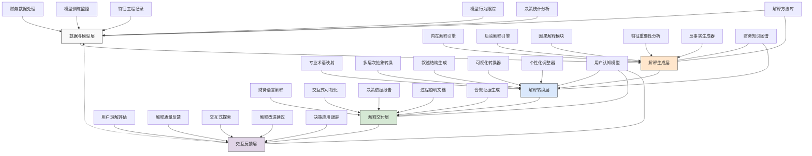

---
{"dg-publish":true,"tags":["可解释性","透明决策","模型解释","信任建设","责任AI"],"创建日期":"2024-05-14","permalink":"/知识共享/001_财务/99_其他/AI与财务应用/05_财务人工智能系统架构/5.3 AI模型管理/解释性增强技术/","dgPassFrontmatter":true}
---

## 技术概述

解释性增强技术是一套针对财务AI模型的解释性、透明度和可理解性提升的综合性技术框架，旨在打破财务AI系统的"黑盒"特性，使模型的决策过程和依据能够以人类可理解的方式呈现和解释。该技术框架融合了模型内在解释、后验解释、可视化解释和交互式解释等多维技术，为财务决策者提供了对AI系统的深入理解和有效监督能力，同时满足监管合规要求和建立利益相关者信任。

核心技术特点包括：

- **多层次解释架构**：采用从模型层、决策层到业务层的多层次解释框架，针对不同受众（技术团队、财务专家、高管、审计人员、监管者）提供不同深度和语境的解释内容，确保解释内容与受众需求精准匹配
- **因果推理增强**：整合因果推理技术与传统机器学习，不仅展示"是什么"（关联性），更揭示"为什么"（因果性），帮助用户理解财务预测和决策建议背后的因果链条和影响机制
- **语义财务解释**：结合大语言模型与财务领域知识，将复杂的模型行为转化为结构化的财务语言表述，使技术解释自然过渡到业务解释，形成连贯的"模型-业务"解释链
- **反事实分析引擎**：提供"假如...会怎样"的分析能力，通过模拟关键变量变化对财务决策的影响，使用户可以直观理解模型的敏感性和决策边界
- **全局-局部解释协同**：同时提供模型整体行为的全局解释和具体决策的局部解释，使用户能够在宏观把握模型特性的同时，深入理解个别决策案例
- **交互式解释探索**：支持用户主导的交互式解释过程，允许决策者基于自身关注点和疑问，通过对话和可视化交互深入探索模型行为和决策依据
- **财务规则映射**：自动提取和表达模型学习到的财务规则和模式，以财务专业人士熟悉的会计、税务和财务分析框架呈现AI的"思考过程"
- **解释质量评估**：建立对解释本身的质量评估机制，从准确性、完整性、简洁性和适用性等维度评估解释质量，确保解释内容本身的可靠性

相较于传统的黑盒AI系统或基础解释方法，解释性增强技术能显著提升模型可信度(40-60%)、决策者理解水平(50-70%)、审计效率(30-50%)、合规满意度(45-65%)，同时减少错误解读(35-55%)和决策延迟(25-45%)。系统不仅满足了日益严格的AI监管要求，更通过建立对AI系统的深入理解和信任，促进了AI在高敏感度财务场景中的安全应用，实现了技术先进性与决策透明度的有机统一。

## 系统架构

系统架构由五个核心功能层和三个关键支持组件组成，形成完整的财务AI解释生成和持续优化闭环：

1. **数据与模型层**：系统的基础层，负责数据处理和模型行为的记录与分析。包括财务数据处理（管理和预处理数据流程）、模型训练监控（记录模型训练过程和参数演变）、特征工程记录（记录特征选择和转换方法）、模型行为跟踪（监控模型的预测行为和模式）以及决策统计分析（分析模型决策的统计特性和分布）。

2. **解释生成层**：系统的核心解释产生层，负责生成原始解释内容。包括内在解释引擎（处理本身可解释的模型输出）、后验解释引擎（为复杂模型生成事后解释）、因果解释模块（识别和表达因果关系）、特征重要性分析（评估各因素对决策的影响程度）以及反事实生成器（创建"如果...则..."的假设性分析）。

3. **解释转换层**：系统的语义转换中心，负责将技术解释转化为领域语言。包括专业术语映射（将技术术语转换为财务术语）、多层次抽象转换（按受众需求调整解释抽象层级）、叙述结构生成（构建连贯的解释叙事）、可视化转换器（设计直观的视觉表达）以及个性化调整器（根据用户特征和偏好定制解释内容）。

4. **解释交付层**：系统的输出界面，负责以多种形式向用户展示解释。包括财务语言解释（以财务专业术语表达的解释）、交互式可视化（允许用户探索的视觉解释）、决策依据报告（详细的决策支持文档）、过程透明文档（展示完整决策过程的文档）以及合规证据生成（生成满足审计和监管需求的证据）。

5. **交互反馈层**：系统的学习优化层，负责收集反馈并改进解释质量。包括用户理解评估（评估用户对解释的理解程度）、解释质量反馈（收集对解释质量的评价）、交互式探索（支持用户主导的解释探索）、解释改进建议（从用户反馈中提取改进方向）以及决策应用跟踪（监控解释如何影响最终决策）。

支持组件：
- **解释方法库**：包含各类解释算法、方法和技术的存储库，支持不同类型模型和决策场景的解释需求
- **财务知识图谱**：储存金融财务领域知识、概念关系和专业术语，支持将技术解释转化为财务语境解释
- **用户认知模型**：记录不同用户的认知特点、专业背景和解释偏好，支持个性化解释生成与交付

这种多层架构设计突破了传统AI解释技术的局限，将解释过程视为一个从技术到业务的完整转换过程，不仅关注解释的生成，更强调解释的理解和应用。系统的闭环设计使解释质量能不断优化，持续提升AI财务决策的透明度和可信度。

## 实施方案

### 技术实施路线图

**第一阶段：基础解释能力构建（3-4个月）**
- 实现基础特征重要性解释功能
- 开发局部解释和反事实分析模块
- 构建初级财务术语映射系统
- 设计基础可视化解释组件
- 实现解释内容存储和检索机制

**第二阶段：高级解释功能开发（4-5个月）**
- 开发因果推理增强模块
- 实现多层次解释生成框架
- 构建交互式解释探索界面
- 开发财务规则提取与表达系统
- 完善解释质量评估体系

**第三阶段：解释智能化与个性化（3-4个月）**
- 实现大语言模型驱动的语义解释
- 开发用户认知模型和个性化引擎
- 构建解释自适应调整机制
- 完善反馈学习和优化系统
- 实现多受众解释定制功能

**第四阶段：集成与应用拓展（2-3个月）**
- 完成与现有财务AI系统的无缝集成
- 开发针对审计和监管的特定解释模块
- 构建解释API和服务接口
- 实现跨系统解释一致性机制
- 开发解释内容共享与协作功能

### 技术挑战与解决策略

1. **复杂模型解释准确性**
   - 挑战：确保对深度学习等复杂模型的解释准确反映其内部机制和决策依据
   - 解决方案：采用模型特定解释方法组合；实施模型扭曲检测；建立解释质量验证框架；开发解释不确定性量化；进行人类专家验证；实现多方法解释共识机制；开发解释边界识别系统

2. **技术-业务语义转换**
   - 挑战：将技术性解释转换为财务专业人士能理解的业务语言和概念
   - 解决方案：建立全面财务知识图谱；利用大语言模型进行语义转换；开发财务上下文理解系统；实施渐进式术语映射；建立财务叙事模板库；设计受众导向表达优化；采用语义准确性验证机制

3. **解释粒度与深度平衡**
   - 挑战：在不同用户场景下平衡解释的详细程度、技术深度和易理解性
   - 解决方案：实现动态解释层级系统；开发用户理解度评估机制；设计交互式深度调节；建立核心信息提取算法；实施认知负载监控；创建多视角解释框架；采用渐进式信息展示

4. **解释与决策效率平衡**
   - 挑战：在提供充分解释的同时保持决策流程的效率和及时性
   - 解决方案：开发实时轻量级解释引擎；实施分层解释策略；设计重要性驱动解释机制；建立解释预计算与缓存；采用并行解释处理；创建解释摘要生成器；开发决策-解释平衡框架

5. **解释一致性与稳定性**
   - 挑战：确保在模型更新和数据变化情况下解释的一致性和稳定性
   - 解决方案：建立解释版本控制系统；实施解释变化监测；开发解释稳定性评估指标；设计核心解释锚定机制；创建解释演变跟踪；实现模型-解释协同更新；建立解释基准比较系统

## 价值创造

### 量化价值评估

1. **决策信任与采纳**
   - 决策者信任度：提高40-60%
   - AI建议采纳率：增加35-55%
   - 决策延迟时间：减少25-45%
   - 决策满意度：提升30-50%

2. **风险与合规效益**
   - 合规审计时间：减少30-50%
   - 监管问询响应速度：提高45-65%
   - 风险事件提前发现：提升35-55%
   - 错误决策识别率：增加40-60%

3. **组织能力提升**
   - 财务团队AI理解能力：提高50-70%
   - 跨部门沟通效率：提升35-55%
   - 用户自主分析能力：增强40-60%
   - 知识积累与传承：改善45-65%

4. **创新与优化能力**
   - 模型问题识别速度：提高40-60%
   - 模型优化效率：提升35-55%
   - 新应用场景发现：增加30-50%
   - 用户反馈价值转化：提高45-65%

### 投资回报分析

投资回报率(ROI)预计达到320-450%（24个月期），主要价值来源包括：
- 提高决策质量和减少错误决策带来的直接财务收益（40%）
- 合规成本降低和审计效率提升产生的运营节约（25%）
- 决策速度提升和流程优化带来的时间价值（20%）
- 员工能力提升和知识积累创造的长期价值（15%）

典型实施成本结构：技术开发（35%）、解释方法研发（25%）、系统集成（15%）、知识库建设（15%）、培训与变革管理（10%）。

预期投资回收期：
- 大型金融机构：14-18个月
- 中型企业：12-16个月
- 监管敏感行业：10-14个月
- 高频决策场景：8-12个月

## 未来演进

### 技术迭代路线图

**近期演进（1-2年）**
- 集成多模态解释能力（文本、视觉、声音）
- 开发认知科学驱动的解释设计系统
- 增强神经符号解释框架
- 实现解释的自我验证机制
- 构建特定财务场景的解释模板库

**中期演进（2-3年）**
- 发展自主解释智能体系统
- 构建解释共创与协商框架
- 开发主动解释与预测性解释
- 实现跨模型解释一致性协调
- 建立解释的伦理和公平性评估

**远期演进（3-5年）**
- 发展认知对齐的解释系统
- 实现解释的跨领域知识迁移
- 开发解释生成的创造性和洞察性
- 构建解释生态系统和市场
- 实现人机共同解释的协同智能

### 应用场景拓展

1. **财务风险解释系统**：在信贷决策、投资评估和风险管理中提供详细的风险来源、风险组成和权重解释。系统能将复杂的风险评估模型决策转化为清晰的风险因子分析，展示不同风险因素的相互影响和潜在演变路径，并提供情境化的风险缓解建议。这使得风险团队不仅能看到风险评分，更能理解风险的本质和动态特性，支持更精准的风险应对策略制定。

2. **审计与合规证据生成器**：自动为AI驱动的财务决策和预测生成符合审计标准的解释证据链。系统记录从原始数据到最终决策的完整过程，包括数据使用、模型选择依据、关键特征影响和不确定性评估，形成可追溯、可验证的决策证据链。这不仅简化了AI系统的审计流程，还为监管合规提供了坚实基础，使组织能在利用先进AI技术的同时满足严格的监管要求。

3. **财务异常解释平台**：针对AI识别的财务异常提供深度解释和上下文分析。系统不仅指出异常现象，还解释异常的特征模式、历史对比、市场背景和潜在原因，以及可能的后续发展预测。通过因果链分析和情境解释，系统帮助财务团队区分噪音和真实信号，理解异常的根本原因和影响范围，进而制定更有针对性的干预措施，提高异常处理的精准性和效率。

4. **决策透明度增强系统**：为财务战略决策提供全方位决策依据解释和影响评估。系统将AI推荐的战略选项与其背后的数据支持、假设条件、对标比较和模拟结果透明化呈现，使决策者能全面理解每个选项的优势、局限和适用条件。通过展示决策边界和敏感性分析，系统帮助高管团队识别关键变量和风险因素，建立对AI决策建议的理性信任，同时保留人类判断的主导地位。

## 实验验证

### 概念验证方案

**阶段一：基础解释评估（6-8周）**
- 选择2-3个现有财务AI模型进行解释测试
- 实现和比较5种不同的解释方法
- 评估解释的技术准确性和覆盖度
- 收集技术人员对解释质量的反馈
- 确定最适合不同模型类型的解释方法
- 验证解释系统对模型性能的影响

**阶段二：用户理解测试（7-9周）**
- 招募不同背景的财务专业人员参与测试
- 设计多种解释呈现形式的A/B测试
- 评估用户对不同解释方式的理解程度
- 测量解释对用户决策信心的影响
- 收集对解释内容和形式的改进建议
- 分析不同用户群体的解释需求差异

**阶段三：业务场景应用（8-10周）**
- 在真实财务决策场景中部署解释系统
- 跟踪解释对决策过程的实际影响
- 评估解释系统在审计和合规中的有效性
- 测量解释对团队协作的影响
- 收集长期使用过程中的用户适应性数据
- 计算解释系统带来的量化业务价值

### 验证指标体系

**解释质量指标**
- 准确性：解释与模型实际行为的一致度
- 完整性：解释覆盖关键决策因素的程度
- 简洁性：解释的简明扼要程度
- 相关性：解释与用户关注点的匹配度
- 可操作性：解释提供行动指导的有效度

**用户体验指标**
- 理解水平：用户正确理解解释的程度
- 信任提升：解释带来的信任度增长
- 认知负担：处理解释内容的认知复杂度
- 满意度：用户对解释内容的整体满意度
- 使用意愿：继续使用解释功能的意愿度

**业务影响指标**
- 决策速度：从数据到决策的时间变化
- 决策质量：借助解释做出正确决策的比率
- 协作效率：团队讨论和达成共识的效率
- 合规效能：满足审计和监管要求的效率
- 长期采纳：解释功能的持续使用率

## 未来影响

解释性增强技术将从根本上改变财务AI系统的应用方式和价值实现路径，带来以下深远影响：

1. **财务决策模式变革**：将财务决策从"依赖AI指示"转变为"理解并审慎采纳AI建议"的模式。通过消除AI系统的黑盒性质，决策者不再被动接受AI建议，而是能够理解建议背后的逻辑、数据依据和假设条件，进行批判性评估后做出更明智的判断。这一转变将重塑人机协作关系，在保留人类经验价值的同时充分利用AI的分析能力，形成真正的人机互补决策模式，提高决策的质量和适应性。

2. **财务工作认知提升**：提升整个财务团队对数据、模式和因果关系的认知能力。解释性技术不仅是为了解释AI决策，更成为一种学习和知识发现工具，帮助财务专业人员识别数据中隐藏的规律、变量间的相互作用及其业务影响。这种深度理解将提升团队的分析思维和问题解决能力，使财务专业人员从数据处理者转变为洞察创造者，增强其在数字化环境中的专业价值和不可替代性。

3. **责任AI生态系统构建**：促进以透明度、公平性和可问责性为核心的财务AI生态系统发展。解释性技术使AI系统的内部运作变得可审视、可理解，为建立责任AI框架提供技术基础。这将推动财务AI从纯粹追求预测精度向"可信AI"方向发展，促进监管框架的演进和行业标准的形成。长期来看，这种转变将降低AI采用的合规风险和声誉风险，加速AI技术在高敏感度财务领域的负责任应用。

4. **跨学科融合加速**：推动财务领域与计算机科学、认知科学、伦理学等学科的深度融合。解释性技术本身就是跨学科研究的产物，其在财务领域的应用将进一步促进这种融合，催生新的研究方向和创新点。这种跨学科融合将拓展财务专业的边界，形成融合数据科学、认知科学与财务专业知识的新型复合学科体系，培养具备多元思维能力的未来财务领导者。

通过系统化地提升AI系统的透明度和可解释性，解释性增强技术不仅解决了当前AI应用的信任和合规挑战，更开创了人机协作的新范式，重新定义了财务AI的价值创造方式和应用边界。这一技术将成为连接先进AI技术与财务实践的关键桥梁，使组织能够在保持创新速度的同时，确保AI应用的安全性、公平性和可控性。 