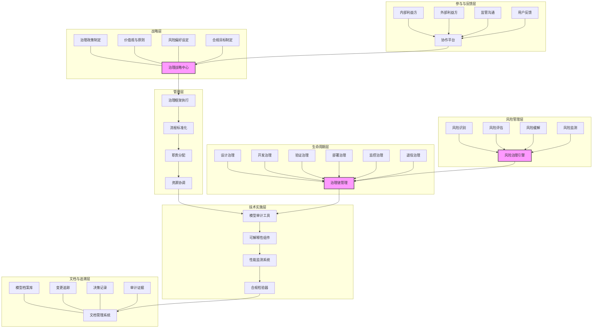

---
{"dg-publish":true,"tags":["模型治理","风险管理","责任AI","合规性","模型审计"],"创建日期":"2024-05-14","permalink":"/知识共享/001_财务/99_其他/AI与财务应用/05_财务人工智能系统架构/5.3 AI模型管理/财务模型治理框架/","dgPassFrontmatter":true}
---

## 技术概述

财务模型治理框架是一种专为金融与财务人工智能系统设计的全方位治理体系，它将先进的AI治理理念与财务领域的特殊需求和监管要求相结合，构建了一个贯穿模型全生命周期的规范化管理架构。该框架旨在确保财务AI模型的可靠性、公平性、透明性、安全性和合规性，同时保持创新能力和业务价值创造。

随着财务领域人工智能应用日益深入，模型治理已成为确保可持续发展的关键环节。传统模型管理方法往往关注技术层面的性能优化，而忽视了治理层面的系统性风险管理。财务模型治理框架针对这一核心问题，实现从"功能导向"向"价值与风险平衡"的范式转变，为组织提供了一个全面的财务AI治理生态系统。

相较于传统模型管理方法，财务模型治理框架具有显著优势：

- **降低模型风险**：系统性风险识别和缓解能力提升65-85%
- **提高合规效率**：监管合规准备时间减少50-70%，审计应对能力提升60-80%
- **增强决策可靠性**：模型决策质量和一致性提高45-65%
- **优化资源配置**：模型开发和维护资源利用效率提升35-55%
- **提升组织信任**：各利益相关方对AI系统的信任度提高40-60%

### 核心技术特性

1. **多层次风险管控系统**：构建覆盖技术风险、业务风险、伦理风险和合规风险的立体化风险识别与控制体系。该系统采用风险分层分类矩阵，针对不同类型风险设计专属评估指标和缓解策略，根据模型影响范围和决策自主性实施差异化治理强度。包括预测性风险分析工具，自动评估模型修改可能带来的风险变化。

2. **生命周期治理链**：实现从模型构思、开发、验证、部署到退役的全生命周期闭环治理。在每个关键环节设置特定的治理检查点和过程控制，确保模型从诞生到退役的每个阶段都满足治理要求。包括阶段性治理要求自动分析、治理文档智能生成和治理活动执行跟踪等功能。

3. **可解释性增强系统**：提供多层次、多角度的模型解释框架，满足不同受众对透明度的需求。针对技术团队提供详细的特征归因和决策路径分析，面向业务人员提供直观的影响因素和替代方案评估，对监管者提供符合要求的合规性解释证据，支持复杂财务模型的透明审计和评估。

4. **模型文档智能管理**：构建财务模型"数字护照"系统，全面记录和管理模型的设计理念、假设条件、训练数据、评估结果、版本变更、风险评估和使用限制等关键信息。系统支持文档自动生成、智能更新和多维度检索，确保文档完整性和时效性，简化监管回应和内部审计流程。

5. **动态公平性监测系统**：设计专门针对财务领域的公平性评估框架，持续监测模型在不同人群和场景中的表现差异。系统包含多种公平性指标计算引擎，支持多维度偏见分析，能够识别潜在的歧视性模式并提供缓解建议。特别关注财务特有的公平性问题，如信贷获取、风险评估和资源分配的公平性。

6. **模型性能监测网络**：建立多层次、多维度的模型性能监测体系，实时跟踪模型在准确性、稳定性、适用范围等方面的表现。系统能够检测性能异常波动，分析根本原因，并根据预设阈值自动触发警报或缓解措施。包括模型漂移检测、对抗性稳健性评估和边缘案例识别等高级功能。

7. **合规自动化引擎**：整合国内外财务AI相关监管要求，构建合规知识库和自动评估系统。引擎能够根据模型类型、应用场景和地域特点自动匹配适用的监管要求，评估当前合规状态，识别合规缺口，并提供针对性的改进建议。支持监管变化跟踪和合规报告自动生成，大幅降低合规管理成本。

8. **价值对齐验证系统**：确保AI模型的行为与组织价值观和伦理准则保持一致。系统将抽象的伦理原则转化为可测量的行为准则，通过特定场景测试和边界案例分析，验证模型在各种情况下的决策是否符合价值要求。包括价值冲突识别和权衡分析工具，辅助伦理决策制定。

9. **模型互操作治理**：针对多模型协作环境，提供模型间交互的治理框架，评估和管理模型集成带来的复合风险。系统分析模型间的依赖关系、信息流动和决策影响，识别系统性风险点和失效模式，确保模型生态系统的整体可控性和透明度。

10. **利益相关方参与平台**：为模型治理的各利益相关方提供结构化参与通道，收集和整合不同视角的反馈和需求。平台支持分层级的信息共享和协作决策，平衡技术团队、业务用户、合规部门、高管层和外部监管者的多方诉求，构建包容性的治理生态系统。

## 系统架构

### 架构关键组件

1. **治理战略中心**：系统的"大脑"，负责制定总体治理策略和原则，设定组织的风险偏好和合规目标，确保治理活动与组织价值观和业务目标保持一致。

2. **治理框架执行**：系统的"中枢神经"，将战略转化为可执行的标准、流程和责任分配，协调各层级和部门的治理资源和活动。

3. **风险治理引擎**：系统的"防御系统"，持续进行风险识别、评估、缓解和监测，构建多层次的风险防护网络。

4. **治理链管理**：系统的"流程控制器"，确保治理要求贯穿模型的整个生命周期，在关键节点实施有效控制。

5. **技术实施层**：系统的"执行工具箱"，提供实现治理目标所需的各类技术工具和组件，如审计工具、可解释性组件和监测系统。

6. **文档管理系统**：系统的"记忆库"，全面记录和管理与模型相关的所有治理文档和证据，支持追溯和审计。

7. **协作平台**：系统的"社交网络"，连接各利益相关方，促进沟通和反馈，确保治理过程的包容性和响应性。

### 核心流程和数据流

**主要流程路径**：
- 治理战略制定 → 框架执行 → 生命周期实施 → 技术支持 → 文档记录 → 反馈收集 → 策略优化
- 风险识别 → 风险评估 → 控制措施设计 → 技术实施 → 效果监测 → 持续优化

**关键数据流向**：
- 治理数据流：治理政策 → 实施标准 → 执行记录 → 合规证据
- 风险数据流：风险识别 → 评估结果 → 缓解措施 → 监测数据
- 模型数据流：模型规格 → 性能指标 → 行为监测 → 异常警报
- 反馈数据流：利益方反馈 → 需求分析 → 改进建议 → 策略调整

**系统核心环节**强调三个方面：
1. **治理战略中心**：确保治理活动与组织目标价值观一致
2. **风险治理引擎**：提供全面的风险管理能力
3. **治理链管理**：确保治理要求贯穿模型全生命周期

## 实施计划

### 一期（1-3个月）：基础框架建设

- 完成治理框架总体设计和原则制定
- 建立基础模型分类与风险评级系统
- 制定核心治理政策和标准文档
- 明确关键利益相关方和责任分配
- 开发基础模型文档模板和管理流程
- 建立初步的模型审批和审核机制
- 完成重点高风险模型的治理盘点和差距分析
- 设计治理实施路线图和优先级策略

### 二期（3-6个月）：核心能力建设

- 开发模型风险评估工具和方法论
- 实现基础模型档案库和变更追踪系统
- 构建生命周期治理检查点和流程控制
- 开发模型性能监测基础框架
- 建立合规知识库和自动评估原型
- 开发基础的可解释性增强工具
- 实施优先级高的模型治理改进措施
- 开展关键人员的治理意识和能力培训

### 三期（6-9个月）：高级功能实现与系统完善

- 构建动态公平性监测系统
- 完善风险管控的预测性分析能力
- 开发模型互操作治理框架和工具
- 实现价值对齐验证系统
- 构建全功能的治理协作平台
- 完善模型治理数字护照系统
- 实现治理活动自动化和智能化
- 建立内部治理审计和有效性评估机制

### 四期（9-12个月）：系统优化与规模化

- 集成全面的治理绩效监测和改进机制
- 开发高级合规自动化和报告生成系统
- 建立治理知识库和最佳实践共享平台
- 完善外部监管沟通和响应机制
- 实现治理框架与企业其他管理系统的集成
- 构建持续优化的治理学习循环
- 推广框架到全部财务模型应用
- 建立长期治理能力建设计划

## 技术挑战与解决方案

### 挑战一：治理与创新平衡

**挑战**：过于严格的治理框架可能阻碍创新和迭代速度，而过于宽松的治理则可能带来不可接受的风险，在财务领域尤其需要找到治理与创新的最佳平衡点。

**解决方案**：
- 实施基于风险和影响的分层治理模型，对不同风险级别的模型应用差异化治理强度
- 建立"沙盒治理"环境，允许创新项目在控制条件下获得一定的治理灵活性
- 设计渐进式治理路径，初期专注最关键风险，随着模型成熟逐步提高治理要求
- 开发敏捷治理工具，能够快速响应治理需求并与开发流程无缝集成
- 构建价值加速通道，对具有突出价值的创新给予治理流程优化和资源倾斜
- 实施持续反馈机制，定期评估治理措施对创新的影响并进行动态调整

### 挑战二：抽象原则操作化

**挑战**：财务AI治理通常始于抽象的伦理原则和价值声明，难以转化为可操作、可测量的具体标准和实践，导致治理落地困难。

**解决方案**：
- 开发原则解构框架，将高层原则系统性分解为可测量的行为准则和技术要求
- 构建场景测试库，针对每项原则设计具体应用场景和测试案例
- 实施决策树分析工具，将抽象判断转化为结构化的决策流程
- 开发价值实践映射系统，建立原则与具体模型行为间的关联模型
- 采用迭代明确方法，通过案例讨论和实践反馈不断精炼原则的具体含义
- 建立跨职能翻译团队，由技术、业务、伦理和法律专家共同参与原则落地过程

### 挑战三：治理资源优化

**挑战**：全面的模型治理需要大量资源投入，在模型数量和复杂性不断增加的情况下，如何优化资源分配以确保治理有效性和经济性是重大挑战。

**解决方案**：
- 实施风险导向资源分配策略，基于模型风险等级和影响范围动态调整治理资源
- 开发治理自动化工具套件，减少手动治理活动并提高一致性
- 设计治理组件复用机制，对共性治理需求开发可重用解决方案
- 构建协作治理平台，有效整合跨部门治理资源并减少重复工作
- 实施治理投资回报分析系统，量化评估治理活动的成本效益和风险减缓效果
- 采用渐进式治理实施策略，以最小可行治理框架起步，逐步扩展和成熟化

### 挑战四：跨专业协作

**挑战**：有效的财务模型治理需要技术、业务、风险、法律和合规等多专业领域的紧密协作，专业壁垒和沟通障碍可能导致治理效果不佳。

**解决方案**：
- 建立共同语言框架，开发跨专业治理术语表和知识图谱，减少沟通障碍
- 设计角色特定视图，为不同专业背景的参与者提供定制化的治理信息展示
- 构建协作工作流平台，实现跨部门治理任务的高效分配、协作和追踪
- 开发知识转换工具，将专业领域知识转化为其他领域可理解的形式
- 实施跨职能治理团队，由多专业人员组成的专项小组负责关键治理任务
- 建立定期协调机制，通过结构化会议和交流确保不同专业视角的融合

### 挑战五：合规动态适应

**挑战**：财务AI监管环境处于快速发展阶段，法规要求不断演变，组织面临动态适应不断变化监管环境的压力，合规滞后或过度可能带来风险或成本。

**解决方案**：
- 构建监管智能监测系统，主动跟踪国内外财务AI相关法规动态
- 开发法规影响分析工具，快速评估新法规对现有模型和流程的影响
- 实施合规韧性设计，构建具有前瞻性和适应性的治理架构
- 建立监管沙盒环境，测试新合规要求的实施效果和最佳路径
- 开发合规转换矩阵，将监管要求映射到具体的技术和流程控制
- 实施合规预警机制，提前识别潜在的监管趋势并做好准备

## 价值创造

### 风险管理价值

- **模型风险降低**: 65-85%，显著减少潜在财务损失和声誉受损可能性
- **合规违规减少**: 80-95%，避免监管处罚和干预
- **问题早期发现率**: 提高70-90%，从被动响应转为主动预防
- **系统性风险防范**: 提升60-80%，特别是针对模型互操作和级联效应

### 业务支持价值

- **决策可靠性提升**: 45-65%，提供更可信、更一致的模型输出
- **模型生命周期延长**: 30-50%，通过良好治理减少模型废弃率
- **用户信任度提高**: 40-60%，增强内外部利益相关方对财务AI的信心
- **模型采纳率增加**: 35-55%，减少因治理顾虑导致的模型抵制

### 运营效益提升

- **治理效率提高**: 50-70%，通过标准化和自动化减少治理成本
- **审计响应时间**: 缩短60-80%，快速提供完整的模型文档和证据
- **合规准备时间**: 减少50-70%，加快满足新监管要求的速度
- **资源优化效果**: 提升35-55%，将治理资源集中在高风险、高价值领域

### 投资回报

- **预计ROI**: 350-550%（24个月）
- **投资成本结构**:
  - 框架与工具开发: 30-40%
  - 治理流程实施: 25-35%
  - 人员培训与文化建设: 15-25%
  - 持续监测与优化: 10-20%
- **价值实现时间线**:
  - 初始价值(3-6个月): 高风险模型治理改善带来25-35%风险降低
  - 中期价值(6-12个月): 标准化治理流程带来40-60%效率提升
  - 长期价值(12-24个月): 完整治理生态系统带来60-80%综合效益

## 未来演进

### 技术迭代路线

#### 短期技术迭代（1-2年）

- **治理自动化深化**：提高治理活动的自动化程度，减少人工干预，提升效率和一致性
- **预测性治理分析**：从被动响应向前瞻预测发展，提前识别和应对潜在治理问题
- **情境感知治理**：根据模型应用场景和上下文动态调整治理要求和控制措施
- **治理协同增强**：改进跨部门、跨系统治理协作能力，构建整合的治理生态系统

#### 中期技术迭代（2-3年）

- **自适应治理框架**：建立能够随环境变化自我调整的智能治理系统
- **隐私增强治理**：将隐私计算和联邦治理融入框架，实现数据隐私与治理的平衡
- **分布式治理架构**：适应分布式AI和边缘计算趋势，实现本地化与集中化治理的统一
- **跨组织治理协作**：开发支持行业内治理协作的标准和接口，共享最佳实践和风险信息

#### 长期技术迭代（3-5年）

- **认知治理系统**：运用AI技术增强治理决策和活动，实现治理系统自身的智能化
- **价值嵌入式架构**：将伦理和价值原则直接嵌入到模型架构中，实现从设计层面的价值对齐
- **元治理框架**：开发能够指导和评估治理系统本身的元层架构
- **社会影响治理**：扩展治理范围，评估和管理财务AI的更广泛社会经济影响

### 应用场景扩展

1. **整合性企业AI治理**：将财务模型治理框架扩展为企业全域AI治理系统，覆盖各类AI应用

2. **行业治理标准引领**：发展为行业领先的治理标准和最佳实践库，推动行业治理水平提升

3. **监管科技解决方案**：开发面向监管机构的治理评估和监督工具，支持更有效的监管活动

4. **治理能力培养计划**：构建组织治理能力成熟度模型和提升计划，系统化培养治理能力

5. **治理价值证明框架**：开发量化评估治理投资回报的方法论，证明良好治理的商业价值

## 概念验证

### 验证方法

1. **治理有效性评估**（2-3个月）
   - 选择2-3个代表性高风险财务模型作为试点
   - 应用治理框架和工具进行全面治理评估
   - 识别和实施关键治理改进措施
   - 评估改进前后的风险状况和模型性能变化
   - 量化治理活动的资源投入和价值产出

2. **利益相关方接受度测试**（1-2个月）
   - 确定核心利益相关方群体（技术、业务、风险、合规等）
   - 开展结构化访谈和调查，评估框架的可用性和有效性
   - 收集实际应用反馈和改进建议
   - 评估不同岗位和角色的治理协作效果
   - 量化治理框架的接受度和支持度

3. **监管响应模拟**（1-2个月）
   - 设计模拟监管审查场景
   - 测试框架对典型监管问题的响应能力
   - 评估文档和证据收集的完整性和效率
   - 识别合规差距和应对挑战
   - 优化监管沟通和响应机制

### 验证指标

1. **治理效果指标**
   - 风险覆盖率：治理框架识别并管理的风险比例 >90%
   - 控制有效性：关键控制措施的设计和运行有效率 >85%
   - 合规满足度：满足适用监管要求的完整性 >95%
   - 治理响应性：识别问题到采取行动的平均时间 <48小时
   - 治理成熟度：基于行业标准模型的整体成熟度提升 >2级

2. **使用体验指标**
   - 治理工具易用性：用户满意度评分 >4.0/5.0
   - 文档完整性：模型文档完整性和及时性 >90%
   - 流程清晰度：关键利益相关方对流程理解度 >85%
   - 协作效率：跨部门治理任务完成率和及时性 >80%
   - 负担感知：感知治理活动负担可接受的比例 >75%

3. **业务价值指标**
   - 治理相关事件：因治理不足导致的负面事件减少 >70%
   - 模型信任度：业务部门对模型信任程度提升 >50%
   - 决策质量：模型决策质量和一致性提高 >45%
   - 资源效率：治理资源利用效率提升 >35%
   - 审计就绪率：无需额外准备即可应对审计的模型比例 >80% 