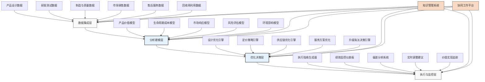

---
{"dg-publish":true,"tags":["AI财务应用","价值优化","全周期分析","生命周期管理","制造业"],"创建日期":"2024-04-29","permalink":"/知识共享/001_财务/99_其他/AI与财务应用/06_行业智能财务应用/6.1 制造业智能财务/6.1 产品生命周期价值优化/","dgPassFrontmatter":true}
---

## 技术概述

产品生命周期价值优化系统是结合AI技术与财务分析的创新应用，旨在从产品概念、设计、制造、销售到回收的全生命周期视角，实现最大化的财务价值创造。该系统打破传统仅关注单一环节成本的思维方式，通过对产品全生命周期进行整体财务建模和预测性分析，寻求长期价值最大化的产品策略和决策。

### 核心技术组件

- **AI预测建模**：使用机器学习和深度学习建立产品全生命周期的价值预测模型
- **数字孪生技术**：构建产品数字孪生，模拟产品在不同生命周期阶段的表现
- **多目标优化算法**：在成本、质量、性能和时间等多维度目标中寻求最优平衡点
- **知识图谱技术**：构建产品知识图谱，连接产品设计、材料、制造工艺与价值因素
- **自然语言处理**：分析市场反馈、客户评价和技术文档，提取价值相关信息
- **情景模拟系统**：模拟不同市场环境、使用场景和维护策略下的价值实现路径

### 与传统产品财务管理的对比

| 特性 | 传统产品财务管理 | 生命周期价值优化系统 |
|------|--------------|------------------|
| 分析范围 | 单阶段、分部门独立评估 | 全生命周期综合评估 |
| 价值视角 | 以成本为中心 | 以总体价值为中心 |
| 决策依据 | 短期财务指标 | 长期价值创造与回报 |
| 优化方法 | 阶段内局部优化 | 跨阶段整体价值优化 |
| 数据集成 | 有限，以财务数据为主 | 全面，整合设计、生产、市场、服务数据 |
| 预测能力 | 简单线性预测 | 复杂非线性AI预测模型 |
| 适应性 | 静态分析，定期更新 | 动态调整，持续学习 |

## 系统架构

## 实施方案

### 技术实施路线图

1. **基础构建阶段**（3-5个月）
   - 数据源识别与集成开发
   - 基础数据模型设计
   - 关键分析算法选型与配置
   - 基础平台搭建

2. **模型开发阶段**（4-6个月）
   - 产品价值模型开发
   - 生命周期成本模型开发
   - 市场与客户响应模型开发
   - 初步优化算法实现

3. **系统整合阶段**（3-4个月）
   - 模型与优化引擎整合
   - 用户界面开发
   - 与企业系统集成
   - 知识库与协同平台构建

4. **扩展优化阶段**（持续进行）
   - 算法性能优化
   - 模型精度提升
   - 功能模块扩展
   - 产品家族扩展支持

### 技术依赖与资源需求

- **硬件资源**：高性能计算集群、云存储资源、数据处理服务器
- **软件平台**：产品生命周期管理(PLM)系统、数据分析平台、AI模型开发框架、可视化工具
- **数据需求**：产品历史数据、市场反馈数据、成本数据、服务记录、竞争产品数据
- **技术人才**：数据科学家、财务分析师、产品工程师、供应链专家、市场分析师

### 潜在挑战与应对策略

| 挑战 | 应对策略 |
|------|---------|
| 数据孤岛问题 | 建立统一数据标准，开发无缝集成接口，实施数据治理 |
| 长周期预测难度 | 应用组合预测技术，定期校准预测模型，引入外部市场信号 |
| 跨部门协作障碍 | 建立共享价值指标，设计协同激励机制，提供统一协作平台 |
| 价值量化困难 | 开发多维价值评估框架，结合定量与定性方法，建立可比较的价值度量 |
| 模型复杂度管理 | 采用分层模型架构，关键因素分析简化模型，平衡复杂度与可解释性 |
| 变革管理挑战 | 分阶段实施策略，关键利益相关者早期参与，提供全面培训和支持 |

## 价值创造

### 量化效益评估

- **产品盈利能力提升**：通过全生命周期价值优化，产品利润率增加15-25%
- **上市时间缩短**：设计优化和决策加速，产品上市时间缩短20-30%
- **服务收入增长**：基于价值分析的服务策略优化，售后服务收入增长25-40%
- **客户生命周期价值**：客户留存率提高15-20%，客户生命周期价值增长30-50%
- **库存与资本优化**：产品家族优化降低库存水平15-25%，资本利用率提高20-30%
- **研发投资回报**：研发资源针对高价值创新的集中，研发ROI提高30-45%

### ROI与成本效益分析

| 价值维度 | 投资规模 | 回报周期 | 预期ROI |
|---------|---------|---------|---------|
| 产品设计优化 | 150-300万元 | 12-24个月 | 200-300% |
| 定价策略优化 | 80-150万元 | 6-12个月 | 250-350% |
| 服务模式优化 | 100-200万元 | 12-18个月 | 180-250% |
| 产品组合管理 | 200-400万元 | 18-30个月 | 150-250% |
| 全系统实施 | 500-1000万元 | 24-36个月 | 200-400% |

*注：实际ROI因企业规模、行业特性和产品复杂度而异*

### 竞争优势与创新价值

- **差异化竞争力**：基于价值而非纯成本的产品差异化策略
- **资源配置优化**：将资源集中于高价值创造的产品线和创新点
- **动态响应能力**：对市场变化和竞争动态的快速价值调整能力
- **创新投资精准度**：提高创新投资回报率，减少无效研发支出
- **客户满意与忠诚**：通过价值驱动的产品设计提高客户满意度和忠诚度
- **可持续发展支持**：将环境和社会价值纳入产品决策，支持可持续发展

## 未来演进

### 技术迭代路线图

1. **近期（1-2年）**
   - 集成更多实时市场数据源，增强市场响应预测
   - 开发更精细的价值分解模型，追踪到组件和特性级别
   - 引入更先进的因果推断模型，提高决策解释性

2. **中期（2-3年）**
   - 建立产品价值社交网络，分析价值在客户网络中的传播
   - 发展自适应价格策略系统，根据价值感知动态调整
   - 整合供应商和分销商价值链，实现生态系统级价值优化

3. **远期（3-5年）**
   - 开发自主优化产品组合系统，动态调整产品策略
   - 实现价值驱动的全自动设计调整和优化
   - 构建行业价值交换网络，优化跨企业价值创造

### 与未来技术趋势结合点

- **联邦学习**：安全地整合跨组织产品绩效数据，不共享原始数据
- **增强现实/虚拟现实**：通过虚拟环境测试产品价值假设，加速设计迭代
- **数字货币与智能合约**：优化价值捕获模型，实现自动化价值分配
- **计算生成设计**：应用生成设计原则实现价值最大化的产品设计
- **情感计算**：分析客户对产品的情感反应，量化情感价值因素

### 扩展应用场景

- **即服务型产品模式**：优化产品即服务模式的价值创造和捕获
- **定制化产品价值**：精确计算个性化配置的价值溢价
- **生态系统价值优化**：扩展到合作伙伴网络的整体价值优化
- **社会影响价值**：整合社会和环境影响作为价值评估维度
- **品牌价值建设**：将品牌价值建设纳入产品生命周期决策

## 实验验证

### 概念验证(POC)方案

1. **范围界定**：
   - 选择1-2个代表性产品线
   - 聚焦3个关键生命周期阶段
   - 定义价值评估的核心指标

2. **技术架构精简**：
   - 构建精简版价值模型
   - 集成关键数据源
   - 开发基础优化算法

3. **实施步骤**：
   - 第1-2周：需求与范围确定
   - 第3-4周：数据收集与清洗
   - 第5-8周：基础模型开发
   - 第9-12周：优化算法实现
   - 第13-14周：用户界面开发
   - 第15-16周：测试与评估

### 评估指标设计

| 类别 | 指标 | 目标值 |
|------|------|-------|
| 模型性能 | 生命周期成本预测准确度 | 误差<10% |
| | 价值预测准确度 | 与实际偏差<15% |
| | 算法响应时间 | 复杂查询<5秒 |
| 业务影响 | 产品毛利提升 | >10% |
| | 库存水平改善 | 降低>12% |
| | 研发资源利用率 | 提高>15% |
| 用户体验 | 决策支持有效性 | >80%决策者认可 |
| | 界面易用性 | 满意度>4.2/5 |
| | 跨部门协作改善 | 协作效率提升>25% |

### 循证迭代策略

1. **验证机制**：
   - A/B测试不同价值模型
   - 回溯测试历史产品决策
   - 领域专家评审

2. **数据收集**：
   - 用户行为自动追踪
   - 决策结果记录系统
   - 定期利益相关者反馈

3. **迭代计划**：
   - 每月小型改进迭代
   - 每季度功能扩展
   - 半年主要版本升级

4. **成功标准**：
   - POC阶段：初步价值模型构建完成，关键产品决策支持能力验证
   - 推广阶段：至少两个产品线应用并实现可量化价值
   - 全面应用：企业级价值管理转型，构建价值驱动的产品决策文化 