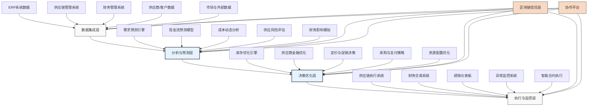

---
{"dg-publish":true,"tags":["AI财务应用","供应链","协同优化","财务管理","智能决策"],"创建日期":"2024-04-29","permalink":"/知识共享/001_财务/99_其他/AI与财务应用/06_行业智能财务应用/6.1 制造业智能财务/6.1 供应链财务协同优化/","dgPassFrontmatter":true}
---

## 技术概述

供应链财务协同优化系统是融合AI技术、供应链管理与财务管理的创新应用，通过打破传统供应链运营与财务管理的壁垒，构建一个端到端的供应链财务数字生态系统。该系统从整体价值链视角出发，实时协调供应链决策与财务影响，在保障现金流健康的同时优化供应链运营效率，实现运营与财务目标的动态平衡。

### 核心技术组件

- **预测性分析引擎**：结合时间序列分析、机器学习和因果推断，预测供应链事件的财务影响
- **多目标优化算法**：在供应链效率、库存水平、服务质量与财务表现间寻求最优平衡
- **区块链技术**：提供供应链金融交易的透明度和可追溯性，支持智能合约自动执行
- **知识图谱**：构建供应链网络与财务流的关联模型，揭示隐藏的影响路径
- **自然语言处理**：分析合同条款、市场信息和财务报告，提取关键信息
- **数字孪生**：创建供应链财务流动的虚拟镜像，实现情景模拟和压力测试

### 与传统方法的对比

| 特性 | 传统供应链财务管理 | 协同优化系统 |
|------|-----------------|-----------|
| 决策视角 | 供应链和财务分离决策 | 集成的协同决策框架 |
| 优化目标 | 单维度目标（成本、交付等） | 多维度平衡（运营和财务） |
| 响应速度 | 滞后反应，周期性调整 | 实时响应，动态优化 |
| 分析能力 | 基于历史数据的静态分析 | 前瞻性预测与情景分析 |
| 供应商关系 | 交易型关系管理 | 基于价值的协作生态系统 |
| 风险管理 | 孤立的风险评估 | 集成的风险-回报分析 |
| 资金优化 | 被动的现金流管理 | 主动的供应链金融策略 |

## 系统架构

## 实施方案

### 技术实施路线图

1. **基础构建阶段**（3-4个月）
   - 数据集成框架开发
   - 核心预测模型构建
   - 基础优化引擎设计
   - 协作平台初步搭建

2. **功能开发阶段**（4-6个月）
   - 需求-库存-现金流协同模型开发
   - 供应商金融优化系统构建
   - 多维度决策支持系统开发
   - 绩效监控仪表板实现

3. **高级功能与集成阶段**（3-5个月）
   - 区块链信任层部署
   - 智能合约系统实现
   - 高级情景模拟功能开发
   - 与企业系统深度集成

4. **扩展与优化阶段**（持续进行）
   - 算法精度持续优化
   - 新场景与用例扩展
   - 合作伙伴生态系统构建
   - 高级分析能力增强

### 技术依赖与资源需求

- **硬件资源**：高性能服务器集群、分布式存储系统、区块链节点网络
- **软件平台**：企业级数据集成中间件、预测分析平台、优化引擎、区块链平台
- **数据需求**：历史交易数据、库存与物流数据、供应商绩效数据、财务报表数据、市场趋势数据
- **技术人才**：供应链分析师、财务建模专家、机器学习工程师、区块链开发者、集成架构师

### 潜在挑战与应对策略

| 挑战 | 应对策略 |
|------|---------|
| 系统复杂性 | 采用微服务架构，模块化设计，分阶段实施 |
| 数据质量与集成 | 建立数据治理框架，开发ETL验证机制，实施主数据管理 |
| 组织协同 | 构建跨职能团队，设计共享KPI，提供协作平台与培训 |
| 预测准确性 | 组合多种预测技术，持续模型校准，引入外部数据增强信号 |
| 供应商参与度 | 设计激励机制，提供易用接口，展示共赢价值 |
| 实施复杂度 | 制定详细变更管理计划，选择关键业务场景先行试点 |

## 价值创造

### 量化效益评估

- **供应链成本降低**：通过优化采购、库存和物流策略，降低总供应链成本8-15%
- **营运资金改善**：优化支付和收款周期，减少营运资金需求12-20%
- **现金流可预测性**：提高现金流预测准确度达85-90%，支持更精准的财务规划
- **库存水平优化**：在维持服务水平的前提下，降低安全库存15-25%
- **供应商融资成本**：通过供应链金融创新，降低生态系统融资成本20-30%
- **采购成本节约**：通过预测性采购和智能谈判支持，降低采购成本5-10%

### ROI与成本效益分析

| 投资领域 | 投资规模估算 | 回报周期 | 预期ROI |
|---------|------------|---------|---------|
| 需求预测与库存优化 | 100-200万元 | 8-12个月 | 180-250% |
| 供应链金融平台 | 150-300万元 | 12-18个月 | 200-300% |
| 协同决策系统 | 200-400万元 | 12-24个月 | 150-200% |
| 区块链信任基础设施 | 250-500万元 | 18-30个月 | 120-180% |
| 全系统实施 | 700-1400万元 | 24-36个月 | 180-250% |

*注：具体ROI取决于企业规模、行业特性和供应链复杂度*

### 竞争优势与创新价值

- **供应链韧性增强**：通过提前识别风险并制定财务缓冲策略，提高供应链抗冲击能力
- **决策敏捷性提升**：缩短决策周期，使企业能更快响应市场变化和机会
- **供应商生态优化**：通过金融激励和协作工具，培养更稳定和高效的供应商网络
- **财务灵活性提高**：释放被困在供应链中的资金，提高资本配置灵活性
- **可持续发展支持**：将可持续性指标融入供应链财务决策，支持环境和社会目标
- **分析能力建设**：培养组织的预测性分析能力，为更广泛的业务决策提供支持

## 未来演进

### 技术迭代路线图

1. **近期（1-2年）**
   - 扩展AI预测能力，增加外部数据源与事件触发机制
   - 发展自适应优化算法，根据市场变化动态调整策略
   - 增强供应链金融产品创新，开发更灵活的融资模式

2. **中期（2-3年）**
   - 实现全自动化的供应链财务协调，减少人工干预
   - 构建跨企业协同决策平台，实现生态系统级优化
   - 开发高级风险预警与缓解系统，提高供应链韧性

3. **远期（3-5年）**
   - 建立自主学习与自适应的供应链财务系统
   - 实现基于区块链的分布式自治供应链金融网络
   - 开发全球供应链资源动态配置引擎，应对复杂市场环境

### 与未来技术趋势结合点

- **物联网(IoT)**：实时追踪实物资产流动，与财务流动同步分析
- **5G通信**：支持更大规模实时数据传输，实现更精细的供应链控制
- **联邦学习**：在保护数据隐私的前提下实现跨组织的协同预测和优化
- **数字货币**：简化跨境支付，降低交易成本，提高资金流转速度
- **量子计算**：解决超大规模供应链网络的复杂优化问题

### 扩展应用场景

- **全球供应链网络优化**：平衡地缘政治风险、成本效益与财务灵活性
- **循环供应链财务模型**：支持循环经济业务模式的财务可行性分析与优化
- **动态定价与收益管理**：将供应链约束与财务目标整合进先进的定价策略
- **新兴市场供应链发展**：设计适合新兴市场特点的供应链金融创新模式
- **危机与弹性规划**：开发供应链财务韧性评估与增强工具，应对极端事件

## 实验验证

### 概念验证(POC)方案

1. **范围界定**：
   - 选择1-2个关键产品线或业务单元
   - 聚焦3-5个核心供应链财务协同场景
   - 纳入关键供应商和客户进行协同测试

2. **技术架构简化**：
   - 构建核心预测与优化模块
   - 实现基础协作平台功能
   - 与现有系统轻量级集成

3. **实施步骤**：
   - 第1-2周：需求定义与基线测量
   - 第3-5周：数据准备与初步模型开发
   - 第6-10周：核心功能实现
   - 第11-12周：内部测试与调整
   - 第13-16周：有限范围内的实际运行
   - 第17-18周：结果评估与规划

### 评估指标设计

| 类别 | 指标 | 目标值 |
|------|------|-------|
| 财务效益 | 营运资金减少 | >10% |
| | 现金流预测准确度 | 误差<12% |
| | 库存资金占用降低 | >15% |
| 运营效率 | 订单履行率提升 | >5% |
| | 库存周转率提高 | >20% |
| | 采购周期缩短 | >15% |
| 协作效果 | 供应商参与度 | >70% |
| | 跨部门决策时间缩短 | >40% |
| | 信息共享延迟降低 | >60% |

### 循证迭代策略

1. **测试方法**：
   - A/B测试优化策略效果
   - 小规模对照实验
   - 持续反馈收集与分析

2. **数据收集**：
   - 系统性能与使用数据自动记录
   - 结构化用户反馈表单
   - 业务影响关键指标跟踪

3. **迭代频率**：
   - 每2周进行微调优化
   - 每月评估整体性能
   - 每季度进行功能扩展

4. **成功标准**：
   - POC阶段：至少完成2个核心场景验证，财务效益指标达标
   - 扩展阶段：系统稳定运行，覆盖主要业务单元，关键指标持续改善
   - 全面部署：企业级供应链财务协同转型，创造可持续竞争优势 