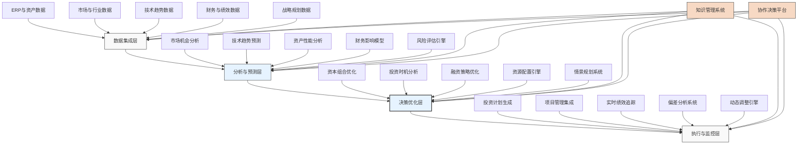

---
{"dg-publish":true,"tags":["AI财务应用","资本规划","投资优化","智能决策","制造业"],"创建日期":"2024-04-29","permalink":"/知识共享/001_财务/99_其他/AI与财务应用/06_行业智能财务应用/6.1 制造业智能财务/6.1 智能资本支出规划/","dgPassFrontmatter":true}
---

## 技术概述

智能资本支出规划系统是融合人工智能与先进财务建模的创新应用，旨在彻底改变制造企业资本投资决策的方式。该系统超越传统的静态资本预算方法，构建动态、前瞻性的资本配置框架，帮助企业在复杂多变的市场环境中做出最优的长期资本投资决策，平衡短期财务压力与长期战略发展需求。

### 核心技术组件

- **多场景预测模型**：结合机器学习和蒙特卡洛模拟，预测不同资本投资路径的财务及战略影响
- **强化学习系统**：通过模拟不同决策序列长期结果，优化资本分配策略
- **因果推断引擎**：分析投资决策与业务成果间的因果关系，而非仅依赖相关性
- **多目标优化算法**：在财务回报、战略支持、风险控制等多维度目标间寻求最优平衡
- **资产数字孪生**：为关键资产构建数字镜像，模拟全生命周期表现和价值创造
- **自然语言处理**：分析市场报告、研究动态和专利数据，识别投资机会与风险

### 与传统资本规划的对比

| 特性 | 传统资本规划 | 智能资本支出规划 |
|------|------------|---------------|
| 决策基础 | 历史数据和静态假设 | 动态市场模拟与多场景预测 |
| 优化方法 | 单项目评估与比较 | 整体投资组合优化 |
| 时间维度 | 年度预算周期 | 动态滚动规划，实时调整 |
| 风险评估 | 简化假设的敏感性分析 | 高级情景模拟与压力测试 |
| 投资评价 | 以财务指标为主 | 集成财务、战略和运营多维度评价 |
| 学习能力 | 有限，主要依赖人工经验 | 持续学习，自动优化决策模型 |
| 协同性 | 部门孤岛决策 | 跨部门协同决策平台 |

## 系统架构

## 实施方案

### 技术实施路线图

1. **基础构建阶段**（3-4个月）
   - 数据架构设计与集成
   - 核心预测模型开发
   - 基础决策框架构建
   - 用户界面原型设计

2. **高级功能开发阶段**（4-6个月）
   - 投资组合优化引擎开发
   - 多场景模拟系统构建
   - 风险评估模型实现
   - 动态规划算法开发

3. **系统集成阶段**（3-4个月）
   - 与ERP和财务系统集成
   - 协作决策平台实现
   - 项目管理工具集成
   - 绩效监控系统构建

4. **扩展优化阶段**（持续进行）
   - 算法优化与学习能力增强
   - 用户体验改进
   - 新分析维度扩展
   - 行业特定模型开发

### 技术依赖与资源需求

- **硬件资源**：高性能计算服务器、云计算资源、数据存储系统
- **软件平台**：高级分析平台、机器学习框架、财务建模工具、可视化引擎
- **数据需求**：历史投资数据、资产绩效数据、市场趋势数据、行业基准数据、宏观经济指标
- **技术人才**：数据科学家、财务分析师、运筹学专家、行业领域专家、软件工程师

### 潜在挑战与应对策略

| 挑战 | 应对策略 |
|------|---------|
| 数据质量与完整性 | 建立数据治理框架，开发数据质量评估工具，采用增量式数据集成 |
| 不确定性建模难度 | 应用组合预测方法，定期校准模型，引入专家知识增强预测 |
| 跨部门协调复杂性 | 设计包容性流程，建立共同目标指标，提供协作决策平台 |
| 战略与财务集成 | 开发量化的战略价值评估框架，将战略目标转化为可测量指标 |
| 用户接受度挑战 | 提供透明的决策逻辑解释，分阶段实施，展示早期价值 |
| 系统复杂度管理 | 采用模块化设计，建立清晰的服务边界，控制技术栈复杂度 |

## 价值创造

### 量化效益评估

- **资本回报率提升**：通过优化投资组合和时机选择，提高资本回报率15-25%
- **资本利用效率**：降低闲置资本和过度投资，提高资本利用率20-30%
- **投资决策速度**：缩短资本决策周期40-60%，提高市场响应速度
- **预测准确度**：资本投资回报预测准确度提高35-50%，减少资源错配
- **战略一致性**：确保85-95%的资本投资直接支持战略优先级
- **风险管理改善**：提前识别投资风险的能力提高50-70%，降低资本损失

### ROI与成本效益分析

| 投资领域 | 投资规模估算 | 回报周期 | 预期ROI |
|---------|------------|---------|---------|
| 预测分析平台 | 100-200万元 | 12-18个月 | 200-300% |
| 投资组合优化 | 150-300万元 | 18-24个月 | 250-350% |
| 风险分析引擎 | 100-200万元 | 12-18个月 | 180-250% |
| 协作决策平台 | 80-150万元 | 6-12个月 | 150-200% |
| 全系统实施 | 400-800万元 | 24-36个月 | 200-350% |

*注：具体ROI取决于企业规模、资本密集度和决策复杂性*

### 竞争优势与创新价值

- **战略敏捷性**：能够快速调整资本配置以响应市场变化和竞争动态
- **创新投资优化**：更精准地评估新技术和创新项目，平衡风险与回报
- **资本效率领先**：在同行业中建立资本效率优势，提高长期竞争力
- **适应性增强**：更好地应对市场波动和技术变革带来的不确定性
- **协作决策文化**：培养基于数据的跨部门协作决策模式
- **长期价值创造**：避免短期主义，支持长期可持续的价值创造

## 未来演进

### 技术迭代路线图

1. **近期（1-2年）**
   - 整合外部市场信号进行投资机会实时监测
   - 开发自动化资本重新平衡系统
   - 增强资产全生命周期优化能力

2. **中期（2-3年）**
   - 实现自主学习型投资决策模型
   - 构建跨企业资本协同平台
   - 开发高级不确定性适应算法

3. **远期（3-5年）**
   - 建立自适应资本生态系统
   - 实现战略-财务-运营的完全集成优化
   - 开发预见性资本配置引擎

### 与未来技术趋势结合点

- **量子计算**：应用于复杂投资组合优化问题，大幅提高计算能力
- **边缘智能**：实现资产层面的实时监控和资本效率优化
- **数字货币与金融科技**：支持更灵活、高效的资本获取和分配模式
- **元宇宙技术**：创建虚拟资本决策环境，支持沉浸式协作决策
- **合成数据**：生成高质量模拟数据，增强稀缺场景的训练能力

### 扩展应用场景

- **永续资本模型**：优化循环经济投资策略，平衡短期回报与长期可持续性
- **智能并购评估**：增强并购目标评估和整合规划的智能分析能力
- **动态资产组合管理**：实时优化企业资产组合，包括留存、出售与升级决策
- **弹性投资框架**：设计适应高不确定性环境的弹性投资策略
- **跨地区资本优化**：在全球制造网络中实现最优资本配置

## 实验验证

### 概念验证(POC)方案

1. **范围界定**：
   - 选择特定资产类别或业务单元
   - 聚焦3-5个关键投资决策场景
   - 纳入历史投资数据进行回测

2. **技术架构简化**：
   - 构建核心预测与优化模块
   - 实现基础协作界面
   - 设计清晰的决策支持输出

3. **实施步骤**：
   - 第1-2周：需求分析与范围定义
   - 第3-4周：数据收集与准备
   - 第5-8周：模型开发与训练
   - 第9-10周：用户界面实现
   - 第11-14周：实际投资决策测试
   - 第15-16周：结果评估与规划

### 评估指标设计

| 类别 | 指标 | 目标值 |
|------|------|-------|
| 决策质量 | 资本回报率提升 | >15% |
| | 资本预算偏差减少 | >40% |
| | 战略一致性提高 | >25% |
| 流程效率 | 决策时间缩短 | >50% |
| | 重新评估周期缩短 | >60% |
| | 情景分析能力提升 | >200% |
| 用户体验 | 决策者满意度 | >4.0/5.0 |
| | 使用频率 | >每周2次 |
| | 推荐采纳率 | >70% |

### 循证迭代策略

1. **测试方法**：
   - 回溯测试历史投资决策
   - 并行评估（系统vs传统方法）
   - 模拟投资决策场景演练

2. **数据收集**：
   - 决策输出与实际结果比对
   - 用户反馈与行为分析
   - 系统性能与准确度监控

3. **迭代周期**：
   - 每2周功能迭代
   - 每月算法优化
   - 每季度大型功能扩展

4. **成功标准**：
   - POC阶段：优于传统方法的决策支持能力验证
   - 推广阶段：至少3个业务单元采用，关键指标达标
   - 全面应用：成为企业资本决策的核心平台，建立数据驱动决策文化 