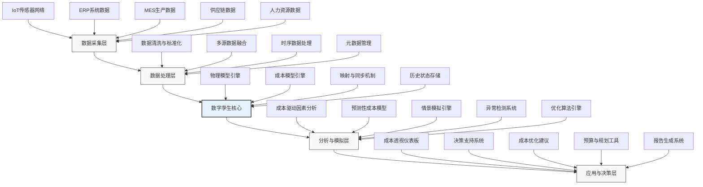

---
{"dg-publish":true,"tags":["AI财务应用","数字孪生","成本模拟","制造业","实时分析"],"创建日期":"2024-04-29","permalink":"/知识共享/001_财务/99_其他/AI与财务应用/06_行业智能财务应用/6.1 制造业智能财务/制造成本数字孪生/","dgPassFrontmatter":true}
---

## 技术概述

制造成本数字孪生是将数字孪生技术与财务成本管理融合的创新应用，通过创建物理制造系统及其成本结构的数字化镜像，实现对成本形成过程的实时模拟、分析和优化。该系统利用多源数据实时采集、高级分析算法和可视化技术，将制造过程中的每一个环节与其对应的成本驱动因素关联起来，形成动态、交互式的成本模型。

### 核心技术组件

- **IoT传感网络**：部署在制造环境中的传感器网络，实时采集能源消耗、材料使用、设备状态和生产参数等数据
- **数字孪生引擎**：构建制造系统的高保真数字化模型，模拟物理世界的行为和特性
- **实时数据集成平台**：整合生产数据、ERP数据、供应链数据和市场数据的中间件
- **AI预测分析**：使用机器学习算法分析成本驱动因素，预测未来成本趋势
- **图计算引擎**：构建成本要素关系图，分析成本传递和影响路径
- **可视化决策界面**：直观展示成本动态变化和影响因素的交互式界面

### 与传统成本管理的对比

| 特性 | 传统成本管理 | 数字孪生成本系统 |
|------|------------|--------------|
| 数据时效性 | 历史数据，周期性更新 | 实时数据，持续更新 |
| 成本视图 | 静态，基于会计周期 | 动态，实时变化 |
| 分析维度 | 有限，主要财务维度 | 多维，包含物理和财务维度 |
| 成本归因 | 基于分配规则，间接 | 基于因果关系，直接 |
| 预测能力 | 基于历史趋势外推 | 基于物理模型和AI预测 |
| 决策支持 | 事后分析，周期性报告 | 实时洞察，即时决策支持 |
| 优化方式 | 人工分析，经验判断 | 算法辅助，模拟验证 |

## 系统架构

## 实施方案

### 技术实施路线图

1. **基础建设阶段**（1-3个月）
   - 制造环境IoT传感网络部署
   - 数据集成接口开发
   - 基础数据模型构建
   - 数字孪生引擎配置

2. **模型构建阶段**（2-4个月）
   - 物理制造流程建模
   - 成本结构映射与关联
   - 历史数据训练模型
   - 初步仿真验证

3. **系统集成阶段**（3-4个月）
   - 与ERP/MES系统集成
   - 实时数据流建立
   - 分析算法部署
   - 可视化界面开发

4. **优化迭代阶段**（持续进行）
   - 模型精度优化
   - 算法性能调优
   - 功能扩展开发
   - 用户体验改进

### 技术依赖与资源需求

- **硬件资源**：边缘计算设备、工业IoT网关、传感器网络、高性能服务器集群
- **软件平台**：数字孪生平台（如Azure Digital Twins、PTC ThingWorx）、流处理框架（Apache Kafka/Flink）、图数据库
- **数据需求**：工艺参数数据、历史成本数据、设备运行数据、BOM数据、原材料价格数据
- **技术人才**：数字孪生专家、数据工程师、成本会计专家、可视化开发工程师、行业领域专家

### 潜在挑战与应对策略

| 挑战 | 应对策略 |
|------|---------|
| 数据质量不足 | 制定数据标准，增加验证机制，采用数据修复算法 |
| 建模复杂性 | 采用渐进式建模，优先关键流程，随后扩展完善 |
| 系统集成难度 | 使用标准化API和中间件，建立明确的数据交换协议 |
| 成本归因准确性 | 结合专家知识构建规则，通过机器学习不断优化 |
| 系统响应性能 | 优化算法效率，采用分层计算架构，关键应用边缘计算 |
| 用户接受度 | 强化培训，提供直观界面，突出商业价值，分阶段推广 |

## 价值创造

### 量化效益评估

- **成本可见性提升**：提高成本透明度50-70%，实现对成本形成全过程的可视化
- **成本控制精准度**：提高异常成本识别准确率达85%以上，减少成本偏差15-25%
- **决策响应时间**：将成本问题识别和响应时间从天级缩短到小时甚至分钟级
- **资源利用优化**：通过智能优化建议，提高资源利用效率8-15%
- **预测准确性**：成本预测准确度提高30-40%，有效支持财务规划和预算编制
- **浪费识别与控制**：识别并减少非增值活动造成的浪费10-20%

### ROI与成本效益分析

| 投资类别 | 典型投资规模 | 回报周期 | 预期ROI |
|---------|------------|---------|---------|
| 小型试点（单一生产线） | 50-150万元 | 12-18个月 | 120-150% |
| 中型实施（单一工厂） | 200-500万元 | 18-24个月 | 150-200% |
| 大型部署（多工厂） | 500-1500万元 | 24-36个月 | 200-300% |

*注：具体ROI因行业、工厂规模和现有数字化水平而异*

### 竞争优势与创新价值

- **产品定价优势**：通过精准成本计算支持更具竞争力的定价策略
- **投标竞争力**：提高大型复杂项目成本预估准确性，增强投标竞争力
- **产品组合优化**：基于真实成本数据优化产品组合，专注高价值产品
- **供应链协同**：通过共享成本洞察提升与供应商的协作效率
- **敏捷制造支持**：支持快速产品迭代的精准成本评估和决策
- **合规与可持续性**：提供能源、碳排放和资源使用的成本透明度

## 未来演进

### 技术迭代路线图

1. **近期（1-2年）**
   - 集成预测性维护数据，关联设备健康状况与成本影响
   - 强化AI分析能力，提高成本预测准确性
   - 开发更丰富的情景模拟能力

2. **中期（2-3年）**
   - 实现供应链数字孪生与成本数字孪生的深度集成
   - 引入强化学习算法实现自动化成本优化
   - 开发跨工厂成本比较和标杆分析功能

3. **远期（3-5年）**
   - 构建自适应成本管理系统，能根据市场变化自动调整生产策略
   - 实现完全闭环的自动化成本控制系统
   - 开发行业级成本数字孪生网络，实现价值链协同优化

### 与未来技术趋势结合点

- **边缘计算与5G**：利用厂区5G网络和边缘计算实现低延迟成本分析
- **区块链技术**：通过区块链确保成本数据在供应链中的可追溯性和可验证性
- **量子计算**：长期应用于复杂成本优化问题的超高速计算
- **增强现实**：车间级成本可视化，让操作人员实时了解操作决策的成本影响
- **自主智能系统**：实现从成本分析到优化决策的完全自动化

### 扩展应用场景

- **服务型制造**：将产品全生命周期成本与服务产品定价结合
- **定制化生产**：精确计算个性化定制产品的成本和定价
- **循环经济模型**：整合再制造、回收等循环经济环节的成本分析
- **碳排放管理**：将碳成本纳入整体成本模型，支持减排决策
- **跨境制造网络**：全球制造基地的成本比较和优化协调

## 实验验证

### 概念验证(POC)方案

1. **范围界定**：
   - 选择单一生产线或单个产品族
   - 聚焦3-5个关键成本驱动因素
   - 确定明确的成功指标和验收标准

2. **技术架构简化**：
   - 使用轻量级数字孪生平台
   - 选择性部署关键传感器
   - 建立最小可行的数据集成

3. **实施步骤**：
   - 第1周：需求分析和设计
   - 第2-3周：传感器部署和数据采集
   - 第4-6周：基础模型构建
   - 第7-8周：基本功能开发
   - 第9-10周：测试和评估
   - 第11-12周：结果分析和报告

### 评估指标设计

| 类别 | 指标 | 目标值 |
|------|------|-------|
| 技术性能 | 数据采集实时性 | 95%数据延迟<5秒 |
| | 系统响应时间 | 查询响应<2秒 |
| | 模型准确性 | 与实际成本偏差<5% |
| 业务价值 | 成本异常检测率 | >80% |
| | 资源浪费识别 | 识别率>75% |
| | 决策支持时效性 | 问题识别到建议生成<10分钟 |
| 用户体验 | 操作复杂度 | 关键任务<3步操作 |
| | 用户满意度 | >4.0/5.0分 |
| | 培训时间 | <8小时可上手使用 |

### 循证迭代策略

1. **数据收集机制**：
   - 自动化性能指标监控
   - 用户反馈收集表单
   - 系统使用行为分析

2. **评估周期**：
   - 每周技术性能评估
   - 每两周业务价值评估
   - 每月全面效果评估

3. **迭代机制**：
   - 基于数据驱动的优先级确定
   - 双周迭代周期
   - 持续集成和部署管道

4. **成功标准**：
   - POC阶段：至少80%的指标达到目标值
   - 试点扩展：技术可行性确认，初步业务价值显现
   - 全面部署：明确的ROI路径和业务案例建立 