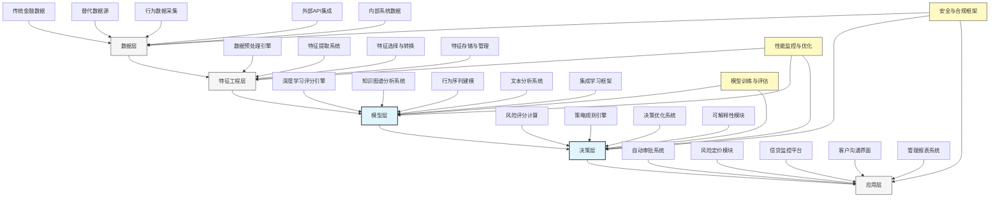

---
{"dg-publish":true,"tags":["AI财务应用","风险评估","信贷分析","金融科技","智能风控"],"创建日期":"2024-04-29","permalink":"/知识共享/001_财务/99_其他/AI与财务应用/06_行业智能财务应用/6.2 金融服务业应用/6.2 智能信贷风险评估/","dgPassFrontmatter":true}
---

## 技术概述

智能信贷风险评估系统是一套融合多种前沿人工智能技术的现代信贷决策平台，通过整合传统与非传统数据源，实现对借款人信用状况的全方位、动态化和精准化评估。该系统突破了传统信用评分模型的局限性，利用深度学习、自然语言处理和知识图谱等技术，从海量异构数据中提取风险信号，构建多维度风险画像，为金融机构提供更全面的风险识别能力和更准确的决策支持，同时显著提升包容性金融服务的覆盖面和效率。

### 核心技术组件

- **多源数据整合引擎**：融合传统金融数据、替代数据和行为数据，构建全方位信用画像
- **深度学习信用评分模型**：利用深度神经网络捕捉复杂非线性关系，提高风险预测准确性
- **知识图谱关联分析**：揭示借款人与相关实体的隐含关系，识别潜在风险网络
- **行为序列建模系统**：分析用户行为时序特征，提取稳定性和变化趋势信号
- **文本理解与情感分析**：从非结构化文本中提取信用相关信息和情感倾向
- **实时风险监控引擎**：持续跟踪借款人状况变化，实现动态风险预警
- **可解释AI决策框架**：提供透明的风险评估理由，满足监管与客户沟通需求
- **自适应学习系统**：从历史决策结果中持续优化模型表现，适应市场环境变化

### 与传统信贷评估方法对比

| 维度 | 传统信贷评估 | 智能信贷风险评估 |
|------|------------|----------------|
| 数据范围 | 信用历史、财务数据为主 | 全维度数据整合，包括行为、社交和替代数据 |
| 分析深度 | 基于统计模型的线性分析 | 深度学习捕捉复杂非线性关系和隐藏模式 |
| 客户覆盖 | 主要覆盖有完整信用记录的人群 | 扩展至信用历史薄弱或缺失的群体 |
| 评估速度 | 小时至天级处理周期 | 秒级实时决策能力 |
| 风险洞察 | 静态历史风险评估 | 动态实时风险监控与预警 |
| 风险维度 | 信用违约风险为主 | 全方位风险评估（违约、欺诈、操作等） |
| 决策透明度 | 评分卡规则相对简单清晰 | 高级模型结合可解释AI技术 |
| 适应能力 | 模型更新周期长（月/季度） | 持续学习与自适应优化（日/周） |
| 个性化程度 | 客群级别的风险定价 | 个体级别的精准风险定价 |

## 系统架构

## 实施方案

### 技术实施路线图

1. **基础数据整合阶段**（3-4个月）
   - 传统数据源集成与标准化
   - 替代数据源评估与接入
   - 数据质量管理框架建立
   - 初步特征工程系统开发

2. **核心能力构建阶段**（4-6个月）
   - 基础评分模型开发与验证
   - 知识图谱构建与关联分析
   - 文本分析引擎开发
   - 初级决策引擎实现

3. **高级功能开发阶段**（3-5个月）
   - 深度学习模型优化与部署
   - 实时风险监控系统构建
   - 可解释性框架整合
   - 自适应学习机制实现

4. **系统优化与应用拓展阶段**（持续进行）
   - 模型性能持续优化
   - 产品与场景覆盖扩展
   - 风险策略精细化调整
   - 系统性能与稳定性提升

### 技术依赖与资源需求

- **硬件资源**：高性能计算服务器集群、分布式存储系统、负载均衡基础设施
- **软件平台**：分布式计算框架、深度学习框架、图数据库、流处理引擎、API管理平台
- **数据需求**：历史信贷数据、征信数据、交易记录、行为数据、公开信息数据
- **技术人才**：数据科学家、机器学习工程师、风险管理专家、数据工程师、安全合规专家

### 潜在挑战与应对策略

| 挑战 | 应对策略 |
|------|---------|
| 数据质量参差不齐 | 建立严格数据验证流程，实施高级数据清洗技术，开发数据质量评分系统 |
| 模型解释性困难 | 采用可解释AI技术，开发特征重要性分析工具，构建直观决策路径可视化 |
| 数据隐私与合规 | 实施数据脱敏与匿名化技术，建立严格访问控制，定期合规审计 |
| 模型稳定性保障 | 建立模型性能监控系统，实施模型版本控制，设计优雅降级机制 |
| 样本偏差控制 | 采用公平性约束训练方法，实施多样化采样技术，定期偏差审计 |
| 应对市场变化 | 构建敏感性分析框架，实施情景模拟测试，建立快速模型更新机制 |

## 价值创造

### 量化效益评估

- **信贷决策准确性提升**：风险识别准确率提高15-25%，坏账率降低20-40%
- **审批效率提升**：自动化审批率提高30-50%，审批时间从天级缩短至分钟/秒级
- **客户覆盖扩展**：可服务的客户群体扩大25-40%，覆盖传统信用评分无法评估的人群
- **运营成本降低**：人工审核需求减少50-70%，每笔贷款处理成本降低30-50%
- **客户体验改善**：申请到审批时间缩短80-95%，客户满意度提升30-50%
- **风险定价优化**：实现更精准的风险差异化定价，利润空间提升10-20%

### ROI与成本效益分析

| 投资领域 | 投资规模估算 | 回报周期 | 预期ROI |
|---------|------------|---------|---------|
| 数据整合系统 | 200-400万元 | 9-15个月 | 300-500% |
| 核心分析引擎 | 300-600万元 | 12-18个月 | 400-700% |
| 决策平台开发 | 250-450万元 | 6-12个月 | 350-600% |
| 应用层开发 | 150-300万元 | 3-9个月 | 250-450% |
| 全系统实施 | 900-1750万元 | 12-24个月 | 350-600% |

*注：ROI基于典型金融机构的贷款规模和风险状况计算，实际结果将因机构特点而异*

### 竞争优势与创新价值

- **全谱系风险洞察**：从单一信用风险扩展至全维度风险评估
- **普惠金融拓展**：为传统信用评分无法覆盖的人群提供服务机会
- **动态风险管理**：从静态评估转向全生命周期动态监控
- **精准客户细分**：实现更细粒度的客户风险分层和差异化服务
- **决策透明与公平**：通过可解释AI增强监管合规性和客户信任
- **敏捷市场响应**：快速适应市场变化和新型风险出现

## 未来演进

### 技术迭代路线图

1. **近期（1-2年）**
   - 增强跨域数据整合能力
   - 开发更高级的异常检测算法
   - 提升模型可解释性
   - 扩展业务场景覆盖范围

2. **中期（2-3年）**
   - 实现强化学习风险决策框架
   - 开发情景感知评估系统
   - 构建预测性风险预警平台
   - 实施高级个性化风险定价

3. **远期（3-5年）**
   - 发展自主进化风险评估系统
   - 构建跨机构风险情报网络
   - 实现宏观经济情景自动融入
   - 开发多目标风险优化框架

### 与未来技术趋势结合点

- **联邦学习**：在保护数据隐私前提下实现跨机构模型协作
- **因果推断**：从相关性分析提升至因果关系发现，提高模型稳定性
- **强化学习**：通过交互式学习优化长期风险决策策略
- **量子计算**：应用于复杂风险计算和模拟，提升处理能力
- **区块链技术**：提供不可篡改的信用记录和风险评估审计跟踪

### 扩展应用场景

- **消费金融**：个人消费贷款、信用卡额度管理
- **小微企业金融**：小微企业贷款、供应链金融
- **住房金融**：智能化抵押贷款风险评估
- **供应链金融**：基于交易关系网络的信用评估
- **保险风险评估**：个人和企业保险风险定价
- **投资者风险评估**：投资者适当性管理与风险匹配

## 实验验证

### 概念验证(POC)方案

1. **范围界定**：
   - 选择特定贷款产品线
   - 确定核心评估维度
   - 设定明确成功指标

2. **技术架构简化**：
   - 核心数据源集成
   - 基础模型开发
   - 决策引擎原型

3. **实施步骤**：
   - 第1-4周：数据收集与清洗
   - 第5-8周：特征工程与基础模型开发
   - 第9-12周：评分引擎与决策逻辑开发
   - 第13-16周：性能评估与优化
   - 第17-20周：结果分析与迭代计划

### 评估指标设计

| 类别 | 指标 | 目标值 |
|------|------|-------|
| 模型性能 | 基尼系数 | >0.65 |
| | KS值 | >0.45 |
| | AUC | >0.85 |
| 业务价值 | 坏账率降低 | >20% |
| | 自动审批率提升 | >30% |
| | 客户覆盖扩展 | >25% |
| 运营效率 | 审批时间减少 | >80% |
| | 人工干预降低 | >50% |
| | 系统响应时间 | <500ms |

### 循证迭代策略

1. **测试方法**：
   - 历史数据回测
   - 影子模式并行评估
   - A/B测试验证

2. **数据收集机制**：
   - 决策结果跟踪记录
   - 模型预测与实际结果对比
   - 系统性能监控指标

3. **迭代周期**：
   - 每周指标评估会议
   - 每两周模型参数优化
   - 每月特征更新与扩展

4. **成功标准**：
   - 技术可行性：模型性能指标达标，系统稳定可靠
   - 业务价值：显著降低风险成本，提高业务规模
   - 用户接受度：业务与风险团队认可新系统价值 