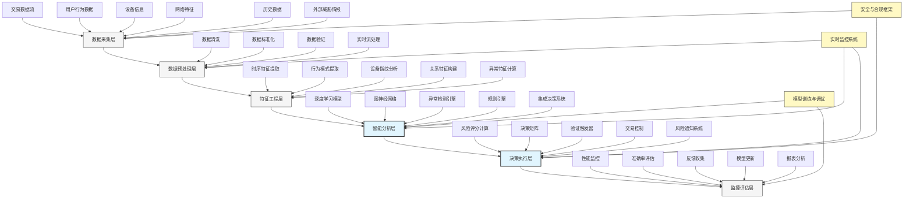

---
{"dg-publish":true,"tags":["AI财务应用","欺诈检测","异常识别","风险管理","金融安全"],"创建日期":"2024-04-29","permalink":"/知识共享/001_财务/99_其他/AI与财务应用/06_行业智能财务应用/6.2 金融服务业应用/6.2 欺诈检测高级系统/","dgPassFrontmatter":true}
---

## 技术概述

欺诈检测高级系统是一套集成多种人工智能与大数据技术的智能防御平台，能够实时识别、预警并拦截各类金融渠道与形式的欺诈行为。该系统突破传统规则基础的欺诈检测局限，通过深度神经网络、图分析、异常检测和行为生物识别等技术，构建多层次防御体系，实现对已知欺诈模式的高效识别和对新型欺诈手段的预测性发现。系统可适应快速变化的欺诈技术，显著提升金融机构交易安全性，降低欺诈损失，同时平衡用户体验与安全防护需求。

### 核心技术组件

- **行为生物识别引擎**：分析用户设备操作特征、输入模式和交互习惯，构建行为身份特征
- **图神经网络关联分析**：挖掘账户、交易、设备和IP之间的复杂关系网络，识别欺诈团伙
- **异常检测框架**：结合统计学与深度学习方法，实时识别偏离正常行为模式的异常活动
- **深度学习分类器**：针对已知欺诈模式，提供高精度识别能力，同时不断优化适应新特征
- **生成对抗网络**：模拟潜在欺诈手段，预测性发现系统漏洞，增强防御能力
- **实时决策引擎**：毫秒级完成复杂风险分析，根据风险等级执行相应拦截或验证措施
- **自适应规则系统**：基于欺诈模式变化自动优化规则参数和权重，减少人工维护
- **可解释风险分析**：提供透明的风险评估依据，支持人工审核和监管合规需求

### 与传统欺诈检测对比

| 维度 | 传统欺诈检测系统 | 欺诈检测高级系统 |
|------|--------------|---------------|
| 检测方法 | 以静态规则集和固定阈值为主 | 融合AI模型、规则引擎和自适应学习 |
| 分析深度 | 针对独立事件分析 | 行为序列和关系网络的多维分析 |
| 适应能力 | 规则更新周期长，人工维护 | 自适应学习，持续优化，自动规则调整 |
| 响应速度 | 批处理或延迟分析 | 毫秒级实时决策 |
| 误报率 | 高误报率(15-30%) | 低误报率(3-8%)，平衡检出率和误报 |
| 用户体验 | 普遍高摩擦验证 | 风险分层处理，低风险低摩擦体验 |
| 检出方向 | 主要识别已知欺诈模式 | 同时识别已知和未知欺诈模式 |
| 分析速度 | 处理大规模交易性能受限 | 高性能架构，支持海量实时交易 |
| 学习能力 | 有限或无学习能力 | 持续从反馈中学习优化 |

## 系统架构

## 实施方案

### 技术实施路线图

1. **基础架构搭建阶段**（2-3个月）
   - 数据采集与集成系统构建
   - 实时处理框架部署
   - 基础规则引擎实现
   - 安全框架与合规机制建立

2. **核心分析能力构建阶段**（3-5个月）
   - 深度学习模型训练与部署
   - 行为分析引擎开发
   - 设备指纹识别系统实现
   - 初级图分析框架搭建

3. **高级分析与集成阶段**（2-4个月）
   - 图神经网络部署与优化
   - 集成多模型决策系统
   - 实时风险评分系统构建
   - 自适应规则引擎实现

4. **优化与扩展阶段**（持续进行）
   - 持续模型优化与更新
   - 欺诈模式库扩展
   - 系统性能调优
   - 全渠道防护扩展

### 技术依赖与资源需求

- **硬件资源**：高性能GPU服务器、分布式计算集群、大容量存储系统、负载均衡设备
- **软件平台**：实时流处理框架、深度学习框架、图数据库、规则引擎系统、API管理平台
- **数据需求**：历史交易数据、已标记欺诈案例、用户行为数据、设备信息、外部威胁情报
- **技术人才**：机器学习专家、安全分析师、欺诈风控专家、数据工程师、性能优化工程师

### 潜在挑战与应对策略

| 挑战 | 应对策略 |
|------|---------|
| 数据质量问题 | 实施严格数据验证机制，构建数据质量评分系统，建立异常数据处理流程 |
| 欺诈手段快速演变 | 采用自适应学习模型，建立欺诈情报共享机制，实施主动防御研究 |
| 模型透明度要求 | 开发模型可解释性框架，提供决策依据展示，建立风险评分解释机制 |
| 实时性能保障 | 优化算法计算效率，实施分层处理策略，部署高性能计算基础设施 |
| 隐私合规要求 | 实施数据脱敏技术，严格访问控制，确保符合GDPR/CCPA等法规标准 |
| 高误报率挑战 | 实施风险分层策略，构建误报反馈机制，持续模型优化与调整 |

## 价值创造

### 量化效益评估

- **欺诈损失降低**：预计降低欺诈相关损失40-60%，显著改善机构财务安全
- **运营成本优化**：减少70-85%的人工审核需求，优化风控人员配置
- **误报率降低**：将误报率从传统系统的15-30%降低至3-8%，减少客户摩擦
- **拦截率提升**：欺诈拦截成功率提高30-50%，特别是对新型欺诈手段
- **处理效率提升**：风险评估时间从秒级/分钟级缩短至毫秒级，支持高速交易
- **客户体验改善**：降低90%低风险交易的验证摩擦，提升转化率5-15%

### ROI与成本效益分析

| 投资领域 | 投资规模估算 | 预期回报周期 | 投资回报率 |
|---------|------------|------------|---------|
| 数据基础设施 | 150-300万元 | 6-12个月 | 350-600% |
| 高级分析系统 | 300-500万元 | 8-14个月 | 400-700% |
| 决策执行平台 | 200-350万元 | 4-10个月 | 300-500% |
| 监控与优化 | 100-200万元 | 6-12个月 | 250-450% |
| 全系统投入 | 750-1350万元 | 12-18个月 | 350-550% |

*注：ROI基于典型金融机构的交易规模和欺诈发生率计算，实际结果因机构特点而异*

### 竞争优势与创新价值

- **全维度防护**：覆盖账户开立、登录、交易、提现等全生命周期欺诈风险
- **无摩擦安全**：实现"背景式安全"，在保障安全的同时最小化用户干扰
- **主动防御**：从被动响应到主动预测与防御，提前识别欺诈风险
- **适应性提升**：快速适应新型欺诈手段，减少系统脆弱期
- **决策透明**：提供清晰风险评估依据，支持监管合规与审计需求
- **规模化处理**：高性能架构支持大规模交易实时分析，适应业务增长

## 未来演进

### 技术迭代路线图

1. **近期（1-2年）**
   - 增强多模态数据处理能力
   - 优化实时图分析性能
   - 提升可解释性框架完善度
   - 扩展欺诈知识库覆盖广度

2. **中期（2-3年）**
   - 实现跨机构协作防御网络
   - 开发高级生成对抗防御系统
   - 构建欺诈意图预测引擎
   - 实施欺诈战术自动分析系统

3. **远期（3-5年）**
   - 发展自主进化防御系统
   - 构建认知安全框架
   - 实现泛行为风险智能识别
   - 开发欺诈对手模拟系统

### 与未来技术趋势结合点

- **联邦学习**：在保护数据隐私前提下实现跨机构欺诈模式共享
- **强化学习**：优化欺诈对抗策略，实现动态防御资源分配
- **区块链技术**：构建不可篡改的交易审计轨迹，增强身份验证机制
- **量子计算安全**：研究应对量子计算威胁的下一代加密与认证
- **边缘智能**：在终端设备实现初步欺诈分析，减少数据传输与隐私风险

### 扩展应用场景

- **支付安全**：各类电子支付渠道的欺诈防护
- **身份验证**：账户开立与登录过程的身份欺诈防护
- **信贷反欺诈**：信贷申请与使用环节的欺诈识别
- **保险反欺诈**：保险理赔阶段的欺诈行为识别
- **内部风险管控**：员工异常行为监测与内部威胁防范
- **跨境交易安全**：国际支付与交易的专项欺诈防护

## 实验验证

### 概念验证(POC)方案

1. **范围界定**：
   - 选定特定交易场景（如在线支付）
   - 确定关键欺诈类型覆盖
   - 设定明确成功指标

2. **简化技术架构**：
   - 核心数据源接入
   - 基础模型实现
   - 决策引擎原型搭建

3. **实施步骤**：
   - 第1-3周：数据收集与准备
   - 第4-6周：特征工程与基础模型开发
   - 第7-9周：规则引擎与决策系统集成
   - 第10-12周：测试与评估
   - 第13-14周：结果分析与迭代

### 评估指标设计

| 类别 | 指标 | 目标值 |
|------|------|-------|
| 检测效果 | 欺诈检出率 | >85% |
| | 误报率 | <8% |
| | AUC值 | >0.92 |
| 运营效率 | 自动决策比例 | >90% |
| | 人工审核减少率 | >70% |
| | 决策平均耗时 | <100ms |
| 业务影响 | 欺诈损失降低 | >40% |
| | 合法交易通过率 | >98% |
| | 客户投诉率变化 | 降低>30% |

### 循证迭代策略

1. **测试方法**：
   - 离线历史数据测试
   - 影子模式并行评估
   - 小比例实时测试

2. **数据收集机制**：
   - 模型预测结果记录
   - 人工审核反馈采集
   - 性能指标实时监控
   - 误报/漏报案例收集

3. **迭代优化流程**：
   - 每周模型性能评估
   - 每两周特征优化更新
   - 每月规则策略调整
   - 持续案例库扩充

4. **成功验收标准**：
   - 技术可行性：核心指标达标，系统稳定运行
   - 业务价值：显著降低欺诈损失，提升操作效率
   - 集成能力：成功与现有业务系统无缝集成 