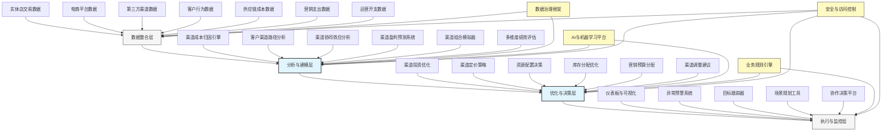

---
{"dg-publish":true,"tags":["AI财务应用","渠道分析","盈利能力","零售财务","多渠道运营"],"创建日期":"2024-04-29","permalink":"/知识共享/001_财务/99_其他/AI与财务应用/06_行业智能财务应用/6.3 零售与消费品应用/全渠道盈利能力分析/","dgPassFrontmatter":true}
---

## 技术概述

全渠道盈利能力分析系统是融合人工智能与高级分析技术的创新财务应用，专为多渠道零售企业设计，实现对线上、线下及第三方渠道的统一盈利能力评估与优化。该系统突破传统财务分析的界限，建立多维度、跨渠道的财务解析框架，通过整合交易数据、客户行为、供应链成本和运营开支，构建全面且精准的渠道盈利模型。系统能够识别每个销售渠道的真实成本结构与利润贡献，揭示渠道间的协同效应和竞争关系，为渠道投资决策、资源分配和价格策略提供数据驱动支持，帮助零售企业优化全渠道组合，最大化整体盈利能力。

### 核心技术组件

- **多维盈利归因引擎**：精确分配直接成本、间接成本和共享开支至各销售渠道和客户旅程
- **渠道协同效应分析器**：量化并评估线上引流线下、线下带动线上等跨渠道协同价值
- **AI驱动的客户渠道路径分析**：追踪客户在多渠道间的移动路径，评估各触点价值贡献
- **预测性渠道绩效模型**：预测不同渠道组合、资源配置和市场条件下的盈利表现
- **动态定价优化系统**：根据渠道成本结构和客户价值，实现渠道差异化最优定价
- **跨渠道库存价值评估**：分析库存在各渠道间的价值差异和流动成本影响
- **全渠道投资回报分析**：评估各渠道营销支出、人力资源和基础设施投资的回报率
- **渠道组合优化引擎**：应用组合理论寻找风险与回报平衡的最优渠道组合

### 与传统渠道分析方法对比

| 维度 | 传统渠道分析 | 全渠道盈利能力分析 |
|------|------------|----------------|
| 分析视角 | 渠道隔离式分析，简单收入对比 | 整合式分析，考虑渠道间交互影响 |
| 成本归因 | 简单成本分配，大量共享成本未细分 | 高级成本归因，精确分摊所有成本类型 |
| 客户视角 | 渠道内单一客户视图，缺乏连贯性 | 跨渠道统一客户旅程追踪与价值分析 |
| 绩效评估 | 基于简单收入指标，短期导向 | 基于全面价值贡献，平衡短期与长期 |
| 分析深度 | 历史性报告，描述性分析为主 | 预测性和规范性分析，主动优化 |
| 优化能力 | 渠道内优化，缺乏整体协调 | 全局优化，实现整体价值最大化 |
| 决策速度 | 月度/季度周期，手动分析 | 近实时分析，自动生成决策建议 |
| 数据整合度 | 渠道数据孤岛，整合困难 | 全渠道数据统一，自动化整合处理 |

## 系统架构

## 实施方案

### 技术实施路线图

1. **基础数据整合阶段**（2-3个月）
   - 建立跨渠道数据采集接口
   - 开发渠道数据标准化框架
   - 构建统一数据仓库架构
   - 实施初步数据质量控制

2. **核心分析能力构建阶段**（3-4个月）
   - 开发成本归因模型与引擎
   - 构建客户渠道旅程追踪系统
   - 实现基础渠道盈利分析功能
   - 开发初步渠道绩效仪表板

3. **高级功能与优化阶段**（2-3个月）
   - 实现渠道协同效应分析
   - 开发预测性渠道绩效模型
   - 构建渠道组合优化引擎
   - 完善决策支持功能

4. **集成与拓展阶段**（持续进行）
   - 与企业现有系统深度集成
   - 扩展支持更多渠道类型
   - 优化算法与模型精度
   - 开发高级自定义分析工具

### 技术依赖与资源需求

- **硬件资源**：高性能数据处理服务器、分布式存储系统、可视化工作站
- **软件平台**：数据集成中间件、商业智能平台、机器学习框架、分析可视化工具
- **数据需求**：销售交易数据、客户互动记录、成本与费用数据、营销活动数据、库存记录
- **技术人才**：数据工程师、财务分析师、机器学习专家、业务分析师、零售领域专家

### 潜在挑战与应对策略

| 挑战 | 应对策略 |
|------|---------|
| 渠道数据不一致 | 建立统一数据标准，开发数据质量评分系统，实施跨渠道数据校验 |
| 成本归因复杂性 | 采用多层级归因模型，结合活动基础成本法和机器学习算法优化分配 |
| 渠道协同效应量化 | 设计多接触点归因模型，建立控制组实验框架，应用因果推断技术 |
| 系统集成困难 | 采用API优先策略，建立数据中间层，设计松耦合架构 |
| 用户接受度 | 提供直观可视化界面，强调实际业务价值，开发自助分析工具 |
| 模型准确性验证 | 实施回测验证，建立持续评估框架，邀请业务专家审核 |

## 价值创造

### 量化效益评估

- **渠道组合优化收益**：通过优化资源分配，提升整体利润率3-7个百分点
- **营销投资回报提升**：精准识别高价值渠道，提高营销ROI 20-35%
- **库存效率改善**：优化跨渠道库存配置，降低库存持有成本15-25%
- **定价策略优化**：实施渠道差异化定价，增加渠道利润贡献5-12%
- **促销活动效益提升**：针对渠道特性优化促销，提高促销ROI 25-40%
- **运营效率提升**：减少低价值活动，降低运营成本10-20%
- **决策速度提升**：将渠道绩效分析时间从周/月级缩短至日/小时级

### ROI与成本效益分析

| 投资领域 | 投资规模估算 | 预期回报周期 | 投资回报率 |
|---------|------------|------------|---------|
| 数据整合基础设施 | 150-300万元 | 6-12个月 | 200-350% |
| 分析模型与引擎 | 200-400万元 | 8-15个月 | 250-400% |
| 优化与决策系统 | 150-300万元 | 5-10个月 | 300-500% |
| 用户界面与报告 | 100-200万元 | 3-8个月 | 200-300% |
| 全系统实施 | 600-1200万元 | 10-18个月 | 250-400% |

*注：ROI基于中型零售企业规模估算，实际结果将因企业规模、渠道复杂度和现有系统成熟度而异*

### 竞争优势与创新价值

- **渠道投资精准化**：将资源集中在高回报渠道，减少低效投入
- **全局最优决策**：突破渠道竖井，实现企业级价值最大化
- **客户体验一致性**：通过理解渠道间协同，提供无缝客户体验
- **敏捷市场响应**：快速评估市场变化对各渠道的影响，及时调整策略
- **战略决策支持**：提供渠道扩张、整合或退出的数据支持
- **跨职能协作促进**：建立统一的渠道绩效视图，促进销售、营销、供应链与财务协作

## 未来演进

### 技术迭代路线图

1. **近期（1-2年）**
   - 整合社交媒体和新兴渠道数据
   - 增强预测模型准确性与范围
   - 开发更精细的客户细分盈利分析
   - 构建自助式渠道分析工具

2. **中期（2-3年）**
   - 实现实时渠道优化建议
   - 构建渠道情景规划平台
   - 开发渠道生态系统价值分析
   - 整合外部市场数据进行竞争分析

3. **远期（3-5年）**
   - 发展自主渠道优化智能体
   - 构建数字孪生渠道模拟系统
   - 实现预见性渠道机会识别
   - 发展渠道创新价值评估框架

### 与未来技术趋势结合点

- **数字孪生**：建立虚拟渠道模型，模拟不同策略的影响
- **增强分析**：将AI支持的分析能力嵌入到日常业务流程
- **边缘计算**：在渠道前端实时收集和初步分析数据
- **语音分析**：整合客服对话数据评估渠道体验
- **区块链**：提供跨渠道交易与成本的透明跟踪

### 扩展应用场景

- **新渠道可行性评估**：预测新渠道投资的潜在回报与风险
- **渠道退出决策支持**：评估渠道退出的财务影响与客户迁移机会
- **价值链重构分析**：模拟不同渠道组合下的价值链重组效果
- **全球市场渠道策略**：支持跨地区渠道策略差异化与协调
- **并购渠道整合分析**：评估并购后渠道整合的协同效应与最优路径

## 实验验证

### 概念验证(POC)方案

1. **范围界定**：
   - 选择2-3个代表性渠道
   - 聚焦特定产品类别或业务单元
   - 确定关键评估指标

2. **技术架构简化**：
   - 构建最小可行数据模型
   - 实现核心成本归因功能
   - 开发基础分析仪表板

3. **实施步骤**：
   - 第1-3周：数据收集与准备
   - 第4-6周：基础模型构建
   - 第7-9周：初步分析与验证
   - 第10-12周：结果评估与展示

### 评估指标设计

| 类别 | 指标 | 目标值 |
|------|------|-------|
| 分析精度 | 成本归因准确度 | >90% |
| | 渠道盈利预测误差 | <10% |
| | 协同效应识别率 | >75% |
| 业务影响 | 渠道盈利改善 | >5% |
| | 库存周转率提升 | >15% |
| | 营销效率提升 | >20% |
| 技术表现 | 数据处理速度 | <4小时刷新 |
| | 系统可用性 | >99.5% |
| | 用户采纳率 | >80%决策参考 |

### 循证迭代策略

1. **测试方法**：
   - 历史数据回测验证
   - 业务专家评审
   - 对照组实验设计

2. **数据收集机制**：
   - 模型预测与实际结果对比
   - 用户反馈收集
   - 系统性能指标监控

3. **迭代优化流程**：
   - 每周核心指标回顾
   - 每两周模型参数调整
   - 每月功能扩展与优化

4. **成功验收标准**：
   - 技术可行性：核心功能稳定运行，数据处理准确
   - 业务价值：明确可量化的盈利能力改善
   - 用户接受度：业务团队积极采用系统建议 