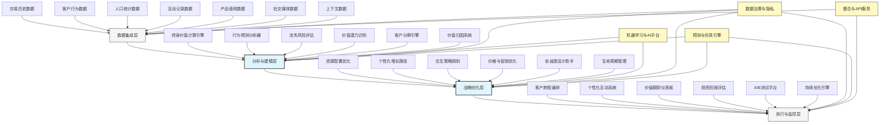

---
{"dg-publish":true,"tags":["AI财务应用","客户价值","生命周期","零售财务","价值优化"],"创建日期":"2024-04-29","permalink":"/知识共享/001_财务/99_其他/AI与财务应用/06_行业智能财务应用/6.3 零售与消费品应用/客户终身价值优化/","dgPassFrontmatter":true}
---

## 技术概述

客户终身价值优化系统是结合人工智能与财务科学的前沿应用，专为零售与消费品企业设计，旨在实现对客户全生命周期经济价值的精准计算、前瞻预测与战略优化。该系统突破传统客户价值评估的短期视角，构建动态的客户资产管理框架，通过整合历史交易、行为模式、人口统计与情境数据，创建全方位的客户价值模型。系统能够预测客户未来购买行为、识别价值增长机会、量化客户忠诚度的经济影响，并提供个性化的价值提升策略，帮助企业从单纯的短期交易驱动转向长期客户资产培育，实现可持续的收入增长与盈利能力提升。

### 核心技术组件

- **生命周期价值计算引擎**：基于多变量模型精准计算客户当前与潜在未来价值
- **AI驱动的购买路径预测**：应用深度学习预测客户未来购买频率、规模与类别
- **价值流失风险分析**：实时评估客户离开概率并量化潜在价值损失
- **个性化价值增长规划**：基于客户特征与行为生成针对性的价值提升路径
- **多渠道交互价值归因**：识别各接触点对客户价值增长的贡献及协同效应
- **情境智能推荐系统**：在最佳场景与时刻提供价值优化建议和个性化优惠
- **客户细分价值矩阵**：动态划分高价值/高潜力客户群，实现差异化资源分配
- **价值优化仿真平台**：模拟不同客户管理策略的长期财务影响

### 与传统客户价值方法对比

| 维度 | 传统客户价值方法 | 客户终身价值优化系统 |
|------|--------------|-------------------|
| 价值视角 | 历史交易为主，静态评估 | 全生命周期动态评估，兼顾当前与未来价值 |
| 分析深度 | 基于简单RFM模型或累计交易额 | 多维度价值计算，考虑直接与间接贡献 |
| 预测能力 | 有限的线性预测，短期导向 | 先进的非线性预测，长期价值导向 |
| 优化范围 | 主要关注交易频率与金额 | 全方位优化客户体验、互动路径与价值交换 |
| 个性化程度 | 群组级别的粗粒度策略 | 个体级别的精细化价值提升路径 |
| 资源分配 | 简单二八法则，缺乏精细度 | 动态、多维度的客户投资回报优化 |
| 整合程度 | 孤立分析，与其他系统割裂 | 端到端集成，贯穿各业务流程与决策 |
| 学习能力 | 固定模型，需定期人工更新 | 自适应模型，持续学习与优化 |

## 系统架构

## 实施方案

### 技术实施路线图

1. **基础数据与分析阶段**（2-3个月）
   - 构建客户数据集成框架
   - 开发基础终身价值计算模型
   - 实现初步客户分群分析
   - 建立数据质量与隐私保护机制

2. **预测与优化能力构建阶段**（3-4个月）
   - 开发购买行为预测模型
   - 构建流失风险评估系统
   - 实现价值增长机会识别
   - 开发个性化策略生成引擎

3. **高级功能与集成阶段**（2-3个月）
   - 构建交互策略优化框架
   - 开发资源分配决策系统
   - 实现价值仿真与场景分析
   - 建立端到端监控与评估机制

4. **智能化与扩展阶段**（持续进行）
   - 增强模型自学习能力
   - 开发高级个性化引擎
   - 扩展多渠道价值整合
   - 提升实时决策能力

### 技术依赖与资源需求

- **硬件资源**：高性能计算服务器、分布式存储集群、实时处理节点
- **软件平台**：客户数据平台、机器学习框架、预测分析工具、营销自动化系统
- **数据需求**：客户交易历史、网站与应用行为、服务互动记录、产品使用数据、人口统计信息
- **技术人才**：数据科学家、客户分析专家、机器学习工程师、财务分析师、营销策略师

### 潜在挑战与应对策略

| 挑战 | 应对策略 |
|------|---------|
| 数据质量与完整性 | 实施多源数据验证机制，建立数据质量评分系统，开发缺失数据补充模型 |
| 隐私合规要求 | 设计隐私优先架构，实施数据匿名化技术，建立客户同意管理系统 |
| 长期预测准确性 | 开发概率模型集成框架，实施持续预测校准，增加多情景预测 |
| 价值归因复杂性 | 实施多接触点归因模型，采用机器学习优化归因，结合控制组实验 |
| 策略执行一致性 | 建立客户战略协调中心，开发跨渠道策略同步机制，实施数字编排平台 |
| ROI证明难度 | 设计科学对照实验，建立价值变化归因框架，开发增量价值计算模型 |

## 价值创造

### 量化效益评估

- **客户留存率提升**：通过前瞻性干预，提高高价值客户留存率15-25%
- **客户平均收入增长**：精准价值提升策略，增加客户年消费额10-20%
- **客户获取成本优化**：基于价值预测的精准获客，降低获客成本20-35%
- **营销资源效率提升**：优化资源分配，提高营销投资回报率30-50%
- **产品组合收益增加**：通过交叉销售和升级销售，提升客单价15-30%
- **忠诚度计划回报提升**：优化忠诚度投资，提高忠诚度ROI25-40%
- **客户服务成本降低**：差异化服务资源分配，降低服务成本10-20%

### ROI与成本效益分析

| 投资领域 | 投资规模估算 | 预期回报周期 | 投资回报率 |
|---------|------------|------------|---------|
| 数据基础架构 | 150-300万元 | 8-12个月 | 200-350% |
| 价值分析与预测平台 | 200-400万元 | 10-16个月 | 250-400% |
| 策略优化系统 | 150-300万元 | 6-12个月 | 300-500% |
| 执行与监控平台 | 100-200万元 | 4-8个月 | 200-350% |
| 全系统实施 | 600-1200万元 | 12-24个月 | 250-400% |

*注：ROI基于中型零售企业估算，实际结果将因客户基础规模、产品复杂度及竞争环境而异*

### 竞争优势与创新价值

- **长期价值视角**：从短期销售转向长期客户资产管理
- **精准资源分配**：将资源集中在高回报客户上，最大化投资回报
- **前瞻性干预能力**：在价值流失前预测并干预，保护收入基础
- **个性化价值交换**：超越标准化促销，实现真正的价值匹配
- **全渠道客户体验**：协调一致的跨渠道价值提升策略
- **数据驱动决策**：用客观数据取代直觉，提高客户策略准确性

## 未来演进

### 技术迭代路线图

1. **近期（1-2年）**
   - 增强跨渠道行为整合能力
   - 提升价值预测准确性
   - 开发高级细分模型
   - 构建更精细的价值提升路径

2. **中期（2-3年）**
   - 实现实时个性化价值优化
   - 开发客户网络价值分析
   - 构建情绪与态度价值影响模型
   - 整合环境与市场因素预测

3. **远期（3-5年）**
   - 发展自主客户价值管理智能体
   - 构建价值最大化决策系统
   - 实现超预测客户需求能力
   - 建立生态系统价值网络分析

### 与未来技术趋势结合点

- **情感计算**：整合客户情感状态评估价值互动最佳时机
- **边缘分析**：在客户互动点实时计算与优化个性化策略
- **增强现实**：创建沉浸式高价值客户体验场景
- **生成式AI**：动态创建高度个性化的价值提案
- **量子计算**：解决复杂的多变量客户价值优化问题

### 扩展应用场景

- **订阅业务价值优化**：专为订阅模式设计的续订与升级策略
- **奢侈品客户价值培育**：高净值客户长期价值关系管理
- **全渠道会员体系设计**：基于价值的动态会员特权与体验设计
- **零售金融服务集成**：将金融产品整合入客户价值优化策略
- **B2B客户价值发展**：应用于企业客户的价值增长路径规划

## 实验验证

### 概念验证(POC)方案

1. **范围界定**：
   - 选择特定客户细分群体
   - 聚焦2-3个价值提升策略
   - 确定明确的成功指标

2. **技术架构简化**：
   - 构建基础LTV计算模型
   - 实现简化预测分析
   - 开发基础策略测试平台

3. **实施步骤**：
   - 第1-3周：数据收集与准备
   - 第4-6周：模型构建与验证
   - 第7-9周：策略设计与测试
   - 第10-12周：结果分析与展示

### 评估指标设计

| 类别 | 指标 | 目标值 |
|------|------|-------|
| 预测准确性 | LTV预测偏差 | <15% |
| | 流失预测准确率 | >80% |
| | 升级销售成功预测率 | >75% |
| 业务影响 | 客户留存率提升 | >10% |
| | 客单价增长 | >15% |
| | 客户互动率提升 | >25% |
| 财务绩效 | 客户平均收入增长 | >12% |
| | 客户服务成本降低 | >8% |
| | 客户获取成本优化 | >15% |

### 循证迭代策略

1. **测试方法**：
   - A/B测试与对照组设计
   - 队列分析与跟踪
   - 增量价值计算

2. **数据收集机制**：
   - 客户行为变化跟踪
   - 价值指标持续监控
   - 策略反馈收集分析

3. **迭代优化流程**：
   - 每周数据审核与分析
   - 每两周策略调整与优化
   - 每月模型再训练与校准

4. **成功验收标准**：
   - 技术可行性：系统准确预测客户价值变化，稳定运行
   - 业务价值：实现明确可量化的客户价值增长
   - 用户接受度：营销、销售与服务团队积极采用系统建议 