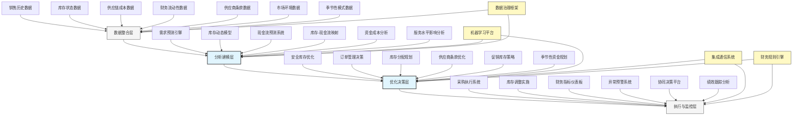

---
{"dg-publish":true,"tags":["AI财务应用","库存管理","现金流","零售财务","供应链优化"],"创建日期":"2024-04-29","permalink":"/知识共享/001_财务/99_其他/AI与财务应用/06_行业智能财务应用/6.3 零售与消费品应用/库存-现金流协同优化/","dgPassFrontmatter":true}
---

## 技术概述

库存-现金流协同优化系统是将人工智能与财务管理深度融合的前沿应用，专为零售与消费品企业设计，实现库存策略与现金流目标的智能平衡与协同管理。该系统突破传统库存管理与财务管理相互割裂的局限，建立跨职能、多目标的集成决策框架，通过整合销售数据、库存状态、供应链成本和财务流动性需求，构建完整的库存-现金流动态模型。系统能够预测不同库存策略对企业现金周期的影响，实时优化采购决策、库存水平与支付条款，为企业提供在保障销售增长的同时最大化现金流效率的整体解决方案，显著改善营运资金效率与财务弹性。

### 核心技术组件

- **销售-库存-现金流三维预测引擎**：将需求预测、库存动态与现金流影响整合为统一模型
- **多目标库存优化系统**：平衡服务水平、库存成本与现金占用的最优决策
- **供应链财务优化器**：协调采购策略、支付条款和供应商激励以改善现金周期
- **动态安全库存管理**：基于服务目标和资金成本自适应调整安全库存水平
- **库存分配智能规划**：优化多渠道、多仓库之间的库存分配以提高资金效率
- **季节性资金需求预测**：预测季节性库存波动对现金需求的影响并提前规划
- **库存价值分析引擎**：评估不同库存组合的财务价值与流动性贡献
- **协同决策支持平台**：促进供应链、销售和财务部门协作优化决策

### 与传统方法对比

| 维度 | 传统库存与现金流管理 | 库存-现金流协同优化系统 |
|------|-------------------|---------------------|
| 决策视角 | 孤立决策，库存与财务各自优化 | 集成决策，同时考虑销售、库存与现金影响 |
| 优化目标 | 单一目标（如服务水平或最低成本） | 多目标平衡（服务、成本与现金效率） |
| 预测能力 | 简单趋势预测，有限考虑财务影响 | 复杂情景模拟，全面评估财务后果 |
| 决策速度 | 周期性计划，缓慢响应变化 | 近实时优化，快速适应市场波动 |
| 库存水平决策 | 基于经验规则或简单公式 | 基于高级分析与动态财务价值评估 |
| 采购策略 | 以成本和交期为主要考量 | 整合考虑采购条款对现金流的影响 |
| 数据整合度 | 系统割裂，信息流转滞后 | 数据高度整合，信息实时共享 |
| 协调机制 | 部门间有限沟通，目标冲突 | 跨职能协作平台，目标一致性 |

## 系统架构

## 实施方案

### 技术实施路线图

1. **基础数据与分析阶段**（2-3个月）
   - 建立多数据源集成架构
   - 开发销售预测基础模型
   - 构建初步现金流映射
   - 实现库存与财务数据对接

2. **核心优化能力构建阶段**（3-4个月）
   - 开发多目标库存优化模型
   - 构建动态安全库存系统
   - 实现采购决策优化引擎
   - 建立基础协同决策平台

3. **高级功能与集成阶段**（2-3个月）
   - 构建季节性资金规划功能
   - 开发供应商条款优化系统
   - 实现多渠道库存协同管理
   - 建立全面绩效评估框架

4. **智能化与扩展阶段**（持续进行）
   - 增强预测模型准确性
   - 扩展多目标优化场景
   - 提升实时决策能力
   - 优化跨职能协作体验

### 技术依赖与资源需求

- **硬件资源**：分析服务器、分布式计算环境、大容量数据存储系统
- **软件平台**：高级分析工具、供应链管理系统、财务规划软件、协作平台
- **数据需求**：销售历史、库存记录、采购数据、供应商条款、财务报表、现金流预测
- **技术人才**：数据科学家、供应链分析师、财务规划专家、机器学习工程师、业务分析师

### 潜在挑战与应对策略

| 挑战 | 应对策略 |
|------|---------|
| 数据孤岛与整合困难 | 实施统一数据标准，开发集成中间件，构建主数据管理系统 |
| 跨部门目标冲突 | 建立共享KPI框架，开发平衡计分卡，实施协同激励机制 |
| 预测准确性问题 | 应用多模型集成技术，实施持续学习框架，开发异常检测系统 |
| 决策复杂性管理 | 构建分层决策框架，开发直观可视化界面，实施决策自动化分级 |
| 实施变更管理 | 开发渐进式部署策略，提供全面培训计划，建立成功案例展示 |
| 绩效评估困难 | 设计多维度评估框架，实施归因分析，建立对照实验机制 |

## 价值创造

### 量化效益评估

- **现金转换周期缩短**：通过优化库存与付款政策，减少现金转换周期8-15天
- **库存周转率提升**：在维持或提高服务水平的同时，提升库存周转率15-25%
- **营运资金需求减少**：通过协同优化，降低营运资金需求10-20%
- **库存相关成本降低**：减少仓储、报废、贬值等成本，总计节省5-12%
- **订单履行率提高**：通过智能库存分配，提高订单履行率3-8%
- **现金流预测准确度提升**：降低现金流预测误差40-60%，改善财务规划质量
- **供应链融资成本降低**：通过优化付款策略与供应商合作，降低融资成本5-15%

### ROI与成本效益分析

| 投资领域 | 投资规模估算 | 预期回报周期 | 投资回报率 |
|---------|------------|------------|---------|
| 数据整合平台 | 150-300万元 | 6-10个月 | 250-350% |
| 分析与建模系统 | 200-400万元 | 8-14个月 | 300-450% |
| 优化决策引擎 | 150-300万元 | 5-10个月 | 350-550% |
| 执行与监控平台 | 100-200万元 | 3-8个月 | 200-300% |
| 全系统实施 | 600-1200万元 | 10-18个月 | 300-400% |

*注：ROI基于中型零售企业估算，实际结果将因企业规模、供应链复杂度与现有系统成熟度而异*

### 竞争优势与创新价值

- **融资需求降低**：减少外部融资依赖，降低财务成本
- **财务弹性提升**：释放现金用于战略投资与市场机会把握
- **供应商关系增强**：通过互利的支付条款优化建立更牢固的供应链关系
- **市场响应加速**：在维持较低库存的同时提高市场需求响应速度
- **风险管理增强**：提高对供应链中断和市场波动的抵御能力
- **跨职能协作改善**：打破供应链和财务部门的壁垒，促进整体业务目标一致性

## 未来演进

### 技术迭代路线图

1. **近期（1-2年）**
   - 增强外部因素集成能力
   - 提升预测模型准确性
   - 拓展供应商协作功能
   - 增加情景分析深度

2. **中期（2-3年）**
   - 实现实时库存-现金流优化
   - 开发供应链金融集成功能
   - 构建端到端价值链优化
   - 增强跨企业协作能力

3. **远期（3-5年）**
   - 发展自主决策智能体
   - 构建数字孪生供应链财务模型
   - 实现预见性风险管理
   - 建立生态系统级优化框架

### 与未来技术趋势结合点

- **区块链技术**：实现供应链金融交易透明化与自动化
- **物联网监控**：通过实时库存跟踪提升数据准确性
- **预测性分析**：识别未来现金流与库存瓶颈
- **认知自动化**：提供智能的库存-现金流决策建议
- **数字孪生**：创建虚拟供应链财务模型进行情景模拟

### 扩展应用场景

- **供应链融资优化**：整合库存管理与供应链金融策略
- **全球库存网络协同**：优化跨地区库存与现金流管理
- **新市场扩张规划**：预测并优化新市场库存投资与现金流需求
- **产品组合财务优化**：基于现金流贡献评估产品线价值
- **并购整合规划**：优化并购后的库存整合与现金管理策略

## 实验验证

### 概念验证(POC)方案

1. **范围界定**：
   - 选择特定产品类别或区域
   - 聚焦2-3个关键库存-现金流优化场景
   - 确定明确的评估指标

2. **技术架构简化**：
   - 构建基础数据整合模型
   - 开发简化版优化算法
   - 实现基本的决策支持界面

3. **实施步骤**：
   - 第1-3周：数据收集与准备
   - 第4-6周：模型构建与验证
   - 第7-9周：优化策略设计与模拟
   - 第10-12周：小规模实施与结果分析

### 评估指标设计

| 类别 | 指标 | 目标值 |
|------|------|-------|
| 库存绩效 | 库存周转率提升 | >15% |
| | 库存价值减少 | >10% |
| | 服务水平维持/提升 | ≥现有水平 |
| 现金流改善 | 现金周期缩短 | >8天 |
| | 营运资金需求降低 | >10% |
| | 现金流预测准确度 | >85% |
| 运营效率 | 协同决策时间缩短 | >50% |
| | 异常情况响应速度 | >70% |
| | 跨部门满意度 | >80% |

### 循证迭代策略

1. **测试方法**：
   - 对照组实验设计
   - 历史数据回测验证
   - 情景模拟与压力测试

2. **数据收集机制**：
   - 库存与现金流指标跟踪
   - 决策执行效果监控
   - 部门反馈与使用情况分析

3. **迭代优化流程**：
   - 每周绩效指标回顾
   - 每两周模型调整与优化
   - 每月功能拓展与提升

4. **成功验收标准**：
   - 技术可行性：系统稳定可靠，预测与优化准确
   - 业务价值：实现明确的财务与库存改善指标
   - 用户接受度：供应链、销售与财务团队积极采用 