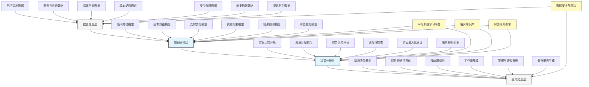

---
{"dg-publish":true,"tags":["AI财务应用","临床决策","财务效果","医疗财务","资源优化"],"创建日期":"2024-04-29","permalink":"/知识共享/001_财务/99_其他/AI与财务应用/06_行业智能财务应用/6.4 医疗与生命科学/6.4 临床财务决策支持/","dgPassFrontmatter":true}
---

## 技术概述

临床财务决策支持系统是融合人工智能与医疗经济学的创新应用，专为医疗服务提供者设计，实现临床决策与财务影响的实时整合与优化。该系统突破传统医疗决策支持的局限，建立临床-财务双视角的决策框架，通过整合患者数据、治疗方案、成本结构和预期结果，构建全面的临床经济学模型。系统能够在医生制定诊疗方案时，即时评估不同临床路径的财务影响，预测治疗选择的成本效益，并推荐在确保医疗质量的前提下最具成本效益的方案，帮助医疗机构平衡高质量护理与财务可持续性的双重挑战，为临床一线决策提供财务智能。

### 核心技术组件

- **临床路径财务影响分析**：实时评估不同治疗路径的完整财务影响与投资回报
- **方案成本效益预测**：应用决策树与概率模型预测治疗方案的成本效益比
- **资源利用优化建议**：在保证临床效果的前提下，建议优化资源利用的替代方案
- **患者特异性财务预测**：基于患者特征与风险因素，提供个性化的财务预测
- **支付方案灵敏度分析**：评估不同支付模式下治疗方案的财务影响差异
- **实时财务合规检查**：确保治疗方案符合支付方规定和最优报销路径
- **干预价值评估系统**：量化临床干预的短期与长期经济价值
- **临床决策财务后果可视化**：直观展示临床决策的财务影响与价值贡献

### 与传统临床决策支持对比

| 维度 | 传统临床决策支持 | 临床财务决策支持系统 |
|------|--------------|------------------|
| 决策重点 | 临床证据与患者安全 | 整合临床证据与经济影响 |
| 财务信息 | 缺乏或仅简单成本数据 | 全面财务影响与价值评估 |
| 决策时机 | 事后财务评估，临床先行 | 临床与财务实时整合决策 |
| 资源考量 | 有限考虑资源约束 | 将资源优化作为核心决策因素 |
| 个性化程度 | 基于医学证据的标准化推荐 | 考虑患者特征的个性化财务方案 |
| 支付模式适应 | 有限考虑支付限制 | 充分整合各类支付规则与机制 |
| 长期价值评估 | 主要关注即时临床决策 | 评估短期与长期的财务影响 |
| 决策平衡 | 偏重临床效果，财务次要 | 寻求临床效果与财务可持续的平衡点 |

## 系统架构

## 实施方案

### 技术实施路线图

1. **基础数据与模型构建阶段**（3-4个月）
   - 建立临床-财务数据整合架构
   - 开发初步临床路径财务映射
   - 构建基础成本效益分析模型
   - 实现临床指南与财务规则集成

2. **核心分析能力构建阶段**（4-5个月）
   - 开发方案比较与优化算法
   - 构建患者特异性财务预测模型
   - 实现支付模式灵敏度分析
   - 开发资源利用优化建议功能

3. **临床接口与工作流集成阶段**（3-4个月）
   - 设计临床友好的决策界面
   - 开发工作流嵌入式提示机制
   - 实现实时财务影响可视化
   - 建立移动平台访问能力

4. **高级功能与优化阶段**（持续进行）
   - 增强预测模型的准确性
   - 扩展支持更多临床场景
   - 优化用户体验与采纳度
   - 开发高级分析与报告功能

### 技术依赖与资源需求

- **硬件资源**：临床工作站服务器、移动访问基础设施、安全数据存储系统
- **软件平台**：临床决策支持框架、医疗数据整合中间件、财务分析工具、机器学习环境
- **数据需求**：电子病历数据、临床路径定义、成本核算数据、支付规则库、历史结果数据
- **技术人才**：临床信息学专家、医疗经济学家、机器学习工程师、医疗数据科学家、用户体验设计师

### 潜在挑战与应对策略

| 挑战 | 应对策略 |
|------|---------|
| 临床-财务数据整合 | 开发专用医疗数据映射工具，建立标准化术语库，实施医疗数据治理框架 |
| 临床决策点识别 | 应用自然语言处理技术分析临床记录，结合工作流分析，建立决策触发点库 |
| 临床采纳阻力 | 设计极简临床界面，提供渐进式财务信息，突出患者价值，培养临床财务意识 |
| 财务预测精度 | 应用集成学习方法，结合历史数据反馈校准，建立多情景预测模型 |
| 实时性能需求 | 优化算法效率，实施边缘计算架构，采用预计算与缓存策略 |
| 患者利益保障 | 确保推荐平衡临床与财务因素，建立医疗质量最低标准，实施伦理审查机制 |

## 价值创造

### 量化效益评估

- **资源利用优化**：通过智能推荐，降低不必要资源使用10-20%
- **支付优化收益**：提高符合最优支付路径的治疗比例，增加收入5-12%
- **文档与报销质量**：减少报销拒绝和编码错误，降低相关损失15-25%
- **治疗变异降低**：减少低价值治疗方案使用，标准化高价值路径，提高效率8-15%
- **临床效率提升**：减少临床与财务不匹配决策的返工，节省医生时间5-10%
- **长期成本节约**：通过预防性和提前干预，降低长期并发症和再入院成本15-30%
- **支付方谈判增强**：通过价值数据支持，改善支付方合约条款3-8%

### ROI与成本效益分析

| 投资领域 | 投资规模估算 | 预期回报周期 | 投资回报率 |
|---------|------------|------------|---------|
| 数据集成基础设施 | 200-400万元 | 10-15个月 | 200-350% |
| 分析模型与引擎 | 250-500万元 | 12-18个月 | 250-400% |
| 临床界面与工作流 | 150-300万元 | 6-12个月 | 300-450% |
| 培训与变革管理 | 100-200万元 | 8-14个月 | 200-300% |
| 全系统实施 | 700-1400万元 | 15-24个月 | 250-380% |

*注：ROI基于中型医疗机构估算，实际结果因机构规模、临床复杂度和现有系统成熟度而异*

### 竞争优势与创新价值

- **临床-财务协同增效**：打破临床与财务决策的传统隔阂
- **点对点财务指导**：在关键临床决策点提供实时财务智能
- **资源分配优化**：确保有限资源用于产生最大临床与财务价值的区域
- **支付模式适应能力**：灵活应对不同支付模式的要求和激励机制
- **临床财务意识培养**：提高临床医生对财务影响和价值医疗的理解
- **共担风险支持**：为风险共担支付模式提供有力的决策支持工具

## 未来演进

### 技术迭代路线图

1. **近期（1-2年）**
   - 扩展覆盖更多临床领域与决策点
   - 增强患者特异性预测能力
   - 整合社会决定因素数据
   - 开发团队决策协作功能

2. **中期（2-3年）**
   - 实现全院级价值优化推荐
   - 开发跨机构价值对标分析
   - 构建临床-财务智能助手
   - 实现隐性知识与经验捕获

3. **远期（3-5年）**
   - 建立自适应学习型推荐系统
   - 发展预测性人口健康干预优化
   - 实现全医疗生态系统价值协调
   - 构建数字孪生医疗经济模型

### 与未来技术趋势结合点

- **精准医疗经济学**：将基因组与其他分子数据整合入成本效益分析
- **增强现实决策辅助**：在临床环境中提供可视化财务决策支持
- **语音交互**：允许医生通过对话获取财务影响信息
- **预测性护理规划**：预测患者未来需求并提供前瞻性资源优化
- **区块链支付追踪**：确保支付合规性和价值医疗中的结果验证

### 扩展应用场景

- **人口健康管理财务优化**：扩展到社区与人口层面的干预价值评估
- **临床试验经济学设计**：支持新治疗方法的经济价值早期评估
- **医疗教育与培训**：培养新一代具备价值医疗思维的临床医生
- **动态定价与报销策略**：支持基于价值的动态定价与报销决策
- **药物与设备选择优化**：提供基于患者特性的个性化药物经济学分析

## 实验验证

### 概念验证(POC)方案

1. **范围界定**：
   - 选择1-2个高成本临床领域(如糖尿病管理或髋关节置换)
   - 聚焦3-5个关键临床决策点
   - 确定明确的临床与财务评估指标

2. **技术架构简化**：
   - 构建专注于目标领域的数据模型
   - 开发特定决策点的财务分析功能
   - 实现简化版临床工作流集成

3. **实施步骤**：
   - 第1-4周：数据收集与准备
   - 第5-8周：模型构建与校准
   - 第9-12周：临床界面开发与测试
   - 第13-16周：临床试点与结果评估

### 评估指标设计

| 类别 | 指标 | 目标值 |
|------|------|-------|
| 临床影响 | 临床标准合规率 | 提升至>90% |
| | 治疗变异性降低 | 减少30-50% |
| | 并发症发生率 | 降低10-20% |
| 财务影响 | 患者/案例平均成本 | 降低8-15% |
| | 最优支付路径遵循率 | 提升至>85% |
| | 资源利用优化 | 减少10-20% |
| 用户接受度 | 临床采纳率 | >70%决策参考 |
| | 用户满意度 | >80%满意 |
| | 决策时间影响 | 增加<10% |

### 循证迭代策略

1. **测试方法**：
   - A/B测试对照设计
   - 临床医生使用反馈收集
   - 患者结果与成本追踪

2. **数据收集机制**：
   - 系统建议与实际决策对比
   - 财务与临床结果关联分析
   - 用户行为与系统交互监测

3. **迭代优化流程**：
   - 每周技术与临床团队回顾
   - 每两周更新决策规则与模型
   - 每月用户界面与功能优化

4. **成功验收标准**：
   - 临床价值：维持或提高既定的临床质量标准
   - 财务价值：实现明确的成本节约或收入优化
   - 用户体验：临床工作流自然集成，不增加决策负担 