---
{"dg-publish":true,"tags":["AI财务应用","医疗定价","价值定价","成本分析","支付模式"],"创建日期":"2024-04-29","permalink":"/知识共享/001_财务/99_其他/AI与财务应用/06_行业智能财务应用/6.4 医疗与生命科学/6.4 医疗服务定价优化/","dgPassFrontmatter":true}
---

## 技术概述

医疗服务定价优化系统是一个融合AI与医疗经济学的智能决策平台，旨在解决医疗服务定价的复杂挑战。系统采用先进的多层次机器学习算法和数据挖掘技术，对成本结构、市场状况、支付方偏好、监管环境和临床价值进行全面分析，实现基于价值的动态定价。系统能够精确分解服务组件成本，根据临床效果评估医疗价值，综合考虑支付方能力、竞争环境和监管约束，并通过需求弹性分析优化价格点，帮助医疗机构在保障财务可持续性的同时，实现价值最大化和患者可负担性之间的平衡，同时提供基于不同支付模式(按服务收费、按病种付费、捆绑支付等)的定价模拟与比较功能，支持医疗机构制定灵活且富有竞争力的定价策略。

### 核心技术组件

- **微观成本追踪引擎**：通过活动基础成本法(ABC)追踪每项医疗服务的精确成本构成
- **临床价值量化模型**：基于健康结果和生活质量改善评估医疗服务的价值
- **支付方偏好分析器**：评估不同保险计划和自费患者的支付意愿与能力
- **竞争性定价情报系统**：实时监测市场同类服务价格和竞争对手定价策略
- **弹性敏感度分析器**：测量不同患者群体和服务类型的价格敏感度
- **情景模拟引擎**：模拟不同定价策略对市场份额、收入和利润的影响
- **监管合规检查器**：确保定价策略符合医疗价格透明度和其他法规要求
- **支付模式优化器**：针对不同支付模式自动生成最优定价建议和组合策略

### 与传统医疗定价方法对比

| 维度 | 传统医疗定价 | 智能医疗服务定价优化系统 |
|------|--------------|----------------------|
| 成本基础 | 粗略成本分摊，常基于历史数据 | 精确微观成本追踪，活动基础成本分析 |
| 价值计算 | 很少考虑临床价值和结果 | 量化健康结果改善和生活质量提升 |
| 市场信息 | 有限的市场数据，更新频率低 | 广泛的市场情报，实时更新与分析 |
| 患者细分 | 简单分类，忽略多样性 | 高度精细化患者群体细分与偏好分析 |
| 定价灵活性 | 僵化统一价格，调整缓慢 | 动态个性化定价，快速响应市场变化 |
| 支付模式适应 | 侧重单一支付模式 | 跨支付模式优化，综合策略设计 |
| 预测能力 | 有限的基础预测，主要基于趋势 | 先进的预测模型，多维情景模拟 |
| 合规性 | 被动合规，手动监控 | 主动合规，自动监测与预警 |

## 系统架构

```mermaid
graph TD
    A[数据采集层] --> B[分析处理层]
    B --> C[定价引擎层]
    C --> D[决策支持层]
    D --> E[执行与监测层]
    
    %% 数据采集层详情
    A1[成本会计系统集成] --> A
    A2[临床结果数据库] --> A
    A3[保险支付数据] --> A
    A4[患者自费数据] --> A
    A5[市场情报系统] --> A
    A6[监管规定数据库] --> A
    A7[历史服务量数据] --> A
    
    %% 分析处理层详情
    B1[活动基础成本分析] --> B
    B2[健康结果价值评估] --> B
    B3[支付方特征分析] --> B
    B4[市场竞争分析] --> B
    B5[需求弹性建模] --> B
    B6[监管影响评估] --> B
    B7[利用率预测] --> B
    
    %% 定价引擎层详情
    C1[成本基础定价模块] --> C
    C2[价值基础定价模块] --> C
    C3[市场导向定价模块] --> C
    C4[支付模式适配器] --> C
    C5[弹性调整计算器] --> C
    C6[边际收益优化器] --> C
    C7[多目标平衡引擎] --> C
    
    %% 决策支持层详情
    D1[定价方案生成器] --> D
    D2[情景模拟比较] --> D
    D3[预期影响分析] --> D
    D4[财务敏感性分析] --> D
    D5[市场份额预测] --> D
    D6[患者可负担性评估] --> D
    D7[组织战略适配分析] --> D
    
    %% 执行与监测层详情
    E1[价格实施管理] --> E
    E2[市场反应追踪] --> E
    E3[绩效与预测比较] --> E
    E4[价格透明度管理] --> E
    E5[异常情况警报] --> E
    E6[定期优化建议] --> E
    E7[定价效果评估] --> E
    
    %% 横向支持系统
    F[机器学习平台] --> B
    F --> C
    
    G[预测分析引擎] --> B
    G --> C
    G --> D
    
    H[安全与合规层] --> A
    H --> E
    
    %% 样式设置
    style A fill:#f5f5f5,stroke:#333,stroke-width:1px
    style B fill:#e6f2ff,stroke:#333,stroke-width:1px
    style C fill:#ffe6cc,stroke:#333,stroke-width:2px
    style D fill:#e6f2ff,stroke:#333,stroke-width:1px
    style E fill:#f5f5f5,stroke:#333,stroke-width:1px
    style F fill:#fff9c4,stroke:#333,stroke-width:1px
    style G fill:#fff9c4,stroke:#333,stroke-width:1px
    style H fill:#fff9c4,stroke:#333,stroke-width:1px
```

## 实施方案

### 技术实施路线图

1. **基础数据整合阶段**（3-4个月）
   - 建立成本会计与临床结果数据连接
   - 整合内部财务与服务量数据
   - 搭建市场情报收集框架
   - 构建监管数据库与更新机制

2. **核心分析能力构建阶段**（4-6个月）
   - 开发微观成本追踪模型
   - 实现临床价值量化算法
   - 构建支付方偏好分析系统
   - 开发需求弹性预测模型

3. **定价引擎与决策支持系统构建**（3-4个月）
   - 实现各类定价模块与算法
   - 开发支付模式适配器
   - 构建多目标优化引擎
   - 设计定价方案生成与比较工具

4. **执行与监测体系构建**（2-3个月）
   - 实现价格实施管理系统
   - 开发市场反应追踪功能
   - 构建异常警报机制
   - 实现定价效果评估体系

### 技术依赖与资源需求

- **硬件资源**：高性能计算服务器、安全存储系统、数据分析工作站
- **软件平台**：成本分析软件、机器学习框架、预测分析平台、可视化工具套件
- **数据需求**：详细成本数据、服务量数据、临床结果数据、支付方数据、市场价格数据
- **技术人才**：医疗经济学专家、数据科学家、成本会计专家、市场分析师、软件工程师

### 潜在挑战与应对策略

| 挑战 | 应对策略 |
|------|---------|
| 成本数据分散且不精确 | 实施微观成本追踪项目，建立标准成本数据池，开发成本分配引擎 |
| 临床价值难以量化 | 采用公认健康结果评估工具，整合患者报告结果，建立标准化价值评估框架 |
| 市场信息不完整 | 建立多渠道市场情报网络，利用公开数据与第三方报告，开发半自动化市场监测工具 |
| 支付方响应预测困难 | 构建支付方细分模型，收集历史响应数据，实施小规模测试与学习机制 |
| 组织变革阻力 | 开展关键利益相关者参与计划，提供培训与展示价值案例，采用渐进式实施策略 |
| 定价透明度要求 | 开发患者友好价格解释工具，确保价格计算可追溯，主动满足并超越合规要求 |
| 复杂支付模式适配 | 为每种支付模式开发专用模块，构建模式转换工具，实施综合支付策略设计 |

## 价值创造

### 量化效益评估

- **收入提升**：通过优化定价，平均增加服务线收入7-15%
- **患者流量增加**：针对价格敏感服务的优化定价提高患者量8-12%
- **财务可持续性**：确保全成本回收，改善贡献边际5-10%
- **市场竞争力**：提高价格竞争力，增加市场份额3-6%
- **谈判效力**：与支付方谈判中增强议价能力，提高报销率4-9%
- **资源配置**：优化服务组合，改善资源利用率10-15%
- **透明度与声誉**：提高价格透明度带来患者满意度提升15-25%
- **决策效率**：减少定价决策流程时间60-75%，提高精准度

### ROI与成本效益分析

| 投资领域 | 投资规模估算 | 预期回报周期 | 投资回报率 |
|---------|------------|------------|---------|
| 成本分析基础设施 | 250-500万元 | 8-12个月 | 300-450% |
| 价值分析与市场情报 | 200-400万元 | 9-14个月 | 350-500% |
| 定价引擎开发 | 300-600万元 | 10-16个月 | 400-600% |
| 决策支持系统 | 150-300万元 | 6-10个月 | 250-400% |
| 执行与监测系统 | 100-250万元 | 5-8个月 | 200-350% |
| 组织变革与培训 | 100-200万元 | 4-8个月 | 150-300% |
| 全系统实施 | 1100-2250万元 | 12-24个月 | 300-500% |

*注：ROI基于中等规模医疗机构估算，实际结果可能因机构类型、服务范围和现有系统成熟度而异*

### 竞争优势与创新价值

- **科学定价基础**：从经验定价转向数据驱动的科学定价方法
- **价值差异化**：能够基于临床价值合理证明价格差异
- **市场适应性**：快速响应市场变化、政策调整和竞争行为
- **战略一致性**：定价策略与组织整体战略和财务目标一致
- **患者中心定价**：在定价决策中融入患者可负担性和价值感知
- **多模式支付兼容**：灵活适应多种支付模式，降低转型风险
- **预见性决策能力**：通过模拟不同情景的影响做出前瞻性决策
- **透明度与信任建设**：增强价格透明度，建立患者与支付方信任

## 未来演进

### 技术迭代路线图

1. **近期（1-2年）**
   - 扩展个性化定价能力
   - 增强预测模型精度
   - 整合更多支付模式模拟
   - 开发患者友好价格工具

2. **中期（2-3年）**
   - 实现AI驱动的动态实时定价
   - 开发跨机构比较分析能力
   - 构建价值基础支付模式设计器
   - 实现精准患者负担预测

3. **远期（3-5年）**
   - 建立医疗经济数字孪生系统
   - 发展预测性健康结果定价
   - 实现生态系统级价值捕获模型
   - 构建区域健康经济优化框架

### 与未来趋势结合点

- **价值基础医疗转型**：引领从服务量到价值导向的支付转型
- **精准医疗经济学**：将精准医疗理念应用于定价个性化
- **健康结果数据爆发**：整合爆炸性增长的健康结果数据进行价值评估
- **人工智能医疗渗透**：适应AI诊断和治疗服务的价值定价
- **消费者驱动医疗**：响应日益增长的患者价格敏感性和选择权

### 扩展应用场景

- **医疗网络合同谈判**：优化与保险网络的合同定价与条款
- **新医疗技术评估与定价**：为创新医疗技术制定合理的初始价格
- **价值基础药物定价**：将框架扩展至药物和医疗设备定价
- **全球医疗服务定价**：支持跨境医疗服务的国际差异化定价
- **医疗创新孵化定价**：为新兴医疗服务模式设计可持续定价策略

## 实验验证

### 概念验证(POC)方案

1. **范围界定**：
   - 选择2-3个代表性服务线(如门诊手术、影像学服务)
   - 聚焦特定患者群体与支付方组合
   - 限定关键绩效指标集合

2. **技术架构简化**：
   - 实现核心成本分析与价值评估模块
   - 开发基础市场反应预测能力
   - 构建定价方案比较工具原型

3. **实施步骤**：
   - 第1-4周：数据收集与准备
   - 第5-8周：基础模型开发与验证
   - 第9-12周：定价引擎原型构建
   - 第13-16周：方案测试与结果评估

### 评估指标设计

| 类别 | 指标 | 目标值 |
|------|------|-------|
| 准确性 | 成本追踪精准度 | 误差<5% |
| | 弹性预测准确性 | 误差<10% |
| | 市场反应预测精度 | 误差<15% |
| 财务影响 | 收入影响 | 增长5-10% |
| | 贡献边际改善 | 提高3-8% |
| | 患者量影响 | 稳定或增长 |
| 运营效果 | 决策时间减少 | 缩短50-70% |
| | 价格更新周期 | 缩短60-80% |
| | 定价一致性提升 | 提高40-60% |
| 使用效果 | 用户满意度 | >80分(满分100) |
| | 采纳率 | >70%建议被采纳 |
| | 跨部门协作改善 | 明显提升(问卷评估) |

### 循证迭代策略

1. **测试方法**：
   - A/B测试不同定价策略
   - 历史回测与预测比较
   - 与传统定价方法对比

2. **数据收集机制**：
   - 市场反应实时追踪
   - 定价决策记录与结果
   - 利益相关者反馈收集

3. **迭代优化流程**：
   - 每月模型精度评估与调整
   - 每季度算法与逻辑优化
   - 半年进行方案范围与功能扩展

4. **成功验收标准**：
   - 技术验证：核心功能完整可用，预测精度达标
   - 业务验证：财务指标明显改善，运营效率提升
   - 用户验证：决策者认可并持续使用系统建议 