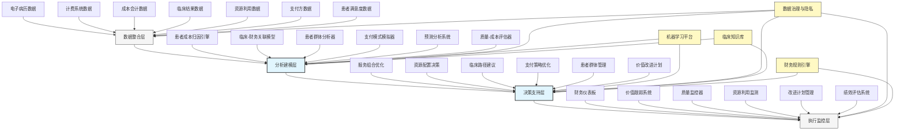

---
{"dg-publish":true,"tags":["AI财务应用","患者分析","盈利模型","医疗财务","价值医疗"],"创建日期":"2024-04-29","permalink":"/知识共享/001_财务/99_其他/AI与财务应用/06_行业智能财务应用/6.4 医疗与生命科学/6.4 患者盈利性分析系统/","dgPassFrontmatter":true}
---

## 技术概述

患者盈利性分析系统是融合人工智能与财务科学的前沿应用，专为医疗机构设计，实现对患者护理全周期的经济价值精准分析与优化。该系统突破传统医疗财务分析的局限，建立以患者为中心的财务分析框架，通过整合临床数据、资源消耗、收入来源和成本结构，构建全面且精准的患者价值模型。系统能够识别不同患者群体的真实成本驱动因素与利润贡献，揭示临床路径与财务结果的关联，为医疗机构提供在保障医疗质量的同时优化资源分配和提升财务可持续性的决策支持，帮助实现从按量计费向价值医疗的战略转型。

### 核心技术组件

- **患者级成本归因引擎**：精确分配直接与间接成本至患者级别，实现微观成本洞察
- **临床-财务关联分析**：量化临床决策、治疗路径和干预措施对财务结果的影响
- **患者群体盈利模式识别**：应用聚类和模式识别技术发现高/低价值患者特征
- **预测性财务风险模型**：预测患者护理过程中的潜在财务风险与机会
- **支付方案优化系统**：分析不同支付模式（按服务计费、捆绑支付、风险共担等）的财务影响
- **资源利用优化器**：评估资源分配策略对患者价值和机构利润的影响
- **价值医疗影响评估**：测量干预措施和护理模式对质量-成本比的影响
- **战略规划与情景模拟**：模拟不同医疗服务组合、患者群体和支付模式的财务后果

### 与传统医疗财务分析对比

| 维度 | 传统医疗财务分析 | 患者盈利性分析系统 |
|------|--------------|-----------------|
| 分析单位 | 部门、服务线或诊断组 | 个体患者及患者群体 |
| 成本视角 | 粗粒度分配、平均成本法 | 精细化活动成本法、患者级归因 |
| 临床整合 | 临床数据与财务数据分离 | 临床-财务数据深度融合 |
| 价值认定 | 收入导向，注重账单 | 结果导向，重视质量-成本比 |
| 预测能力 | 简单趋势外推，有限前瞻性 | 先进预测模型，个体和群体风险预测 |
| 支付模式适应 | 主要针对按服务付费模式 | 适应多种支付模式，包括价值型支付 |
| 决策支持 | 事后财务报告，有限指导性 | 实时分析，前瞻性决策支持 |
| 资源优化 | 简单削减成本，可能影响质量 | 价值优化，平衡质量与成本 |

## 系统架构

## 实施方案

### 技术实施路线图

1. **基础数据整合阶段**（3-4个月）
   - 建立临床-财务数据整合架构
   - 开发患者级成本归因模型
   - 构建基础数据质量控制流程
   - 实现初步报告与可视化功能

2. **核心分析能力构建阶段**（4-6个月）
   - 开发患者群体分析算法
   - 构建临床-财务关联模型
   - 实现支付模式模拟功能
   - 开发预测性财务风险模型

3. **决策支持功能开发阶段**（3-4个月）
   - 构建服务组合优化功能
   - 开发资源配置建议系统
   - 实现患者管理策略优化
   - 建立价值改进计划框架

4. **执行与扩展阶段**（持续进行）
   - 实现综合仪表板与监控系统
   - 扩展支持更多临床科室和服务线
   - 优化预测模型精度与适用性
   - 开发高级自定义分析工具

### 技术依赖与资源需求

- **硬件资源**：高性能分析服务器、安全数据存储系统、临床工作站集成
- **软件平台**：医疗数据集成中间件、高级分析工具、机器学习框架、合规报告系统
- **数据需求**：电子病历数据、计费系统记录、成本会计信息、临床结果指标、资源利用记录
- **技术人才**：医疗数据科学家、财务分析师、临床信息专家、机器学习工程师、医疗经济学家

### 潜在挑战与应对策略

| 挑战 | 应对策略 |
|------|---------|
| 数据孤岛与整合困难 | 建立标准化数据模型，开发专用医疗ETL工具，实施医疗数据治理框架 |
| 患者级成本归因复杂性 | 应用时间驱动型活动成本法，结合临床路径分析，实施微观成本追踪 |
| 临床-财务结果关联 | 采用因果推断技术，实施临床变异控制，建立多维度结果矩阵 |
| 隐私与合规问题 | 实施严格的数据脱敏，确保HIPAA合规，建立安全访问控制 |
| 临床采纳抵抗 | 开发对临床医生友好的界面，强调质量改进价值，提供部门级激励 |
| 多元支付模式建模 | 构建灵活的支付模拟器，适应不同付款人规则，提供情景分析 |

## 价值创造

### 量化效益评估

- **服务线利润率改善**：通过优化患者组合和资源分配，提高关键服务线利润率3-8个百分点
- **资源利用效率提升**：识别并减少低价值资源使用，提高资源利用率15-25%
- **支付优化收益**：通过最优支付模式选择和谈判，提升支付覆盖率5-10%
- **成本节约**：识别并减少不必要的治疗和检查，降低患者护理成本8-15%
- **服务组合优化**：将资源从低价值服务转向高价值服务，提高整体利润贡献10-20%
- **财务风险降低**：通过预测性分析，减少意外财务损失15-30%
- **管理决策效率提升**：将财务分析周期从月/季度级缩短至周/日级，加速决策

### ROI与成本效益分析

| 投资领域 | 投资规模估算 | 预期回报周期 | 投资回报率 |
|---------|------------|------------|---------|
| 数据整合基础设施 | 250-500万元 | 12-18个月 | 200-300% |
| 分析与预测模型 | 300-600万元 | 15-24个月 | 250-400% |
| 决策支持系统 | 200-400万元 | 8-15个月 | 300-450% |
| 用户界面与报告 | 150-300万元 | 6-12个月 | 200-300% |
| 全系统实施 | 900-1800万元 | 18-30个月 | 250-350% |

*注：ROI基于中型医疗机构估算，实际结果因机构规模、复杂度和现有系统成熟度而异*

### 竞争优势与创新价值

- **从量到价值的转型**：支持从按量计费向价值医疗模式的战略转变
- **精准资源配置**：将资源集中在高价值患者护理和服务上
- **谈判能力增强**：基于数据的支付方谈判，改善合约条款
- **临床-财务协同**：打破临床决策与财务后果之间的壁垒
- **风险预测与应对**：提前识别财务风险，主动采取干预措施
- **患者群体策略**：开发针对特定患者群体的定制化管理策略

## 未来演进

### 技术迭代路线图

1. **近期（1-2年）**
   - 整合社会决定因素数据
   - 增强对新型支付模式的适应性
   - 开发更精细的患者风险预测
   - 构建临床设备与资源价值分析

2. **中期（2-3年）**
   - 实现实时患者盈利性分析
   - 发展基于价值的临床路径推荐
   - 构建全面的患者终身价值模型
   - 开发综合性医疗财务数字孪生

3. **远期（3-5年）**
   - 建立自适应医疗服务组合系统
   - 发展预测性人口健康管理
   - 实现医疗财务智能体辅助决策
   - 构建跨机构价值网络分析

### 与未来技术趋势结合点

- **精准医疗**：整合基因组学与患者盈利性分析，实现个性化价值评估
- **人口健康管理**：扩展至社区级分析，优化整体医疗资源配置
- **可穿戴设备数据**：整合患者生成数据，创建更全面的价值模型
- **区块链技术**：实现透明且安全的医疗成本与质量追踪
- **自然语言处理**：从临床记录中提取价值线索，增强成本归因准确性

### 扩展应用场景

- **价值型医疗网络设计**：优化医疗机构网络组成与资源配置
- **风险分担协议评估**：模拟与评估创新型风险分担支付协议
- **医师绩效价值分析**：评估医师决策对患者价值与机构财务的影响
- **医疗设备投资评估**：基于患者价值的医疗设备投资回报分析
- **预防性干预价值评估**：量化预防性项目对长期患者价值的影响

## 实验验证

### 概念验证(POC)方案

1. **范围界定**：
   - 选择1-2个关键服务线
   - 聚焦特定患者群体(如慢性病管理)
   - 确定明确的评估指标集

2. **技术架构简化**：
   - 构建有限数据集成模型
   - 开发基础成本归因功能
   - 实现初步患者群体分析

3. **实施步骤**：
   - 第1-4周：数据收集与准备
   - 第5-8周：基础模型构建
   - 第9-12周：初步分析与验证
   - 第13-16周：结果评估与展示

### 评估指标设计

| 类别 | 指标 | 目标值 |
|------|------|-------|
| 分析精度 | 患者成本归因准确度 | >90% |
| | 盈利性预测准确率 | >85% |
| | 临床-财务关联度 | 显著相关(p<0.05) |
| 业务影响 | 目标服务线利润改善 | >5% |
| | 资源利用率提升 | >15% |
| | 不必要服务减少 | >10% |
| 技术表现 | 数据处理周期 | <24小时刷新 |
| | 系统可用性 | >99.5% |
| | 用户采纳率 | >75%关键决策者 |

### 循证迭代策略

1. **测试方法**：
   - 历史数据回测验证
   - 对照组设计(相似服务线比较)
   - 前后对比分析

2. **数据收集机制**：
   - 模型预测与实际结果对比
   - 用户反馈与系统使用分析
   - 关键财务与临床指标跟踪

3. **迭代优化流程**：
   - 每周技术团队回顾会
   - 每两周用户反馈整合
   - 每月模型调整与功能优化

4. **成功验收标准**：
   - 技术可行性：系统稳定、数据准确、分析可靠
   - 业务价值：明确可量化的财务改善指标
   - 用户接受度：临床与财务团队积极采用系统建议 