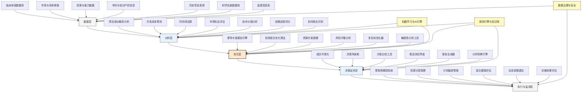

---
{"dg-publish":true,"tags":["AI财务应用","研发投资","投资组合","药物研发","风险管理"],"创建日期":"2024-04-29","permalink":"/知识共享/001_财务/99_其他/AI与财务应用/06_行业智能财务应用/6.4 医疗与生命科学/6.4 研发投资组合优化/","dgPassFrontmatter":true}
---

## 技术概述

研发投资组合优化系统是专为生物制药、医疗设备等生命科学企业设计的AI驱动决策支持平台，旨在解决复杂的研发资源分配问题。该系统运用先进的机器学习算法、蒙特卡洛模拟和投资组合理论，实现研发项目价值的客观量化与动态优化，帮助企业在高度不确定的医疗研发环境中，平衡创新突破与财务收益的双重目标。系统能够评估每个候选药物或医疗技术的成功概率、开发成本、市场潜力和战略价值，构建风险分散且预期回报最大化的研发组合，为企业提供科学化的投资决策支持，实现有限研发资源的最优配置，同时提供持续监测和动态调整能力，适应研发进程中的新发现与市场变化。

### 核心技术组件

- **多维价值评估引擎**：整合临床、商业和战略维度，全面评估研发项目价值
- **概率成功建模**：基于历史数据和类似项目表现，预测各研发阶段通过概率
- **资源约束优化器**：考虑资金、人才和设施限制，生成可行的资源分配方案
- **风险平衡分析仪**：评估投资组合的风险分布与多样性，防止风险过度集中
- **情景模拟系统**：使用蒙特卡洛方法生成成千上万种可能的未来情景并评估结果
- **价值链模型**：考虑价值创造全链条，包括临床价值、市场准入和商业化潜力
- **协同效应计算器**：识别并量化研发项目间的技术、市场和资源协同效应
- **里程碑追踪系统**：持续监测研发进度，实时评估项目价值变化与组合调整需求

### 与传统研发投资管理对比

| 维度 | 传统研发投资管理 | 智能研发投资组合优化系统 |
|------|--------------|-------------------|
| 决策基础 | 主要依赖领域专家直觉和经验 | 结合专家判断与数据驱动分析 |
| 价值评估 | 静态NPV计算，忽略不确定性 | 动态概率模型，考虑多种情景 |
| 风险分析 | 简单风险分类与描述 | 精确量化与多维度风险建模 |
| 资源分配 | 分散决策，缺乏整体最优视角 | 全局优化，考虑所有可能组合 |
| 组合视角 | 项目独立评估，较少考虑协同 | 组合层面全面评估，考虑项目间关系 |
| 决策频率 | 年度或半年度大型审查会议 | 持续监测与动态调整机制 |
| 情景适应 | 有限的"是/否"情景 | 全面的多变量情景模拟 |
| 战略对齐 | 主观映射到战略目标 | 定量战略目标映射与平衡优化 |

## 系统架构

## 实施方案

### 技术实施路线图

1. **基础数据整合阶段**（3-4个月）
   - 建立研发项目数据结构与标准
   - 收集和整合历史项目表现数据
   - 开发初步成功概率预测模型
   - 构建基础研发成本估算框架

2. **核心建模能力构建阶段**（4-6个月）
   - 开发多维价值评估引擎
   - 构建资源约束优化算法
   - 实现蒙特卡洛模拟引擎
   - 开发风险平衡分析功能

3. **决策界面与组合管理阶段**（3-4个月）
   - 设计组合可视化与分析界面
   - 开发情景测试与比较工具
   - 实现投资组合优化推荐功能
   - 构建报告与洞察生成系统

4. **监测与动态优化阶段**（4-5个月）
   - 实现里程碑追踪与警报系统
   - 开发动态调整建议功能
   - 构建组合健康评估仪表盘
   - 实现学习反馈与模型优化机制

### 技术依赖与资源需求

- **硬件资源**：高性能计算集群、数据存储系统、安全服务器架构
- **软件平台**：统计分析环境、机器学习框架、优化算法库、可视化工具套件
- **数据需求**：历史研发项目数据、行业成功率数据、成本参数库、市场预测数据
- **技术人才**：医药研发专家、数据科学家、运筹学专家、财务分析师、软件工程师

### 潜在挑战与应对策略

| 挑战 | 应对策略 |
|------|---------|
| 研发数据分散且不标准 | 开发研发数据整合框架，建立标准数据字典，实施ETL流程确保数据一致性 |
| 预测模型精度限制 | 结合领域专家判断与机器学习，实施集成学习方法，采用持续校准机制 |
| 项目价值量化困难 | 开发多维价值评估框架，包含临床、商业和战略维度，采用敏感性分析应对不确定性 |
| 组织变革阻力 | 采用渐进式实施策略，早期纳入关键决策者，提供透明解释和培训，突出价值证明 |
| 协同效应捕获挑战 | 建立结构化协同识别方法，开发量化评估工具，结合历史案例验证与专家审核 |
| 决策责任与信任问题 | 定位系统为决策支持而非替代，保持人为判断的核心地位，提供完整分析逻辑和假设 |

## 价值创造

### 量化效益评估

- **投资回报率提升**：优化研发组合预期可提高整体ROI 15-30%
- **成功率增加**：通过更精准项目选择，后期研发阶段成功率提高10-20%
- **资源利用效率**：减少资源错配，提高核心资源利用效率12-25%
- **开发周期加速**：优化资源分配，减少关键项目开发时间5-15%
- **战略对齐改善**：提高研发组合与企业战略的一致性20-35%
- **风险平衡优化**：降低高风险项目集中带来的整体投资组合风险15-30%
- **决策质量与速度**：减少决策时间30-50%，同时提高决策质量
- **组织敏捷性提升**：对市场变化与技术突破的响应速度提高25-40%

### ROI与成本效益分析

| 投资领域 | 投资规模估算 | 预期回报周期 | 投资回报率 |
|---------|------------|------------|---------|
| 数据整合与分析基础设施 | 300-600万元 | 10-16个月 | 350-500% |
| 模型开发与优化引擎 | 400-800万元 | 12-18个月 | 400-600% |
| 决策界面与用户工具 | 200-400万元 | 8-12个月 | 300-450% |
| 监测与动态调整系统 | 250-500万元 | 10-14个月 | 300-500% |
| 组织变革与培训 | 150-300万元 | 6-12个月 | 200-350% |
| 全系统实施 | 1300-2600万元 | 18-30个月 | 350-550% |

*注：ROI基于中型生物制药公司估算，实际结果可能因公司规模、研发规模和现有系统成熟度而异*

### 竞争优势与创新价值

- **资源最优配置**：确保资源投向最具价值的研发项目
- **风险科学管控**：建立全面风险评估与分散机制
- **投资灵活性提升**：增强研发组合对市场变化的适应能力
- **客观决策基础**：减少决策偏差，提供数据支持的客观依据
- **战略一致性保障**：确保研发投资与公司长期战略目标一致
- **早期预警能力**：及时识别问题项目，快速调整资源分配
- **组织协同增强**：跨部门围绕共同的项目评估框架协作
- **知识资本积累**：通过持续学习，积累研发决策智慧与知识

## 未来演进

### 技术迭代路线图

1. **近期（1-2年）**
   - 扩展早期研发项目评估能力
   - 增强外部合作项目评估功能
   - 整合专利分析与知识产权价值评估
   - 开发内部与外部项目比较框架

2. **中期（2-3年）**
   - 实现跨治疗领域组合优化
   - 开发技术平台价值预测能力
   - 构建研发与商业化协同决策框架
   - 实现合作与许可决策支持

3. **远期（3-5年）**
   - 建立自适应学习型预测系统
   - 发展跨企业研发生态系统优化
   - 实现全球研发资源动态配置
   - 构建研发数字孪生模拟环境

### 与未来技术趋势结合点

- **精准医学经济学**：整合基因组学数据预测治疗靶点价值
- **量子计算优化**：应用量子算法解决复杂的组合优化问题
- **研发数字孪生**：创建虚拟研发环境进行高级模拟与测试
- **区块链项目跟踪**：实现多方合作项目的透明化跟踪
- **脑机协同决策**：增强人类专家与AI系统的协同决策能力

### 扩展应用场景

- **学术研究优先级设定**：支持研究型医院和学术机构的资源分配
- **临床试验站点优化**：预测并优化临床试验站点的选择与资源分配
- **技术转让评估**：评估外部技术的引入价值与适当估值
- **初创公司投资决策**：支持医疗科技风投的投资组合构建
- **监管路径优化**：评估并优化不同监管策略与路径的价值

## 实验验证

### 概念验证(POC)方案

1. **范围界定**：
   - 选择1-2个治疗领域的研发项目子集
   - 聚焦特定研发阶段(如临床II期或III期项目)
   - 确定3-5个关键决策指标进行验证

2. **技术架构简化**：
   - 开发核心价值评估与优化模块
   - 使用历史项目数据训练初始预测模型
   - 实现基础可视化与情景测试功能

3. **实施步骤**：
   - 第1-4周：数据准备与基础模型开发
   - 第5-8周：价值评估引擎与优化器构建
   - 第9-12周：用户界面开发与专家验证
   - 第13-16周：组合优化测试与结果比较

### 评估指标设计

| 类别 | 指标 | 目标值 |
|------|------|-------|
| 预测能力 | 项目成功率预测准确度 | 较专家判断提高15-25% |
| | 开发成本预测偏差 | 减少至<15% |
| | 市场预测与实际偏差 | 减少至<20% |
| 优化效果 | 组合期望值提升 | 增加10-20% |
| | 风险分散度改善 | 提高15-30% |
| | 资源利用效率 | 提高12-25% |
| 用户接受度 | 决策者采纳率 | >65%推荐被考虑 |
| | 用户信任度评分 | >75分(满分100) |
| | 决策效率提升 | 减少30-50%决策时间 |

### 循证迭代策略

1. **测试方法**：
   - 回测历史决策与模型推荐的对比
   - 模拟决策场景评估
   - 专家组与系统推荐对比

2. **数据收集机制**：
   - 系统推荐与实际决策记录
   - 决策者反馈与评价
   - 项目实际表现追踪

3. **迭代优化流程**：
   - 每月预测模型准确度评估
   - 每季度算法与评估方法优化
   - 半年进行一次全面功能与界面更新

4. **成功验收标准**：
   - 技术验证：预测准确度显著优于基准方法
   - 业务验证：提供明确可量化的组合价值提升
   - 用户验证：决策者认可并愿意在实际决策中参考系统建议 