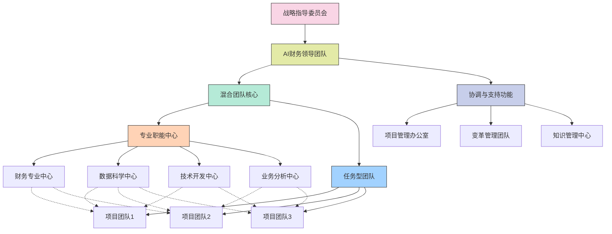
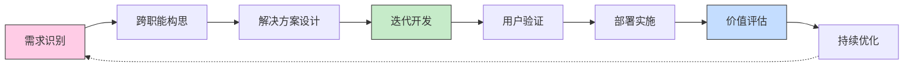
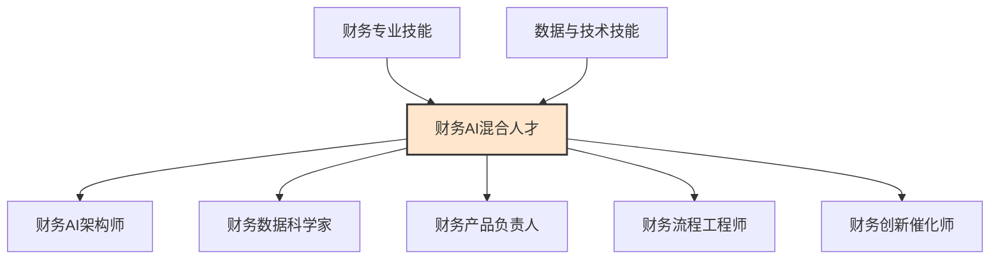

---
{"dg-publish":true,"tags":["AI财务应用","团队设计","组织结构","人才策略","协作模式"],"创建日期":"2024-04-29","permalink":"/知识共享/001_财务/99_其他/AI与财务应用/07_实施与转型策略/7.1 组织转型路径/7.1 混合团队组织设计/","dgPassFrontmatter":true}
---

## 设计概述

混合团队组织设计是一种创新的组织结构模型，专为AI财务转型背景下的人才整合和协作而设计。该模型打破传统部门边界，将财务专业人员、数据科学家、IT专家和业务分析师融合为有机整体，形成具有多学科背景、相互协作的高效团队。通过创新的角色定义、协作机制和工作流程设计，混合团队能够充分发挥各类人才的互补优势，加速AI财务解决方案的开发与应用，同时促进知识交流与技能提升。这种组织模式不仅适应了AI时代对复合型人才的需求，也为财务职能的创新转型提供了组织基础，平衡了专业深度与跨领域协作，提升了组织的创新能力和响应速度。

### 核心设计原则

1. **能力互补**：整合不同学科和专业背景的人才，形成互补能力组合，覆盖从业务理解到技术实施的全链条。

2. **敏捷响应**：采用扁平化结构和敏捷工作方法，提高决策速度和执行效率，快速响应业务需求变化。

3. **知识融合**：促进不同专业领域间的知识交流和融合，创造跨领域创新机会，培养T型和π型人才。

4. **目标一致**：建立统一的目标和价值衡量体系，确保团队成员尽管专业背景不同，但朝着共同目标协同工作。

5. **连续学习**：将学习和发展融入工作流程，建立持续学习机制，使团队能够不断适应技术和业务环境的变化。

6. **灵活扩展**：设计可扩展的团队结构和资源调配机制，能够根据需求和优先级灵活调整规模和组合。

7. **平衡专精与广度**：在保持专业深度的同时，鼓励跨领域能力发展，平衡专业精深与知识广度。

## 组织结构模型

### 混合团队基本架构

混合团队的组织结构采用"核心-卫星"模式，包含以下关键组成部分：

1. **核心团队**
   - 永久性跨职能团队，专注于AI财务战略、架构和关键能力建设
   - 包含高级财务领导、数据科学主管、技术架构师、产品负责人等关键角色
   - 负责整体方向、标准制定、资源分配和成果管理

2. **专业职能中心**
   - 按专业领域划分的卓越中心，如财务分析中心、数据科学中心、技术开发中心等
   - 提供专业知识、技能培训和方法论支持
   - 负责人才发展和专业标准维护

3. **任务型团队**
   - 围绕特定项目或业务挑战组建的临时性跨职能团队
   - 从各专业职能中心抽调人才，按需组合
   - 采用敏捷方法论，聚焦特定成果交付

4. **协调与支持功能**
   - 包括项目管理办公室、变革管理团队、知识管理中心等
   - 提供协调、流程支持和变革推动
   - 确保混合团队的高效运作和组织整合

### 组织结构图

### 关键角色定义

**1. 财务AI解决方案架构师**
- **职责**：设计AI财务解决方案整体架构，确保技术与业务需求的契合
- **背景**：财务领域知识 + 技术架构设计能力
- **关键技能**：战略思维、系统设计、跨领域整合、商业敏锐度

**2. 财务数据科学家**
- **职责**：将数据科学方法应用于财务问题，开发预测模型和分析算法
- **背景**：数据科学/统计学 + 财务业务理解
- **关键技能**：高级分析、机器学习、财务指标建模、数据可视化

**3. 财务流程工程师**
- **职责**：重新设计财务流程以整合AI能力，优化端到端流程
- **背景**：流程管理/运营 + 财务专业知识
- **关键技能**：流程分析、自动化设计、变革管理、系统思维

**4. 财务产品负责人**
- **职责**：定义AI财务产品需求，管理开发路线图，确保用户价值
- **背景**：财务业务 + 产品管理经验
- **关键技能**：需求分析、用户体验设计、价值优先级排序、敏捷方法

**5. 财务技术翻译员**
- **职责**：在业务和技术团队之间架起沟通桥梁，转译需求和解决方案
- **背景**：跨领域知识，技术和业务双精通
- **关键技能**：沟通技巧、教学能力、简化复杂概念、双向思维

**6. 财务创新催化师**
- **职责**：促进创新思维，推动跨界创新和新解决方案开发
- **背景**：创新管理/设计思维 + 财务洞察
- **关键技能**：创造性思维、实验设计、变革推动、趋势洞察

## 运作机制

### 三级运作模式

混合团队采用三级运作模式，确保战略方向、专业深度和快速交付的平衡：

**1. 战略层级 - 季度运作**
- **参与者**：核心团队、高级利益相关者、战略合作伙伴
- **关注点**：战略方向、投资决策、大规模举措、价值评估
- **关键活动**：
  - 季度战略检视和调整
  - 投资组合评审和资源分配
  - 价值实现评估
  - 能力差距和发展规划

**2. 管理层级 - 月度运作**
- **参与者**：职能中心负责人、项目负责人、关键业务代表
- **关注点**：跨项目协调、资源优化、障碍消除、能力建设
- **关键活动**：
  - 月度绩效和进度审查
  - 跨团队协调和资源调整
  - 最佳实践共享和标准化
  - 风险和问题管理

**3. 执行层级 - 每周/每日运作**
- **参与者**：任务型团队成员、专业支持人员
- **关注点**：具体交付、技术实施、迭代改进、用户反馈
- **关键活动**：
  - 敏捷冲刺和站会
  - 用户反馈收集和整合
  - 迭代开发和持续交付
  - 技术和业务挑战解决

### 协作流程与工具

**1. 协作工作流**

**2. 决策机制**
- **分层决策模型**：明确不同层级的决策权限和范围
- **数据驱动决策**：基于统一的数据和分析进行决策
- **专业共识机制**：整合多学科视角达成平衡决策
- **快速上报通道**：针对跨领域复杂问题的快速决策机制

**3. 协作工具与平台**
- **项目管理工具**：敏捷开发管理工具、看板系统
- **知识共享平台**：内部知识库、经验分享系统
- **协作开发环境**：代码库、开发协作工具、测试环境
- **沟通平台**：即时通讯、视频会议、文档协作工具
- **价值跟踪系统**：绩效指标仪表盘、成果展示平台

### 资源分配机制

**1. 人才资源池**
- 建立跨技能的人才资源池
- 动态技能地图和能力映射
- 基于项目需求的资源需求规划
- 灵活调配和优先级管理

**2. 需求与资源匹配**
- 标准化的资源请求流程
- 基于能力和可用性的匹配算法
- 资源分配委员会审批机制
- 资源冲突解决协议

**3. 共享服务支持**
- 核心专业能力作为共享服务
- 服务级别协议(SLA)定义
- 自助服务与专家支持结合
- 基于使用的资源计费模型

## 绩效与激励

### 团队绩效框架

**1. 多维度绩效指标**

| 维度 | 指标类别 | 示例指标 |
|------|----------|----------|
| **价值创造** | 财务价值 | • ROI和成本节约 • 收入增加 • 效率提升的经济价值 |
| | 业务价值 | • 决策质量提升 • 洞察驱动的业务改进 • 用户满意度 |
| **交付能力** | 速度 | • 需求到实施的周期时间 • 迭代频率 • 解决问题的响应时间 |
| | 质量 | • 缺陷率 • 用户采纳度 • 解决方案可靠性 |
| **能力建设** | 技术能力 | • 新技术应用深度 • 技术成熟度提升 • 平台能力扩展 |
| | 人才发展 | • 技能提升度 • 知识分享活跃度 • 跨职能能力发展 |
| **创新能力** | 过程创新 | • 新方法应用 • 流程优化 • 工作方式改进 |
| | 解决方案创新 | • 新创意实施数量 • 创新解决方案价值 • 知识产权创造 |

**2. 平衡计分卡方法**
- 平衡短期与长期绩效
- 平衡交付价值与能力建设
- 平衡团队与个人贡献
- 平衡财务与非财务指标

**3. 持续反馈机制**
- 实时绩效可视化
- 定期进展检视
- 360度反馈
- 顾客/用户反馈整合

### 激励与认可

**1. 团队激励机制**
- 基于团队整体成果的奖励
- 里程碑和成就庆祝
- 共享价值创造收益
- 团队能力提升投资

**2. 个人发展路径**
- 定制化职业发展路线图
- 跨职能轮岗机会
- 专业认证和学习资源
- 创新项目自主权

**3. 非物质激励**
- 公开认可和能见度
- 创新授权和自主性
- 知识分享和教学机会
- 高影响力项目参与权

## 人才管理策略

### 人才获取与发展

**1. 人才来源策略**
- 内部人才识别与转型
- 外部专业人才引进
- 战略合作伙伴资源
- 组织并购与整合

**2. 技能地图与发展规划**

**3. 学习与发展模式**
- 70-20-10学习模型
  - 70%：在岗实践与项目挑战
  - 20%：社交学习与指导
  - 10%：正式培训与课程
- 多形式学习途径
  - 内部大师班和工作坊
  - 在线学习平台
  - 实战项目与跨职能轮岗
  - 外部认证与专业培训

### 文化建设与变革管理

**1. 混合团队文化特征**
- **创新思维**：鼓励实验、接受失败、快速学习
- **协作精神**：跨界尊重、开放交流、共同解决问题
- **成果导向**：聚焦价值创造、优先用户需求、数据驱动决策
- **持续学习**：好奇心、知识分享、跨领域学习
- **敏捷响应**：适应变化、迭代进步、速度与灵活性

**2. 文化转型策略**
- 领导层言行示范
- 文化大使计划
- 强化期望行为的认可机制
- 故事讲述与成功案例宣传
- 工作环境与空间设计

**3. 变革管理方法**
- ADKAR变革管理框架应用
  - 意识(Awareness)：为何需要混合团队
  - 欲望(Desire)：个人激励与利益
  - 知识(Knowledge)：新工作方式所需技能
  - 能力(Ability)：实际应用技能的支持
  - 强化(Reinforcement)：保持变革的机制
- 变革沟通计划
- 抗拒管理策略
- 变革支持网络

## 混合团队模式案例

### 金融服务业案例：全球银行AI财务团队

**背景**：全球大型银行需要加速财务智能化转型，提升数据分析和决策支持能力。

**组织结构**：
- **核心团队**：财务转型负责人、数据科学主管、财务业务架构师和技术架构师
- **专业中心**：财务控制、财务规划、技术开发、数据科学和用户体验设计
- **项目团队**：围绕智能预算规划、实时报告、自动异常检测等具体解决方案

**成功因素**：
- 明确的AI财务转型愿景和路线图
- CFO和CIO联合领导的强大支持
- 混合团队的共同绩效目标和激励
- 专业轮岗和技能发展计划
- 敏捷工作方法和小团队自主权

**价值实现**：
- 财务分析时间减少60%
- 预测准确度提升35%
- 风险识别提前30天
- 10种创新财务应用解决方案
- 财务团队技术能力大幅提升

### 制造业案例：工业企业财务智能化团队

**背景**：大型制造企业需要实现财务与运营数据的深度整合，支持智能决策和成本优化。

**组织结构**：
- **混合核心团队**：财务主管、运营分析负责人、数据工程负责人和AI解决方案架构师
- **能力中心**：成本分析、供应链财务、预测分析和数据可视化
- **敏捷开发小组**：产品成本优化、供应链财务预警、投资优化等

**运作机制**：
- 每日立会确保协调
- 两周一次交付节奏
- 月度价值评估和方向调整
- 季度能力投资和发展计划

**实现价值**：
- 供应链成本降低12%
- 现金流预测准确度提高40%
- 资本支出ROI提升25%
- 建立了可持续的内部AI财务能力

## 实施指南

### 分阶段实施策略

**1. 阶段一：基础构建（3-6个月）**
- 确立愿景和设计原则
- 选择1-2个试点领域
- 组建初始核心团队
- 建立基本协作机制
- 开发初步技能培训
- 实施快速价值项目

**2. 阶段二：扩展发展（6-12个月）**
- 基于试点经验调整模型
- 扩大混合团队覆盖范围
- 建立专业职能中心
- 完善绩效评估框架
- 深化学习和发展计划
- 扩展技术支持平台

**3. 阶段三：成熟优化（12-18个月）**
- 标准化混合团队运作模式
- 建立人才培养和流动机制
- 优化资源分配和共享
- 建立创新激励计划
- 发展社区和知识网络
- 持续文化强化和调整

### 成功因素与应对挑战

**关键成功因素**：
1. 高层领导的明确支持和参与
2. 清晰的价值创造焦点和衡量机制
3. 平衡长期能力建设与短期价值实现
4. 持续的专业发展和技能提升投资
5. 敏捷且适应性强的工作方法和流程

**常见挑战及应对策略**：

| 挑战 | 应对策略 |
|------|---------|
| **专业隔阂与沟通障碍** | • 混合团队建设工作坊 • 共同语言和术语表建立 • 翻译角色设立 • 日常协作工具选择 |
| **技能差距与学习曲线** | • 分层次的技能发展计划 • 导师和辅导计划 • 实战项目学习 • 微型学习和知识碎片 |
| **角色与责任模糊** | • 清晰的RACI矩阵 • 定期角色澄清会议 • 项目章程和团队协议 • 反馈和冲突解决机制 |
| **资源竞争与优先级冲突** | • 透明的资源分配流程 • 战略一致性评估 • 价值驱动优先级排序 • 跨职能容量规划 |
| **绩效评估复杂性** | • 平衡个人与团队指标 • 多维度绩效框架 • 360度反馈机制 • 成果与行为双重评估 |

### 实施工具包

**1. 混合团队设计工具**
- 角色与职责模板
- 技能矩阵评估工具
- 团队结构设计画布
- 协作模式选择器

**2. 团队启动与运作工具**
- 混合团队启动手册
- 协作协议模板
- 决策矩阵模型
- 冲突解决框架

**3. 评估与优化工具**
- 团队成熟度评估
- 协作效能测量
- 资源利用分析
- 文化健康检查

## 未来展望

### 演进趋势

**1. 超级团队模式**：人类与AI系统作为团队成员共同工作，AI不仅作为工具，而是作为团队协作者。

**2. 流动性组织结构**：更灵活的"液态"组织形式，随项目和挑战快速重组，无固定边界。

**3. 生态系统整合**：混合团队扩展到组织外部，包括合作伙伴、供应商、客户和外部专家。

**4. 远程混合协作**：地理分布式团队的高效协作模式，结合物理和虚拟协作空间。

**5. 自组织能力**：团队具备更高度的自主权和自组织能力，减少层级和正式结构依赖。

### 未来组织能力

**1. 人机协同能力**：有效协调人类与AI系统的优势，实现互补价值最大化。

**2. 生态系统思维**：超越组织边界的价值创造和资源协调能力。

**3. 持续重塑能力**：快速适应环境变化，持续调整结构和运作方式。

**4. 技术赋能协作**：利用新兴技术促进更深层次的知识共享和远程协作。

**5. 动态角色流动**：基于需求和能力的动态角色分配，而非固定职位。

### 准备行动建议

1. **投资人才跨界能力**：鼓励和支持专业人才跨领域学习和轮岗

2. **试验新型协作模式**：设立创新实验空间，测试不同的混合团队模式

3. **开发协作技术平台**：构建支持未来工作模式的协作与知识管理平台

4. **培养生态系统思维**：发展领导者和团队成员的生态系统视角和协作能力

5. **建立学习与适应机制**：设计持续学习和组织适应的结构化机制 