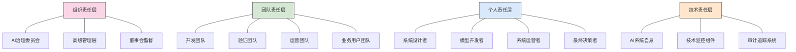
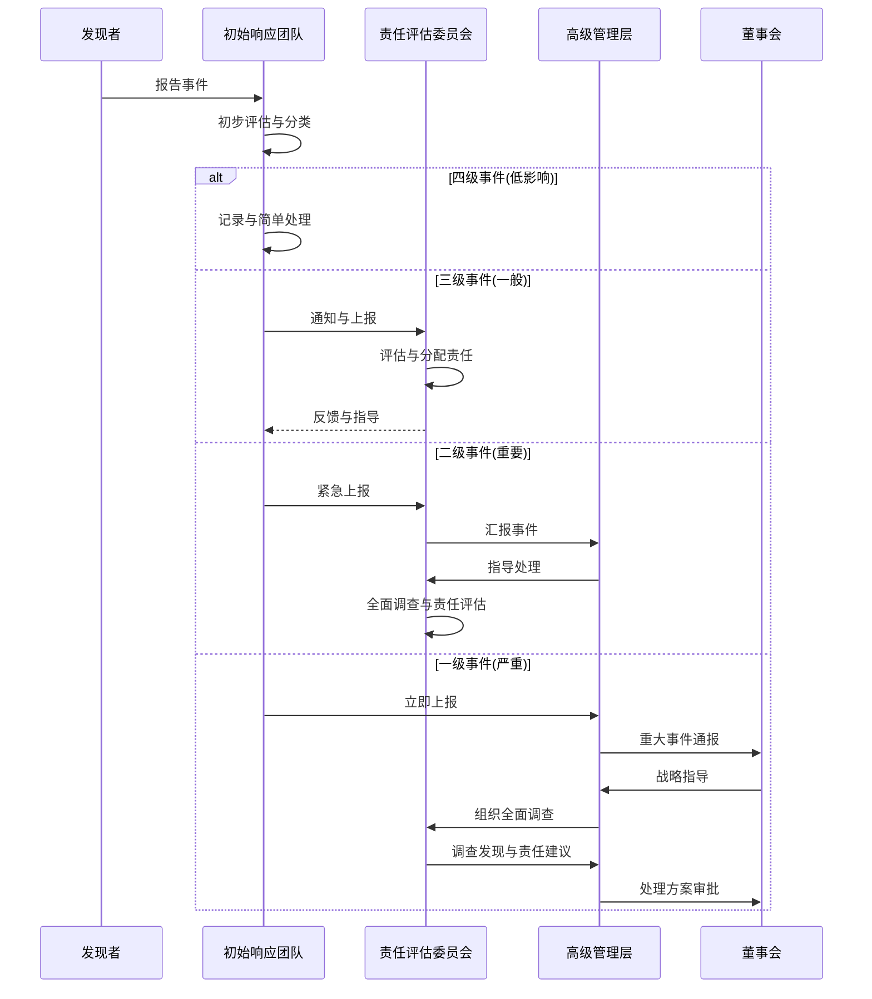

---
{"dg-publish":true,"tags":["AI财务应用","责任机制","问责体系","治理框架","风险管控"],"创建日期":"2024-04-29","permalink":"/知识共享/001_财务/99_其他/AI与财务应用/07_实施与转型策略/7.3 治理与伦理/AI责任机制设计/","dgPassFrontmatter":true}
---

# AI责任机制设计

## 责任机制概念框架

财务AI系统责任机制是确保AI技术在财务领域应用的可控性、可追溯性和问责性的系统性框架。随着AI在财务决策中的影响力日益增强，建立清晰的责任归属、透明的操作流程和有效的问责体系变得尤为重要。本框架旨在定义组织如何分配责任、建立监督机制并处理AI决策的后果，同时平衡创新与风险管控。

### 核心理念

财务AI责任机制建立在以下核心理念基础上：

- **连续责任链**：责任不是孤立的，而是贯穿AI系统全生命周期的连续链条
- **多方责任共担**：从设计者到最终决策者，各相关方共同承担相应责任
- **比例性原则**：责任程度与AI系统潜在影响和自主权相匹配
- **透明与可解释**：责任机制本身应透明且易于理解，不应成为责任推卸的工具
- **动态调整**：责任分配应随AI系统能力和应用场景的演变而调整

### 责任分配模型

## 责任框架设计

### 责任分层与主体定义

#### 组织责任层

**AI治理委员会责任**
- 制定AI责任政策与标准
- 监督责任机制实施情况
- 审议重大AI责任事件
- 定期评估责任机制有效性

**高级管理层责任**
- 确保资源配置支持责任机制
- 建立责任导向的组织文化
- 对重大AI决策承担最终责任
- 定期向董事会报告责任状况

**董事会监督责任**
- 批准AI责任框架与政策
- 确保责任机制符合战略目标
- 监督高管团队履行责任情况
- 向股东与监管机构负责

#### 团队责任层

**开发团队责任**
- 确保AI系统设计符合责任标准
- 进行责任导向的开发实践
- 提供系统限制与能力的透明文档
- 参与系统问题的根本原因分析

**验证团队责任**
- 独立评估系统的责任机制
- 测试异常情况下的责任分配
- 验证可追溯性与审计能力
- 确认责任相关控制的有效性

**运营团队责任**
- 维护系统的责任追踪能力
- 监控系统行为的责任偏差
- 实施责任相关的运营控制
- 记录与报告责任事件

**业务用户团队责任**
- 在授权范围内使用AI系统
- 理解并遵循责任界限
- 及时报告潜在责任问题
- 参与责任事件的调查与解决

#### 个人责任层

**系统设计者责任**
- 设计具备可追溯性的系统架构
- 确保责任考量融入系统设计
- 透明记录设计决策与权衡
- 预见并减轻潜在责任风险

**模型开发者责任**
- 确保模型训练符合伦理标准
- 记录模型假设与限制
- 测试并记录潜在偏见与问题
- 提供模型解释与透明度

**系统运营者责任**
- 在定义的参数范围内操作系统
- 及时响应系统异常与警报
- 维护运营日志与决策记录
- 执行定期责任检查

**最终决策者责任**
- 理解AI建议的局限性
- 在适当情况下质疑或覆盖AI建议
- 记录重大决策理由与过程
- 对最终决策结果负责

#### 技术责任层

**AI系统自身责任**
- 记录决策路径与推理过程
- 标记置信度低的输出
- 提供决策解释
- 在预设边界外拒绝操作

**监控组件责任**
- 持续监控系统行为与输出
- 检测异常模式与偏差
- 触发预设责任警报
- 记录系统性能与合规性

**审计追踪系统责任**
- 维护不可篡改的决策记录
- 支持责任调查与事件追溯
- 提供证据链与责任证明
- 生成责任相关报告

### 责任矩阵与交叉点

#### 生命周期责任矩阵

| 生命周期阶段 | 组织责任 | 团队责任 | 个人责任 | 技术责任 |
|--------------|----------|----------|----------|----------|
| **设计规划** | 设定责任标准 批准责任框架 | 制定责任设计规范 责任风险评估 | 纳入责任设计模式 透明记录决策 | 责任属性设计 透明度规划 |
| **开发实施** | 资源分配 阶段性审查 | 责任控制实施 团队协作责任 | 代码审查责任 文档责任 | 可追溯性构建 审计功能实现 |
| **测试验证** | 验证标准批准 合规确认 | 责任测试执行 验证报告审查 | 测试场景设计 问题修复责任 | 责任测试自动化 边界测试 |
| **部署运营** | 部署授权 责任机制监督 | 运营责任控制 事件响应管理 | 操作责任履行 异常报告责任 | 实时监控 责任追踪记录 |
| **评估优化** | 责任审查 改进决策 | 责任分析 最佳实践共享 | 持续学习 改进建议责任 | 责任数据分析 改进反馈 |

#### 决策责任分布

**责任分配因子**

下表展示了在不同场景下，各方责任权重的大致分布（总计100%）：

| 决策场景 | AI治理委员会 | 业务管理层 | 模型开发者 | 系统运营者 | 最终用户 | AI系统 |
|----------|:------------:|:----------:|:----------:|:----------:|:--------:|:------:|
| **全自动决策** | 15% | 20% | 25% | 15% | 5% | 20% |
| **AI建议人决策** | 10% | 15% | 20% | 10% | 35% | 10% |
| **人类监督下的AI** | 10% | 20% | 15% | 25% | 20% | 10% |
| **人类决策AI辅助** | 5% | 25% | 10% | 10% | 45% | 5% |
| **紧急干预场景** | 5% | 30% | 5% | 25% | 30% | 5% |

*注：此分布为指导性框架，应根据具体组织和应用调整*

**决策权限与责任匹配**

| 角色 | 可做出决策类型 | 对应责任范围 | 责任限制条件 |
|------|----------------|--------------|--------------|
| **AI系统** | 预定义范围内的自动化决策 数据处理与分析决策 预警与异常检测 | 决策过程与结果的一致性 数据处理的准确性 异常检测的可靠性 | 不超出设计参数范围 提供足够决策解释 已通过验证测试 |
| **系统运营者** | 运行参数调整决策 异常情况下的干预 系统暂停与重启 | 操作合规性与及时性 干预决策的合理性 系统维护的适当性 | 在授权范围内行动 遵循运营规程 及时报告重大决策 |
| **业务用户** | 基于AI建议的最终决策 覆盖AI建议的决策 决策边界的定义 | 最终决策的业务结果 覆盖决策的合理性 使用方式的适当性 | 接受过充分培训 记录重大决策理由 符合授权级别 |
| **管理层** | 系统应用范围决策 责任政策制定 重大事件响应决策 | 系统使用的战略导向 责任政策的适当性 事件处理的有效性 | 基于充分信息决策 遵循治理框架 向董事会报告 |

## 责任追踪与透明度

### 决策追踪系统

#### 关键追踪点设计

**必要追踪元素**
- 决策标识符与时间戳
- 决策参与者识别
- 输入数据与来源
- 应用的模型与版本
- 决策路径与关键节点
- 最终结果与执行动作

**追踪级别定义**

| 追踪级别 | 应用场景 | 记录详细度 | 保留期限 |
|----------|----------|------------|----------|
| **基础追踪** | 低风险常规决策 | 决策摘要、结果、主要参与者 | 1-2年 |
| **标准追踪** | 中等风险/金额决策 | 详细决策路径、完整参数、所有参与者 | 3-5年 |
| **强化追踪** | 高风险/监管敏感决策 | 完整决策过程、中间状态、系统环境、完整数据链 | 7-10年或永久 |

**不可篡改记录技术**
- 数字签名与时间戳认证
- 区块链或分布式账本技术
- 写一次读多次(WORM)存储
- 密封审计日志与访问控制

#### 事件重建能力

**责任事件重建流程**
1. 事件识别与范围定义
2. 追踪数据收集与验证
3. 决策路径重构与分析
4. 参与者角色与贡献确认
5. 责任分配评估
6. 报告生成与共享

**重建工具与方法**
- 事件重建可视化引擎
- 决策树回溯分析
- 时间线构建与关联分析
- 假设情景测试与比较

### 透明度设计

#### 分层透明度框架

**内部透明度层**
- 目标受众：组织内部利益相关者
- 透明内容：完整决策过程、技术细节、完整责任分配
- 实现机制：详细仪表盘、技术文档、内部报告

**监管透明度层**
- 目标受众：监管机构与审计人员
- 透明内容：合规证据、风险控制、责任分配证明
- 实现机制：监管报告、审计接口、合规证明

**客户透明度层**
- 目标受众：服务客户与直接影响方
- 透明内容：决策解释、影响因素、申诉渠道
- 实现机制：客户通知、解释界面、决策报告

**公众透明度层**
- 目标受众：公众与间接利益相关者
- 透明内容：系统总体原则、责任框架概述、影响摘要
- 实现机制：公开文档、影响报告、责任声明

#### 透明度工具与接口

**决策解释引擎**
- 技术设计：多层次解释生成系统
- 关键功能：自动生成不同受众的解释内容
- 实现方式：自然语言生成、可视化解释、反事实分析

**责任追踪界面**
- 技术设计：基于角色的追踪数据访问系统
- 关键功能：责任事件查询、责任链可视化、证据访问
- 实现方式：交互式仪表盘、责任地图、证据仓库

**透明度合规检查器**
- 技术设计：基于规则的透明度评估系统
- 关键功能：评估透明度符合程度、识别透明度缺口
- 实现方式：合规检查列表、透明度评分、改进建议

## 问责与纠正机制

### 责任评估框架

#### 事件分类与响应

**责任事件分类**

| 事件级别 | 定义 | 示例 | 响应级别 |
|----------|------|------|----------|
| **一级（严重）** | 导致重大财务损失或严重监管后果的AI决策失误 | 系统性交易错误 重大合规违规 大规模数据泄露 | 高管直接参与 全面调查 监管报告 公开披露 |
| **二级（重要）** | 造成显著业务影响但可控的AI系统问题 | 模型性能显著下降 系统偏差导致不公平 控制失效事件 | 部门级响应 详细调查 内部报告 选择性披露 |
| **三级（一般）** | 轻微影响日常运营的系统异常 | 局部性能波动 个别决策异常 轻微流程偏差 | 团队级响应 基本调查 事件记录 内部通报 |
| **四级（低影响）** | 无实质负面影响的潜在问题 | 边缘案例处理偏差 文档不完整 次要系统警告 | 责任人跟进 简要分析 改进记录 |

**响应流程设计**

#### 责任评估方法

**评估维度**
- 预见可能性：问题是否可以合理预见
- 预防措施：是否采取了适当的预防措施
- 响应适当性：事件发生后的响应是否及时适当
- 透明度水平：相关信息是否得到适当披露
- 主观认知：相关方是否了解风险并尽职尽责

**责任程度评估矩阵**

| 责任因素 | 轻微责任 | 一般责任 | 重大责任 | 关键责任 |
|----------|----------|----------|----------|----------|
| **预见可能性** | 几乎不可预见 | 理论上可预见但罕见 | 可预见但不明显 | 明显可预见 |
| **控制能力** | 几乎无法控制 | 有限控制能力 | 可控但困难 | 完全可控 |
| **行动适当性** | 采取了最佳可能行动 | 行动合理但不够完善 | 行动存在明显不足 | 未采取必要行动 |
| **专业标准** | 超过专业标准 | 符合专业标准 | 低于专业标准 | 严重违反标准 |
| **结果影响** | 最小或无影响 | 有限负面影响 | 显著负面影响 | 严重损害 |

**评估流程**
1. 初步事实收集与文档化
2. 相关责任主体识别
3. 责任因素评估与打分
4. 责任程度综合判定
5. 评估报告编制与审查
6. 责任结论沟通与确认

### 纠正与改进机制

#### 责任后果框架

**后果类型与适用情况**

| 后果类型 | 适用场景 | 实施方式 | 目标影响 |
|----------|----------|----------|----------|
| **系统调整** | 技术设计或实施缺陷 模型性能问题 控制机制不足 | 系统修复与升级 控制加强 架构调整 | 防止类似问题重复 加强系统稳健性 提高安全性 |
| **流程改进** | 操作流程缺陷 决策过程问题 责任链条断裂 | 流程重新设计 检查点增强 权限调整 | 消除流程漏洞 提高操作效率 加强责任连续性 |
| **组织调整** | 结构性责任缺失 资源配置不当 监督机制不足 | 组织结构调整 团队重组 责任重新分配 | 明确责任界限 优化监督效果 提高组织效能 |
| **个人措施** | 个人责任失误 专业能力不足 故意不当行为 | 培训与指导 角色调整 绩效管理措施 | 提高个人能力 调整至适当岗位 建立正确激励 |
| **对外措施** | 外部影响事件 客户或公众受损 监管关注事件 | 公开沟通与澄清 补偿措施 合规改进 | 恢复信任 减轻损害 满足监管期望 |

**后果实施指导原则**
- 比例原则：后果应与责任程度和影响严重性相匹配
- 公平一致：相似情况下应采取一致的措施
- 建设性导向：优先考虑改进和预防而非惩罚
- 透明实施：后果决定过程和理由应透明记录
- 申诉机会：提供合理的申诉和复核渠道

#### 持续学习与改进

**经验教训捕获**
- 结构化事后分析方法
- 无责备学习文化建设
- 跨案例模式识别
- 系统性问题根本原因分析

**改进实施与跟踪**
- 责任改进行动计划制定
- 实施责任分配与时间表
- 改进成效评估指标
- 长期跟踪与成熟度评估

**系统性反馈循环**
- 将责任事件经验纳入培训
- 更新责任框架与政策
- 调整风险评估与控制
- 优化透明度与报告机制

## 实施与成熟度

### 实施路线图

#### 分阶段实施策略

**第一阶段：基础建立（0-6个月）**
- 建立核心责任政策与标准
- 明确关键角色与责任边界
- 实施基础追踪与记录机制
- 开发初步响应流程

**第二阶段：能力构建（7-12个月）**
- 实施责任追踪系统与工具
- 建立责任评估委员会与流程
- 开发分层透明度机制
- 试点责任案例分析与处理

**第三阶段：整合优化（13-24个月）**
- 将责任机制整合到决策流程
- 优化自动化责任追踪能力
- 实施成熟的评估与后果框架
- 建立持续改进与学习循环

#### 实施依赖与支持因素

**组织支持要素**
- 高层领导明确支持与示范
- 充分的资源与预算分配
- 跨职能协作与共识
- 员工培训与能力建设

**技术支持要素**
- 责任追踪技术基础设施
- 集成到现有系统生态
- 数据管理与保护能力
- 分析与报告工具

**文化支持要素**
- 开放透明的组织文化
- 积极的问题报告氛围
- 学习导向而非指责导向
- 持续改进的价值观

### 成熟度评估

#### 责任成熟度模型

**五级成熟度框架**

| 成熟度级别 | 特征描述 | 指标示例 |
|------------|----------|----------|
| **1级：初始** | 责任实践不一致、被动 责任分配模糊 有限的文档和跟踪 | 基本责任政策存在 主要角色责任定义 简单事件响应能力 |
| **2级：发展** | 责任框架已定义但不完整 基础流程已建立 有限的工具支持 | 责任矩阵已建立 基本追踪机制运行 事件分类标准存在 |
| **3级：标准** | 完整责任框架得到应用 标准流程一致执行 适当工具支持 | 完整追踪系统运行 透明度机制有效 良好的评估与响应 |
| **4级：管理** | 责任实践被主动管理 通过度量持续优化 高度自动化工具 | 预警机制有效 责任指标主动跟踪 高度自动化追踪 |
| **5级：优化** | 责任文化深入人心 持续创新与优化 行业领先实践 | 责任考量融入决策 持续改进循环有效 卓越责任文化 |

**成熟度评估方法**
- 结构化自评问卷与检查表
- 基于证据的独立评估
- 关键指标与基准比较
- 基于场景的测试与演练

#### 长期维护机制

**动态调整策略**
- 定期责任框架审查与更新
- 新技术与场景适应评估
- 监管变化响应机制
- 持续优化与简化方法

**知识管理与传承**
- 责任最佳实践库建设
- 案例研究开发与共享
- 责任专业知识网络
- 培训与认证项目

## 特殊应用场景

### 高风险财务决策责任

#### 信贷与投资决策

**特定责任考虑因素**
- 系统性风险与市场影响
- 长期结果与短期决策分离
- 多层审批与责任共担
- 模型风险与数据质量影响

**适应性责任机制**
- 分级责任评估与授权
- 自动决策与人工覆盖平衡
- 动态责任分配与市场条件
- 强化长期影响评估责任

#### 财务报告与合规

**特定责任考虑因素**
- 法定报告责任边界
- 签署责任与AI辅助
- 审计追踪与证据要求
- 外部验证与保证责任

**适应性责任机制**
- 结构化审签责任链条
- 合规确认点与验证机制
- 外部审计责任接口
- 数据谱系与来源责任

### 跨组织责任协调

#### 合作伙伴生态系统

**责任边界定义**
- 明确组织间责任分界
- 共享数据责任分配
- 联合决策责任模型
- 事件响应协作框架

**跨组织责任工具**
- 组织间责任协议模板
- 责任文档共享标准
- 联合追踪与审计机制
- 统一责任术语与分类

#### 云服务与外包场景

**责任保留与转移**
- 不可转移责任识别
- 服务级别与责任协议
- 持续监督与验证机制
- 退出策略与责任转回

**第三方责任管理**
- 供应商责任评估框架
- 责任尽职调查标准
- 持续责任监控机制
- 责任违约响应计划

## 未来发展趋势

### 技术演进影响

**自主AI与责任界限**
- 随AI自主性增加的责任分配变化
- 自学习系统的责任归属挑战
- 责任链从设计到学习的延伸
- 主动责任承担的AI概念

**新兴技术责任框架**
- 区块链与智能合约责任模型
- 联邦学习中的分布式责任
- 量子计算的不确定性责任考量
- 元宇宙财务应用的虚拟责任

### 监管与社会趋势

**全球责任监管发展**
- 区域监管协调与差异
- 责任认证与标准化趋势
- 算法问责法规演进
- 数字伦理与责任交叉

**利益相关方期望变化**
- 公众透明度期望提升
- 投资者责任考量增强
- 员工责任价值观变化
- 社会许可与责任期望

## 案例研究与最佳实践

### 行业案例分析

#### 金融机构AI责任实践

**案例一：全球银行的AI贷款决策责任框架**

背景：一家全球性银行在实施AI驱动的贷款决策系统时，建立了全面的责任框架，以应对监管审查和公平贷款要求。

主要组成：
- 多层人类监督与审批机制
- 详细的决策追踪与解释系统
- 分层责任分配与定期审查
- 强制性人工介入触发条件

成果：
- 监管合规审查通过率提高30%
- 争议贷款决策减少45%
- 责任问题解决时间缩短60%
- 员工对决策的信心提升

**案例二：资产管理公司的投资AI责任机制**

背景：一家管理超过5000亿资产的投资公司实施了AI辅助投资决策系统，同时建立了严格的责任与风险管理框架。

主要组成：
- 清晰区分AI建议与人类决策
- 情景分析与极端条件责任测试
- 投资委员会与AI团队的责任协调
- 客户透明度与解释机制

成果：
- 大额投资决策责任明确性提升75%
- 异常市场条件下责任链完整性保持
- 客户投诉减少35%
- 监管沟通效率提高40%

### 实施最佳实践

#### 责任设计模式

**分层责任设计模式**
- 将责任嵌入系统架构各层
- 责任传递与转换规则
- 层间责任接口标准化
- 分层责任监控与报告

**弹性责任设计模式**
- 动态责任分配算法
- 上下文感知责任调整
- 异常情况责任切换
- 韧性责任链设计

#### 责任文化构建

**领导责任示范**
- 高管责任宣言与承诺
- 公开责任讨论与沟通
- 责任事件透明处理
- 责任考量融入战略决策

**责任激励机制**
- 将责任表现纳入绩效评估
- 责任积极行为的认可机制
- 责任知识分享的激励
- 跨团队责任协作奖励 