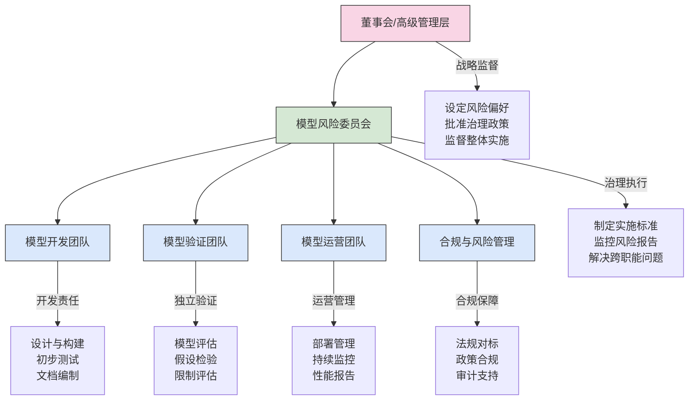

---
{"dg-publish":true,"tags":["AI财务应用","模型治理","风险控制","治理框架","合规管理"],"创建日期":"2024-04-29","permalink":"/知识共享/001_财务/99_其他/AI与财务应用/07_实施与转型策略/7.3 治理与伦理/模型治理与风险管理/","dgPassFrontmatter":true}
---

## 模型治理概念框架

模型治理是确保财务AI模型在其整个生命周期中得到适当开发、部署和监督的系统性方法。有效的模型治理框架平衡了创新与风险管理，建立了明确的职责、流程和控制机制，确保AI模型符合法规要求、组织标准和利益相关方期望。随着财务AI应用的扩大，强健的治理框架成为实现可持续价值同时防范潜在风险的关键。

### 核心原则

#### 风险比例原则
治理强度与模型风险级别成正比，根据模型的业务重要性、复杂性和潜在影响调整控制措施。

#### 问责透明原则
明确定义的角色和责任，确保决策透明并可追溯到特定角色和行动。

#### 持续监控原则
建立持续评估机制，监控模型性能、相关性和合规性，实现早期风险识别。

#### 风险平衡原则
在创新和应用速度与风险控制间取得适当平衡，避免过度限制或控制不足。

#### 持续改进原则
通过反馈循环和经验教训促进治理实践的不断优化和完善。

## 治理架构设计

### 组织结构与职责

#### 多层治理模型

#### 关键角色职责矩阵

| 角色 | 策略制定 | 模型审批 | 开发监督 | 验证审查 | 运营监控 | 合规保障 | 报告审阅 |
|------|:--------:|:--------:|:--------:|:--------:|:--------:|:--------:|:--------:|
| 董事会/高管 | ✓✓ | ✓ |  |  |  |  | ✓ |
| 风险委员会 | ✓ | ✓✓ | ✓ | ✓ | ✓ | ✓ | ✓✓ |
| 模型所有者 |  | ✓ | ✓✓ | ✓ | ✓✓ |  | ✓ |
| 开发团队 |  |  | ✓✓ |  | ✓ |  |  |
| 验证团队 |  | ✓ |  | ✓✓ |  | ✓ | ✓ |
| 运营团队 |  |  |  |  | ✓✓ |  | ✓ |
| 合规团队 | ✓ |  |  | ✓ |  | ✓✓ | ✓ |
| 内部审计 | ✓ |  |  | ✓ |  | ✓ | ✓ |

*注: ✓✓ 表示主要责任，✓ 表示参与责任*

### 政策框架设计

#### 分层政策架构

**顶层治理政策**
- 目的：建立整体治理原则和风险管理方向
- 内容：治理目标、风险偏好声明、高级职责分配、治理范围
- 审批级别：董事会/高级管理层
- 更新频率：年度或重大变化时

**专项标准与程序**
- 目的：为各治理领域提供详细标准和实施指南
- 内容：模型分类标准、验证要求、文档标准、测试规范
- 审批级别：模型风险委员会
- 更新频率：半年度或根据需要

**操作指南与模板**
- 目的：提供日常治理活动的具体指导
- 内容：代码审查清单、测试脚本、文档模板、报告格式
- 审批级别：各职能负责人
- 更新频率：季度或持续优化

#### 关键政策文档清单

1. **模型风险管理总体政策**
   - 风险定义与分类
   - 治理原则与职责
   - 政策维护与例外处理

2. **模型开发标准**
   - 开发方法论规范
   - 代码质量标准
   - 测试与记录要求

3. **模型验证政策**
   - 验证范围与深度标准
   - 独立性要求
   - 结果评估与报告框架

4. **模型监控与维护标准**
   - 持续监控要求
   - 性能阈值与触发条件
   - 维护流程与变更管理

5. **模型文档标准**
   - 必要文档组件
   - 版本控制规范
   - 审批记录要求

## 模型生命周期治理

### 风险分级与控制匹配

#### 模型风险分类框架

**风险评估维度**
- **业务重要性**：模型支持的业务决策价值和范围
- **模型复杂性**：技术复杂度、可解释性和操作难度
- **数据敏感性**：使用的数据类型及其隐私和安全考量
- **使用范围**：影响的决策数量和利益相关者范围
- **法规敏感性**：相关监管要求的严格程度

**分级模型**

| 风险等级 | 定义 | 示例 | 控制强度 |
|----------|------|------|----------|
| **一级（高）** | 影响核心财务决策、高复杂度或高规管敏感度 | 信贷评分模型、资本分配模型、反洗钱预测 | 全面控制，独立验证，频繁审查，高管批准 |
| **二级（中）** | 支持重要业务活动，中等复杂度或规管要求 | 财务预测模型、预算优化、异常检测 | 强化控制，结构化验证，定期审查，部门级批准 |
| **三级（低）** | 辅助决策工具，低复杂度，有限业务影响 | 报告自动化、基本分析工具、简单分类 | 基础控制，简化验证，抽样审查，团队级批准 |

#### 差异化控制矩阵

**按生命周期阶段的控制强度**

| 生命周期阶段 | 一级（高风险） | 二级（中风险） | 三级（低风险） |
|--------------|----------------|----------------|----------------|
| **设计规划** | 正式设计审批 详细需求文档 全面风险评估 | 结构化设计审查 标准需求文档 重点风险评估 | 简化设计检查 基本需求记录 自我风险评估 |
| **开发测试** | 严格代码审查 全面测试套件 独立QA评估 | 部分代码审查 主要测试套件 同行QA检查 | 关键点代码检查 基本功能测试 自我质量确认 |
| **验证部署** | 深入独立验证 全面上线检查 分阶段部署 | 标准独立验证 结构化上线检查 受控部署 | 简化验证程序 基本上线检查 直接部署 |
| **监控维护** | 持续实时监控 月度性能审查 年度全面评估 | 定期样本监控 季度性能审查 年度简化评估 | 被动监控 半年性能检查 需要时评估 |

### 模型开发治理

#### 开发阶段控制点

**初始规划与设计**
- **需求治理**：确保业务需求明确记录并获得利益相关方确认
- **设计审查**：评估模型设计的合理性、复杂性和预期限制
- **数据评估**：审查数据质量、代表性和适用性

**模型开发过程**
- **方法论审查**：确保所选算法和技术方法的适当性
- **代码标准符合**：评估代码质量、可维护性和文档水平
- **特征工程控制**：审查特征选择的合理性和潜在偏见

**测试与初步验证**
- **内部测试标准**：确保测试覆盖关键功能和边缘情况
- **性能基准设定**：建立明确的成功标准和性能指标
- **开发文档审查**：评估技术文档的完整性和准确性

#### 关键文档要求

**模型设计文档标准**
- 模型目标与范围
- 方法选择理由
- 关键假设与限制
- 数据需求与来源
- 预期性能指标

**开发记录要求**
- 版本控制历史
- 关键决策点记录
- 模型迭代与改进
- 测试结果与解释
- 已知问题与解决方案

### 模型验证框架

#### 独立验证原则

**验证独立性要求**
- 组织独立性：验证团队应独立于开发团队
- 资源独立性：专用预算和人员配置
- 方法独立性：使用不同于开发的验证方法
- 报告独立性：直接向风险委员会报告结果

**验证范围设定**
- 基于风险级别确定验证深度和广度
- 明确验证豁免条件和简化流程标准
- 建立验证计划的审批和调整机制

#### 验证方法论

**概念验证**
- 评估模型方法论的科学合理性
- 检查假设的有效性和理论基础
- 分析方法选择的适当性和替代方案

**实施验证**
- 审查代码实现与设计规范的一致性
- 评估计算效率和技术实现质量
- 检查数据处理管道的正确性和完整性

**结果验证**
- 独立测试数据集性能评估
- 与基准模型和替代方法比较
- 敏感性和稳定性分析

**文档验证**
- 确认文档完整性和内容准确性
- 评估文档对模型理解和使用的支持程度
- 检查与文档标准的符合性

#### 验证报告标准

**报告结构规范**
- 执行摘要，包括总体结论和关键发现
- 验证范围与方法描述
- 详细发现与证据
- 风险评估与分类
- 建议措施与时间表

**问题分级系统**
- **严重问题**：影响模型有效性或导致重大风险
- **重要问题**：显著影响模型性能或风险控制
- **次要问题**：需要注意但不影响关键功能或风险水平

**验证结果类别**
- **无条件通过**：满足所有标准，可直接批准
- **有条件通过**：需解决特定问题后批准
- **需要修改**：需要重大修改后重新验证
- **不建议使用**：存在根本性缺陷，不建议部署

### 模型部署与监控

#### 部署治理流程

**部署前准备**
- 完成生产环境准备评估
- 制定回滚计划和应急措施
- 建立部署后监控指标和阈值

**分阶段部署策略**
- 有限用户/场景测试
- 并行运行期（与现有系统比较）
- 渐进式扩展至全面部署

**上线审批流程**
- 基于风险等级的审批权限矩阵
- 部署前检查清单完成确认
- 最终上线授权机制

#### 持续监控框架

**监控维度与频率**

| 监控维度 | 一级模型 | 二级模型 | 三级模型 | 关键指标示例 |
|----------|----------|----------|----------|------------|
| **数据质量** | 实时/每日 | 每周 | 每月 | 缺失率、分布偏移、异常值比例 |
| **模型性能** | 实时/每日 | 每周 | 每月 | 准确率、精确率、ROC曲线、校准度 |
| **业务影响** | 每周 | 每月 | 季度 | 决策通过率、客户接受度、财务影响 |
| **运行稳定性** | 实时 | 每日 | 每周 | 响应时间、错误率、系统可用性 |
| **合规状态** | 每月 | 季度 | 半年 | 政策符合率、文档完整性、审计结果 |

**性能退化触发机制**
- 基于统计显著性的预警阈值设定
- 多级预警体系（注意、警告、紧急）
- 预定义的升级路径和响应时间要求

**监控报告与审查**
- 标准化监控仪表盘与报告模板
- 基于风险的审查频率和深度
- 跨模型趋势分析和系统性问题识别

## 模型风险管理

### 风险识别与评估

#### 系统性风险识别框架

**风险分类体系**

| 风险类别 | 定义 | 风险来源示例 | 潜在影响 |
|----------|------|--------------|----------|
| **方法风险** | 与模型方法论设计相关的风险 | 不适当的算法选择 过度简化的假设 忽略重要变量 | 系统性预测错误 无法捕捉关键模式 结果不可靠 |
| **数据风险** | 与输入数据质量和代表性相关的风险 | 数据质量问题 历史数据不代表未来 缺少关键数据点 | 训练效果不佳 预测偏差 性能退化 |
| **实施风险** | 与技术实现相关的风险 | 代码错误 计算效率问题 环境配置错误 | 结果计算错误 运行效率低下 系统不稳定 |
| **使用风险** | 与模型应用和解释相关的风险 | 超出设计边界使用 误解模型输出 过度依赖自动化 | 决策错误 不当行动 控制失效 |
| **治理风险** | 与监督和控制相关的风险 | 不充分的文档 不适当的验证 缺乏监控 | 无法审计 未发现问题 延迟修复 |

**风险评估方法**

- **定性评估框架**
  - 风险影响和可能性矩阵
  - 专家判断评估流程
  - 情景分析方法

- **定量评估技术**
  - 敏感性分析
  - 压力测试
  - 反向测试
  - 模型比较分析

#### 风险动态监控

**早期预警指标**
- 数据漂移指标：输入分布变化
- 性能趋势指标：关键指标渐进变化
- 异常检测指标：意外模式或输出
- 使用模式指标：边界情况请求增加

**特定场景监控**
- 市场波动期间的模型行为
- 新客户群体的模型表现
- 组织变更后的模型使用情况
- 技术环境变更后的稳定性

### 风险缓解策略

#### 按风险类型的缓解措施

**方法风险缓解**
- 多模型集成与比较
- 模型简化策略（减少过拟合）
- 保守假设和边际设定
- 结构化专家判断整合

**数据风险缓解**
- 强化数据质量控制
- 数据增强与模拟技术
- 缺失数据处理策略
- 持续数据更新与再训练

**实施风险缓解**
- 代码审查与测试自动化
- 环境标准化与容器化
- 持续集成与部署流程
- 冗余与故障恢复设计

**使用风险缓解**
- 用户培训与认证
- 决策支持工具与指南
- 使用限制与边界控制
- 模型输出解释增强

**治理风险缓解**
- 治理流程自动化
- 文档生成与维护工具
- 审计跟踪增强
- 合规检查自动化

#### 应急预案框架

**模型失效响应计划**
- 失效判定标准与权限
- 升级路径与时间框架
- 替代流程与回退机制
- 利益相关方沟通模板

**恢复策略种类**
- 短期修复（参数调整）
- 中期解决（模型调整）
- 长期重建（完全重构）
- 替代方案（手动流程或备用模型）

## 治理实施与持续改进

### 实施路线图

#### 分阶段实施计划

**第一阶段：基础建设（0-6个月）**
- 建立核心治理政策与标准
- 定义关键角色与责任
- 实施高风险模型的基本控制
- 开发风险评估基础框架

**第二阶段：加强与扩展（7-12个月）**
- 完善验证与监控流程
- 扩展治理至中风险模型
- 建立自动化监控能力
- 开发综合报告体系

**第三阶段：优化与整合（13-24个月）**
- 实施高级分析与早期预警
- 完成所有模型的治理覆盖
- 治理流程自动化与工具整合
- 建立持续改进机制

#### 实施依赖与关键成功因素

**组织依赖**
- 高层领导支持与资源承诺
- 跨职能协作和角色清晰度
- 适当的技能发展与培训
- 有效的变更管理与沟通

**技术依赖**
- 治理工具与平台可用性
- 数据管理基础设施成熟度
- 自动化监控与报告能力
- 集成到现有技术生态系统

**文化依赖**
- 风险意识的组织文化
- 透明与问责价值观
- 平衡创新与控制的思维
- 持续学习与改进意愿

### 成熟度评估与持续改进

#### 治理成熟度模型

**五级成熟度框架**

| 成熟度级别 | 特征描述 | 关键能力指标 |
|------------|----------|------------|
| **1级：初始** | 治理反应式、非正式、人员依赖 | 基本政策存在 关键高风险模型有基本控制 有限文档和跟踪 |
| **2级：发展** | 治理流程定义但实施不一致 | 正式治理架构 标准化验证流程 基本风险评估方法 |
| **3级：标准** | 一致应用治理流程和控制 | 全面模型库 结构化验证和监控 自动化报告系统 |
| **4级：管理** | 通过指标和反馈积极管理治理 | 预测性风险分析 治理流程优化 持续监控和改进 |
| **5级：优化** | 主动创新和优化治理实践 | 高度自动化治理 持续适应监管变化 行业领先最佳实践 |

**成熟度评估方法**
- 自我评估问卷和记分卡
- 内部审计评估
- 外部专家评审
- 同行基准比较

#### 持续改进机制

**治理有效性评估**
- 定期治理审查会议
- 关键绩效指标追踪
- 利益相关方反馈收集
- 内外部审计发现

**改进循环流程**
- 发现收集与优先级排序
- 根本原因分析
- 改进措施制定与实施
- 结果评估与反馈

**知识管理与经验共享**
- 治理经验教训库
- 最佳实践共享社区
- 案例研究开发
- 内部知识转移机制

## 行业案例与最佳实践

### 案例研究

#### 案例一：大型金融机构的模型治理转型

**背景**：一家跨国银行面临模型风险激增，30多个业务线使用500多个AI和传统模型，导致风险控制不一致、效率低下和合规问题。

**挑战**：
- 分散的模型开发和维护
- 治理流程不一致
- 缺乏模型风险可见性
- 高昂的验证和审计成本

**实施策略**：
- 建立集中化模型风险管理部门
- 开发分层治理框架和风险分级系统
- 实施标准化验证流程和工具
- 建立自动化监控平台

**成果**：
- 验证时间缩短40%
- 模型风险事件减少60%
- 治理成本降低25%
- 监管评估结果显著改善

#### 案例二：科技公司的敏捷模型治理实践

**背景**：一家金融科技公司需要平衡快速创新与有效风险管理，每月部署数十个新模型或更新。

**挑战**：
- 传统治理流程减缓创新速度
- 高频率模型更新难以跟踪
- 验证资源有限
- 新兴风险快速演变

**实施策略**：
- 开发风险导向的治理方法
- 实施自动化验证和监控工具
- 建立持续集成的治理检查
- 采用模型即代码和基础设施即代码方法

**成果**：
- 创新速度维持不变
- 验证周期缩短80%
- 早期风险识别率提高50%
- 在快速增长期间保持监管合规

### 最佳实践指南

#### 组织实践

**治理委员会设计**
- 确保跨职能代表性
- 建立明确的决策权限和流程
- 设定定期会议和审查周期
- 保持战略层面参与

**技能与能力开发**
- 建立关键治理角色的能力模型
- 开发专门的模型风险培训课程
- 平衡技术和业务理解能力
- 建立认证和继续教育机制

#### 技术实践

**治理工具与自动化**
- 模型库管理系统最佳实践
- 自动化验证工具应用策略
- 监控自动化与预警系统
- 治理工作流与追踪平台

**文档与知识管理**
- 模型文档标准化方法
- 版本控制和变更管理实践
- 知识库结构和访问管理
- 自动文档生成工具应用

#### 流程实践

**敏捷治理方法**
- 将治理整合到敏捷开发周期
- 持续验证和增量评估方法
- 风险导向的迭代优先级设定
- 平衡速度和控制的实践方法

**跨功能协作增强**
- 开发与风险团队协作模式
- 共同责任和激励机制
- 早期参与和并行工作流
- 沟通协议与工具应用

## 未来趋势与发展方向

### 技术演进影响

**自动化治理工具**
- AI辅助模型审查和评估
- 自学习监控系统
- 治理流程自动化和优化
- 实时风险检测与响应

**区块链与分布式治理**
- 不可变模型记录与审计跟踪
- 智能合约驱动的治理流程
- 分布式验证与审批机制
- 跨组织治理协议

**可解释性技术进步**
- 复杂模型解释的新方法
- 人机协作解释框架
- 定制利益相关方解释工具
- 监管级可解释性解决方案

### 监管环境变化

**全球监管趋势**
- 对AI模型治理的明确要求
- 跨行业监管协调增加
- 基于原则的灵活监管框架
- 监管科技在治理中的应用

**新兴合规要求**
- 算法公平性与非歧视要求
- 数据隐私与模型治理交叉
- 模型透明度与披露义务
- 系统性风险管理要求

### 创新治理模式

**开源治理框架**
- 社区驱动的治理标准
- 共享治理工具和方法
- 集体学习与经验共享
- 行业协作的治理创新

**适应性治理模型**
- 动态风险评估与控制调整
- 上下文敏感的治理应用
- 自适应验证深度与频率
- 持续学习型治理系统

**分布式与联邦治理**
- 跨组织模型治理协议
- 联邦学习中的治理挑战
- 分布式决策与责任模型
- 生态系统级风险管理方法 