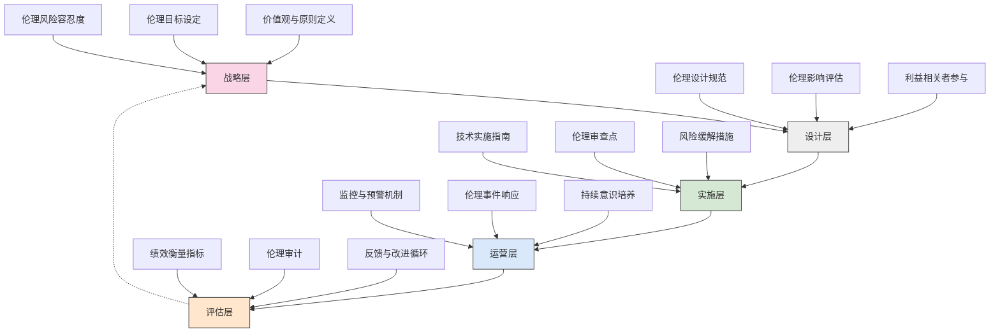
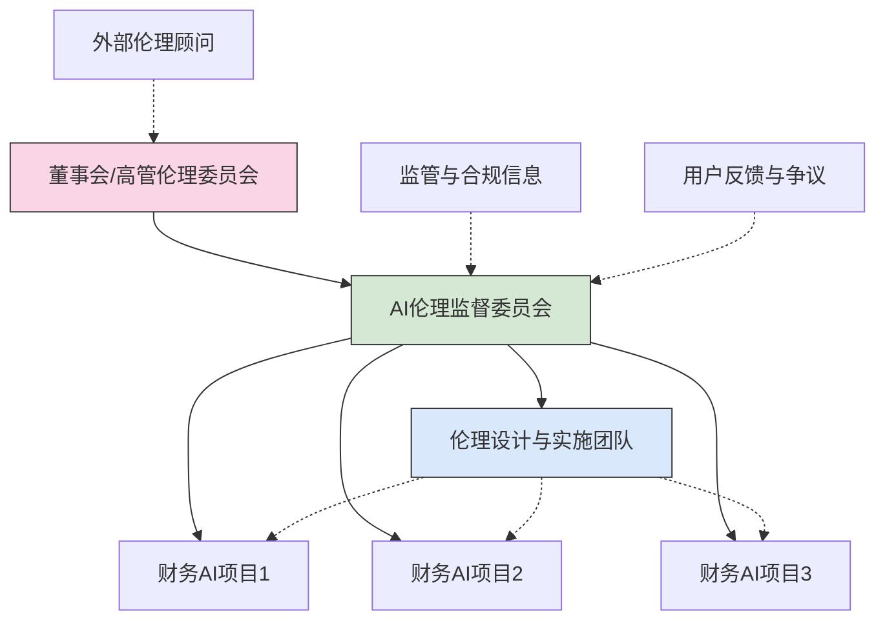

---
{"dg-publish":true,"tags":["AI财务应用","AI伦理","决策指南","伦理框架","责任治理"],"创建日期":"2024-04-29","permalink":"/知识共享/001_财务/99_其他/AI与财务应用/07_实施与转型策略/7.3 治理与伦理/财务AI伦理决策框架/","dgPassFrontmatter":true}
---

## 框架概述

财务AI伦理决策框架是一个结构化的指导系统，旨在帮助组织在财务领域应用AI技术时系统性地考量和解决相关伦理问题。该框架整合了伦理原则、实践指南和决策工具，使组织能够在追求AI创新和效率的同时，确保其应用符合道德标准、监管要求和社会期望。通过建立清晰的伦理决策路径和评估方法，这一框架帮助财务领导者和技术开发团队在设计、开发和部署AI系统的全生命周期中平衡技术推进与伦理考量，降低潜在风险，提升AI应用的可持续性和社会接受度。

### 核心伦理原则

财务AI伦理决策框架基于以下八项核心原则，这些原则共同构成了评估和指导AI财务应用的伦理基础：

1. **透明性**：AI系统的决策过程、使用的数据和可能的局限性应当对相关方保持透明，尤其对于重大财务决策尤为重要。

2. **公平性**：确保AI系统在财务决策中不会产生或强化对特定群体的不公平对待，尤其关注信贷评估、投资推荐和资源分配等领域。

3. **问责制**：明确定义AI系统使用中的责任归属，确保有明确的问责机制，即使决策由算法执行也能追溯责任主体。

4. **隐私保护**：尊重个人数据隐私权，采取适当措施保护敏感财务数据，遵循最小化数据收集和使用原则。

5. **稳健性与安全性**：确保AI系统具备足够的稳健性和安全性，能够抵御攻击和滥用，特别是在处理关键财务信息和流程时。

6. **专业胜任**：确保操作和监督AI系统的人员具备必要的专业知识和技能，理解系统的能力边界和潜在风险。

7. **人类自主性**：保持人类在关键财务决策中的最终控制权和判断力，AI系统应作为增强而非替代人类判断。

8. **社会福祉**：评估AI财务应用对更广泛社会环境的影响，确保其不会损害社会公共利益或加剧不平等。

## 决策框架结构

### 多层次伦理决策模型

财务AI伦理决策框架采用多层次结构，确保伦理考量贯穿AI系统的全生命周期：

### 决策流程与工具

#### 1. 伦理风险评估流程

**步骤一：初始风险识别**
- 使用伦理风险矩阵评估潜在伦理问题
- 考虑数据使用、决策影响、透明度和公平性风险
- 记录已识别风险及其严重程度和发生可能性

**步骤二：深入影响分析**
- 分析识别风险对不同利益相关者的影响
- 评估短期和长期伦理后果
- 考虑直接和间接伦理影响

**步骤三：风险缓解规划**
- 制定针对每项已识别风险的缓解策略
- 建立风险监控指标和预警机制
- 分配风险管理责任和资源

**步骤四：伦理审查与批准**
- 由伦理委员会或指定审查小组评估风险和缓解计划
- 确保符合组织伦理原则和外部法规要求
- 正式记录审查结果和批准决定

#### 2. 伦理决策矩阵

| 决策因素 | 低伦理关注度 (1分) | 中等伦理关注度 (2分) | 高伦理关注度 (3分) | 权重 |
|---------|-------------------|---------------------|--------------------|-----|
| **数据敏感性** | 完全匿名或公开数据 | 伪匿名或间接识别数据 | 高度敏感个人财务数据 | 25% |
| **决策自主性** | AI仅提供信息，人类完全控制决策 | AI提供推荐，人类审核后决策 | AI高度自主决策，人类监督有限 | 25% |
| **影响范围** | 影响单个内部流程 | 影响特定客户群体 | 广泛影响多个利益相关者 | 20% |
| **透明性水平** | 决策逻辑完全可解释 | 决策逻辑部分可解释 | 复杂的"黑盒"决策 | 15% |
| **公平性风险** | 无明显偏见风险 | 存在潜在偏见风险 | 高偏见风险或历史偏见记录 | 15% |

**决策分值计算**：各因素得分 × 权重 = 总伦理关注分值

**关注度分级**：
- 总分 < 1.5：低伦理关注，标准审批流程
- 总分 1.5-2.2：中等伦理关注，需详细审查
- 总分 > 2.2：高伦理关注，需全面伦理评估和高层批准

#### 3. 伦理审查清单

**数据伦理检查点**：
- [ ] 数据收集是否获得适当同意/授权？
- [ ] 数据使用是否符合原始收集目的？
- [ ] 是否实施了充分的数据安全和隐私保护措施？
- [ ] 是否有明确的数据保留和处置政策？
- [ ] 数据集是否存在已知或潜在的偏见？

**算法伦理检查点**：
- [ ] 算法是否可解释并记录其决策依据？
- [ ] 是否评估了算法对不同群体的差异化影响？
- [ ] 是否建立了算法偏见检测和纠正机制？
- [ ] 是否设置了人类干预和审核机制？
- [ ] 是否进行了稳健性和对抗性测试？

**部署伦理检查点**：
- [ ] 是否向最终用户提供了充分的透明度说明？
- [ ] 是否建立了意见反馈和申诉机制？
- [ ] 是否有应对系统错误或失效的应急计划？
- [ ] 是否定期进行伦理审计和评估？
- [ ] 是否为员工提供了伦理意识培训？

## 应用场景指南

### 财务领域特定伦理考量

#### 1. 信贷决策中的伦理指南

在应用AI进行信贷决策时，组织应特别注意以下伦理考量：

- **公平贷款评估**：确保AI系统不会基于受保护特征（如性别、种族、年龄）产生歧视性贷款决策
- **解释权保障**：为被拒绝申请者提供清晰理解和质疑决策的机会
- **替代数据使用边界**：明确定义替代数据（如社交媒体、行为数据）的适当使用范围和限制
- **能力提升平衡**：确保AI增强不会导致过度自动化或削弱人类信贷专业知识

**最佳实践**：
- 实施预部署的公平性测试和持续监控
- 建立人机协作审核机制，尤其针对边缘案例
- 主动披露使用的关键评估因素和数据类型
- 定期进行结果分析，检测并修正分布偏移和不公平现象

#### 2. 财务预测与规划中的伦理指南

在部署AI财务预测系统时，应注意以下伦理原则：

- **准确性与谦逊**：清晰表明预测的不确定性和局限性，避免过度自信
- **利益相关方平衡**：确保预测不会系统性偏向特定群体利益
- **压力与激励管理**：防止系统被操纵以产生偏向性预测
- **长期与短期平衡**：避免过度关注短期指标而忽视长期后果

**最佳实践**：
- 使用多情景建模，展示不同假设下的可能结果
- 建立独立验证机制，评估预测质量和潜在偏差
- 确保预测参数和假设的透明度
- 定期回测和校准预测模型

#### 3. 欺诈检测的伦理平衡

在实施AI欺诈检测系统时，需要平衡以下伦理考量：

- **有效保护与错误指控**：平衡高检出率与误报率，避免对无辜方的不当指控
- **隐私与监控边界**：明确界定合理监控范围，尊重隐私期望
- **算法透明与安全**：在解释系统决策和保护安全机制间找到平衡
- **权力不对等**：考虑组织与个人间的权力差异，确保公平对待

**最佳实践**：
- 建立分级预警机制，区分不同确定性级别的警报
- 实施"人在环路"审核流程，特别是对高影响决策
- 为被错误标记的个人提供便捷的申诉机制
- 定期审查和更新检测规则，减少系统性偏差

## 治理与监督机制

### 伦理治理结构

#### 1. 多层次治理模型

财务AI伦理决策框架建议建立以下三层治理结构：

**战略层**：董事会/高管伦理委员会
- 职责：制定AI伦理原则，确定伦理风险偏好，审批高风险决策
- 构成：CFO、CTO、法务负责人、风控负责人、外部伦理专家
- 运作：季度会议，年度伦理战略审查

**监督层**：AI伦理监督委员会
- 职责：落实伦理政策，审查中高风险AI应用，处理伦理争议
- 构成：财务技术负责人、数据科学团队代表、合规专家、业务代表
- 运作：月度审查会议，事件驱动特别会议

**执行层**：伦理设计与实施团队
- 职责：执行日常伦理审查，开发伦理工具，提供伦理咨询
- 构成：AI伦理专家、开发团队成员、用户体验设计师
- 运作：持续嵌入开发流程，项目阶段性伦理检查点

#### 2. 伦理监督流程

**定期审查流程**
- 季度AI系统伦理审计
- 性能与公平性指标持续监控
- 年度全面伦理影响评估

**事件驱动审查**
- 重大系统变更前的伦理评估
- 用户投诉或争议触发的伦理审查
- 外部环境变化（如法规更新）引发的合规审查

**持续改进机制**
- 伦理事件教训收集与分享
- 伦理案例库开发与培训
- 伦理最佳实践更新与推广

### 关键绩效指标

通过以下关键绩效指标监控财务AI系统的伦理表现：

| 维度 | 指标 | 目标 | 监控频率 |
|------|------|------|---------|
| **透明度** | 决策可解释率 | >90% | 月度 |
| | 用户理解度调查分数 | >4/5 | 季度 |
| | 信息披露完整性评分 | >95% | 季度 |
| **公平性** | 群体间差异指标 | <5% | 月度 |
| | 公平性审计通过率 | 100% | 季度 |
| | 偏见投诉率 | <0.1% | 持续 |
| **问责制** | 明确归责决策比例 | 100% | 月度 |
| | 响应时间达标率 | >95% | 月度 |
| | 问责制培训完成率 | 100% | 半年 |
| **数据治理** | 合规数据使用率 | 100% | 持续 |
| | 数据隐私事件数 | 0 | 持续 |
| | 数据质量指标 | >98% | 月度 |
| **用户权利** | 申诉机制使用率 | 监控趋势 | 月度 |
| | 申诉解决满意度 | >85% | 季度 |
| | 用户控制选项使用率 | 监控分布 | 季度 |

### 外部参与和开放性

为确保财务AI伦理框架的包容性和外部视角，建议采取以下措施：

1. **外部伦理委员会**
   - 组建包含多元化外部专家的顾问委员会
   - 定期邀请外部审核和挑战内部决策
   - 发布公开的伦理立场和原则声明

2. **利益相关者参与机制**
   - 建立客户咨询团，获取用户体验反馈
   - 与行业协会和标准机构保持合作
   - 参与多方利益相关者对话和圆桌讨论

3. **伦理研究与合作**
   - 与学术机构建立伦理研究合作项目
   - 参与行业伦理标准和最佳实践开发
   - 公开分享非敏感伦理挑战和解决方案

## 实施指南

### 阶段性实施路径

组织可采用以下分阶段方法实施财务AI伦理决策框架：

**第一阶段：基础构建（1-3个月）**
- 建立基本伦理原则和政策
- 指定初始伦理负责人和联络点
- 对现有AI系统进行初步伦理风险评估
- 开发基础伦理审查工具和模板

**第二阶段：系统整合（3-6个月）**
- 建立正式的伦理治理结构
- 将伦理审查整合到开发流程中
- 为关键利益相关者提供伦理培训
- 开发监控仪表板和报告机制

**第三阶段：成熟运行（6-12个月）**
- 实施全面的伦理影响评估
- 建立伦理KPI和持续改进机制
- 发展伦理案例库和最佳实践资源
- 启动外部参与和透明度计划

**第四阶段：持续优化（持续进行）**
- 基于经验调整伦理框架和流程
- 适应监管和技术变化
- 追踪伦理成熟度进展
- 分享经验和参与行业伦理标准发展

### 实施成功要素

1. **高层领导支持**
   - 确保董事会和高管团队公开支持伦理框架
   - 将伦理考量纳入战略决策和资源分配
   - 领导者以身作则，示范伦理决策行为

2. **跨职能协作**
   - 建立财务、技术、法务和风控团队之间的协作机制
   - 明确角色和责任，确保accountability
   - 创建共同语言和理解，克服专业隔阂

3. **能力建设**
   - 开发财务AI伦理培训计划
   - 建立伦理咨询资源和支持工具
   - 将伦理能力纳入人才发展计划

4. **文化融合**
   - 将伦理考量融入组织价值观和文化
   - 认可和奖励伦理决策和行为
   - 创造安全的环境，鼓励提出伦理问题和担忧

### 常见挑战与应对策略

| 挑战 | 症状 | 应对策略 |
|------|------|----------|
| **感知为创新障碍** | 伦理审查被视为额外负担 团队绕过伦理流程 伦理考量被推迟到后期 | • 强调伦理设计促进可持续创新 • 将伦理审查融入现有开发流程 • 分享早期伦理考量节省成本的案例 |
| **专业知识缺口** | 伦理评估表面化 无法识别复杂的伦理风险 技术与伦理团队沟通困难 | • 投资伦理专业发展 • 建立跨学科伦理咨询团队 • 开发适合财务环境的伦理工具 |
| **执行不一致** | 各团队应用标准不一致 缺乏明确的决策权限 伦理评估结果被忽视 | • 制定明确的决策框架和标准 • 建立伦理决策升级机制 • 实施伦理决策审计追踪 |
| **监管不确定性** | 对新兴监管要求的担忧 过度谨慎导致创新受限 缺乏明确的合规路径 | • 积极监控监管发展 • 参与行业政策对话 • 采用适应性合规策略 |
| **短期与长期平衡** | 业务压力导致伦理折衷 缺乏长期伦理影响评估 伦理投资难以量化 | • 开发伦理价值衡量框架 • 将伦理目标纳入绩效评估 • 强调伦理失败的长期成本 |

## 案例研究

### 案例一：大型银行信贷评估AI系统的伦理决策

**背景**：
某国际银行开发了基于机器学习的信贷评分系统，用于自动评估贷款申请。初期分析显示该系统提高了决策速度和一致性，但也发现系统可能对某些人口统计群体产生不利影响。

**伦理挑战**：
- 算法对低收入但信用良好申请人的评分偏低
- 对有限信用历史的年轻申请人不利
- 替代数据使用引发隐私和公平性担忧
- 缺乏对拒绝决定的有效解释机制

**框架应用**：
1. **风险评估**：应用伦理决策矩阵，识别该系统为"高伦理关注度"（总分2.6）
2. **治理介入**：由AI伦理监督委员会进行全面审查
3. **利益相关者参与**：组织客户焦点小组和公民社会组织咨询
4. **技术调整**：
   - 实施公平性约束算法，平衡不同群体结果
   - 开发可解释AI组件，提供决策理由
   - 实施人类审核环节，审查边界案例
5. **流程改进**：
   - 建立申诉渠道和流程
   - 增强客户沟通和透明度

**成果**：
- 群体差异指标从初始12%降至3%
- 可解释决策比例提高到95%
- 客户满意度提升15%
- 系统获得监管机构积极评价
- 减少了潜在的声誉和法律风险

### 案例二：财务预测系统的伦理框架应用

**背景**：
某制造企业开发AI财务预测系统，用于预测现金流、销售和成本趋势，辅助战略决策和投资规划。

**伦理挑战**：
- 预测结果可能影响不同部门资源分配，存在公平性问题
- 系统使用敏感业务数据，需要严格的访问控制
- 决策者过度依赖自动预测，忽略人工判断
- 缺乏对预测不确定性的充分沟通

**框架应用**：
1. **伦理设计整合**：在开发初期就应用伦理审查清单
2. **透明度增强**：
   - 开发置信区间可视化
   - 明确标识假设和限制条件
   - 提供多情景预测比较
3. **人机协作优化**：
   - 设计互补决策流程
   - 建立预测质疑机制
   - 实施结构化人工判断整合
4. **治理机制**：
   - 建立预测审查委员会
   - 实施预测质量回顾
   - 开发预测偏差检测工具

**成果**：
- 决策者对系统局限的认识提高
- 资源分配争议减少
- 预测精度和可信度提升
- 跨部门协作改善
- 建立了可持续的伦理预测文化

## 未来展望

### 伦理框架演进趋势

随着AI技术和财务应用的不断发展，财务AI伦理决策框架也将持续演进：

1. **自动化伦理评估工具**
   - AI辅助的伦理风险扫描工具
   - 实时伦理监控和预警系统
   - 自动化合规检查和报告生成

2. **分布式伦理治理模式**
   - 跨组织伦理协作框架
   - 行业级伦理标准和认证
   - 开源伦理评估工具和方法

3. **适应性伦理框架**
   - 根据应用场景自动调整的伦理评估
   - 学习型伦理框架，从经验中改进
   - 文化敏感的伦理考量和本地化

4. **量化伦理指标**
   - 更精确的伦理影响量化方法
   - 伦理表现的财务价值评估
   - 伦理投资回报计算模型

### 前瞻性建议

为了保持组织在AI财务伦理领域的领先地位，建议采取以下前瞻性措施：

1. **建立伦理创新实验室**
   - 探索新兴AI技术的伦理维度
   - 开发前沿伦理方法和工具
   - 与学术界和研究机构合作

2. **塑造伦理对话和标准**
   - 积极参与行业政策对话
   - 贡献最佳实践和案例研究
   - 影响新兴伦理标准的发展

3. **培育伦理文化**
   - 将伦理素养纳入核心能力模型
   - 建立伦理决策和领导力发展计划
   - 创建伦理创新和解决方案共享平台

4. **拓展伦理合作生态系统**
   - 与监管机构建立协作关系
   - 发展跨行业伦理联盟
   - 支持伦理研究和教育计划

### 结语

财务AI伦理决策框架不仅是一种风险管理工具，更是价值创造和可持续创新的驱动力。通过在AI财务应用的各个阶段嵌入伦理考量，组织能够构建更可靠、公平和负责任的系统，赢得利益相关者的信任，并在日益复杂的监管环境中保持竞争优势。

随着技术继续重塑财务领域，伦理考量将成为区分卓越组织的关键因素。那些能够将技术创新与伦理责任有机结合的组织，将在塑造AI财务未来方面发挥引领作用，创造既有商业价值又对社会有益的解决方案。 