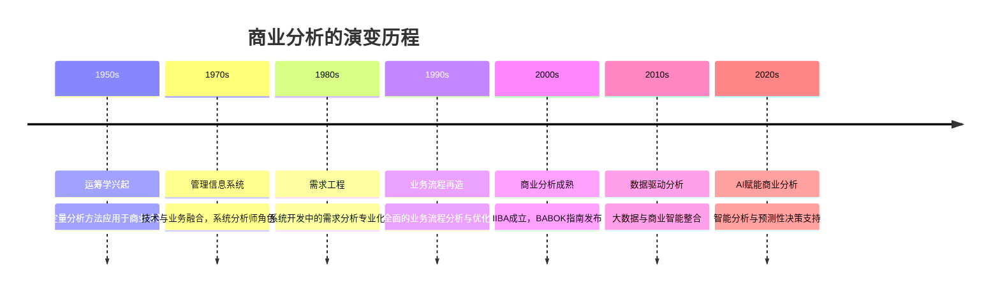
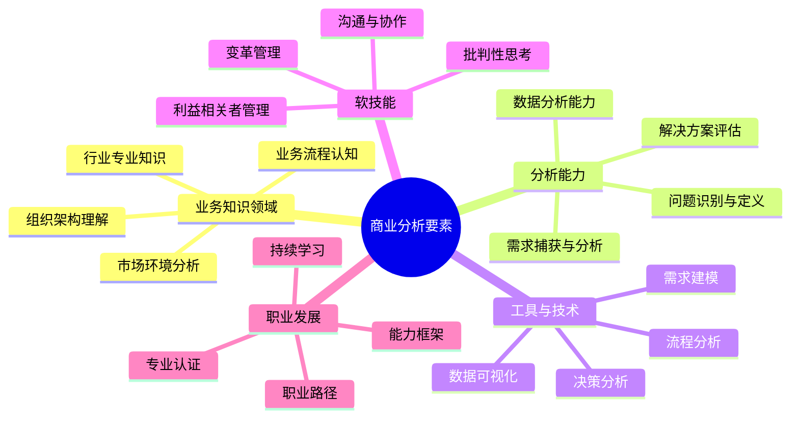

---
{"dg-publish":true,"tags":["商业分析","基础概念","分析框架","价值创造"],"创建日期":"2024-04-26","permalink":"/知识共享/002_商业分析/01_学习内容/01_商业分析基础/1.1 商业分析概述/","dgPassFrontmatter":true}
---

# 1.1 商业分析概述

> [!quote] 核心要点
> 商业分析是一套系统性方法，旨在识别业务需求、解决业务问题并推动组织价值创造。本文从多角度阐述商业分析的定义、发展历史、核心要素和应用价值，帮助您建立对商业分析的全面认知。

## 商业分析的定义

商业分析作为一个专业领域，有多种定义视角，以下是几个权威机构和学者的定义：

1. **国际商业分析师协会(IIBA)**：商业分析是使能变革的实践，通过定义需求和推荐解决方案，为组织创造价值。

2. **项目管理协会(PMI)**：商业分析是应用知识、技能、工具和技术来确定问题和机会，确定目标和目的，以及定义满足组织需求所必需的解决方案。

3. **麦肯锡咨询公司**：商业分析是利用数据、系统思维和业务洞察力来识别问题、发现机会并支持决策过程的系统性方法。

4. **哈佛商学院**：商业分析是结合统计学、信息技术和管理科学的跨学科领域，旨在转化数据为可行的业务洞察。

这些定义的共同点在于：
- 强调创造业务价值
- 关注需求识别和问题解决
- 支持决策和变革
- 需要多学科知识和方法

## 商业分析的发展历史

### 关键里程碑

1. **1968年**：Robert N. Anthony提出管理控制框架，成为早期业务分析的理论基础
2. **1984年**：Peter Checkland开发软系统方法论(SSM)，为商业分析提供系统思维工具
3. **2003年**：国际商业分析师协会(IIBA)成立，标志着商业分析作为独立专业的正式确立
4. **2005年**：首版《商业分析知识体系指南》(BABOK Guide)发布
5. **2009年**：商业分析专业认证(CBAP)开始广泛获得业界认可
6. **2015年**：BABOK Guide 3.0版发布，全面更新商业分析框架
7. **2018年**：数据科学与商业分析开始深度融合
8. **2020年**：人工智能开始广泛应用于商业分析实践

## 商业分析的构成要素

商业分析作为一个系统性领域，包含多个相互关联的核心要素：

### 核心知识领域

根据BABOK指南，商业分析包含六大知识领域：

1. **商业分析计划与监控**：规划商业分析活动并持续监控绩效
2. **引出与协作**：与利益相关者合作识别业务需求和问题
3. **需求生命周期管理**：管理需求从构思到退役的全生命周期
4. **战略分析**：分析当前状态，定义未来愿景并确定变革需求
5. **需求分析与设计定义**：详细说明和建模需求，设计解决方案
6. **解决方案评估与验证**：评估提议或实施的解决方案价值

## 商业分析的价值

商业分析为组织提供多方面的价值：

1. **明确业务需求**：确保解决方案真正满足业务需求，避免资源浪费
2. **促进资源优化**：帮助组织有效分配有限资源，专注于高价值项目
3. **降低风险**：通过前期分析识别潜在风险和问题，提前制定缓解措施
4. **提高决策质量**：提供基于数据和分析的决策依据，减少决策偏误
5. **推动持续改进**：建立衡量和评估机制，促进组织持续优化和提升
6. **桥接业务与技术**：充当业务与技术团队之间的桥梁，确保解决方案技术可行且业务可用
7. **支持战略规划**：提供市场、竞争和内部能力的分析，支持战略制定

## 商业分析在不同行业的应用

商业分析方法在不同行业中有着广泛应用，但会基于行业特点进行调整：

### 金融服务行业
- **特点**：高度监管、数据密集、风险敏感
- **应用**：风险分析、客户细分、合规报告、欺诈检测
- **案例**：花旗银行利用行为分析和预测模型，优化客户体验并减少20%的运营成本

### 零售行业
- **特点**：客户体验导向、渠道多元、库存管理关键
- **应用**：需求预测、库存优化、客户旅程分析
- **案例**：沃尔玛通过商业分析优化供应链，降低库存成本并减少断货率10%

### 医疗健康行业
- **特点**：严格监管、数据隐私敏感、质量安全至关重要
- **应用**：患者流程优化、医疗质量分析、资源调度
- **案例**：梅奥诊所利用预测分析减少30%的不必要住院，同时提高病人满意度

### 制造业
- **特点**：流程密集、供应链复杂、效率关键
- **应用**：生产流程优化、供应链分析、质量控制
- **案例**：丰田汽车通过精益生产分析，减少35%的生产周期时间

### 科技行业
- **特点**：快速创新、用户体验关键、高度竞争
- **应用**：产品分析、用户行为分析、竞争情报
- **案例**：谷歌通过A/B测试和用户分析，每年实施超过2500项产品改进

## 商业分析实践案例

### 案例一：Netflix的数据驱动决策

**背景**：Netflix需要从传统DVD租赁业务转型为流媒体服务

**应用商业分析的过程**：
1. **需求分析**：通过用户研究发现客户希望随时随地访问内容
2. **市场分析**：评估流媒体市场潜力和竞争格局
3. **技术可行性分析**：评估基础设施需求和技术挑战
4. **财务建模**：分析订阅模式的财务可行性和长期价值
5. **风险评估**：识别并缓解内容获取、技术和市场风险

**结果**：成功转型为全球领先的流媒体服务，用户数量从2007年的不到1000万增长到2023年的2.3亿

**关键决策点**：
- 投资原创内容制作（基于用户行为分析）
- 采用推荐系统（基于用户喜好分析）
- 国际扩张策略（基于市场机会分析）

### 案例二：星巴克的客户体验优化

**背景**：星巴克面临快速扩张后的体验一致性和客户忠诚度挑战

**应用商业分析的过程**：
1. **客户旅程映射**：分析客户接触点和体验
2. **需求分析**：识别核心客户群的关键需求
3. **竞争分析**：评估竞争对手的服务模式和差异化点
4. **解决方案设计**：开发忠诚度计划和数字化体验
5. **效果监测**：建立KPI追踪系统

**结果**：推出成功的星享俱乐部计划，移动订单占比超过20%，客户满意度提升18%

**关键决策点**：
- 移动应用开发（基于用户便利性分析）
- 定制化产品推荐（基于购买历史分析）
- 店内体验改进（基于客户反馈分析）

### 案例三：西南航空的运营模式分析

**背景**：美国航空业竞争激烈，大多数航空公司利润微薄

**应用商业分析的过程**：
1. **行业结构分析**：评估航空业价值链和成本结构
2. **流程分析**：识别运营中的低效环节
3. **需求分析**：了解客户最看重的服务属性
4. **商业模式设计**：设计点对点、单一机型的低成本模式
5. **情景规划**：评估不同市场条件下的适应性

**结果**：建立高效、盈利的低成本航空模式，在高度竞争的行业中连续盈利超过45年

**关键决策点**：
- 采用单一机型（基于维护成本分析）
- 放弃枢纽模式（基于周转时间分析）
- 不收取行李费（基于客户价值分析）

## 商业分析的挑战与创新方向

### 当前挑战

1. **数据质量与可访问性**：获取高质量、完整的数据仍是许多组织的挑战
2. **跨部门协作**：打破部门孤岛，促进协作分析
3. **复杂性增加**：业务环境日益复杂，需要更强的系统思维能力
4. **技术快速变化**：分析技术和工具快速迭代，需要持续学习
5. **价值衡量**：量化商业分析工作的价值和投资回报
6. **专业人才缺口**：具备业务理解和技术能力的复合型人才稀缺

### 创新方向

1. **AI辅助商业分析**：利用人工智能自动化数据处理和初步分析
2. **实时分析**：从周期性分析转向实时分析和决策支持
3. **预测性和规范性分析**：从描述"发生了什么"到预测"将发生什么"和建议"应该做什么"
4. **民主化分析**：通过自助服务分析工具，使业务人员能够进行基础分析
5. **混合分析方法**：结合定量和定性方法，提供更全面的业务视角
6. **敏捷商业分析**：采用迭代和增量方法进行商业分析，提高响应速度

## 自我检测问题

1. 比较IIBA和PMI对商业分析的定义，说明其共同点和差异。
2. 商业分析在历史上经历了哪些关键发展阶段？每个阶段的特点是什么？
3. 根据BABOK指南，商业分析包含哪六大知识领域？
4. 商业分析如何为组织创造价值？请举例说明。
5. 金融服务业和零售业在商业分析应用上有哪些不同？为什么？
6. 分析Netflix案例中，数据分析如何支持其关键业务决策。
7. 西南航空的商业模式分析案例给我们哪些启示？
8. 当前商业分析面临的最大挑战是什么？组织如何应对？
9. 人工智能将如何改变商业分析实践？请给出具体应用场景。
10. 您所在行业或组织如何应用商业分析方法解决问题？效果如何？

## 进阶学习资源

### 书籍推荐
1. 《商业分析实践指南》(IIBA)
2. 《商业分析：有效需求的最佳实践》(Debra Paul等)
3. 《商业分析技术工作手册》(James Cadle等)
4. 《竞争优势》(Michael Porter)
5. 《商业模式新生代》(Alexander Osterwalder)

### 在线资源
1. [IIBA官方网站](https://www.iiba.org/)
2. [Modern Analyst](https://www.modernanalyst.com/)
3. [Business Analyst Times](https://www.batimes.com/)
4. Coursera上的"商业分析专业化"课程
5. LinkedIn Learning上的商业分析课程

### 认证路径
1. IIBA认证：ECBA(入门) → CCBA(中级) → CBAP(高级)
2. PMI-PBA：项目管理协会商业分析专业人士认证
3. IREB CPRE：国际需求工程委员会认证

## 相关概念关联

- [[知识共享/002_商业分析/01_学习内容/01_商业分析基础/1.2 商业分析师的角色与职责\|1.2 商业分析师的角色与职责]] - 了解商业分析专业人员的工作内容
- [[知识共享/002_商业分析/01_学习内容/01_商业分析基础/1.3 商业分析的思维方式\|1.3 商业分析的思维方式]] - 深入探讨商业分析所需的思维模型
- [[知识共享/002_商业分析/01_学习内容/02_数据收集与处理/2.1 数据收集与处理基础\|2.1 数据收集与处理基础]] - 学习支持商业分析的数据基础知识
- [[知识共享/002_商业分析/01_学习内容/03_分析方法与工具/3.1 描述性分析方法\|3.1 描述性分析方法]] - 掌握基础的数据分析技术
- [[知识共享/002_商业分析/01_学习内容/06_商业模式分析/6.1 商业模式画布\|6.1 商业模式画布]] - 了解商业模式分析的核心工具 