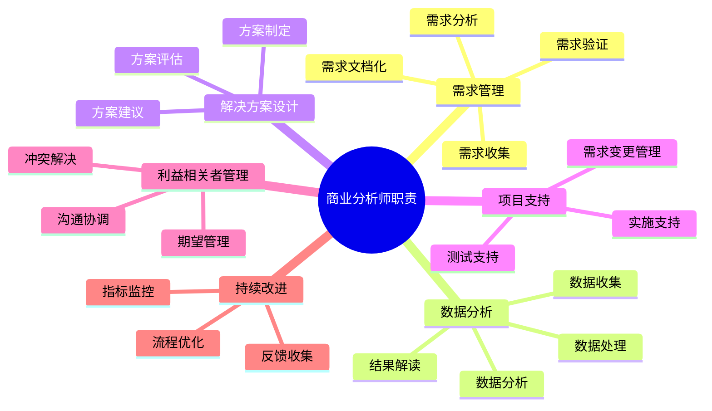
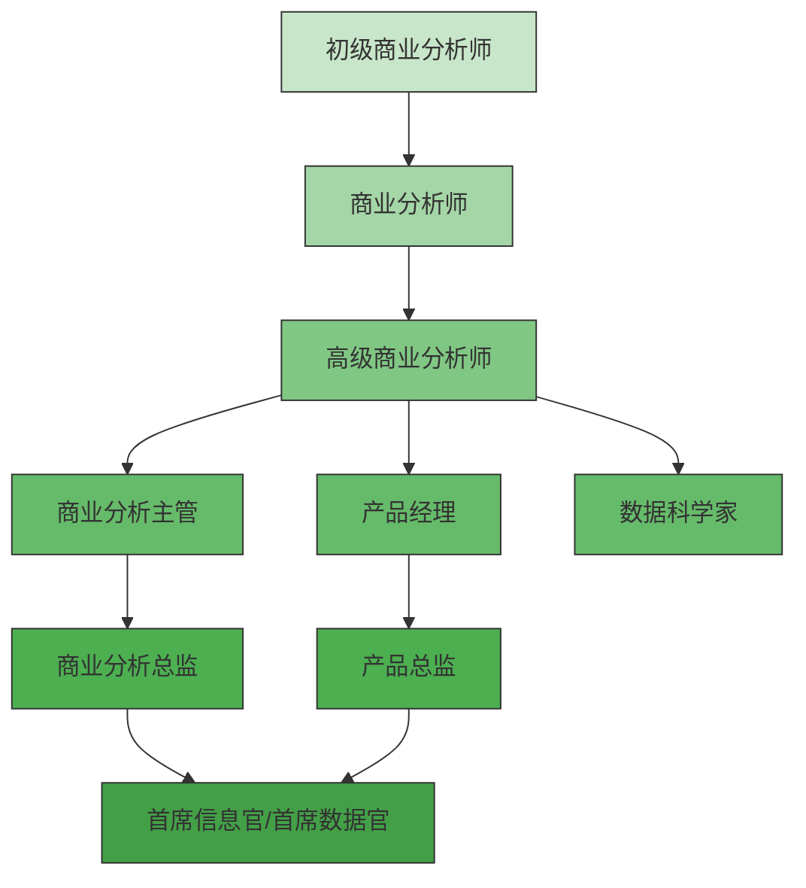

---
{"tags":["商业分析","职业角色","能力模型","职业发展"],"创建日期":"2024-04-25","更新日期":"2024-04-25","dg-publish":true,"permalink":"/知识共享/002_商业分析/01_学习内容/01_商业分析基础/1.2 商业分析师的角色与职责/","dgPassFrontmatter":true}
---

> [!quote] 核心要点
> 商业分析师是连接业务与技术的桥梁，负责识别业务需求、分析数据并提供决策支持。本文详细介绍商业分析师的职责范围、核心能力、职业发展路径以及在不同行业中的角色变化，帮助读者全面理解这一职业角色。

## 商业分析师的定义

### 权威机构的定义视角

**国际商业分析师协会(IIBA)定义**：
商业分析师是"负责识别业务需求并确定满足这些需求的解决方案的专业人士。解决方案通常包括软件系统开发或改进的组成部分，但也可能包含流程改进、组织变革或战略规划与政策制定。"

**项目管理协会(PMI)定义**：
"商业分析师是促进变革的代理人，他们定义需求并推荐解决方案，为利益相关者创造和交付价值。"

**麦肯锡咨询公司视角**：
"商业分析师是能够将数据转化为可执行洞察并推动业务决策的专业人士，他们既是数据科学家，也是业务顾问。"

### 定义比较与核心共识

比较不同定义，可以发现商业分析师角色的核心共识：
- 识别和定义业务需求
- 分析数据并提供洞察
- 推荐解决方案并支持决策
- 创造业务价值
- 连接业务与技术

## 商业分析师的职责范围

### 业务需求管理

1. **需求引出与收集**
   - 与业务利益相关者进行访谈和研讨会
   - 观察业务流程和操作
   - 分析现有文档和系统
   - 创建用户故事和用例

2. **需求分析与整理**
   - 将高层业务需求分解为详细需求
   - 识别需求之间的依赖关系
   - 确保需求的清晰性、完整性和可测试性
   - 协调和解决需求冲突

3. **需求文档化与沟通**
   - 创建需求规格说明书、用户故事或产品待办事项
   - 开发业务流程图和用例图
   - 维护需求跟踪矩阵
   - 与开发团队沟通需求细节

### 数据分析与洞察提取

1. **数据收集与处理**
   - 确定分析所需数据
   - 评估数据质量和可用性
   - 数据清洗和预处理
   - 构建分析数据集

2. **执行分析与模型构建**
   - 应用统计和分析方法
   - 构建预测模型
   - 进行假设检验
   - 开发数据可视化

3. **洞察提取与结果解读**
   - 识别关键发现和模式
   - 量化业务影响
   - 提取可操作的洞察
   - 制作执行摘要和报告

### 解决方案评估与推荐

1. **解决方案设计**
   - 开发满足业务需求的方案
   - 评估不同方案的可行性
   - 分析成本效益和风险
   - 提出实施建议

2. **业务案例开发**
   - 构建投资回报分析
   - 量化预期业务价值
   - 评估实施风险
   - 制定成功标准

### 项目实施支持

1. **变更管理**
   - 管理需求变更
   - 评估变更影响
   - 更新项目文档

2. **测试支持**
   - 开发验收标准
   - 审查测试计划
   - 参与用户验收测试
   - 验证解决方案符合需求

3. **培训与部署支持**
   - 开发培训材料
   - 协助用户采用
   - 监控解决方案效果

## 商业分析师的核心能力模型

### 商业分析师能力框架

根据IIBA的商业分析能力模型(Business Analysis Capability Model)，商业分析师的核心能力可分为六大领域：

```mermaid
graph TD
    A[商业分析师核心能力] --> B[业务知识]
    A --> C[分析技能]
    A --> D[软技能]
    A --> E[技术知识]
    A --> F[方法论掌握]
    A --> G[工具熟练度]
    
    B --> B1[行业知识]
    B --> B2[业务流程理解]
    B --> B3[组织结构认知]
    
    C --> C1[问题分析能力]
    C --> C2[数据分析能力]
    C --> C3[建模与设计能力]
    C --> C4[批判性思维]
    
    D --> D1[沟通与表达]
    D --> D2[协作能力]
    D --> D3[引导与谈判]
    D --> D4[适应性与学习能力]
    
    E --> E1[系统知识]
    E --> E2[技术趋势理解]
    E --> E3[数据结构认知]
    
    F --> F1[敏捷方法]
    F --> F2[瀑布方法]
    F --> F3[设计思维]
    
    G --> G1[分析工具]
    G --> G2[建模工具]
    G --> G3[项目管理工具]
    
    style A fill:#f9a825,stroke:#333,stroke-width:2px
    style B fill:#42a5f5,stroke:#333,stroke-width:1px
    style C fill:#42a5f5,stroke:#333,stroke-width:1px
    style D fill:#42a5f5,stroke:#333,stroke-width:1px
    style E fill:#42a5f5,stroke:#333,stroke-width:1px
    style F fill:#42a5f5,stroke:#333,stroke-width:1px
    style G fill:#42a5f5,stroke:#333,stroke-width:1px
```

### 业务与领域知识

- **行业特定知识**：了解特定行业的业务模式、价值链和关键绩效指标
- **业务流程理解**：识别和分析组织的核心业务流程和运作方式
- **组织结构认知**：理解决策结构、部门职能和关键利益相关者

### 技术分析能力

- **数据分析能力**：应用统计方法、数据挖掘和预测建模技术
- **流程分析能力**：识别流程瓶颈并设计优化方案
- **系统思维**：理解系统组件之间的相互关系和影响

### 软技能与人际能力

- **沟通能力**：清晰表达复杂概念，适应不同受众
- **协商与说服能力**：在冲突中找到平衡点，说服利益相关者
- **引导能力**：有效主持会议和研讨会，促进共识达成
- **批判性思维**：质疑假设，从多角度分析问题

### 工具与方法论掌握

- **分析工具**：Excel、SQL、Python、R、Tableau等
- **建模工具**：Visio、BPMN工具、UML工具等
- **项目管理工具**：JIRA、Trello、Asana等
- **方法论**：敏捷、瀑布、设计思维、六西格玛等

## 商业分析师在不同行业中的角色变化

### 金融服务业

**角色重点**：
- 风险分析与合规
- 客户行为分析
- 欺诈检测
- 产品定价优化

**案例**：花旗银行的商业分析师通过分析客户交易模式，开发了更精准的信用风险评估模型，将不良贷款率降低了12%。

### 电子商务与零售业

**角色重点**：
- 客户旅程分析
- 定价与促销策略
- 库存优化
- 个性化推荐

**案例**：亚马逊的商业分析师通过A/B测试和购买行为分析，优化了产品推荐算法，提升了交叉销售收入超过35%。

### 医疗健康行业

**角色重点**：
- 患者流程优化
- 临床数据分析
- 医疗资源分配
- 成本控制与质量改进

**案例**：克利夫兰诊所的商业分析师通过分析患者流程数据，重新设计了门诊预约系统，将等待时间减少了40%，患者满意度提高15%。

### 制造业

**角色重点**：
- 供应链优化
- 预测性维护
- 生产效率分析
- 质量控制

**案例**：通用电气的商业分析师利用物联网数据和预测性分析，为飞机发动机开发了维护预警系统，减少了非计划停机时间，为航空客户每年节省约700万美元。

## 商业分析师的职业发展路径

### 典型职业阶梯

### 不同发展方向比较

| 发展方向 | 关键能力要求 | 职业前景 | 适合人群特点 |
|---------|------------|---------|------------|
| 管理路线 | 领导力、团队管理、战略规划 | 商业分析总监、部门主管 | 善于协调、有领导意愿、战略思维强 |
| 专家路线 | 深度技术能力、行业专业知识 | 首席分析师、领域专家 | 追求专业深度、注重技术、喜欢解决复杂问题 |
| 产品路线 | 产品思维、用户体验、市场洞察 | 产品经理、产品总监 | 用户导向、创新思维、结果驱动 |
| 咨询路线 | 沟通能力、问题解决、适应性强 | 内部/外部顾问、独立咨询师 | 善于表达、享受多样性、人际敏感度高 |

### 标杆企业中的商业分析师发展案例

**案例1：麦肯锡的商业分析师发展模式**

麦肯锡采用"专业+管理"双轨制发展模式：
- 0-2年：商业分析师，主要负责数据收集和基础分析
- 2-4年：高级商业分析师，领导单独工作流，直接与客户沟通
- 4-6年：专家或项目经理，专注于特定行业或功能领域
- 6年以上：高级专家或合伙人，负责客户关系和团队领导

**案例2：谷歌的商业分析师职业阶梯**

谷歌的商业分析师有三条发展路径：
1. **技术专家路线**：成为数据科学家或机器学习专家
2. **产品路线**：转向产品分析或产品管理
3. **管理路线**：领导分析团队，最终成为部门总监

谷歌的一个真实案例：Sarah从商业分析师开始，专注于用户行为分析，两年后成为高级分析师，之后转向产品分析师路线，现在是YouTube的产品战略总监，负责数据驱动的产品决策。

## 成为优秀商业分析师的实践建议

### 关键能力培养策略

1. **T型知识结构建设**
   - 广度：跨职能知识、行业视野、方法论多样性
   - 深度：选择1-2个专精领域深耕

2. **实践项目积累**
   - 参与跨部门项目
   - 主动承担有挑战的分析任务
   - 建立个人案例库

3. **持续学习习惯养成**
   - 订阅行业资讯
   - 参加社区和行业会议
   - 交叉学习相关领域知识

### 常见挑战与应对策略

| 挑战 | 表现 | 应对策略 |
|-----|-----|---------|
| 需求模糊不清 | 利益相关者无法明确表达需求 | 运用引导技术、可视化、原型验证 |
| 数据质量问题 | 数据不完整、不准确或不一致 | 建立数据质量评估框架，透明沟通数据限制 |
| 跨部门协作障碍 | 沟通困难，优先级冲突 | 建立正式沟通渠道，寻找共同目标 |
| 技术与业务鸿沟 | 难以将技术限制解释给业务方 | 使用类比和可视化，避免技术术语 |
| 结果实施阻力 | 分析结果未被采纳或实施 | 提前获取支持，展示快速胜利，渐进式变革 |

### 认证与专业发展资源

**主要认证**：
- IIBA的ECBA（入门级）/CCBA（能力级）/CBAP（专业级）认证
- PMI-PBA（专业商业分析师）认证
- IREB的需求工程认证

**学习资源**：
- 线上课程：Coursera、Udemy上的商业分析专项课程
- 社区：IIBA当地分会、LinkedIn商业分析师小组
- 书籍：《商业分析实践指南》、《商业分析的艺术》

## 案例分析：星巴克的商业分析师如何推动数据驱动决策

### 背景

2008-2009年金融危机期间，星巴克面临客流下降和盈利能力下滑的挑战。公司需要重新审视其扩张策略和店面运营效率。

### 商业分析师的角色与贡献

星巴克组建了一个商业分析团队，专注于以下几个方面：

1. **选址分析优化**
   - 问题：过去的扩张导致一些店面位置欠佳，相互蚕食
   - 方法：商业分析师整合了地理信息、人口统计、交通流量和消费行为数据
   - 解决方案：开发了新的选址评分模型，考虑30多个变量
   - 结果：新店铺的首年绩效提升了20%，关闭了500多家表现不佳的店铺

2. **客户体验优化**
   - 问题：不同时段的服务速度和质量不一致
   - 方法：分析师收集了POS交易数据、排队时间和客户反馈
   - 解决方案：优化了员工排班和工作流程，引入了移动支付
   - 结果：高峰期平均等待时间减少了35%，客户满意度提高

3. **产品组合分析**
   - 问题：菜单复杂导致准备时间长，一些产品利润率低
   - 方法：分析师进行了产品组合和边际贡献分析
   - 解决方案：精简了菜单，增加了高利润率产品的推广
   - 结果：平均客单价提升了7%，运营效率提高了12%

### 关键成功因素

星巴克商业分析师成功的关键因素包括：
- 跨职能合作（与市场、运营、财务等部门）
- 平衡数据与客户体验
- 将分析转化为可执行的建议
- 建立试点和快速实验机制
- 持续监控和调整

### 启示

这个案例展示了商业分析师如何在企业转型和绩效改善中发挥关键作用。通过将数据分析与深刻的业务理解相结合，商业分析师能够提供具有战略意义的洞察和解决方案。

## 思考与练习

1. 当你需要从不同利益相关者处收集相互矛盾的需求时，你会采用什么策略来解决这些冲突？

2. 商业分析师经常需要在技术团队和业务团队之间"翻译"。请思考在向非技术背景的高管解释复杂的数据分析结果时，你会采用什么沟通技巧？

3. 你认为在商业分析师的六大核心能力中，哪些对初级、中级和高级分析师的重要性会发生变化？为什么？

4. 想象你是一家零售企业的商业分析师，被要求分析并提高店内促销活动的效果。请概述你的分析方法和可能使用的数据。

5. 商业分析师如何在敏捷开发环境中调整自己的工作方式与传统瀑布式开发环境相比？

## 相关链接

- [[知识共享/002_商业分析/01_学习内容/01_商业分析基础/1.1 商业分析概述\|1.1 商业分析概述]] - 了解商业分析的基本概念和价值
- [[知识共享/002_商业分析/01_学习内容/01_商业分析基础/1.3 商业分析的思维方式\|1.3 商业分析的思维方式]] - 探索商业分析所需的思维模式
- [[知识共享/002_商业分析/01_学习内容/01_商业分析基础/1.4 商业分析与相关学科的关系\|1.4 商业分析与相关学科的关系]] - 理解商业分析与其他领域的关联
- [[知识共享/002_商业分析/01_学习内容/03_分析方法与工具/3.1 描述性分析方法\|3.1 描述性分析方法]] - 学习商业分析师常用的分析方法

## 参考文献

1. International Institute of Business Analysis. (2015). A Guide to the Business Analysis Body of Knowledge (BABOK Guide), Version 3.0.
2. Hass, K. B. (2015). The Enterprise Business Analyst: Developing Creative Solutions to Complex Business Problems.
3. Brennan, K. (2009). A Guide to the Business Analysis Body of Knowledge (BABOK Guide), Version 2.0.
4. Paul, D., Cadle, J., & Yeates, D. (2014). Business Analysis (3rd ed.). BCS Learning & Development Limited.
5. Wiegers, K., & Beatty, J. (2013). Software Requirements (3rd ed.). Microsoft Press.
6. McKinsey & Company. (2018). Analytics Translator: The New Must-Have Role.
7. Harvard Business Review. (2019). Data Scientist: The Sexiest Job of the 21st Century.
8. PMI. (2018). Business Analysis for Practitioners: A Practice Guide. 