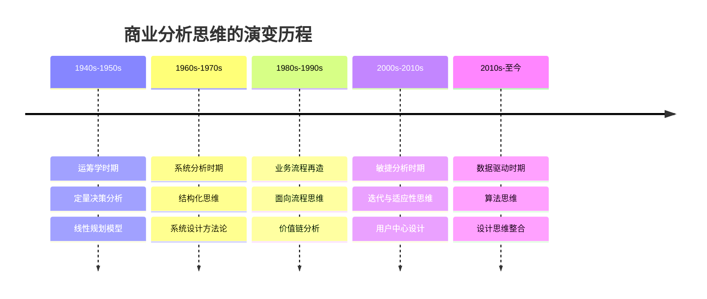
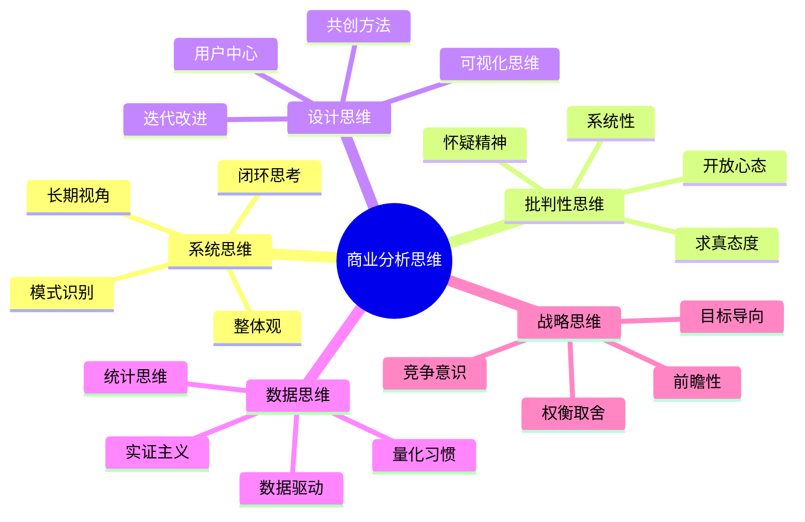

---
{"dg-publish":true,"tags":["商业分析","思维方式","批判性思维","系统思考"],"创建日期":"2024-04-26","publish":true,"permalink":"/知识共享/002_商业分析/01_学习内容/01_商业分析基础/1.3 商业分析的思维方式/","dgPassFrontmatter":true}
---

# 商业分析的思维方式

## 引言

商业分析不仅是一系列技能和工具的集合，更是一种独特的思维方式。高效的商业分析师能够以特定的思维模式处理复杂问题，在数据和业务之间架起桥梁，为组织创造价值。本文将深入探讨商业分析的核心思维方式，从多个维度阐释这些思维模式如何帮助分析师更有效地解决业务问题，以及如何培养和强化这些思维能力。

## 商业分析思维的定义与内涵

### 多视角定义

根据不同机构和学者的观点，商业分析思维可以从多个角度进行定义：

1. **国际商业分析师协会(IIBA)**：商业分析思维是"一种识别业务需求和确定解决方案的方法论，通过理解业务架构、组织结构和运作模式，确保解决方案与业务目标和战略保持一致。"

2. **Barbara A. Carkenord(《七步成诗：商业分析的艺术》作者)**：将商业分析思维描述为"一种围绕业务价值构建的思考方式，包括批判性思考、系统思维和战略眼光的综合运用。"

3. **Kevin Brennan(《商业分析实践指南》作者)**：定义为"一种将业务视为系统的思维方式，注重理解系统各部分之间的关系，以及如何通过改变系统某一部分来优化整体。"

4. **Harvard Business Review**：将商业分析思维定义为"一种基于数据驱动的决策思维模式，通过将业务问题分解为可测量的组成部分，然后运用结构化方法进行分析和解决。"

这些定义虽侧重点不同，但都强调了商业分析思维是一种将复杂业务问题结构化、系统化解决的思维模式，以及将数据与业务洞察结合的能力。

### 商业分析思维的历史演变

商业分析思维的发展经历了几个关键阶段：

- **运筹学时期(1940s-1950s)**：二战后，运筹学和管理科学的发展奠定了商业分析的早期基础，引入了定量决策分析方法。
  
- **系统分析时期(1960s-1970s)**：随着计算机技术的发展，结构化分析方法兴起，出现了更系统化的业务流程分析方法。斯坦福教授Russell Ackoff提出了"系统思维"的概念，成为后来商业分析思维的重要组成部分。

- **业务流程再造(1980s-1990s)**：迈克尔·波特(Michael Porter)的价值链分析和迈克尔·哈默(Michael Hammer)的流程再造理论极大地影响了商业分析的思维方式，强调从端到端流程优化的角度思考问题。

- **敏捷分析时期(2000s-2010s)**：敏捷方法论的兴起使商业分析思维更加注重迭代、适应性和协作，IIBA成立并发布BABOK指南，标志着商业分析专业的正式确立。

- **数据驱动时期(2010s-至今)**：大数据与人工智能技术的普及使商业分析思维更加注重数据科学和算法思维，同时设计思维(Design Thinking)的引入为商业分析增添了更多创新和以人为本的元素。

## 商业分析的核心思维模式

### 系统思维

系统思维(Systems Thinking)是商业分析最核心的思维模式之一。它要求分析师将业务视为相互关联的系统，而不是孤立的部分。

**关键特征**：
- **整体观**：理解部分如何构成整体，以及各部分之间的关系
- **闭环思考**：识别因果循环和反馈机制
- **长期视角**：关注短期行动对长期结果的影响
- **模式识别**：寻找系统中重复出现的行为模式

**实践应用**：
当分析一个销售下滑问题时，系统思维者不会仅关注销售部门的绩效，而是会审视整个价值链，包括产品开发、市场营销、客户服务等多个环节，以及它们之间的相互影响。

### 批判性思维

批判性思维是一种理性、反思性的思维方式，强调客观分析、质疑假设和多角度评估。

**关键特征**：
- **求真态度**：追求准确和可靠的信息
- **开放心态**：愿意考虑多种观点和解释
- **系统性**：有条理地分析问题
- **怀疑精神**：不盲目接受信息，主动识别偏见和假设

**实践应用**：
在评估一个新系统实施的业务案例时，批判性思维者会质疑预设的假设，检验数据的有效性，考虑各种可能的情景，包括最坏情况分析。

### 设计思维

设计思维是一种以人为本的创新方法，强调同理心和迭代设计。

**关键特征**：
- **用户中心**：深刻理解用户需求和痛点
- **共创方法**：与利益相关者协作设计解决方案
- **可视化思维**：通过图表、原型等方式呈现想法
- **迭代改进**：快速原型、测试和调整

**实践应用**：
在设计客户服务流程时，设计思维者会通过用户研究深入理解客户体验，创建客户旅程地图，开发多个原型方案进行测试，并基于反馈不断优化。

### 数据思维

数据思维强调基于事实和数据而非直觉做决策，是现代商业分析的核心能力。

**关键特征**：
- **数据驱动**：依靠数据而非仅凭经验或直觉
- **统计思维**：理解概率、变异性和统计推断
- **实证主义**：重视可验证的证据
- **量化习惯**：倾向于将观察转化为可测量的指标

**实践应用**：
在评估市场营销活动效果时，数据思维者会设计A/B测试，收集和分析相关指标，使用统计方法确定结果的显著性，并基于数据洞察优化未来活动。

### 战略思维

战略思维关注长期目标和竞争优势，帮助分析师将分析工作与组织战略保持一致。

**关键特征**：
- **目标导向**：始终关注组织的长期目标
- **前瞻性**：预见未来趋势和变化
- **竞争意识**：了解竞争环境和组织的相对优势
- **权衡取舍**：认识到资源有限，需要战略性取舍

**实践应用**：
在评估新产品开发机会时，战略思维者会分析市场趋势、竞争格局和组织能力，确保新产品与公司长期战略一致，并能带来持续竞争优势。

## 商业分析思维在不同组织中的应用

### 大型企业

在大型企业环境中，商业分析思维通常需要更加结构化和规范化，以适应复杂的组织结构和业务流程。

**最佳实践**：
- 建立端到端的系统视角，理解跨部门影响
- 平衡短期效率和长期战略
- 将数据分析与组织政治因素相结合
- 利用标准化框架和方法论

**案例：通用电气的数字化转型**
通用电气在数字化转型过程中，分析师采用系统思维将物联网技术、数据分析和业务流程重组整合在一起，而不是孤立地看待技术升级。同时应用了设计思维来重新构想客户体验，以及数据思维来优化资产性能管理。

### 中小企业

中小企业中的商业分析思维通常更加灵活和实用，强调快速见效和资源效率。

**最佳实践**：
- 注重实用性和速度，避免过度分析
- 将分析与执行紧密结合
- 灵活运用轻量级分析方法
- 聚焦具有最大业务影响的领域

**案例：Warby Parker的数据驱动决策**
眼镜电商Warby Parker应用数据思维和批判性思维，通过小规模测试和快速迭代来优化其线上到线下的商业模式。分析师能够敏捷地分析顾客数据，识别模式，并将洞察迅速转化为业务决策。

### 初创企业

初创企业环境中的商业分析思维强调创新、速度和适应性，常常需要在有限信息下做决策。

**最佳实践**：
- 接受不确定性，采用验证学习方法
- 结合定性和定量分析方法
- 聚焦核心价值主张和产品市场契合度
- 快速测试假设和调整方向

**案例：Airbnb的增长策略**
Airbnb的分析师通过设计思维深入理解用户需求，使用数据思维进行增长实验，并采用系统思维解决平台的网络效应问题。他们不断测试假设，根据数据调整策略，实现了爆发式增长。

### 非营利组织

非营利组织中的商业分析思维需要平衡社会影响和组织可持续性，常常面临资源约束和复杂的利益相关者需求。

**最佳实践**：
- 平衡定量和定性指标
- 关注社会影响评估
- 优化有限资源的分配
- 考虑多元利益相关者的需求

**案例：红十字会的数据策略**
红十字会应用系统思维和数据思维来优化其灾难响应系统，分析历史数据、民众需求模式和资源分配效率，以提高灾难援助的有效性，同时确保捐赠者资金的高效利用。

## 培养商业分析思维的方法

### 思维训练

培养商业分析思维需要有意识的训练和练习：

1. **思维导图练习**：使用思维导图分析复杂问题，训练系统思维能力
2. **假设质疑训练**：定期审视和挑战自己的假设，增强批判性思维
3. **视角转换练习**：尝试从不同利益相关者角度看问题，培养同理心和多元思考
4. **数据可视化练习**：将复杂数据转化为可视化图表，增强模式识别能力
5. **决策日记**：记录重要决策及其依据，后续回顾检验决策质量

### 工具和框架

以下工具和框架有助于结构化商业分析思维：

1. **系统动力学模型**：学习和应用系统动力学模型，增强系统思维能力
2. **决策矩阵**：使用决策矩阵评估多种方案，提升结构化决策能力
3. **5W2H分析法**：通过"What, Why, Who, When, Where, How, How much"全面分析问题
4. **CATWOE视角分析**：考虑"Customers, Actors, Transformation, World view, Owner, Environment"各方面
5. **心智模型图**：绘制和分析利益相关者的心智模型，理解不同视角

### 实践与反思

思维能力的提升需要在实践中锻炼，并通过反思持续改进：

1. **案例学习**：分析真实业务案例，思考如何应用不同思维模式
2. **角色扮演**：模拟不同业务场景下的分析与决策过程
3. **同行评审**：邀请同事评审你的分析和解决方案
4. **反思日志**：定期记录分析过程中的思考和洞察
5. **导师指导**：向有经验的分析师学习思维方法和技巧

## 案例分析：商业分析思维的实际应用

### 案例一：奈飞(Netflix)的内容策略分析

**背景**：  
2013年，奈飞作为一家DVD租赁转型的流媒体公司，面临如何投资原创内容的关键决策。

**应用的思维方式**：
- **数据思维**：奈飞分析了海量用户观看数据，识别出观众偏好模式
- **系统思维**：考虑了内容创作、平台技术、用户体验和商业模式的相互关系
- **战略思维**：评估了原创内容对长期竞争优势的贡献

**关键决策点**：
- 是否投资《纸牌屋》这样的高成本原创剧集
- 如何确定内容投资组合
- 是否一次性发布全季内容

**结果评估**：
奈飞的原创内容策略取得了巨大成功，《纸牌屋》等剧集不仅赢得了观众和评论界的赞誉，还带来了用户增长和品牌价值提升。通过数据驱动的内容决策和系统性思考，奈飞建立了独特的竞争优势，成功从内容分发商转型为内容创作者。

### 案例二：星巴克的数字化转型

**背景**：  
2015年，面对消费者习惯变化和新兴竞争对手的挑战，星巴克需要制定数字化转型策略。

**应用的思维方式**：
- **设计思维**：以客户体验为中心重新设计移动点单和支付流程
- **系统思维**：将数字渠道与实体店体验无缝整合
- **数据思维**：利用应用数据分析客户偏好和购买模式

**关键决策点**：
- 如何平衡数字便利性和"第三空间"体验
- 是否推出移动预订和支付系统
- 如何利用会员数据个性化用户体验

**结果评估**：
星巴克成功实现了数字化转型，其移动订购和支付系统成为行业标杆。通过设计思维关注用户体验，系统思维整合线上线下渠道，以及数据思维驱动个性化，星巴克在保持品牌独特性的同时增强了客户忠诚度和运营效率。

### 案例三：宝洁(P&G)的供应链转型

**背景**：  
2000年代初，宝洁面临全球供应链复杂度增加和成本压力，需要重新思考其供应链策略。

**应用的思维方式**：
- **系统思维**：将供应链视为一个整体系统而非孤立环节
- **批判性思维**：质疑传统的"推"式供应链模式
- **数据思维**：利用高级分析优化库存和分销决策

**关键决策点**：
- 是否实施消费者驱动的供应网络(CDSN)模型
- 如何平衡成本效率和客户响应速度
- 是否投资实时数据分析能力

**结果评估**：
宝洁通过系统思维和数据思维驱动的供应链转型，实现了10亿美元的库存减少和供应链成本显著下降，同时提高了客户服务水平。这一转型不仅优化了运营效率，还增强了市场响应能力，为宝洁在竞争激烈的消费品市场提供了优势。

### 案例四：中国移动的5G战略规划

**背景**：  
2018年，随着5G技术的成熟，中国移动需要制定全面的5G部署和商业化战略。

**应用的思维方式**：
- **战略思维**：前瞻性规划5G的长期竞争格局和增长机会
- **系统思维**：考虑技术演进、基础设施投资、应用生态和用户采用的相互影响
- **批判性思维**：质疑传统电信商业模式在5G时代的适用性

**关键决策点**：
- 如何平衡5G网络投资与商业回报
- 是否优先发展行业应用还是消费者应用
- 如何构建5G生态系统和合作伙伴网络

**结果评估**：
中国移动通过战略思维和系统思维指导的5G规划，成功实现了全球领先的5G网络部署和商业化进程。通过前瞻性的战略布局和全面的生态系统构建，中国移动不仅保持了市场领导地位，还开发了多元化的5G应用场景和商业模式，为未来增长奠定了基础。

### 案例五：阿里巴巴的新零售策略

**背景**：  
2016年，面对电商增长放缓和消费者需求变化，阿里巴巴提出"新零售"战略概念。

**应用的思维方式**：
- **系统思维**：打破线上线下边界，构建整合的零售生态系统
- **设计思维**：以消费者体验为中心重新设计购物旅程
- **数据思维**：利用大数据和人工智能驱动全渠道零售决策

**关键决策点**：
- 是否投资线下实体零售业务
- 如何整合线上线下数据和体验
- 如何改造传统零售供应链

**结果评估**：
阿里巴巴的新零售战略取得了显著成效，盒马鲜生等新零售业态引领了行业变革。通过系统思维打破渠道壁垒，设计思维重塑用户体验，以及数据思维驱动智能决策，阿里巴巴成功拓展了业务边界，增强了生态系统竞争力，并创造了新的增长引擎。

## 商业分析思维的挑战与未来发展

### 当代挑战

当前商业分析思维面临的主要挑战包括：

1. **复杂性增加**：业务环境日益复杂，需要更强的系统思维能力
2. **数据过载**：海量数据中提炼有意义洞察的难度增加
3. **变化速度加快**：市场和技术变化速度使传统分析框架面临挑战
4. **跨学科整合**：需要整合多领域知识和思维方式
5. **人工智能的影响**：如何与AI协作而非被替代

### 创新方向

商业分析思维的创新发展方向：

1. **增强分析**：AI辅助的商业分析思维增强工具
2. **认知多样性**：更加重视团队认知多样性的价值
3. **敏捷思维**：适应不确定性的敏捷分析思维模式
4. **伦理思维**：加强对数据伦理和社会影响的考量
5. **量子思维**：借鉴量子物理的不确定性和叠加态概念应对复杂决策

### 未来趋势

未来商业分析思维的发展趋势：

1. **思维工具数字化**：更多智能化的思维辅助工具
2. **认知科学融合**：与认知科学的深度结合
3. **远程协作思维**：适应远程工作的集体分析思维方法
4. **跨界思维模式**：整合设计、科学和商业的跨学科思维
5. **可持续思维**：将环境和社会可持续性纳入分析框架

## 思考问题与实践练习

### 自我评估问题

1. 你在分析问题时是否考虑了系统的各个组成部分及其相互关系？
2. 你能否识别出自己在分析过程中的潜在假设和偏见？
3. 你如何平衡数据驱动和直觉判断在决策中的作用？
4. 在提出解决方案时，你是否充分考虑了用户需求和体验？
5. 你的分析是否与组织的长期战略目标保持一致？
6. 你能否识别问题背后的根本原因，而不只是表面现象？
7. 你是否考虑了解决方案的潜在副作用和长期影响？
8. 你如何处理分析中的不确定性和模糊性？
9. 你是否能够有效地将分析转化为可执行的行动建议？
10. 你的分析框架是否足够灵活以适应变化的情况？

### 实践练习

1. **系统图绘制**：选择一个业务问题，绘制影响因素图，识别关键变量和反馈循环
2. **假设检验**：列出一个分析项目的所有假设，设计方法验证每个假设
3. **多视角分析**：从不同利益相关者的角度分析同一问题，比较异同
4. **数据叙事**：将一组复杂数据转化为有说服力的业务叙事
5. **反向思考**：从理想结果出发，反向推导实现路径
6. **限制创新**：在严格资源限制下设计解决方案，训练创造性思维
7. **决策后复盘**：分析过去的决策，识别思维盲点和改进机会
8. **跨行业类比**：寻找其他行业的类似问题及解决方案，应用到当前情境
9. **思维模式切换**：有意识地在分析过程中切换不同思维模式，观察结果差异
10. **协作分析**：组织多元背景的团队成员共同分析复杂问题，整合不同思维方式

## 资源与延伸阅读

### 推荐书籍

1. 《第五项修炼：学习型组织的艺术与实践》- 彼得·圣吉
2. 《思考，快与慢》- 丹尼尔·卡尼曼
3. 《系统之美：决策者的系统思考》- 德内拉·梅多斯
4. 《设计思维：改变世界的无限创意》- 蒂姆·布朗
5. 《清晰思考的艺术》- 罗尔夫·多贝里
6. 《超越管理：系统思考下的组织再造》- 拉塞尔·艾考夫
7. 《商业分析思维：成功分析师的7个思维工具》- 汉斯·罗斯林

### 学习资源

1. IIBA的"商业分析思维方式"在线课程
2. Coursera上的"系统思维与复杂性"课程
3. 哈佛商业评论的"数据分析思维"系列文章
4. 麻省理工学院的系统动力学开放课程
5. 斯坦福设计学院的设计思维资源

### 工具和框架

1. 系统思维工具箱：Kumu, Loopy, Insight Maker
2. 批判性思维框架：SWOT分析, PESTEL分析, 五个为什么
3. 设计思维工具：同理心地图, 旅程地图, 原型设计工具
4. 决策思维辅助：决策树软件, 蒙特卡洛模拟工具
5. 思维可视化：MindManager, XMind, Miro

## 相关链接

- [[知识共享/002_商业分析/01_学习内容/01_商业分析基础/1.1 商业分析概述\|1.1 商业分析概述]] - 了解商业分析的基本概念和范围
- [[知识共享/002_商业分析/01_学习内容/01_商业分析基础/1.2 商业分析师的角色与职责\|1.2 商业分析师的角色与职责]] - 探索商业分析师的主要职责和技能要求
- [[知识共享/002_商业分析/01_学习内容/01_商业分析基础/1.4 商业分析与相关学科的关系\|1.4 商业分析与相关学科的关系]] - 了解商业分析与其他学科的交叉与融合
- [[3.1 描述性分析方法\|3.1 描述性分析方法]] - 掌握基础的分析方法和技术

## 参考文献

1. Ackoff, R. L. (1999). *Re-Creating the Corporation: A Design of Organizations for the 21st Century*. Oxford University Press.
2. Brown, T. (2009). *Change by Design: How Design Thinking Transforms Organizations and Inspires Innovation*. HarperBusiness.
3. Carkenord, B. A. (2009). *Seven Steps to Mastering Business Analysis*. J. Ross Publishing.
4. Kahneman, D. (2011). *Thinking, Fast and Slow*. Farrar, Straus and Giroux.
5. IIBA. (2015). *A Guide to the Business Analysis Body of Knowledge (BABOK Guide), Version 3.0*. International Institute of Business Analysis.
6. Martin, R. (2009). *The Design of Business: Why Design Thinking is the Next Competitive Advantage*. Harvard Business Press.
7. Meadows, D. H. (2008). *Thinking in Systems: A Primer*. Chelsea Green Publishing.
8. Senge, P. M. (2006). *The Fifth Discipline: The Art & Practice of The Learning Organization*. Doubleday. 