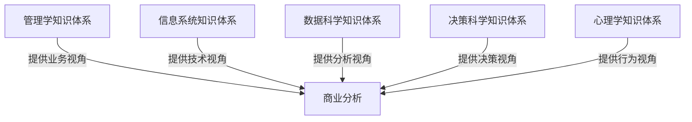
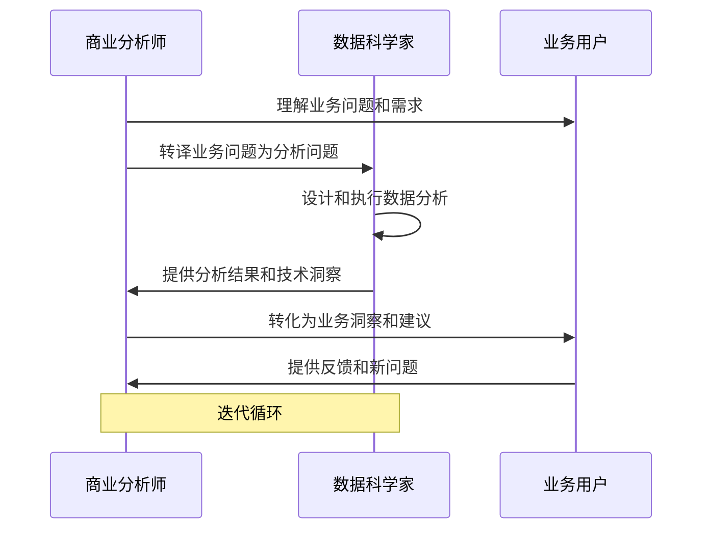
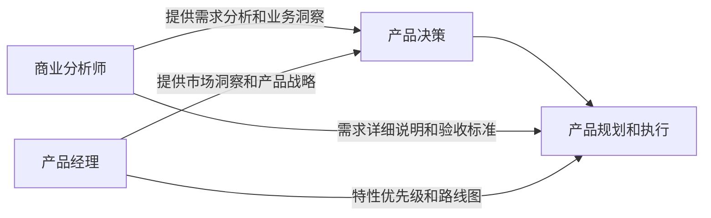
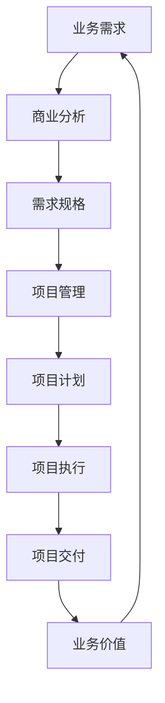
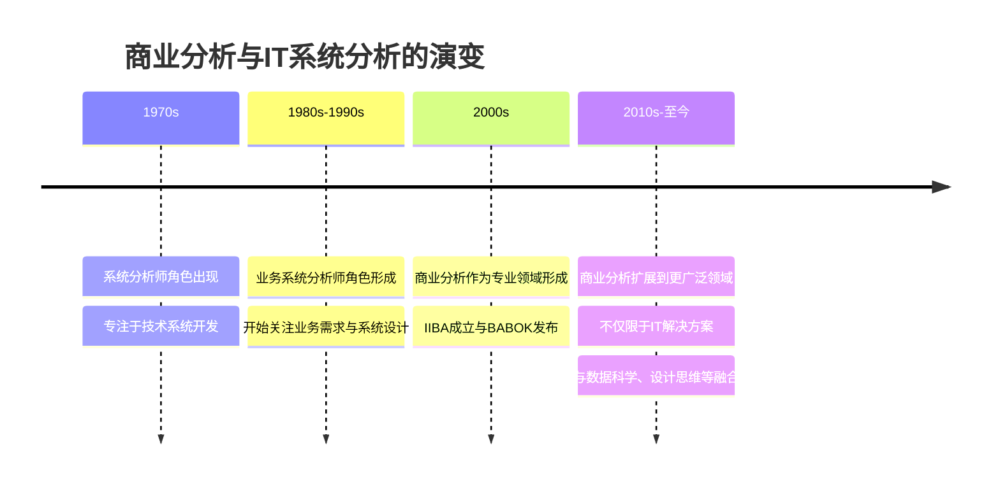
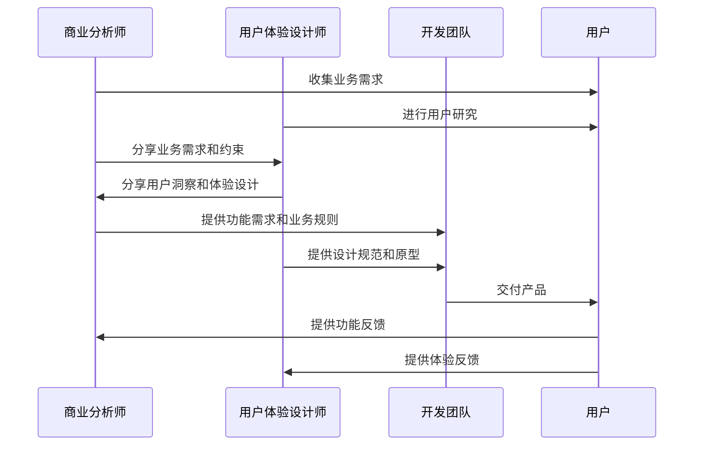
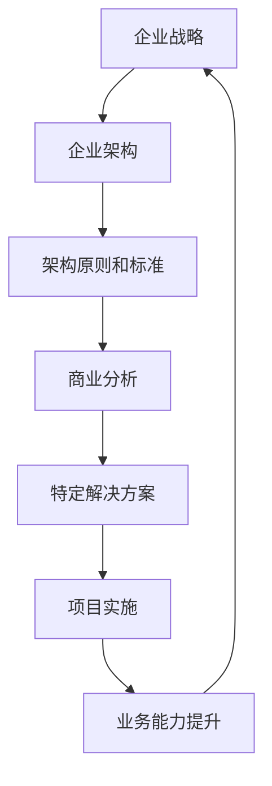

---
{"dg-publish":true,"tags":["商业分析","学科关系","数据科学","管理咨询","产品管理"],"创建日期":"2024-04-26","permalink":"/知识共享/002_商业分析/01_学习内容/01_商业分析基础/1.4 商业分析与相关学科的关系/","dgPassFrontmatter":true}
---

# 商业分析与相关学科的关系

## 引言

商业分析作为一个新兴的跨学科领域，其边界并非泾渭分明，而是与多个专业领域相互交叉、相互影响。理解商业分析与相关学科的关系，不仅有助于我们更全面地把握商业分析的本质和边界，也能帮助我们在实践中更好地借鉴和整合各学科的优势方法和工具。本文将探讨商业分析与数据科学、管理咨询、产品管理等多个相关学科的关系，分析它们之间的异同与协同点，以及未来融合发展的趋势。

## 商业分析的学科定位

### 商业分析的多维视角

商业分析从不同视角可以被视为：

1. **应用学科**：将多学科知识应用于解决实际业务问题的应用型领域
2. **桥梁学科**：连接业务领域和技术领域的中间学科
3. **综合学科**：整合多个相关学科方法论和工具的综合性学科
4. **演进学科**：随着数字化和数据化趋势不断演进发展的新兴学科

### 商业分析在知识体系中的位置

商业分析处于多个知识领域的交叉点：

从知识分类学角度，商业分析可以被视为：

1. **方法论导向**：专注于分析问题和解决方案的方法论集合
2. **实践导向**：以应用实践和实际问题解决为中心的知识领域
3. **跨界导向**：跨越传统学科界限，整合多领域洞察的交叉学科

## 商业分析与数据科学的关系

### 概念界定与区别

**商业分析**：聚焦于识别业务需求，定义和评估解决方案，确保解决方案与业务目标一致。

**数据科学**：集中于从数据中提取知识和洞察，使用统计学、机器学习和编程技能处理和分析大规模数据。

### 交叉与融合

商业分析与数据科学在以下方面存在交叉：

1. **数据分析技能**：两者都需要数据处理、可视化和解释能力
2. **问题解决导向**：两者都致力于通过分析解决实际问题
3. **决策支持功能**：两者最终目标都是支持更好的决策

关键区别包括：

| 维度 | 商业分析 | 数据科学 |
|------|---------|---------|
| 关注点 | 业务问题与解决方案 | 数据模式与算法 |
| 技能侧重 | 业务领域知识、沟通与需求分析 | 统计学、机器学习、编程 |
| 方法论 | 结构化分析方法、过程改进 | 实验设计、模型构建、算法优化 |
| 工具 | 业务建模工具、流程分析工具 | 编程语言(Python, R)、机器学习框架 |
| 成果 | 业务需求、解决方案、战略建议 | 预测模型、算法、数据产品 |

### 协同工作模式

在实践中，商业分析师与数据科学家的协同工作模式：

成功的协同案例：

**信用卡公司的欺诈检测系统**：商业分析师定义业务问题和成功指标(如降低欺诈损失同时减少误判)，数据科学家构建预测模型，商业分析师负责整合模型到业务流程并衡量业务成果。

## 商业分析与管理咨询的关系

### 概念界定与区别

**商业分析**：关注业务需求和解决方案的评估与定义，通常更加具体和操作性。

**管理咨询**：提供战略和运营层面的专业建议，帮助企业提升绩效，范围更广泛。

### 交叉与融合

交叉点包括：

1. **问题诊断能力**：两者都需要识别和定义业务问题
2. **解决方案设计**：两者都需要设计和评估解决方案
3. **利益相关者管理**：两者都需要与多方利益相关者沟通和协调

主要区别：

| 维度 | 商业分析 | 管理咨询 |
|------|---------|---------|
| 视角 | 更偏技术与流程 | 更偏战略与组织 |
| 时间框架 | 通常关注中短期项目 | 可涉及长期战略转型 |
| 交付方式 | 常驻团队或项目组 | 外部咨询顾问 |
| 深度 | 特定领域深入分析 | 广泛议题高层次分析 |
| 方法论 | 结构化分析方法 | 战略框架和变革管理方法 |

### 实践中的互补性

在实际项目中的互补角色：

**企业数字化转型项目**：管理咨询顾问提供整体转型战略和路线图，商业分析师负责具体系统需求定义和实施分析，两者共同确保技术解决方案与业务战略一致。

随着管理咨询的数据化趋势，两个领域界限日益模糊，许多咨询公司正在培养"混合型"人才，同时具备商业分析和管理咨询的技能。

## 商业分析与产品管理的关系

### 概念界定与区别

**商业分析**：关注识别业务需求和定义解决方案，确保解决方案符合业务目标。

**产品管理**：负责产品的整个生命周期，包括产品策略、路线图规划、特性定义和市场成功。

### 交叉与融合

两者的交叉领域：

1. **需求分析**：都需要理解和定义用户需求
2. **解决方案设计**：都参与产品/解决方案的设计过程
3. **商业价值评估**：都需评估解决方案的商业价值

主要区别：

| 维度 | 商业分析 | 产品管理 |
|------|---------|---------|
| 关注重点 | 需求与解决方案的定义和评估 | 产品战略、市场定位和商业成功 |
| 决策权限 | 通常提供建议和分析 | 常拥有产品决策权 |
| 责任范围 | 项目或特定问题领域 | 产品的整个生命周期 |
| 利益相关者 | 内部业务部门和技术团队 | 内部团队和外部客户/市场 |
| 成功指标 | 解决方案质量和业务问题解决 | 产品市场表现和商业成功 |

### 协同合作模式

商业分析师和产品经理的协同工作：

协同案例：

**企业软件开发**：产品经理负责整体产品愿景、路线图和特性优先级排序，商业分析师负责详细需求收集、用户故事编写和验收标准定义，两者紧密合作确保产品既满足市场需求又解决具体业务问题。

## 商业分析与项目管理的关系

### 概念界定与区别

**商业分析**：专注于识别业务需求和定义解决方案。

**项目管理**：负责规划、执行和监控项目，确保项目按时、按预算、按质量完成。

### 交叉与融合

共同点包括：

1. **利益相关者管理**：两者都需要与多方利益相关者合作
2. **范围管理**：两者都涉及定义和管理项目/解决方案范围
3. **变更管理**：两者都需要处理需求和计划变更

关键区别：

| 维度 | 商业分析 | 项目管理 |
|------|---------|---------|
| 关注点 | "做正确的事"(解决正确的问题) | "正确地做事"(高效执行) |
| 主要职责 | 需求定义、解决方案评估 | 计划、协调、监控项目执行 |
| 成功指标 | 解决方案有效性和业务价值 | 按时、按预算、按质量完成 |
| 方法论 | 需求工程、业务建模 | 项目管理框架(PMBOK, PRINCE2等) |
| 技能侧重 | 分析思维、需求引导、解决方案评估 | 计划、组织、协调、风险管理 |

### 协同工作模式

在项目中的协同关系：

协同实践：

**敏捷开发环境**：商业分析师负责理解业务需求并转化为用户故事和验收标准，项目经理/Scrum Master负责促进团队协作和移除障碍，两者共同确保项目交付的解决方案真正满足业务需求。

## 商业分析与IT系统分析的关系

### 概念界定与区别

**商业分析**：更广泛地关注业务问题和解决方案，不限于IT系统。

**IT系统分析**：专注于IT系统的需求分析和功能设计。

### 历史演变

商业分析与IT系统分析的历史关系经历了以下演变：

### 交叉与区别

两者的主要交叉点：

1. **需求分析技能**：都需要收集、分析和文档化需求
2. **系统思维**：都需要系统性思考问题和解决方案
3. **建模技术**：都使用各种建模技术(如流程图、UML等)

主要区别：

| 维度 | 商业分析 | IT系统分析 |
|------|---------|---------|
| 范围 | 全面业务问题解决(可能包括但不限于IT) | 主要关注IT系统设计与实现 |
| 视角 | 业务价值和战略一致性 | 系统功能和技术实现 |
| 所需知识 | 广泛的业务领域知识 | 深入的技术知识 |
| 成果 | 业务需求、解决方案评估、商业案例 | 功能规格、系统设计、技术实现方案 |

### 实践中的融合

在数字化转型时代，这两个角色正在融合：

- 商业分析师需要具备更多技术理解力
- IT系统分析师需要更深入理解业务
- 敏捷方法论促进了角色界限的模糊化

实践案例：

**大型企业资源规划(ERP)实施**：融合了商业分析技能(流程优化、变更管理、业务案例)和IT系统分析技能(系统配置、集成设计、数据迁移)，形成跨职能团队，共同确保系统既满足业务需求又技术可行。

## 商业分析与用户体验设计的关系

### 概念界定与区别

**商业分析**：关注业务需求和解决方案的定义与评估。

**用户体验设计**：专注于创造满足用户需求的、易用且愉悦的产品体验。

### 交叉与融合

共同之处：

1. **用户需求理解**：两者都需要深入理解用户/客户需求
2. **解决方案设计**：两者都参与解决方案设计过程
3. **迭代改进**：两者都采用迭代方法不断改进

主要区别：

| 维度 | 商业分析 | 用户体验设计 |
|------|---------|---------|
| 关注点 | 业务价值和功能需求 | 用户体验和情感连接 |
| 方法论 | 需求工程、业务建模 | 设计思维、用户研究、原型设计 |
| 成果 | 需求规格、用户故事、业务规则 | 用户旅程图、线框图、交互设计 |
| 视角 | 业务与技术平衡 | 用户为中心 |
| 评估标准 | 功能完整性和业务价值 | 可用性和用户满意度 |

### 协同工作模式

有效的协作流程：

成功的协同案例：

**金融科技应用开发**：商业分析师负责定义核心业务需求和合规要求，UX设计师负责创造直观且愉悦的用户旅程，两者紧密合作确保应用既满足业务目标又提供出色的用户体验，最终提高用户采纳率和业务成果。

## 商业分析与数据分析的关系

### 概念界定与区别

**商业分析**：聚焦于理解业务问题并定义解决方案，范围广泛。

**数据分析**：专注于利用数据回答特定问题，发现洞察和支持决策。

### 交叉与融合

共同点：

1. **分析思维**：两者都需要强大的分析思维能力
2. **问题解决**：两者都聚焦于解决业务问题
3. **决策支持**：两者都为决策提供支持

主要区别：

| 维度 | 商业分析 | 数据分析 |
|------|---------|---------|
| 方法 | 定性与定量方法并重 | 以定量分析为主 |
| 数据依赖 | 可能使用但不仅限于数据 | 主要依赖数据驱动 |
| 工具 | 业务建模工具、流程分析工具 | 数据处理工具(Excel, SQL, Tableau等) |
| 技能重点 | 沟通、需求引导、解决方案评估 | 数据处理、统计分析、数据可视化 |
| 成果 | 需求规格、解决方案建议 | 分析报告、仪表板、洞察发现 |

### 协同工作模式

商业分析师和数据分析师的互补角色：

- 商业分析师提出正确的业务问题
- 数据分析师找到数据支持的答案
- 商业分析师将答案转化为业务行动和解决方案

行业案例：

**零售业客户忠诚度计划**：商业分析师定义业务目标和成功指标(如提高客户终身价值)，数据分析师分析购买模式和客户细分，商业分析师将这些洞察转化为具体的营销活动和流程改进。两者共同确保数据洞察转化为有效的业务行动。

## 商业分析与企业架构的关系

### 概念界定与区别

**商业分析**：关注具体业务需求和解决方案评估。

**企业架构**：关注组织的整体结构设计，包括业务、信息、应用和技术架构。

### 交叉与融合

交叉领域：

1. **业务建模**：两者都进行业务建模活动
2. **战略一致性**：两者都关注解决方案与战略的一致性
3. **变革管理**：两者都参与组织变革过程

主要区别：

| 维度 | 商业分析 | 企业架构 |
|------|---------|---------|
| 范围 | 通常针对特定项目或问题领域 | 覆盖整个组织架构 |
| 时间视角 | 多关注中短期解决方案 | 更关注长期架构演进 |
| 抽象层次 | 具体业务需求和解决方案 | 高层架构原则和标准 |
| 方法论 | 需求工程、解决方案评估 | 架构框架(TOGAF, Zachman等) |
| 成果 | 需求规格、解决方案建议 | 架构蓝图、原则和标准 |

### 协同工作关系

商业分析与企业架构的互补作用：

实践案例：

**大型零售商数字化转型**：企业架构师设计整体数字架构和技术标准，商业分析师在这一框架内定义具体业务需求和解决方案。企业架构确保各解决方案的一致性和整合性，商业分析确保每个解决方案解决实际业务问题。

## 商业分析与相关学科的融合趋势

### 知识技能的融合

现代商业分析正与多学科知识交叉融合：

1. **数据素养**：商业分析越来越融合数据分析能力
2. **设计思维**：借鉴用户体验设计的方法论
3. **敏捷实践**：整合敏捷项目管理的协作方式
4. **变革管理**：吸收组织变革管理的方法
5. **商业智能**：结合BI工具和方法

### T型和π型人才的兴起

未来商业分析专业人才趋势：

1. **T型人才**：在商业分析有深度，同时在相关领域有广度
2. **π型人才**：在商业分析和另一专业领域(如数据科学、产品管理)同时具备专业深度
3. **跨界学习**：持续跨学科学习成为标准要求

### 未来发展趋势

商业分析与相关学科融合的主要趋势：

1. **角色边界模糊**：职能交叉和角色融合增加
2. **工具集整合**：不同学科的工具方法相互借鉴
3. **人工智能辅助**：AI辅助分析将改变工作方式
4. **终身学习模式**：持续跨学科学习成为常态
5. **协作生态系统**：跨职能团队和协作平台发展

## 案例研究：学科融合的实践案例

### 案例一：亚马逊的产品开发流程

**背景**：  
亚马逊著名的"逆向工作"流程融合了多学科方法。

**学科融合点**：
- **商业分析 + 产品管理**：通过"产品PRD逆向"流程，先创建产品新闻稿和FAQ，再定义需求
- **商业分析 + 数据科学**：利用数据实验和A/B测试验证业务假设
- **商业分析 + 用户体验**：将客户体验置于中心位置，而非技术或竞争者

**成功因素**：
跨学科团队协作、以客户为中心的文化、数据驱动决策、迭代验证流程。

### 案例二：奈飞的内容决策模型

**背景**：  
奈飞将数据分析与商业分析紧密结合，创建了独特的内容决策模型。

**学科融合点**：
- **商业分析 + 数据科学**：利用高级算法分析观众喜好和行为模式
- **商业分析 + 内容策略**：将数据洞察转化为具体内容投资决策
- **商业分析 + 财务分析**：评估不同内容投资组合的回报率

**成功因素**：
数据与业务洞察的无缝整合、跨职能决策流程、测量与反馈循环。

### 案例三：谷歌的设计冲刺(Design Sprint)方法

**背景**：  
谷歌创建的设计冲刺方法融合了多个学科的方法论。

**学科融合点**：
- **商业分析 + 设计思维**：通过结构化流程快速定义和验证解决方案
- **商业分析 + 敏捷方法**：压缩发现和验证周期，快速迭代
- **商业分析 + 用户研究**：将用户反馈直接整合到解决方案设计

**成功因素**：
跨学科团队组成、时间盒限制、结构化但灵活的流程、快速原型和验证。

### 案例四：中国平安的智能客服系统

**背景**：  
平安保险构建智能客服系统，融合多学科方法。

**学科融合点**：
- **商业分析 + 数据科学**：利用NLP和机器学习理解客户问题
- **商业分析 + 用户体验**：设计自然流畅的对话界面
- **商业分析 + 流程优化**：重新设计客服流程，融合人工和AI

**成功因素**：
业务需求与技术能力的平衡、渐进式实施策略、持续学习和改进机制。

### 案例五：阿里巴巴的数据中台建设

**背景**：  
阿里巴巴的数据中台建设是商业分析与多学科融合的典范。

**学科融合点**：
- **商业分析 + 企业架构**：设计支持业务灵活性的数据架构
- **商业分析 + 数据治理**：建立数据标准和管理流程
- **商业分析 + 产品管理**：将数据能力产品化，服务各业务线

**成功因素**：
业务与技术的深度融合、标准化与自助化平衡、能力沉淀与复用机制。

## 跨学科学习路径与资源

### 核心能力构建

构建跨学科商业分析能力的关键领域：

1. **商业分析基础**：IIBA BABOK知识体系和核心概念
2. **数据分析能力**：基础统计学、数据可视化、SQL基础
3. **设计思维技能**：用户研究方法、原型设计、创新思维
4. **项目方法论**：敏捷、精益、设计冲刺等方法
5. **变革管理能力**：利益相关者管理、组织变革理论

### 学习资源推荐

跨学科学习的优质资源：

1. **认证课程**：
   - IIBA CBAP/CCBA认证
   - Scrum Product Owner认证
   - Data Analysis专业证书(如Google、Microsoft提供的)

2. **书籍推荐**：
   - 《商业分析实践指南》(BABOK指南)
   - 《精益创业》(Eric Ries)
   - 《设计思维:改变世界的无限创意》(Tim Brown)
   - 《用户故事与敏捷方法》(Mike Cohn)
   - 《数据科学入门》(Joel Grus)

3. **在线学习平台**：
   - Coursera的"数据驱动决策"专项课程
   - edX的"商业分析基础"课程
   - LinkedIn Learning的敏捷和设计思维课程

4. **社区与会议**：
   - IIBA当地分会活动
   - 产品与敏捷社区(如Scrum联盟)
   - 数据分析社区(如Kaggle)

### 持续学习策略

有效的跨学科学习策略：

1. **T型学习路径**：先建立商业分析坚实基础，再拓展相关学科知识
2. **项目导向学习**：通过实际项目应用和整合跨学科知识
3. **社区参与**：加入不同专业社区，获取多元视角
4. **导师指导**：寻找不同学科的导师，获取专业指导
5. **反思实践**：定期反思不同学科方法的应用效果

## 思考与实践练习

### 反思问题

1. 你的工作中哪些方面体现了商业分析与其他学科的交叉?
2. 在你的组织中，不同角色(如商业分析师、数据分析师、产品经理)如何协作?有哪些挑战?
3. 你认为自己作为商业分析师，需要加强哪些相关学科的知识?
4. 在你的项目经历中，你是如何整合不同学科的方法和工具的?
5. 你如何看待商业分析学科的未来发展趋势?

### 实践演练

1. **跨角色合作演练**：与数据分析师或UX设计师合作分析一个业务问题，记录各自视角的不同和互补
2. **方法论整合**：尝试将设计思维的双钻模型与传统需求分析流程整合，设计新的问题解决流程
3. **学科视角转换**：选择一个业务问题，分别从商业分析、数据分析、产品管理等角度分析，比较异同
4. **跨学科工具使用**：学习并应用一个你不熟悉领域的工具(如数据可视化工具或原型设计工具)
5. **自我能力评估**：对照IIBA能力模型与其他相关学科能力要求，评估自己的优势与不足

## 相关链接

- [[知识共享/002_商业分析/01_学习内容/01_商业分析基础/1.1 商业分析概述\|1.1 商业分析概述]] - 了解商业分析的基本概念和范围
- [[知识共享/002_商业分析/01_学习内容/01_商业分析基础/1.2 商业分析师的角色与职责\|1.2 商业分析师的角色与职责]] - 深入商业分析师的核心职责与技能
- [[知识共享/002_商业分析/01_学习内容/01_商业分析基础/1.3 商业分析的思维方式\|1.3 商业分析的思维方式]] - 掌握商业分析特有的思维模式和框架
- [[知识共享/002_商业分析/01_学习内容/02_数据收集与处理/2.1 数据收集与处理基础\|2.1 数据收集与处理基础]] - 数据分析在商业分析中的基础应用

## 参考文献

1. International Institute of Business Analysis. (2015). *A Guide to the Business Analysis Body of Knowledge (BABOK Guide), Version 3.0*. IIBA.
2. Brennan, K. (2009). *A Guide to the Business Analysis Body of Knowledge (BABOK Guide), Version 2.0*. IIBA.
3. Brown, T. (2009). *Change by Design: How Design Thinking Transforms Organizations and Inspires Innovation*. HarperBusiness.
4. Cohn, M. (2004). *User Stories Applied: For Agile Software Development*. Addison-Wesley.
5. Gothelf, J., & Seiden, J. (2013). *Lean UX: Applying Lean Principles to Improve User Experience*. O'Reilly Media.
6. Ries, E. (2011). *The Lean Startup: How Today's Entrepreneurs Use Continuous Innovation to Create Radically Successful Businesses*. Crown Business.
7. McKinsey & Company. (2018). *Analytics in Banking: Time to Realize the Value*. McKinsey & Company.
8. Gartner. (2019). *Predicts 2020: Data and Analytics Strategies - Invest, Influence and Impact*. Gartner Research.
9. TOGAF. (2018). *The Open Group Architecture Framework*. The Open Group.
10. Project Management Institute. (2017). *A Guide to the Project Management Body of Knowledge (PMBOK Guide), 6th Edition*. PMI. 