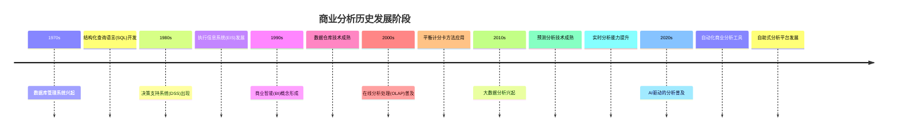
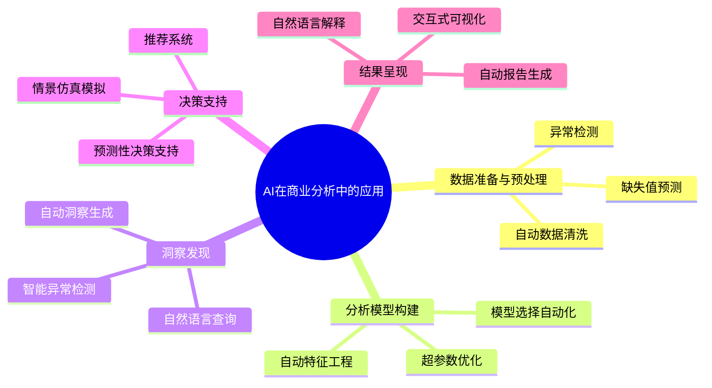
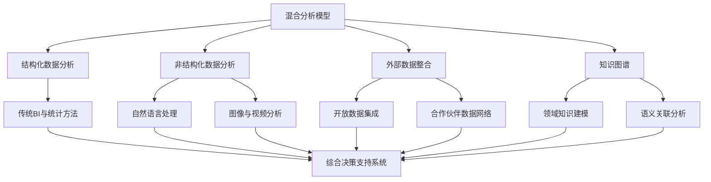

---
{"dg-publish":true,"tags":["商业分析","发展趋势","数字化转型","人工智能","数据驱动"],"创建日期":"2024-05-05","permalink":"/知识共享/002_商业分析/01_学习内容/01_商业分析基础/1.5 商业分析的发展趋势/","dgPassFrontmatter":true}
---

# 1.5 商业分析的发展趋势

> [!quote] 概述
> 本文深入探讨商业分析领域的发展趋势，梳理行业演变历程，分析当前主导趋势，并对未来发展方向做出预测。通过案例研究和趋势分析，帮助商业分析师把握行业脉搏，提前布局未来竞争所需的关键能力。

## 1. 商业分析发展的历史演进

### 1.1 从传统报表到现代商业分析

商业分析的发展历程可以追溯到早期的商业智能和报表系统，经历了多个关键阶段的演变：

### 1.2 商业分析范式的转变

随着技术进步和业务需求的变化，商业分析经历了以下几次重要的范式转变：

1. **从描述性到预测性**：从简单描述"发生了什么"转向预测"将会发生什么"
2. **从批处理到实时**：从周期性的报表分析转向实时数据监控和分析
3. **从专家主导到自助服务**：从IT部门和分析专家主导转向业务人员自助分析
4. **从孤立分析到集成决策**：从独立的分析活动转向与业务流程深度集成
5. **从通用工具到特定领域解决方案**：从通用分析平台转向行业和领域特定的分析应用

## 2. 当前主导的商业分析趋势

### 2.1 数据驱动文化的兴起

数据驱动型组织的特征与传统组织形成鲜明对比：

| 维度 | 传统组织 | 数据驱动型组织 |
|------|----------|----------------|
| 决策基础 | 直觉和经验 | 数据洞察和预测模型 |
| 分析普及度 | 分析师岗位专属 | 全员数据素养 |
| 数据可得性 | 有限且延迟 | 广泛且实时 |
| 实验态度 | 避险规避错误 | 快速实验迭代 |
| 组织架构 | 传统层级结构 | 跨职能数据团队 |
| 技术基础设施 | 孤立的系统 | 集成的数据平台 |

案例：**Netflix的数据驱动决策文化**

Netflix将数据分析融入企业DNA，从内容创作、用户体验到技术架构的每个环节都依托数据决策。例如，《纸牌屋》的创作决策就基于用户喜好数据分析，创下了商业成功的典范。Netflix建立了完整的实验文化，每年进行数千次A/B测试，不断优化用户体验和内容推荐。

### 2.2 人工智能与商业分析的融合

人工智能正在以多种方式重塑商业分析实践：

案例：**埃森哲的AI分析平台**

埃森哲开发了AI驱动的商业分析平台myWizard，该平台能够自动分析大量业务数据，发现模式和异常，并提供可行的业务洞察。此平台将传统需要数周的分析工作缩短到数小时，同时提高了分析准确性和深度，使咨询顾问能够专注于高价值的战略建议而非基础数据处理。

### 2.3 自助式分析与民主化

自助式分析平台的特点与影响：

1. **直观的可视化界面**：降低技术门槛，使非技术用户能够创建复杂分析
2. **预构建的分析模板**：提供行业和场景特定的分析模型，加速应用
3. **自然语言交互**：允许用户使用日常语言提问和获取洞察
4. **协作功能**：支持团队共享、注释和协作分析过程
5. **嵌入式分析**：将分析能力直接集成到业务应用中

案例：**Tableau在星巴克的应用**

星巴克部署Tableau作为全公司的自助分析平台，使门店经理能够独立分析销售数据、客流模式和产品表现。这种民主化的分析能力使决策从总部下放到一线，门店经理能够根据本地市场动态调整运营策略，如调整人员配置、库存管理和促销活动，从而提高了门店效率和顾客满意度。

### 2.4 实时分析与即时洞察

实时分析正在成为竞争优势的关键来源：

- **流处理技术**：如Apache Kafka、Flink等支持毫秒级数据处理
- **边缘计算**：将分析能力推向数据产生的边缘位置，减少延迟
- **内存计算**：通过内存数据库提高分析速度，支持复杂实时查询
- **事件驱动架构**：基于事件的分析系统，支持实时触发和响应

案例：**优步的实时定价系统**

优步开发了复杂的实时分析系统，每秒处理数百万地理位置数据点，实时分析供需情况并动态调整价格。该系统能够在几秒内检测到需求激增，自动实施动态加价，优化司机分布并最大化平台收益。这种实时分析能力成为优步商业模式的核心竞争力。

## 3. 未来商业分析的发展方向

### 3.1 增强分析与智能自动化

增强分析将在以下方面改变分析工作：

1. **自动洞察发现**：AI系统自动识别数据中的趋势、异常和机会
2. **预测性维护**：主动识别潜在问题并建议干预措施
3. **情境感知分析**：考虑用户角色、历史行为和当前上下文的个性化分析
4. **自动化叙事生成**：将数据分析结果自动转化为易于理解的叙事和建议
5. **持续学习系统**：分析系统从用户交互和结果中不断学习和改进

### 3.2 混合分析模型的兴起

未来的分析将整合多种数据类型和分析方法：

案例：**高盛的混合分析平台**

高盛开发了名为Atlas的混合分析平台，整合了市场数据、新闻文本、社交媒体情绪和内部交易数据，创建了全面的市场洞察系统。该系统使用自然语言处理分析文本，机器学习预测市场走势，并通过知识图谱连接各种金融实体，为交易员提供整合的市场视图，显著提升了交易决策的准确性和速度。

### 3.3 商业分析即服务(BAaaS)

预计商业分析即服务将以下列方式发展：

1. **垂直行业特化**：针对特定行业的端到端分析解决方案
2. **微服务分析架构**：模块化的分析组件，可按需组合和部署
3. **多云分析平台**：跨不同云环境的统一分析能力
4. **按需扩展**：根据分析需求自动调整计算资源
5. **零代码分析应用开发**：允许业务用户构建定制分析应用

### 3.4 伦理AI与负责任分析

未来分析将更加注重伦理和责任：

- **算法透明度**：可解释的AI模型与分析逻辑
- **公平性审计**：检测和消除分析系统中的偏见
- **隐私保护分析**：差分隐私等技术保护个人数据
- **合规自动化**：内置法规遵从和自动合规检查
- **可持续分析**：减少分析系统的能源消耗和环境影响

## 4. 对商业分析师的能力要求变化

### 4.1 未来商业分析师的核心能力

商业分析师的角色正在演变，需要掌握新的能力组合：

| 能力领域 | 传统能力 | 未来能力 |
|---------|----------|----------|
| 技术技能 | Excel高级应用 基础SQL查询 静态报表设计 | 编程技能(Python/R) 机器学习理解 数据管道设计 |
| 业务理解 | 功能领域专长 流程分析 基本财务知识 | 跨领域系统思维 数字商业模式理解 变革管理能力 |
| 沟通技能 | 报告撰写 基础数据可视化 分析结果展示 | 数据叙事能力 高级可视化设计 非技术受众翻译 |
| 思维方式 | 分析性思维 问题解决 关注细节 | 设计思维 实验思维 伦理思考 |
| 工具应用 | 专业BI工具 单一平台精通 内部数据处理 | 多平台集成能力 自动化工具链 混合数据源管理 |

### 4.2 学习路径与技能发展建议

针对未来趋势，商业分析师的发展路径建议：

1. **技术升级**
   - 掌握Python或R程序设计基础
   - 了解机器学习基本原理和应用场景
   - 学习现代数据平台架构和数据工程概念

2. **领域专精**
   - 深入特定行业或业务领域
   - 构建跨职能知识网络
   - 了解行业特定的分析最佳实践

3. **软技能提升**
   - 发展数据叙事和可视化传达能力
   - 培养变革管理和影响力技能
   - 建立设计思维和用户导向能力

4. **持续学习机制**
   - 参与数据社区和专业组织
   - 建立个人学习网络和资源库
   - 实践项目导向的技能发展

## 5. 案例研究：商业分析趋势的实际应用

### 5.1 亚马逊：预测性商业分析的应用

亚马逊建立了复杂的预测分析系统，整合了多项前沿趋势：

- **需求预测**：每个SKU的动态需求预测，影响库存管理和物流决策
- **个性化推荐**：实时调整的推荐算法，提高转化率和客户满意度
- **定价优化**：竞争情报和需求弹性驱动的动态定价策略
- **供应链优化**：预测性分析指导仓库选址和路线规划

这些系统每天分析数十亿交易记录和用户行为数据，为业务决策提供支持，使亚马逊能够以较低成本提供更好的客户体验。

### 5.2 星展银行：AI驱动的金融分析转型

星展银行实施了全面的AI驱动分析战略：

- **智能客户细分**：使用无监督学习识别新兴客户群体和行为模式
- **欺诈检测**：实时交易分析系统，使用图分析和机器学习检测异常模式
- **智能客服**：NLP驱动的分析系统，理解客户问题并提供个性化解决方案
- **风险模型**：混合传统统计方法和深度学习的信贷风险评估

通过这些应用，星展银行将欺诈检测准确性提高40%，客户服务响应时间缩短60%，同时提高了风险评估的准确性和效率。

### 5.3 联合利华：自助式分析的全球推广

联合利华实施了大规模的自助式分析计划：

- **全球数据平台**：统一的数据存储和分析环境，支持全球70个国家的业务
- **分析应用市场**：预构建的分析应用库，覆盖营销、供应链、财务等领域
- **培训计划**：针对不同角色的数据技能培训，培养了5000多名"数据公民"
- **分析社区**：内部社区和最佳实践分享网络，促进知识传播

这一计划使联合利华的市场响应速度提高了30%，产品上市时间缩短25%，同时使各级决策者能够独立访问和分析业务数据。

## 6. 思考与自我评估

### 6.1 趋势影响评估

思考以下问题，评估商业分析趋势对你的工作或组织的影响：

1. 你所在组织的数据驱动文化处于什么阶段？主要障碍是什么？
2. 你的分析工作中哪些部分可能被AI自动化？哪些部分需要人类判断？
3. 自助式分析工具在你的组织中如何改变了决策流程和速度？
4. 你所在行业中，实时分析能力如何创造竞争优势？
5. 你的组织是否具备混合分析能力？整合结构化和非结构化数据的主要挑战是什么？
6. 隐私法规和伦理考量如何影响你的分析实践？
7. 你当前的技能组合与未来需求之间存在哪些差距？
8. 你的组织如何平衡中央化分析团队和分散式分析能力的关系？

### 6.2 自我评估测验

评估你对商业分析趋势的理解：

1. 数据驱动文化的核心特征是什么？
2. AI在商业分析中的主要应用领域有哪些？
3. 自助式分析平台与传统BI工具的关键区别是什么？
4. 实时分析系统的技术基础包括哪些关键组件？
5. 增强分析与传统分析的根本区别是什么？
6. 混合分析模型整合了哪些类型的数据和分析方法？
7. 商业分析即服务(BAaaS)的发展趋势有哪些？
8. 负责任分析实践包括哪些关键原则？
9. 未来商业分析师需要具备哪些新能力？
10. 企业如何评估商业分析能力的成熟度？

## 7. 延伸学习资源

### 7.1 推荐书籍

- Davenport, T. H. (2022). *Working with AI: Real Stories of Human-Machine Collaboration*
- Gartner. (2023). *The Future of Analytics and Business Intelligence*
- Franks, B. (2021). *The Analytics Revolution: How to Improve Your Business by Making Analytics Operational*
- Kitchin, R. (2021). *Data Lives: How Data Are Made and Shape Our World*
- Provost, F. & Fawcett, T. (2023). *Data Science for Business: Decision Making and Data Mining*

### 7.2 在线课程与认证

- Google Data Analytics Professional Certificate
- IBM Data Science Professional Certificate
- Microsoft Power BI Data Analyst
- Tableau Desktop Specialist
- IIBA Certification in Business Data Analytics (CBDA)

### 7.3 社区与论坛

- Data Science Central
- Analytics Vidhya
- KDnuggets
- Reddit r/datascience
- LinkedIn Data Science & Analytics Groups

### 7.4 研究报告与白皮书

- Gartner Analytics and BI Magic Quadrant
- Forrester Wave: Enterprise BI Platforms
- McKinsey Global Institute: Analytics Comes of Age
- Deloitte: Analytics Trends Report
- IDC FutureScape: Worldwide Data & Analytics Predictions

## 8. 相关概念链接

- [[知识共享/002_商业分析/01_学习内容/01_商业分析基础/1.1 商业分析概述\|01_商业分析基础/1.1 商业分析概述]]
- [[03_分析方法与工具/3.3 预测性分析方法\|03_分析方法与工具/3.3 预测性分析方法]]
- [[03_分析方法与工具/3.7 Python与R在商业分析中的应用\|03_分析方法与工具/3.7 Python与R在商业分析中的应用]]
- [[07_决策支持系统/7.7 实时决策支持\|07_决策支持系统/7.7 实时决策支持]]
- [[知识共享/002_商业分析/01_学习内容/02_数据收集与处理/2.3 数据可视化技术\|02_数据收集与处理/2.3 数据可视化技术]] 