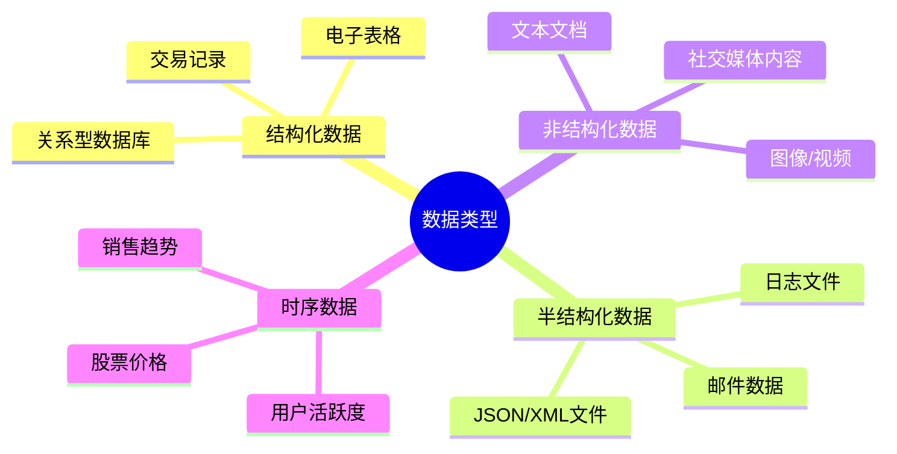
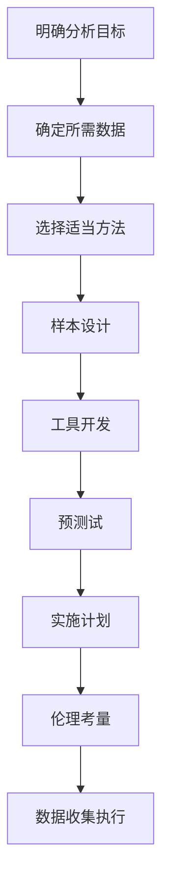

---
{"tags":["商业分析","数据收集","数据处理","数据质量"],"created":"2024-04-26","dg-publish":true,"permalink":"/知识共享/002_商业分析/01_学习内容/02_数据收集与处理/2.1 数据收集与处理基础/","dgPassFrontmatter":true}
---

# 数据收集与处理基础

## 引言

在商业分析中，数据是一切洞察和决策的基础。无论多么先进的分析方法，如果建立在低质量数据之上，都将导致"垃圾输入，垃圾输出"的结果。本章将系统介绍商业分析中的数据收集与处理基础知识，包括数据类型、收集方法、处理技术以及质量管理，为后续深入分析奠定坚实基础。

## 商业分析中的数据类型

### 按数据结构分类

### 按数据来源分类

1. **内部数据**：企业自身产生和拥有的数据
   - ERP系统数据（财务、库存、人力资源）
   - CRM系统数据（客户交易、沟通记录）
   - 网站和应用数据（用户行为、点击流）

2. **外部数据**：来自企业外部环境的数据
   - 市场研究数据
   - 行业报告和统计
   - 社交媒体和公共舆情
   - 政府和公共数据集

### 按采集方式分类

1. **一手数据**：专门为特定目的收集的原始数据
   - 问卷调查
   - 用户访谈
   - 焦点小组讨论
   - A/B测试

2. **二手数据**：为其他目的收集但可被复用的数据
   - 行业报告和论文
   - 公开数据集
   - 历史交易记录

## 数据收集方法

### 定量数据收集技术

1. **问卷调查**
   - **特点**：结构化、可量化、适合大样本
   - **适用场景**：客户满意度评估、市场偏好测试
   - **关键考量**：问题设计、样本代表性、量表选择

2. **系统自动采集**
   - **特点**：实时、大量、低成本
   - **适用场景**：用户行为追踪、销售数据监控
   - **技术手段**：网站埋点、API集成、日志分析

3. **实验设计**
   - **特点**：控制变量、测量因果关系
   - **适用场景**：产品优化、营销效果测试
   - **常见方法**：A/B测试、多变量测试

### 定性数据收集技术

1. **深度访谈**
   - **特点**：深入、开放式、小样本
   - **适用场景**：用户需求探索、产品体验评估
   - **实施要点**：问题框架、访谈技巧、记录方法

2. **观察法**
   - **特点**：直接、情境化、无干扰
   - **适用场景**：用户行为研究、流程优化
   - **类型**：参与式观察、非参与式观察

3. **焦点小组讨论**
   - **特点**：互动、多视角、集体智慧
   - **适用场景**：概念测试、创意激发
   - **组织要点**：人员构成、引导技巧、讨论主题

### 数据收集计划设计

有效的数据收集需要周密的计划，包括以下关键步骤：

1. **明确分析目标**：确定核心问题和决策需求
2. **确定所需数据**：识别为解决问题所需的具体数据点
3. **选择适当方法**：基于目标、资源和时间选择收集方法
4. **样本设计**：确定目标人群和抽样方法
5. **工具开发**：设计问卷、访谈提纲或数据采集系统
6. **预测试**：小规模测试以验证方法有效性
7. **实施计划**：包括时间表、人员分工和质量控制
8. **伦理考量**：确保数据收集符合隐私和伦理标准

## 数据处理基础

### 数据处理流程

1. **数据获取**：从各种渠道收集原始数据
2. **数据清理**：处理缺失值、异常值和重复数据
3. **数据转换**：格式统一、编码转换、数据规范化
4. **数据集成**：合并多源数据，建立关联
5. **数据归约**：降维、聚合、采样以减少数据量
6. **数据分析准备**：特征工程、变量创建
7. **数据安全与合规**：确保处理过程符合隐私法规

### 常见数据质量问题

1. **完整性问题**：数据缺失、记录不完整
2. **准确性问题**：数据错误、记录不准确
3. **一致性问题**：同一数据在不同系统中表示不一致
4. **及时性问题**：数据更新不及时，无法反映当前状况
5. **唯一性问题**：数据重复，影响分析准确性
6. **合规性问题**：数据收集或使用违反隐私法规

### 数据清理技术

1. **缺失值处理**
   - 删除含缺失值的记录（适用于缺失率低且随机缺失）
   - 均值/中位数/众数填充（适用于数值型数据）
   - 基于规则的填充（利用业务逻辑或数据关系）
   - 预测模型填充（利用其他变量预测缺失值）

2. **异常值处理**
   - 基于统计的检测（Z-分数、IQR法则）
   - 基于密度的检测（LOF算法、DBSCAN）
   - 异常值处理策略（删除、替换、隔离）

3. **数据标准化**
   - 数据格式统一（日期、货币、单位）
   - 编码规范化（性别、地区、产品类别）
   - 数值标准化（Min-Max标准化、Z-score标准化）

## 数据存储与管理

### 数据存储系统

1. **关系型数据库**
   - **特点**：结构化、事务支持、ACID特性
   - **典型产品**：MySQL、PostgreSQL、SQL Server
   - **适用场景**：交易处理、结构化业务数据

2. **NoSQL数据库**
   - **特点**：灵活模式、高扩展性、多样数据类型
   - **典型产品**：MongoDB（文档型）、Redis（键值型）
   - **适用场景**：大规模Web应用、实时数据处理

3. **数据仓库**
   - **特点**：面向主题、集成、时变、不可更新
   - **典型产品**：Snowflake、Amazon Redshift
   - **适用场景**：企业报表、历史数据分析

4. **数据湖**
   - **特点**：存储原始数据、格式多样、规模庞大
   - **典型产品**：AWS S3 + Athena、Azure Data Lake
   - **适用场景**：大数据分析、机器学习训练

### 数据管理最佳实践

1. **数据治理**
   - 建立数据所有权和责任制
   - 制定数据标准和规范
   - 实施数据质量监控机制

2. **元数据管理**
   - 记录数据来源和转换过程
   - 定义数据字段含义和业务规则
   - 构建数据血缘关系图

3. **数据安全与隐私**
   - 实施数据访问控制
   - 数据脱敏和匿名化处理
   - 合规性审计和记录

## 数据收集与处理工具

### 数据收集工具

1. **调查问卷工具**
   - **商业工具**：Qualtrics、SurveyMonkey
   - **开源选择**：LimeSurvey、Google Forms

2. **网站数据采集**
   - **分析平台**：Google Analytics、Adobe Analytics
   - **热图工具**：Hotjar、Crazy Egg
   - **自定义追踪**：GTM、Segment

3. **API和数据集成**
   - **API管理**：Postman、Apigee
   - **数据集成**：Zapier、Talend

### 数据处理工具

1. **电子表格软件**
   - **适用场景**：小型数据集、基础分析、快速原型
   - **代表工具**：Excel、Google Sheets

2. **专业统计软件**
   - **适用场景**：复杂统计分析、科研级分析
   - **代表工具**：SPSS、SAS、R

3. **编程语言和库**
   - **适用场景**：自动化处理、高度定制化分析
   - **代表工具**：Python(Pandas, NumPy)、R(tidyverse)

4. **ETL平台**
   - **适用场景**：企业级数据集成与转换
   - **代表工具**：Informatica、Talend、Apache NiFi

## 案例分析：星巴克的数据驱动客户体验

### 背景与挑战

星巴克面临实体店增长放缓和竞争加剧的挑战，需要通过数据优化客户体验和运营效率。

### 数据收集策略

1. **移动应用数据**：通过星巴克应用收集用户偏好、购买历史和位置数据
2. **会员卡交易**：追踪会员购买行为和偏好变化
3. **门店运营数据**：收集各门店销售、库存和人流数据
4. **社交媒体情感**：分析社交平台上的品牌提及和评价

### 数据处理与应用

1. **建立统一客户视图**：整合多来源数据，构建360度客户画像
2. **实施个性化推荐**：基于购买历史和偏好提供定制化优惠
3. **优化门店运营**：根据流量和销售模式调整人员配置和库存
4. **产品创新驱动**：基于数据洞察开发新饮品和服务

### 成果与启示

1. **业务成果**：移动订单占比提升至25%，顾客满意度提高15%
2. **关键经验**：
   - 数据收集应围绕客户旅程设计
   - 实时数据处理为业务决策提供时效价值
   - 数据隐私保护是客户信任的基础

## 学习资源与进阶方向

### 推荐学习资源

1. **书籍**
   - 《数据科学入门》(Field Cady)
   - 《数据清洗手册》(Megan Squire)

2. **在线课程**
   - Coursera: 数据科学方法论
   - DataCamp: 数据处理与清洗

3. **实践工具**
   - Kaggle平台的数据集和案例
   - GitHub上的开源数据处理项目

### 进阶学习路径

1. **数据工程**：深入学习ETL工具和大数据处理框架
2. **高级数据分析**：掌握统计学和预测建模方法
3. **数据可视化**：学习高效数据展示和故事讲述技术

## 相关链接

- [[2.2 数据分析方法\|2.2 数据分析方法]] - 了解如何对收集和处理的数据进行深入分析
- [[2.3 数据可视化技术\|2.3 数据可视化技术]] - 掌握数据可视化的原则与实践
- [[3.1 统计分析基础\|3.1 统计分析基础]] - 学习基本统计方法在商业分析中的应用

## 参考文献

1. Patel, N. (2021). Data Collection Methods for Business Analysis. Journal of Business Analytics, 5(2), 78-92.
2. Kimball, R., & Ross, M. (2013). The Data Warehouse Toolkit: The Definitive Guide to Dimensional Modeling.
3. Rahm, E., & Do, H. H. (2000). Data Cleaning: Problems and Current Approaches. IEEE Data Engineering Bulletin, 23(4), 3-13.
4. Davenport, T. H. (2018). What Businesses Can Learn from Starbucks' Data Strategy. Harvard Business Review.
5. DAMA International. (2017). DAMA-DMBOK: Data Management Body of Knowledge. 