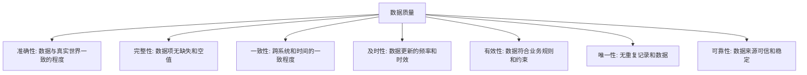
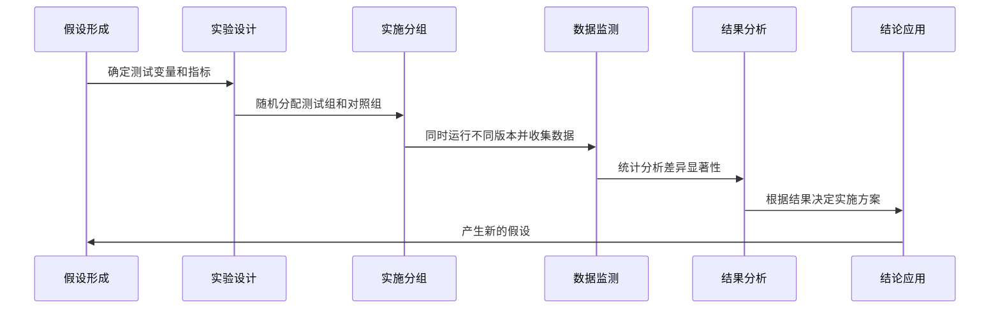

---
{"dg-publish":true,"tags":["商业分析","数据收集","数据处理","数据分析基础"],"创建日期":"2024-04-26","permalink":"/知识共享/002_商业分析/01_学习内容/02_数据收集与处理/2.1 数据收集与处理基础/","dgPassFrontmatter":true}
---

## 引言

在商业分析领域，数据是决策的基石。高质量的数据能够支撑准确的业务洞察，而低质量的数据则可能导致错误的判断。数据收集与处理是商业分析工作的前提和基础，它直接决定了后续分析的质量和可靠性。本文将系统介绍数据收集与处理的基本概念、关键技术、常见挑战及实践方法，帮助商业分析师建立坚实的数据基础，为后续的深入分析奠定基础。

## 数据基础概念

### 数据的定义与特性

数据是对现实世界客观事物的记录和描述，是信息和知识的基础。从商业分析角度，数据具有以下特性：

1. **客观性**：数据应客观反映事实，不带主观色彩
2. **相关性**：数据与特定业务问题或目标相关
3. **时效性**：数据具有时间属性，反映特定时点的状态
4. **精确性**：数据应具备适当的精度和准确度
5. **可比性**：相同类型的数据应具有可比性
6. **一致性**：数据在不同渠道和时点保持一致

### 数据类型与分类

根据不同维度，数据可以分为多种类型：

**按结构化程度分类**：
- **结构化数据**：具有固定模式和清晰结构，如关系型数据库中的表格数据
- **半结构化数据**：具有一定结构但不固定，如JSON、XML文件
- **非结构化数据**：没有预定义的数据模型，如文本文档、图像、视频

**按数据性质分类**：
- **定量数据**：可以精确测量和计数的数值数据，如销售额、客户数量
- **定性数据**：描述性数据，如客户评价、产品评论、访谈记录

**按数据来源分类**：
- **内部数据**：组织内部生成的数据，如ERP系统、CRM系统数据
- **外部数据**：来自组织外部的数据，如市场调研数据、行业报告
- **一手数据**：专门为特定目的收集的原始数据
- **二手数据**：为其他目的收集但可再利用的数据

### 数据质量维度

高质量数据应满足多个维度的要求：

## 数据收集方法

### 数据收集策略

有效的数据收集需要明确的策略：

1. **目标导向**：根据业务问题和分析目标确定需要收集的数据
2. **范围界定**：明确数据收集的边界、粒度和详细程度
3. **资源平衡**：在数据价值和收集成本之间寻求平衡
4. **多源验证**：使用多种来源交叉验证数据的准确性
5. **合规保障**：确保数据收集符合法律法规和隐私保护要求

### 内部数据收集

组织内部数据收集方法：

| 数据来源 | 典型数据类型 | 收集方法 | 优势 | 局限性 |
|---------|------------|---------|------|--------|
| ERP系统 | 交易数据、财务数据 | 系统提取、API接口 | 全面、结构化 | 可能存在集成问题 |
| CRM系统 | 客户数据、销售数据 | 系统报表、数据导出 | 客户洞察丰富 | 数据质量依赖录入 |
| 生产系统 | 生产记录、质量数据 | 自动化采集、日志分析 | 实时性强 | 可能数据量大 |
| 网站/应用 | 用户行为数据、点击流 | 埋点、日志、分析工具 | 行为细节丰富 | 需要隐私合规 |
| 内部文档 | 非结构化战略、规划 | 文本分析、人工提取 | 上下文信息丰富 | 提取难度大 |

### 外部数据收集

外部数据收集的主要方法：

1. **市场调研**：
   - 问卷调查：设计问卷收集目标群体数据
   - 深度访谈：与利益相关者的一对一访谈
   - 焦点小组：组织小组讨论获取群体观点

2. **观察法**：
   - 直接观察：研究人员直接观察被研究对象
   - 参与式观察：研究人员参与到被研究环境中
   - 神秘购物：模拟客户体验并记录观察结果

3. **外部数据源**：
   - 公开数据：政府数据、行业报告、学术研究
   - 商业数据：第三方数据提供商、市场研究公司
   - 社交媒体：社交平台上的公开讨论和评论
   - 网络爬虫：从网站自动提取数据(注意合规性)

### 实验与A/B测试

通过实验生成数据的方法：

1. **A/B测试流程**：

2. **主要应用场景**：
   - 产品功能测试：测试新功能对用户行为的影响
   - 界面设计优化：比较不同设计方案的转化效果
   - 定价策略测试：测试不同价格对销售和利润的影响
   - 营销内容优化：测试不同消息和内容的效果

3. **实验设计关键点**：
   - 单一变量：每次只测试一个变量以确保结果可归因
   - 随机分配：确保测试组和对照组具有可比性
   - 足够样本：确保统计显著性
   - 适当持续时间：避免时间影响和季节性因素

## 数据处理流程

### 数据处理的基本步骤

数据从收集到可用于分析需要经过一系列处理：

### 数据清洗技术

数据清洗是提高数据质量的关键步骤：

1. **处理缺失值**：
   - 删除：移除含缺失值的记录(适用于缺失比例小)
   - 填充：用均值、中位数、众数或预测值填充
   - 标记：将缺失本身作为一种状态保留

2. **识别和处理异常值**：
   - 统计方法：Z-分数、IQR(四分位间距)法
   - 图形方法：箱线图、散点图识别
   - 处理方法：移除、替换、分类处理或变换

3. **去重处理**：
   - 精确匹配：完全相同记录的识别
   - 模糊匹配：近似记录的识别(编辑距离、相似度算法)
   - 规则匹配：基于业务规则的重复判定

4. **数据一致性检查**：
   - 格式一致性：统一日期、货币、单位等格式
   - 值域检查：确保数据在合理范围内
   - 逻辑一致性：检查相关字段间的逻辑关系

### 数据转换与集成

将清洗后的数据转换为适合分析的形式：

1. **数据转换**：
   - 标准化/归一化：将数据调整到相同尺度
   - 离散化：将连续变量转换为分类变量
   - 聚合：将详细数据汇总到所需粒度
   - 变量转换：对数、平方根等数学变换

2. **数据集成**：
   - 纵向集成：合并具有相同结构的多个数据集
   - 横向集成：合并具有不同属性的相关数据集
   - 关联规则：确定不同数据集之间的关联键
   - 冲突解决：处理集成过程中的数据冲突

### 数据库与数据仓库

数据存储和管理的主要系统：

1. **关系型数据库(RDBMS)**：
   - 结构：基于表、行、列的结构化数据存储
   - 特点：ACID特性(原子性、一致性、隔离性、持久性)
   - 适用场景：交易处理、结构化数据管理
   - 常见系统：MySQL, Oracle, SQL Server

2. **数据仓库**：
   - 结构：主题导向、集成化、时变性、非易失性
   - 特点：面向分析的历史数据存储
   - 适用场景：商业智能、历史数据分析、报表生成
   - 架构类型：星型模式、雪花模式

3. **大数据平台**：
   - 结构：分布式存储和处理
   - 特点：高容量、高速度、多样性
   - 适用场景：大规模数据处理、实时分析
   - 技术栈：Hadoop, Spark, Hive等

### ETL与ELT流程

数据处理的两种主要架构模式：

1. **ETL(提取-转换-加载)**：
   - 流程：先从源系统提取数据，在中间层转换，再加载到目标系统
   - 优势：目标系统数据质量高，性能负担小
   - 局限：处理延迟，灵活性较低
   - 工具：Informatica, Talend, SSIS

2. **ELT(提取-加载-转换)**：
   - 流程：先提取数据直接加载到目标系统，再在目标系统内转换
   - 优势：更快的加载速度，更灵活的转换
   - 局限：需要目标系统有强大处理能力
   - 适用：现代数据仓库、大数据环境

对比：

| 特征 | ETL | ELT |
|------|-----|-----|
| 处理位置 | 中间层服务器 | 目标数据库/仓库 |
| 数据量 | 中小规模数据 | 大规模数据 |
| 加载速度 | 较慢(需先转换) | 较快(直接加载) |
| 转换灵活性 | 较低(预定义) | 较高(可随时调整) |
| 系统要求 | 中间层资源 | 目标系统处理能力 |
| 典型应用 | 传统数据仓库 | 现代数据湖、云数据仓库 |

## 数据收集与处理工具

### 数据收集工具

常用的数据收集工具及其特点：

1. **调查与表单工具**：
   - Google Forms：免费易用的在线表单
   - Survey Monkey：专业调查平台，支持复杂逻辑
   - Typeform：注重用户体验的交互式表单
   - Qualtrics：企业级调研平台，功能全面

2. **网站分析工具**：
   - Google Analytics：网站流量与用户行为分析
   - Hotjar：热图与用户行为录制工具
   - Mixpanel：产品分析与事件跟踪
   - Adobe Analytics：企业级网站分析平台

3. **移动应用分析**：
   - Firebase Analytics：移动应用分析平台
   - Appsflyer：移动归因与营销分析
   - Amplitude：产品与用户行为分析

4. **API与数据连接器**：
   - Zapier：不同应用间的自动化集成
   - Segment：客户数据平台，集中管理数据源
   - Apigee：API管理与分析平台

### 数据处理与分析工具

各类数据处理工具及适用场景：

1. **电子表格**：
   - Microsoft Excel：最广泛使用的数据处理工具
   - Google Sheets：协作友好的在线电子表格
   - 适用场景：中小规模数据处理，快速分析与可视化

2. **统计与数据分析软件**：
   - SPSS：传统统计分析软件，界面友好
   - SAS：企业级分析平台，功能全面
   - R：开源统计编程语言，扩展包丰富
   - 适用场景：专业统计分析，研究与报告

3. **数据处理编程语言**：
   - Python(Pandas, NumPy)：灵活强大的数据处理能力
   - R(dplyr, tidyr)：统计分析与数据处理
   - SQL：结构化数据查询与处理
   - 适用场景：自动化处理，复杂数据操作，可重复分析

4. **商业智能工具**：
   - Tableau：直观的数据可视化与探索
   - Power BI：微软生态集成的BI平台
   - Looker：现代云BI与数据平台
   - 适用场景：数据仪表板，交互式报表，业务监控

5. **ETL与数据集成工具**：
   - Informatica：企业级数据集成平台
   - Talend：开源与商业数据集成工具
   - Apache NiFi：数据流与处理自动化
   - 适用场景：数据仓库建设，系统集成，数据流程自动化

### 选择合适工具的考虑因素

在选择数据工具时需考虑的要素：

1. **业务需求**：
   - 分析目标和用例
   - 所需功能和特性
   - 用户技能水平和偏好

2. **技术因素**：
   - 数据规模与复杂度
   - 性能与扩展需求
   - 与现有系统的集成能力
   - 安全性与合规性要求

3. **组织因素**：
   - 预算与成本
   - 内部技术能力
   - 长期维护与支持
   - 总体拥有成本(TCO)

## 数据收集与处理的实践挑战

### 数据质量管理

确保数据质量的主要挑战与实践：

1. **常见数据质量问题**：
   - 不完整数据：关键字段缺失或空值
   - 不准确数据：与实际不符或录入错误
   - 不一致数据：同一实体在不同系统中表示不同
   - 重复数据：多条记录表示同一实体
   - 过时数据：未及时更新的过期信息

2. **数据质量管理框架**：
   - 定义标准：建立清晰的数据质量标准和指标
   - 质量评估：定期评估和监控数据质量
   - 根本原因分析：识别质量问题的源头
   - 持续改进：实施流程改进和工具优化

3. **数据治理实践**：
   - 数据所有权：明确数据资产的责任人
   - 数据生命周期：管理从创建到归档的全周期
   - 元数据管理：记录数据的定义、来源和关系
   - 质量监控：建立监控机制和报警系统

### 数据隐私与合规

在数据收集与处理中的隐私考量：

1. **主要法规要求**：
   - GDPR(欧盟)：个人数据处理的综合法规
   - CCPA/CPRA(加州)：消费者隐私保护法案
   - PIPL(中国)：个人信息保护法
   - 行业特定法规：HIPAA(医疗)、GLBA(金融)等

2. **合规最佳实践**：
   - 数据最小化：只收集必要的数据
   - 明确同意：获取数据主体的明确授权
   - 目的限制：仅为声明的目的使用数据
   - 安全措施：实施适当的数据保护措施
   - 透明度：清晰告知数据处理活动
   - 数据主体权利：支持查阅、更正、删除等权利

3. **隐私增强技术**：
   - 数据匿名化：移除个人标识信息
   - 数据假名化：替换标识符但保留分析价值
   - 差分隐私：添加噪声保护个体隐私
   - 加密技术：保护数据传输和存储安全

### 大规模数据处理挑战

处理大量数据时的主要挑战：

1. **技术挑战**：
   - 存储容量：管理PB级数据的存储需求
   - 处理速度：在可接受时间内处理海量数据
   - 数据多样性：处理结构化、半结构化和非结构化数据
   - 实时性要求：满足低延迟和流处理需求

2. **解决方案**：
   - 分布式架构：横向扩展处理能力
   - 云计算：利用弹性资源和按需扩展
   - 数据采样：适当情况下使用数据子集
   - 增量处理：只处理变化的数据
   - 并行计算：利用MapReduce等并行处理模型

3. **成本与效益平衡**：
   - 价值评估：评估数据处理的商业价值
   - 存储分层：按价值和访问频率分层存储
   - 处理优化：优化查询和算法效率
   - 云资源管理：优化云资源使用和成本

## 数据收集与处理的行业实践案例

### 零售业案例

**案例：全渠道零售商客户数据整合**

**背景**：大型零售商需要整合线上和线下多个渠道的客户数据，以创建统一的客户视图。

**挑战**：
- 多系统数据不一致(POS系统、电商平台、会员系统)
- 客户识别与匹配困难
- 数据质量参差不齐
- 实时数据需求与批处理平衡

**解决方案**：
1. 建立客户数据平台(CDP)整合各渠道数据
2. 实施确定性和概率性匹配算法识别同一客户
3. 建立数据质量评分系统和自动化修复流程
4. 采用混合架构：关键数据实时处理，其他数据批处理

**成果**：
- 创建360°客户视图，识别率提升40%
- 个性化营销效果提升35%
- 客户生命周期价值分析准确度提高25%
- 库存预测准确度提升20%

### 金融服务案例

**案例：银行风险数据整合与分析**

**背景**：大型银行需要整合多个业务线和系统的风险数据，以满足监管要求并优化风险管理。

**挑战**：
- 异构系统数据格式不一致
- 严格的数据准确性和完整性要求
- 复杂的监管合规要求
- 历史数据与实时数据的平衡

**解决方案**：
1. 建立企业级数据仓库与主数据管理(MDM)系统
2. 实施严格的数据质量控制流程和检查点
3. 建立数据沿袭追踪系统确保可审计性
4. 采用混合存储策略：关系型数据库+大数据平台

**成果**：
- 监管报告生成时间从5天减少到1天
- 数据质量问题减少75%
- 风险评估的准确性提高30%
- 信贷决策时间缩短60%

### 医疗健康案例

**案例：医疗机构患者数据整合与分析**

**背景**：大型医疗系统需要整合多个医院、诊所和系统的患者数据，以提升护理质量和运营效率。

**挑战**：
- 严格的隐私法规和安全要求(HIPAA)
- 多种临床系统和格式的数据集成
- 结构化与非结构化数据(影像、临床笔记)混合
- 实时数据访问需求

**解决方案**：
1. 建立符合HIPAA的健康信息交换平台
2. 采用医疗标准(HL7, FHIR)实现系统互操作性
3. 结合NLP技术处理临床笔记等非结构化数据
4. 实施严格的访问控制和数据匿名化策略

**成果**：
- 降低30%的不必要重复检查
- 临床决策支持准确度提高40%
- 患者再入院率降低15%
- 资源调配效率提升25%

## 数据收集与处理的最佳实践

### 规划与战略

有效数据收集与处理的前期规划：

1. **数据需求评估**：
   - 确定业务问题和分析目标
   - 识别所需数据类型和来源
   - 评估现有数据资产和缺口
   - 确定数据粒度和历史深度需求

2. **数据战略制定**：
   - 数据收集优先级排序
   - 确定构建vs购买决策
   - 设计数据架构和流程
   - 资源规划和预算分配

3. **利益相关者参与**：
   - 明确业务部门的数据需求
   - 获取管理层支持和资源承诺
   - 确保IT和业务团队协作
   - 建立清晰的责任和沟通机制

### 实施与管理

数据收集与处理的实施最佳实践：

1. **渐进式实施**：
   - 从小规模试点开始
   - 快速迭代和持续改进
   - 验证价值后再扩大规模
   - 基于经验教训调整方法

2. **自动化与监控**：
   - 尽可能自动化重复任务
   - 建立数据流程监控机制
   - 实施异常检测和警报
   - 定期审计和维护数据流程

3. **文档与知识管理**：
   - 详细记录数据定义和字典
   - 维护数据沿袭和处理流程文档
   - 记录数据限制和已知问题
   - 建立数据使用的最佳实践库

### 技能与团队建设

数据处理相关的人才和技能发展：

1. **核心技能需求**：
   - 数据收集与问卷设计技能
   - 数据清洗和预处理能力
   - 数据库和SQL知识
   - 基本编程能力(Python, R等)
   - 数据可视化技能
   - 统计分析基础

2. **团队结构与角色**：
   - 数据工程师：负责数据管道和基础设施
   - 数据分析师：进行分析和洞察生成
   - 数据科学家：应用高级方法和模型
   - 数据管理员：确保数据质量和治理
   - 业务分析师：连接业务需求和数据解决方案

3. **持续学习与发展**：
   - 建立内部培训和知识分享
   - 鼓励认证和外部学习
   - 构建实践社区和学习文化
   - 参与行业会议和交流

## 未来趋势与发展方向

### 技术发展趋势

数据收集与处理领域的新兴技术：

1. **人工智能辅助数据处理**：
   - 自动化数据清洗和准备
   - 智能异常检测和修复
   - 自动元数据生成和标记
   - 预测性数据质量管理

2. **实时数据处理**：
   - 流处理架构普及
   - 低延迟分析能力
   - 事件驱动架构
   - 边缘计算与处理

3. **自助式数据准备**：
   - 无代码/低代码数据处理工具
   - 业务用户友好的界面
   - 智能建议和辅助功能
   - 自动化数据转换推荐

4. **数据网格架构**：
   - 分布式数据所有权
   - 领域驱动的数据产品
   - 自服务数据基础设施
   - 联邦治理模型

### 方法论演进

数据实践方法的发展趋势：

1. **数据产品思维**：
   - 将数据视为产品而非项目
   - 用户体验驱动的数据设计
   - 持续改进的数据服务
   - 产品化的数据资产管理

2. **敏捷数据实践**：
   - 迭代式数据开发
   - 快速实验和验证
   - 跨职能数据团队
   - 持续集成与交付数据

3. **数据道德与责任**：
   - 算法公平性和透明度
   - 负责任的数据使用框架
   - 主动隐私保护设计
   - 可持续的数据实践

4. **数据文化与素养**：
   - 全组织数据素养提升
   - 数据驱动决策文化
   - 民主化的数据访问
   - 数据叙事和沟通能力

## 思考与实践练习

### 反思问题

1. 在你的组织中，数据收集过程中面临的最大挑战是什么?如何改进?
2. 你如何评估所收集数据的质量?有哪些关键指标?
3. 在处理不同来源的数据时，你如何确保数据的一致性和准确性?
4. 你的组织是否有明确的数据治理框架?如不完善，应如何建立?
5. 数据隐私法规如何影响你的数据收集和处理实践?需要哪些调整?

### 实践练习

1. **数据需求分析**：
   选择一个业务问题，详细列出解决该问题所需的数据类型、来源、格式和质量要求。

2. **数据收集计划**：
   设计一个调查问卷或数据收集表单，确保问题设计遵循最佳实践，避免偏见和歧义。

3. **数据清洗实践**：
   获取一个包含典型数据质量问题(缺失值、异常值、重复等)的数据集，设计并实施清洗流程。

4. **ETL流程设计**：
   为特定业务场景设计一个完整的ETL/ELT流程，包括数据来源、转换逻辑和加载策略。

5. **数据质量评估**：
   对一个现有数据集应用数据质量评估框架，计算关键质量指标并提出改进建议。

## 相关链接

- [[知识共享/002_商业分析/01_学习内容/01_商业分析基础/1.1 商业分析概述\|1.1 商业分析概述]] - 了解商业分析的基本概念和范围
- [[知识共享/002_商业分析/01_学习内容/01_商业分析基础/1.2 商业分析师的角色与职责\|1.2 商业分析师的角色与职责]] - 商业分析师在数据工作中的职责
- [[知识共享/002_商业分析/01_学习内容/01_商业分析基础/1.3 商业分析的思维方式\|1.3 商业分析的思维方式]] - 数据分析思维与商业分析思维
- [[知识共享/002_商业分析/01_学习内容/01_商业分析基础/1.4 商业分析与相关学科的关系\|1.4 商业分析与相关学科的关系]] - 数据科学与商业分析的关系
- [[2.2 数据分析方法与工具\|2.2 数据分析方法与工具]] - 进阶数据分析技术
- [[2.3 数据可视化基础\|2.3 数据可视化基础]] - 有效呈现数据分析结果

## 参考文献

1. Kimball, R., & Ross, M. (2013). *The Data Warehouse Toolkit: The Definitive Guide to Dimensional Modeling* (3rd ed.). Wiley.
2. Few, S. (2012). *Show Me the Numbers: Designing Tables and Graphs to Enlighten* (2nd ed.). Analytics Press.
3. Dasu, T., & Johnson, T. (2003). *Exploratory Data Mining and Data Cleaning*. Wiley.
4. Pyle, D. (1999). *Data Preparation for Data Mining*. Morgan Kaufmann.
5. Loshin, D. (2010). *Master Data Management*. Morgan Kaufmann.
6. DAMA International. (2017). *DAMA-DMBOK: Data Management Body of Knowledge* (2nd ed.). Technics Publications.
7. Redman, T. C. (2008). *Data Driven: Profiting from Your Most Important Business Asset*. Harvard Business Press.
8. Davenport, T. H., & Harris, J. G. (2017). *Competing on Analytics: The New Science of Winning* (Rev. ed.). Harvard Business Review Press.
9. Aggarwal, C. C. (2015). *Data Mining: The Textbook*. Springer.
10. Tan, P. N., Steinbach, M., Karpatne, A., & Kumar, V. (2018). *Introduction to Data Mining* (2nd ed.). Pearson. 