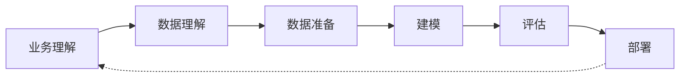
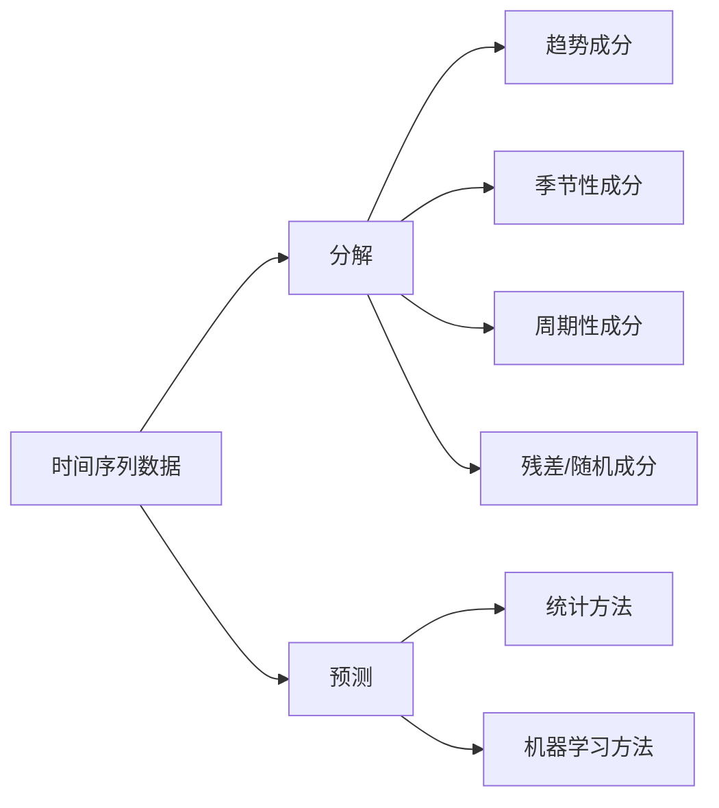
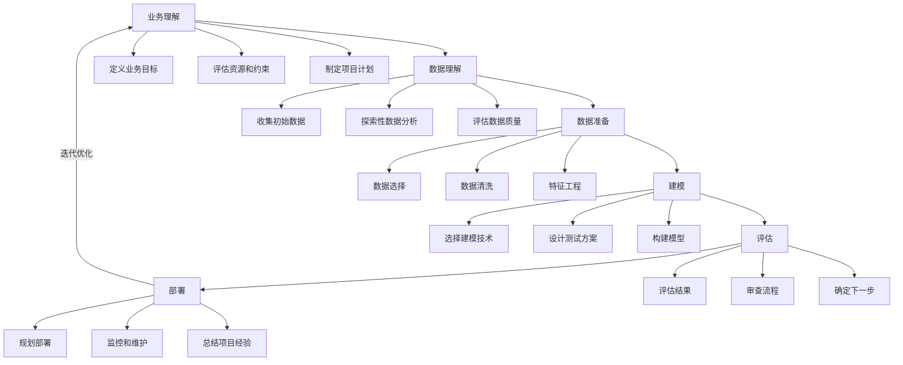
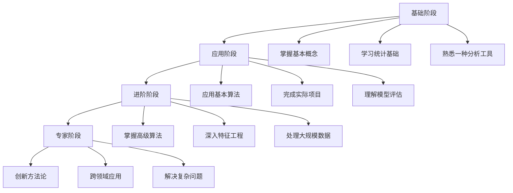

---
{"dg-publish":true,"tags":["商业分析","数据挖掘","数据分析","预测分析","机器学习"],"创建日期":"2024-04-28","permalink":"/知识共享/002_商业分析/01_学习内容/02_数据收集与处理/2.2 数据挖掘与分析技术/","dgPassFrontmatter":true}
---

## 引言

数据挖掘与分析技术是现代商业分析的核心能力，它使组织能够从海量数据中发现隐藏的模式、关系和趋势，进而支持更明智的商业决策。随着数据量的爆炸性增长和计算能力的提升，数据挖掘与分析技术在商业领域的应用日益广泛且深入。本文将系统介绍数据挖掘的基本概念、核心技术、应用场景以及实施方法，帮助商业分析师掌握这一强大工具，从数据中提取最大价值。

## 数据挖掘基础

### 数据挖掘的定义与价值

数据挖掘是从大型数据集中提取有价值信息和知识的过程，它结合了统计学、机器学习、人工智能和数据库技术等多个学科的方法。

**数据挖掘的核心价值**：

1. **发现隐藏模式**：识别数据中不明显的规律和关系
2. **预测未来趋势**：基于历史数据预测未来可能的发展
3. **识别异常情况**：检测偏离正常模式的异常值和行为
4. **提炼行动洞察**：将数据发现转化为可执行的业务建议
5. **自动化决策支持**：为决策过程提供数据驱动的支持

### 数据挖掘与知识发现过程

知识发现在数据库(KDD)过程是一个系统化的数据挖掘流程：

1. **业务理解**：确定业务目标，将其转化为数据挖掘问题
2. **数据理解**：收集初始数据，熟悉数据特征和质量
3. **数据准备**：清洗、转换和整合数据为适合挖掘的形式
4. **建模**：选择和应用合适的数据挖掘技术
5. **评估**：评估模型结果是否满足业务目标
6. **部署**：将挖掘成果转化为业务行动

### 数据挖掘任务类型

数据挖掘任务可分为两大类：

**描述性任务**：发现数据中的模式和特征
- 聚类分析：将相似对象分组
- 关联规则发现：识别事件间的共现关系
- 异常检测：识别偏离正常模式的数据

**预测性任务**：预测未知或未来值
- 分类：预测类别标签
- 回归：预测连续值
- 时间序列预测：预测随时间变化的趋势

## 核心数据挖掘技术

### 分类与预测技术

分类是预测数据所属类别的过程，常用的技术包括：

| 技术 | 原理 | 优势 | 局限性 | 适用场景 |
|-----|-----|-----|-------|---------|
| 决策树 | 基于特征构建树形结构 | 可解释性强，易理解 | 容易过拟合 | 客户细分，风险评估 |
| 朴素贝叶斯 | 基于贝叶斯定理和特征独立假设 | 训练速度快，适合小数据集 | 假设特征独立，不适合复杂关系 | 文本分类，垃圾邮件过滤 |
| 支持向量机 | 寻找最优超平面分隔类别 | 处理高维数据效果好 | 计算复杂度高，参数调优复杂 | 图像识别，生物信息学 |
| 神经网络 | 模拟人脑神经元连接 | 可建模复杂非线性关系 | 计算资源需求大，解释性差 | 图像识别，自然语言处理 |
| 随机森林 | 多决策树集成学习 | 准确率高，不易过拟合 | 计算复杂度高，解释性降低 | 金融风控，医疗诊断 |

**分类模型评估指标**：
- 准确率(Accuracy)：正确预测的比例
- 精确率(Precision)：预测为正的样本中真正为正的比例
- 召回率(Recall)：真正为正的样本中预测为正的比例
- F1分数：精确率和召回率的调和平均
- ROC曲线和AUC：反映模型区分能力

### 聚类分析技术

聚类是将相似对象分组的无监督学习方法：

1. **K-均值聚类**：
   - 原理：将数据分为K个簇，每个点归属于距离最近的簇中心
   - 算法流程：随机初始化簇中心→分配点→更新簇中心→重复直至收敛
   - 优势：简单高效，易于实现和理解
   - 局限：需预先指定簇数，对异常值敏感，仅识别球形簇

2. **层次聚类**：
   - 原理：通过合并或分裂构建簇的层次结构
   - 类型：凝聚法(自下而上)和分裂法(自上而下)
   - 优势：不需预先指定簇数，可生成直观的树状图
   - 局限：计算和存储开销大，难以处理大数据集

3. **密度聚类(DBSCAN)**：
   - 原理：基于密度连接形成簇，可识别任意形状的簇
   - 优势：不需预先指定簇数，可识别噪声点，适合复杂形状
   - 局限：对参数敏感，难以处理不同密度的簇

4. **聚类评估指标**：
   - 轮廓系数：衡量簇内相似度和簇间差异度
   - 戴维斯-布尔丁指数：基于簇内距离和簇间距离的评估
   - 兰德指数：与参考分类的一致性比较

### 关联规则挖掘

关联规则挖掘发现数据项之间的共现关系：

1. **关联规则基本概念**：
   - 项集(Itemset)：项的集合，如{面包,牛奶}
   - 支持度(Support)：项集在数据集中出现的频率
   - 置信度(Confidence)：规则成立的条件概率
   - 提升度(Lift)：衡量规则两边相关性的程度

2. **Apriori算法**：
   - 原理：基于"频繁项集的所有子集也是频繁的"性质
   - 步骤：生成候选项集→检查频繁项集→生成规则
   - 应用：市场篮分析，产品捆绑推荐

3. **FP-Growth算法**：
   - 原理：使用FP树表示压缩数据，避免生成候选项集
   - 优势：比Apriori更高效，适合大型数据集
   - 应用：复杂的购物模式分析，用户行为挖掘

### 异常检测技术

异常检测识别偏离正常行为的数据点：

1. **统计方法**：
   - Z-分数法：基于均值和标准差判定异常
   - IQR(四分位距)：基于分布四分位数判定异常
   - 适用：连续数值数据，假设数据符合特定分布

2. **距离和密度方法**：
   - K近邻(KNN)：基于到邻近点的距离判定异常
   - 局部离群因子(LOF)：基于局部密度判定异常
   - 适用：多维数据，可发现局部异常

3. **机器学习方法**：
   - 隔离森林：随机分割空间，异常点通常被更快分离
   - 单类SVM：学习正常数据的边界，边界外为异常
   - 自编码器：重建错误大的视为异常
   - 适用：复杂高维数据，大规模异常检测

### 时间序列分析

时间序列分析探索和预测随时间变化的数据：

1. **时间序列分解**：
   - 趋势成分：数据长期变化方向
   - 季节性成分：有规律的周期性波动
   - 周期性成分：不固定周期的波动
   - 残差/随机成分：不规则波动

2. **预测技术**：
   - ARIMA模型：自回归+差分+移动平均
   - 指数平滑：对近期数据赋予更高权重
   - Prophet：处理季节性和假日效应
   - LSTM/GRU：深度学习处理长序列依赖

3. **评估指标**：
   - MAE(平均绝对误差)
   - RMSE(均方根误差)
   - MAPE(平均绝对百分比误差)

## 商业应用场景

### 客户分析应用

数据挖掘在客户分析中的典型应用：

1. **客户细分**：
   - 目标：将客户群体划分为具有相似特征的细分市场
   - 技术：K-均值聚类、层次聚类
   - 商业价值：针对性营销、产品开发、差异化服务
   - 案例：零售商将客户分为高价值忠诚客户、价格敏感型客户、季节性购物者等

2. **客户价值分析**：
   - 目标：识别和预测客户生命周期价值(CLV)
   - 技术：回归分析、RFM分析(近度、频率、金额)
   - 商业价值：优化客户获取成本，资源分配
   - 案例：电信公司预测客户未来收入贡献

3. **客户流失预测**：
   - 目标：预测哪些客户可能流失
   - 技术：分类算法(随机森林、逻辑回归)
   - 商业价值：提前干预，降低客户流失率
   - 实施流程：识别流失指标→建模预测→制定干预策略→评估效果

### 市场营销应用

数据挖掘支持的营销决策：

1. **推荐系统**：
   - 原理：基于协同过滤、内容过滤或混合方法
   - 技术实现：用户-项目矩阵、相似度计算、矩阵分解
   - 商业应用：产品推荐、内容推荐、个性化营销
   - 案例：亚马逊的"购买了这个商品的人还购买了..."

2. **营销活动优化**：
   - 目标：提高营销活动的转化率和ROI
   - 技术：A/B测试、多变量测试、预测建模
   - 价值：资源优化分配，提高营销效率
   - 案例：优化电子邮件主题行、发送时间和内容

3. **市场篮分析**：
   - 目标：发现产品间的购买关联
   - 技术：关联规则挖掘(Apriori算法)
   - 应用：交叉销售、产品布局、促销设计
   - 案例："啤酒和尿布"的经典案例及其商业启示

### 运营优化应用

数据挖掘在业务运营中的应用：

1. **需求预测**：
   - 目标：预测未来产品/服务需求
   - 技术：时间序列分析、回归分析
   - 价值：库存优化、资源规划、成本控制
   - 实施流程：数据准备→影响因素分析→模型构建→预测→评估调整

2. **流程挖掘**：
   - 目标：从事件日志中发现业务流程
   - 技术：过程发现算法、流程分析
   - 价值：识别流程瓶颈、优化业务流程
   - 案例：医院通过流程挖掘优化患者治疗路径

3. **异常检测与风险管理**：
   - 目标：识别可能的欺诈、风险和异常活动
   - 技术：异常检测算法、规则引擎
   - 价值：减少损失、提高安全性
   - 应用：信用卡欺诈检测、网络安全、质量控制

## 数据挖掘实践指南

### 项目实施方法论

数据挖掘项目的CRISP-DM方法论：

### 特征工程最佳实践

特征工程是数据挖掘成功的关键：

1. **特征选择技术**：
   - 过滤方法：基于统计指标选择特征(卡方检验、信息增益)
   - 包装方法：使用目标算法评估特征子集(递归特征消除)
   - 嵌入方法：在模型训练过程中选择特征(LASSO回归)

2. **特征变换技术**：
   - 数值特征：标准化、归一化、对数变换、分箱
   - 类别特征：独热编码、标签编码、目标编码
   - 时间特征：提取时间组件、创建时间窗口特征

3. **特征创建策略**：
   - 组合现有特征：创建交互项和多项式特征
   - 领域知识驱动：基于业务理解创建派生特征
   - 自动特征工程：使用自动化工具生成特征

### 模型评估与解释

确保模型有效且可信：

1. **评估策略**：
   - 交叉验证：k折交叉验证、留一法
   - 训练-测试分离：随机分割、时间序列分割
   - 超参数调优：网格搜索、随机搜索、贝叶斯优化

2. **解释技术**：
   - 全局解释：特征重要性、部分依赖图
   - 局部解释：LIME、SHAP值
   - 规则提取：从复杂模型中提取可解释规则

3. **商业价值评估**：
   - 成本-收益分析：模型部署的ROI估算
   - 业务指标跟踪：模型如何改善关键业务指标
   - 决策影响分析：模型决策对业务流程的影响

### 数据挖掘工具生态

常用的数据挖掘工具和平台：

1. **开源编程库**：
   - Python：scikit-learn, pandas, TensorFlow, PyTorch
   - R：caret, randomForest, arules, forecast
   - 适用场景：需要灵活性和定制化的项目

2. **商业分析平台**：
   - Tableau, Power BI：可视化和基础分析
   - SAS, SPSS：企业级统计和挖掘工具
   - 适用场景：注重易用性和集成的企业环境

3. **云服务**：
   - AWS SageMaker, Google Cloud AI, Azure ML
   - 优势：扩展性强，无需维护基础设施
   - 适用场景：需要大规模处理能力的项目

## 伦理与法规考量

数据挖掘的负责任实践：

1. **数据隐私与合规**：
   - 遵守GDPR、CCPA等隐私法规
   - 实施数据匿名化和去标识化
   - 获取适当的数据使用同意

2. **公平性与偏见**：
   - 识别和减轻算法偏见
   - 评估不同人口统计群体的模型公平性
   - 建立多样化的训练数据

3. **透明度与问责制**：
   - 记录模型决策过程
   - 提供模型决策解释
   - 建立监督和审核机制

## 案例研究：电子商务客户行为分析

### 项目背景

某电子商务平台希望通过数据挖掘优化其营销策略和客户体验。平台拥有丰富的客户浏览、购买和评价数据。

### 数据准备与探索

1. **数据来源**：
   - 交易数据：购买历史、金额、频率
   - 浏览数据：点击流、页面停留时间
   - 客户资料：人口统计学特征、注册信息
   - 评价数据：产品评分、评论文本

2. **探索性分析发现**：
   - 客户活跃度呈现明显的时间模式
   - 部分产品类别具有强关联性
   - 首次购买与重复购买的行为差异显著

### 模型构建与结果

1. **客户细分模型**：
   - 使用K-means聚类算法
   - 基于RFM维度(近度、频率、金额)
   - 识别出5个客户群体：忠诚高价值、潜力新客、流失风险等

2. **产品推荐模型**：
   - 使用关联规则挖掘(Apriori算法)
   - 发现强关联的产品组合
   - 实现基于项目的协同过滤推荐

3. **流失预测模型**：
   - 使用随机森林分类算法
   - 关键预测特征：购买间隔增加、客服互动、评价变化
   - 模型准确率85%，召回率78%

### 业务实施与效果

1. **个性化营销策略**：
   - 针对不同客户群体定制电子邮件内容
   - 高价值客户提前获得新品和特价信息
   - 流失风险客户接收挽留优惠

2. **产品页面优化**：
   - 基于关联规则调整"相关产品"展示
   - 优化产品分类和导航结构

3. **成果评估**：
   - 电子邮件点击率提升18%
   - 交叉销售收入增加12%
   - 客户保留率提高7%

## 学习资源与进阶路径

### 推荐学习资源

1. **入门书籍**：
   - 《数据挖掘：概念与技术》(Han & Kamber)
   - 《数据科学实战》(Field Cady)
   - 《精通数据挖掘：R语言实践》(Zumel & Mount)

2. **在线课程**：
   - 斯坦福大学："机器学习"(Andrew Ng)
   - Coursera: "数据科学专项课程"(约翰霍普金斯大学)
   - Udemy: "Python数据科学与机器学习实战"

3. **实践资源**：
   - Kaggle：数据科学竞赛平台
   - UCI机器学习库：标准数据集
   - GitHub：开源项目和代码示例

### 能力提升路径

数据挖掘能力发展的四个阶段：

## 思考问题

1. 在您的组织中，哪些业务问题可通过数据挖掘技术解决？
2. 如何评估数据挖掘项目的商业价值和投资回报率？
3. 数据挖掘结果如何与业务决策流程集成？
4. 处理不平衡数据集(如罕见事件预测)的最佳策略是什么？
5. 如何在模型准确性和可解释性之间取得平衡？
6. 什么情况下应选择简单模型而非复杂模型？
7. 数据隐私法规如何影响您的数据挖掘实践？
8. 如何确保挖掘结果不会强化已有的偏见？
9. 数据挖掘技术将如何随着AI的发展而演变？
10. 组织如何建立数据驱动的决策文化？

## 参考文献

1. Han, J., Kamber, M., & Pei, J. (2012). Data Mining: Concepts and Techniques (3rd ed.). Morgan Kaufmann.
2. Hastie, T., Tibshirani, R., & Friedman, J. (2009). The Elements of Statistical Learning. Springer.
3. Provost, F., & Fawcett, T. (2013). Data Science for Business. O'Reilly Media.
4. Witten, I. H., Frank, E., Hall, M. A., & Pal, C. J. (2017). Data Mining: Practical Machine Learning Tools and Techniques. Morgan Kaufmann.
5. McKinney, W. (2017). Python for Data Analysis (2nd ed.). O'Reilly Media. 