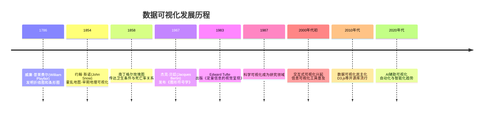
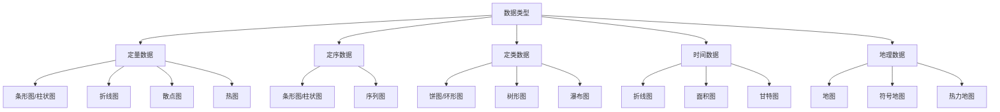
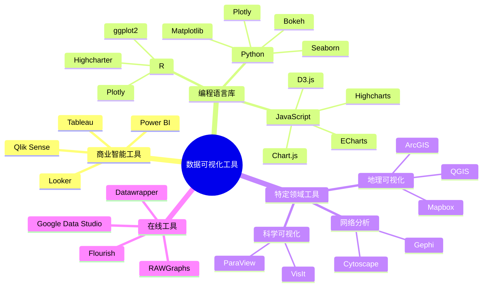

---
{"dg-publish":true,"tags":["商业分析","数据可视化","数据分析","可视化工具"],"创建日期":"2024-04-30","permalink":"/知识共享/002_商业分析/01_学习内容/02_数据收集与处理/2.3 数据可视化技术/","dgPassFrontmatter":true}
---

# 数据可视化技术

> [!quote] 概述
> 数据可视化是将数据通过图形化的方式直观呈现，帮助人们理解和分析数据中的模式、趋势和关系的过程。作为商业分析的核心技能，掌握数据可视化技术能够有效提升信息传递效率，支持决策制定，并促进组织内的数据驱动文化。本文将系统介绍数据可视化的原理、方法和实践应用。

## 1. 数据可视化基础

### 1.1 定义与价值

数据可视化是将数据或信息转化为图形、图表或其他可视化元素的过程，旨在增强人们对数据的理解和洞察。

**多角度定义：**
- **Edward Tufte（可视化先驱）**：数据可视化是"思考的工具"，其目的是增强人类对复杂数据的认知能力。
- **Ben Shneiderman（HCI专家）**："数据可视化的真正价值在于让人们看到他们从未预期的事物，并提出新问题。"
- **Alberto Cairo（可视化研究者）**：数据可视化是"功能性艺术"，需兼顾美学表达与信息准确传递。

**核心价值：**
- **认知增强**：利用人类视觉系统快速处理视觉信息的能力
- **模式发现**：帮助识别数据中的趋势、异常和关系
- **信息浓缩**：将复杂数据转化为直观图形，提升信息密度
- **沟通效率**：提高数据传达的清晰度和说服力
- **辅助决策**：支持基于数据的决策制定过程

### 1.2 数据可视化的历史发展

### 1.3 数据可视化的理论基础

**感知与认知原理：**
- **预注意处理**：人类视觉系统能够在意识处理前快速感知某些视觉特征(颜色、大小、形状等)
- **格式塔原则**：人类倾向于将视觉元素组织成简单、有序的模式
- **认知负荷理论**：有效的可视化应减轻认知负担，提高信息处理效率

**视觉编码原理：**
- **视觉变量层次**：不同视觉属性(位置、长度、角度、面积、色调等)在准确表达定量信息方面有效性不同
- **通道效力排序**：位置 > 长度 > 角度 > 面积 > 体积 > 颜色饱和度/亮度 > 颜色色调

## 2. 数据可视化设计原则

### 2.1 核心原则

**1. 真实性原则**
- 准确表达数据，不歪曲事实
- 适当的比例尺和零基线
- 避免误导性表达

**2. 功能性原则**
- 明确可视化目标和受众
- 确保可视化服务于特定问题
- 信息层次与重点突出

**3. 简洁性原则**
- 减少图表噪音和装饰
- 优化数据-墨水比(Data-ink ratio)
- 删除非必要视觉元素

**4. 可读性原则**
- 清晰的标题和标签
- 合适的字体和大小
- 考虑色盲友好设计

**5. 美学原则**
- 和谐的配色方案
- 视觉吸引力与专业性平衡
- 一致的设计语言

### 2.2 视觉编码选择指南

**视觉编码匹配表：**

| 数据关系 | 最佳视觉编码 | 适用图表类型 |
|---------|-------------|------------|
| 比较数值 | 长度、位置 | 条形图、柱状图、点图 |
| 时间趋势 | 位置、斜率 | 折线图、面积图 |
| 部分与整体 | 角度、面积 | 饼图、堆叠柱状图、树形图 |
| 分布情况 | 位置、密度 | 直方图、箱线图、小提琴图 |
| 相关性 | 位置 | 散点图、热图 |
| 地理分布 | 位置、色彩 | 地图、等值线图 |
| 层次关系 | 包含、连接 | 树状图、桑基图 |

## 3. 可视化图表类型详解

### 3.1 基础图表

**条形图/柱状图**
- **适用场景**：比较不同类别间的数值大小
- **最佳实践**：
  - 通常从大到小排序（非时序数据）
  - 保持一致的颜色，仅对重点类别使用强调色
  - 水平条形图适合类别名称较长的情况
- **变体**：分组柱状图、堆叠柱状图、双向条形图

**折线图**
- **适用场景**：展示连续数据的趋势和变化
- **最佳实践**：
  - 避免使用过多线条（通常不超过5-7条）
  - 使用不同线型和颜色区分系列
  - 考虑数据点标记的必要性
- **变体**：多线折线图、阶梯图、斜率图

**饼图/环形图**
- **适用场景**：展示部分与整体的关系（比例）
- **最佳实践**：
  - 限制类别数量（通常不超过5-7个）
  - 从最大扇区开始，顺时针排列
  - 考虑使用环形图增加中心空间显示总数
- **变体**：半圆饼图、玫瑰图、环形图

**散点图**
- **适用场景**：分析两个变量之间的关系
- **最佳实践**：
  - 使用趋势线展示相关性
  - 可添加第三维度（气泡大小、颜色）
  - 考虑使用抖动(jitter)处理重叠点
- **变体**：气泡图、热点散点图、连接散点图

### 3.2 高级图表

**热图(Heatmap)**
- **适用场景**：展示二维数据的密度或强度
- **实现方法**：使用颜色深浅表示数值大小
- **应用示例**：网站点击热图、相关性矩阵

**树形图(Treemap)**
- **适用场景**：展示层次结构数据和比例
- **实现方法**：嵌套矩形，大小表示数值
- **应用示例**：市场份额分析、产品组合可视化

**桑基图(Sankey Diagram)**
- **适用场景**：展示流程、路径和数量转换
- **实现方法**：使用宽度变化的连接表示流量
- **应用示例**：用户流分析、能源流动、预算分配

**平行坐标图(Parallel Coordinates)**
- **适用场景**：分析多维数据中的模式
- **实现方法**：将多维数据映射到平行轴上
- **应用示例**：多因素比较、聚类分析

**雷达图(Radar Chart)**
- **适用场景**：比较多个定量变量
- **实现方法**：在圆形坐标系中使用多轴
- **应用示例**：能力评估、产品特性比较

### 3.3 专业可视化类型

**地理空间可视化**
- 符号地图、等值线图、热力地图
- 地图切片技术与交互式地图
- 地理信息系统(GIS)集成

**网络与关系可视化**
- 力导向图、弦图、弧线图
- 节点与边的视觉编码策略
- 大规模网络的可视化技术

**时间序列可视化**
- 堆叠面积图、流图(Streamgraph)
- 日历热图、时间轮(Time Wheel)
- 多尺度时间线

## 4. 数据可视化工具与技术

### 4.1 工具分类与选择

**工具选择考虑因素：**
1. **数据复杂度**：数据量大小、维度、更新频率
2. **用户技术能力**：编程技能、学习曲线
3. **交互需求**：静态展示 vs. 动态交互
4. **集成需求**：与现有系统的兼容性
5. **成本因素**：预算、许可要求
6. **安全性**：数据隐私与访问控制
7. **可扩展性**：未来需求与定制潜力

### 4.2 主流工具详解

**Tableau**
- **特点**：强大的拖放界面、丰富的可视化类型、优秀的数据连接能力
- **优势**：用户友好、快速原型开发、企业集成
- **适用场景**：企业级报表、仪表板开发、数据探索
- **限制**：高成本、统计分析功能有限、深度定制较复杂

**Microsoft Power BI**
- **特点**：与微软生态系统无缝集成、内置AI功能、DAX语言支持
- **优势**：成本效益好、快速学习曲线、强大的数据转换
- **适用场景**：Office用户、需要共享报告的团队、中小企业
- **限制**：高级功能需Pro版、大数据处理能力有限

**Python可视化生态系统**
- **Matplotlib**：基础绘图库，高度可定制
- **Seaborn**：统计可视化专长，美观且简洁
- **Plotly**：交互式可视化，支持Web集成
- **适用场景**：数据科学项目、复杂分析、自动化报告
- **学习资源**：[Python数据可视化实战](https://plotly.com/python/plotly-fundamentals/)

**R语言可视化**
- **ggplot2**：基于图形语法，高度一致的API
- **特点**：统计可视化强项、优雅的语法、学术标准
- **适用场景**：研究分析、统计建模、复杂数据集
- **学习曲线**：中等，需掌握基本R语法和ggplot2语法

### 4.3 可视化技术与方法

**响应式可视化设计**
- 适应不同屏幕尺寸的布局调整
- 触控设备的交互优化
- 移动优先的设计考虑

**交互技术**
- 过滤与聚焦：应用筛选条件
- 钻取(Drill-down)：从总体到细节
- 缩放与平移：探索大型数据集
- 刷选与突出显示：识别特定数据点
- 动画与过渡：追踪数据变化

**整合与嵌入**
- API与Web服务集成
- 嵌入式可视化组件
- 实时数据更新机制

## 5. 实践应用

### 5.1 商业分析中的应用场景

**销售与市场分析**
- 销售趋势与预测可视化
- 客户细分与行为分析
- 营销活动效果对比
- 地区市场表现热图

**财务分析与报告**
- 预算与实际支出对比
- 财务KPI仪表板
- 现金流与收入预测
- 成本结构树形图

**运营分析**
- 供应链流程可视化
- 生产效率与瓶颈分析
- 质量控制图表
- 资源分配可视化

**用户体验与产品分析**
- 用户旅程图
- 功能使用热图
- A/B测试结果可视化
- 用户留存曲线

### 5.2 行业案例分析

**零售业案例：沃尔玛的数据可视化应用**
- **背景**：面对电子商务竞争，沃尔玛加强数据驱动决策
- **方法**：构建综合可视化仪表板，整合销售、库存和客户数据
- **技术**：结合地理热图、时间序列和交互式仪表板
- **成果**：
  - 优化库存管理，减少缺货率12%
  - 识别区域销售模式，调整门店布局
  - 改进促销策略，提高季节性商品转化率
- **关键因素**：用户友好设计、实时更新、移动访问支持

**金融服务案例：摩根大通的风险可视化系统**
- **背景**：2008金融危机后，需加强风险监控与预警
- **方法**：开发多层次风险可视化平台
- **技术**：网络图、热图、情景分析交互模型
- **成果**：
  - 提前识别风险集中区域
  - 降低风险评估时间60%
  - 改善监管报告质量与速度
- **关键因素**：多维数据整合、异常检测算法、直观的风险表示

**医疗健康案例：克利夫兰诊所的患者流可视化**
- **背景**：需优化患者体验和资源利用
- **方法**：构建患者流动和等待时间可视化系统
- **技术**：桑基图、实时更新热图、预测模型
- **成果**：
  - 减少平均等待时间23%
  - 提高设备利用率
  - 改善排班和资源分配
- **关键因素**：实时数据集成、直观呈现、行动导向设计

### 5.3 可视化项目实施步骤

**1. 需求分析与规划**
- 明确目标和关键问题
- 识别用户类型和使用场景
- 确定必要的数据源
- 设定评估标准

**2. 数据准备与处理**
- 数据收集与集成
- 数据清洗与转换
- 处理缺失值和异常值
- 结构化数据以适应可视化需求

**3. 可视化设计**
- 选择合适的图表类型
- 设计交互方式
- 规划布局和信息层次
- 创建低保真原型

**4. 开发与实现**
- 选择合适的工具和技术
- 构建初始可视化
- 添加交互功能
- 实现数据连接和更新机制

**5. 测试与优化**
- 功能测试
- 用户可用性测试
- 性能优化
- 视觉优化和细节调整

**6. 部署与维护**
- 集成到目标平台或系统
- 用户培训和文档
- 建立更新机制
- 监控使用情况和收集反馈

## 6. 数据可视化的挑战与最佳实践

### 6.1 常见挑战与解决方案

**数据规模挑战**
- **问题**：大数据集可视化性能与清晰度
- **解决方案**：
  - 数据聚合与抽样技术
  - 级联加载与渐进式渲染
  - 视图分割与导航设计
  - 硬件加速技术应用

**复杂数据关系表达**
- **问题**：多维数据和复杂关系的直观表达
- **解决方案**：
  - 降维技术（PCA、t-SNE等）
  - 多视图协调设计
  - 维度筛选与聚焦机制
  - 综合使用多种互补图表类型

**数据质量与不确定性**
- **问题**：数据不完整、有偏差或含不确定性
- **解决方案**：
  - 明确显示置信区间和误差范围
  - 透明展示数据来源与处理方法
  - 提供缺失数据的视觉标记
  - 使用模糊视觉编码表示不确定性

**用户理解与解释**
- **问题**：确保用户正确理解和解释可视化
- **解决方案**：
  - 提供清晰的注释和上下文信息
  - 使用引导式探索和教程
  - 设计综合性图例和帮助文档
  - 避免可能引起误解的设计选择

### 6.2 商业分析可视化最佳实践

**目标导向设计**
- 始终以业务问题为中心
- 清晰定义关键绩效指标(KPIs)
- 从决策需求反推可视化设计

**受众适配**
- 根据受众技术水平调整复杂度
- 考虑决策者时间限制和关注点
- 在技术团队和业务部门间建立视觉语言桥梁

**数据叙事**
- 构建有逻辑流程的数据故事
- 使用引导性注释强调关键发现
- 平衡探索性和解释性可视化

**设计审美与专业性**
- 建立一致的设计系统和视觉语言
- 确保专业外观和品牌一致性
- 减少装饰性元素，专注数据表达

**迭代改进**
- 收集用户反馈并不断优化
- 测量可视化效果与影响
- 跟踪技术发展，及时更新方法

### 6.3 未来趋势与发展方向

**AI辅助可视化**
- 自动化图表推荐系统
- 智能数据预处理和异常检测
- 自然语言生成数据解释

**沉浸式数据体验**
- 增强现实(AR)和虚拟现实(VR)数据可视化
- 3D和空间数据表示
- 多感官数据表达（听觉、触觉）

**实时协作与社交可视化**
- 多用户同步数据探索
- 可视化注释和讨论功能
- 数据可视化的分享与传播机制

**普适化与民主化**
- 无代码可视化构建工具
- 自然语言查询生成可视化
- 跨设备和跨平台可视化体验

## 7. 学习路径与资源

### 7.1 阶梯式学习路径

**初学者阶段 (1-2个月)**
- 掌握数据可视化基本原则和类型
- 学习一种主流BI工具基础操作(Tableau/Power BI)
- 创建基本图表和简单仪表板
- 推荐资源：《数据可视化实战》、Tableau公开课

**进阶阶段 (2-4个月)**
- 深入学习视觉设计原则与色彩理论
- 掌握高级图表类型和交互技术
- 学习基础编程可视化(Python/R基础图表)
- 推荐资源：《讲故事的数据》、Edward Tufte作品

**专家阶段 (4-8个月)**
- 掌握高级分析与可视化整合
- 学习自定义可视化开发(D3.js/高级Python)
- 构建端到端可视化解决方案
- 跨领域应用数据可视化
- 推荐资源：D3.js教程、《交互式数据可视化》

### 7.2 推荐学习资源

**书籍：**
- 《数据可视化之美》- Nathan Yau
- 《定量信息的视觉呈现》- Edward Tufte
- 《用数据讲故事》- Cole Nussbaumer Knaflic
- 《信息可视化：设计交互》- Colin Ware

**在线课程：**
- Coursera: "数据可视化与交流" - Alberto Cairo
- Udacity: "数据可视化与D3.js"
- LinkedIn Learning: "Tableau基础与高级技巧"
- DataCamp: "Python数据可视化"

**社区与资源：**
- [Information is Beautiful](https://informationisbeautiful.net/)
- [Flowing Data](https://flowingdata.com/)
- [Tableau Public Gallery](https://public.tableau.com/app/discover)
- [Observable](https://observablehq.com/) - 数据可视化创作平台

### 7.3 实践练习与评估

**入门练习：**
1. 分析并重新设计一个既有的糟糕图表
2. 使用同一数据集创建3种不同图表类型
3. 构建一个包含3-5个图表的简单仪表板

**进阶项目：**
1. 创建一个交互式销售数据探索工具
2. 设计一个时间序列数据的多维可视化
3. 开发一个地理空间数据分析仪表板

**专业挑战：**
1. 为复杂网络数据创建自定义可视化
2. 开发一个整合多种数据源的实时仪表板
3. 设计一套组织的可视化设计系统与标准

## 自测问题

1. 数据可视化的五个核心设计原则是什么？每个原则在实际应用中如何体现？
2. 针对不同数据类型（定量、定序、定类、时间、地理），分别哪些图表类型最合适？为什么？
3. 在选择数据可视化工具时，应考虑哪些关键因素？不同因素之间如何权衡？
4. 如何有效地表达数据中的不确定性和可信度？请给出三种具体方法。
5. 数据可视化中的"数据-墨水比"原则是什么？如何应用这一原则优化图表设计？
6. 在商业分析情境中，如何确保数据可视化既美观又准确传达信息？
7. 什么是"可视化谎言"？请列举三个常见的误导性数据表达手法及其避免方法。
8. 如何设计一个有效的多维数据可视化方案？请考虑4个以上维度的情况。
9. 交互式可视化相比静态可视化有哪些优势和局限性？在何种情况下应选择交互式方案？
10. 数据可视化项目实施过程中最常见的三个失败原因是什么？如何预防？

## 延伸阅读

- [[知识共享/002_商业分析/01_学习内容/04_市场与竞争分析/4.1 市场分析框架\|04_市场与竞争分析/4.1 市场分析框架]] - 了解如何将可视化应用于市场分析
- [[03_分析方法与工具/3.8 数据可视化最佳实践\|03_分析方法与工具/3.8 数据可视化最佳实践]] - 更多可视化实践指南
- [[02_笔记/02_方法工具/数据故事讲述技巧\|02_笔记/02_方法工具/数据故事讲述技巧]] - 学习如何围绕数据构建引人入胜的叙事
- [[知识共享/002_商业分析/03_案例/02_公司案例/Netflix的数据驱动决策\|03_案例/02_公司案例/Netflix的数据驱动决策]] - 了解顶级公司如何应用数据可视化 