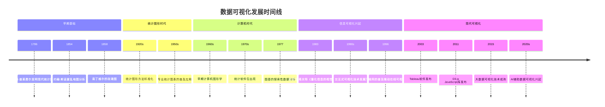
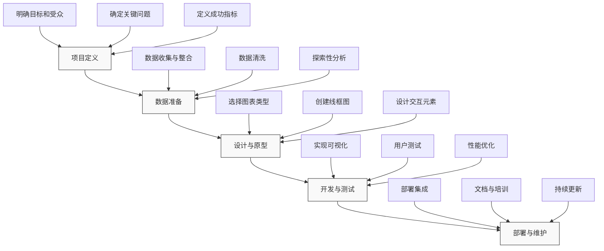

---
{"dg-publish":true,"tags":["商业分析","数据可视化","图表类型","设计原则","工具应用"],"创建日期":"2024-04-28","permalink":"/知识共享/002_商业分析/01_学习内容/02_数据收集与处理/2.3 数据可视化技术/","dgPassFrontmatter":true}
---

# 数据可视化技术

## 引言

数据可视化是将数据转化为视觉表现形式的过程，是现代商业分析的核心能力之一。有效的数据可视化能够揭示隐藏在复杂数据集中的模式、趋势和关系，帮助决策者快速理解数据背后的洞察。随着数据量的爆炸性增长，数据可视化已从简单的图表展示演变为一个结合设计、统计、认知心理学和计算机科学的综合领域。本文将系统介绍数据可视化的基本原理、类型、设计原则及实践应用，帮助商业分析师掌握这一强大工具，提升数据沟通和分析效果。

## 数据可视化基础

### 数据可视化的定义与价值

数据可视化是将数据和信息转换为视觉表现形式的过程和技术，通过图形化展示帮助人们更好地理解和分析数据。

**数据可视化的核心价值**：

1. **信息压缩**：将大量数据压缩为可理解的视觉形式
2. **模式识别**：帮助发现数据中的模式、趋势和异常
3. **认知增强**：利用人类视觉系统的优势加速信息处理
4. **沟通效率**：提高数据沟通的清晰度和说服力
5. **决策支持**：支持更快速、更准确的数据驱动决策

**数据可视化在商业分析中的应用场景**：

1. **绩效监控**：通过仪表板实时跟踪业务KPI
2. **趋势分析**：识别和预测业务和市场趋势
3. **关系探索**：理解变量之间的相关性和因果关系
4. **比较分析**：对比不同时间段、产品或区域的表现
5. **异常检测**：识别数据中的异常值和异常模式
6. **分布分析**：了解数据的分布情况和特征
7. **故事讲述**：构建数据驱动的商业叙事

### 数据可视化的历史演变

数据可视化有着丰富的历史，从早期的手绘图表到现代的交互式可视化工具：

1. **早期先驱(18-19世纪)**：
   - 威廉·普莱费尔(William Playfair)：发明了现代折线图、条形图和饼图
   - 约翰·斯诺(John Snow)：1854年霍乱地图分析，将疾病爆发与水源关联
   - 佛罗伦萨·南丁格尔(Florence Nightingale)：玫瑰图展示战争中的死亡原因

2. **统计图形发展(20世纪前半叶)**：
   - 统计图形方法的标准化
   - 新图表类型的出现，如直方图、散点图等
   - 商业应用开始普及

3. **计算机时代(1950-1990年代)**：
   - 计算机图形学的发展
   - 统计软件包的出现(如SAS、SPSS)
   - 约翰·图基(John Tukey)的探索性数据分析方法

4. **信息可视化兴起(1990-2000年代)**：
   - 互联网数据的爆炸性增长
   - 交互式可视化工具的发展
   - 爱德华·塔夫特(Edward Tufte)的视觉设计原则

5. **现代数据可视化(2000年代至今)**：
   - 大数据可视化技术
   - 商业智能和自助式可视化工具(Tableau、Power BI等)
   - 交互式仪表板和实时可视化
   - 数据叙事(Data Storytelling)方法的兴起

### 人类视觉感知与数据可视化

有效的数据可视化建立在对人类视觉系统工作原理的理解基础上：

1. **预注意处理**：
   - 人脑能在毫秒级别处理某些视觉属性(如颜色、大小、方向)
   - 这些属性可用于立即传达重要信息，无需有意识的处理

2. **格式塔原则**：
   - 接近性：靠近的元素被视为组
   - 相似性：相似的元素被视为组
   - 连续性：人脑倾向于在元素间创建连续线条
   - 封闭性：人脑倾向于感知完整形状，即使有缺失部分

3. **视觉层次**：
   - 主要视觉属性的感知顺序：位置 > 长度 > 角度 > 面积 > 颜色
   - 这种层次影响数据编码效率

4. **认知负荷**：
   - 工作记忆有限，过多视觉元素会导致认知超载
   - 减少认知负荷的原则：简化、分组、突出重点

5. **颜色感知**：
   - 色调(色相)、饱和度和亮度的区分能力
   - 色盲考虑(约8%男性、0.5%女性有红绿色盲)
   - 文化对颜色理解的影响

这些视觉感知原理直接影响可视化设计决策，包括图表类型选择、颜色方案、布局和元素组织。

## 数据可视化类型及应用

### 基础图表类型

商业分析中最常用的基础图表类型及其适用场景：

1. **条形图/柱状图**：
   - **适用**：类别比较、排名、分布
   - **变体**：堆叠条形图、分组条形图、瀑布图
   - **最佳实践**：
     - 通常从大到小排序(除非有明确顺序)
     - 包含数据标签以提高精确度
     - 避免3D效果，保持简洁

2. **折线图**：
   - **适用**：时间序列数据、趋势、连续变化
   - **变体**：多系列折线图、阶梯图、面积图
   - **最佳实践**：
     - 适当选择y轴范围，避免误导
     - 对多线图使用清晰区分的颜色和标签
     - 考虑数据密度，必要时使用数据平滑

3. **饼图与环形图**：
   - **适用**：部分与整体关系、占比分析(最多5-7个类别)
   - **变体**：环形图、南丁格尔玫瑰图、甜甜圈图
   - **最佳实践**：
     - 限制类别数量，合并小类别为"其他"
     - 直接在图表上标注百分比
     - 按顺时针方向从最大部分开始排列

4. **散点图**：
   - **适用**：相关性分析、分布模式、异常值检测
   - **变体**：气泡图、散点矩阵、热散点图
   - **最佳实践**：
     - 包含趋势线以强调相关性
     - 使用颜色或形状编码额外维度
     - 考虑使用抖动技术处理重叠点

5. **热图**：
   - **适用**：二维数据分布、相关性矩阵、时间模式
   - **变体**：日历热图、相关性热图、地理热图
   - **最佳实践**：
     - 选择适当的颜色渐变(通常为单色或双色)
     - 添加图例解释颜色编码
     - 考虑使用分层聚类增强模式识别

6. **箱线图**：
   - **适用**：分布比较、变异性分析、异常值识别
   - **变体**：小提琴图、箱线图加抖动点
   - **最佳实践**：
     - 清晰标注四分位数和异常值
     - 考虑添加平均值标记
     - 排序箱线图以突出差异

7. **雷达图/蜘蛛图**：
   - **适用**：多变量比较、性能评估、平衡分析
   - **变体**：填充雷达图、多系列雷达图
   - **最佳实践**：
     - 限制维度数量(通常5-10个)
     - 确保所有轴使用一致的比例
     - 考虑使用并排的多个小型雷达图进行比较

### 高级可视化类型

更复杂的可视化类型，适用于特定分析需求：

1. **树状图/矩形树图**：
   - **适用**：层次数据、比例分析、嵌套结构
   - **示例应用**：产品类别销售分布、预算分配
   - **设计考虑**：颜色编码、嵌套级别、标签位置

2. **网络图/关系图**：
   - **适用**：关系分析、网络结构、连接模式
   - **示例应用**：社交网络分析、供应链映射、组织结构
   - **设计考虑**：节点布局算法、边缘处理、交互功能

3. **桑基图**：
   - **适用**：流量分析、路径可视化、资源分配
   - **示例应用**：用户流分析、能源流动、预算流向
   - **设计考虑**：节点排序、颜色一致性、标签可读性

4. **平行坐标图**：
   - **适用**：多维数据分析、模式识别、异常检测
   - **示例应用**：产品比较、客户细分、多指标性能评估
   - **设计考虑**：轴排序、交互筛选、颜色编码

5. **地图可视化**：
   - **变体**：分层统计地图、等值线图、地理热图、点地图
   - **示例应用**：区域销售分析、市场渗透率、地理分布
   - **设计考虑**：投影选择、颜色比例、地理详细程度

6. **词云**：
   - **适用**：文本数据可视化、频率分析、关键词突出
   - **示例应用**：客户反馈分析、内容主题、社交媒体监测
   - **设计考虑**：词频计算方法、排除词、布局算法

7. **层次结构图**：
   - **变体**：树形图、旭日图、冰锥图
   - **示例应用**：组织结构、产品层次、文件系统
   - **设计考虑**：节点展开/折叠、深度表示、节点尺寸

8. **流图/主题河流图**：
   - **适用**：时间序列数据、主题变化、流量演变
   - **示例应用**：主题趋势分析、内容演变、时间分配
   - **设计考虑**：平滑算法、颜色分配、基线选择

### 交互式可视化技术

交互元素可以显著增强可视化的分析价值：

1. **基本交互技术**：
   - **过滤与查询**：允许用户筛选数据集
   - **缩放与平移**：探索大型数据集的不同部分
   - **详细信息展示(Tooltip)**：悬停显示额外信息
   - **排序与重组**：改变数据视图的组织方式
   - **标注与书签**：保存和共享特定视图

2. **高级交互技术**：
   - **刷选与联动**：在多个视图间同步选择
   - **钻取**：从汇总视图深入到详细数据
   - **动态查询**：通过滑块等控件实时更新视图
   - **参数控制**：调整可视化参数以测试假设
   - **动画转换**：通过动画展示数据变化

3. **交互式仪表板设计原则**：
   - 层次化信息展示(从概览到细节)
   - 一致的交互模式和视觉语言
   - 适当的响应时间和反馈机制
   - 引导用户注意的视觉提示
   - 考虑不同用户角色的需求

4. **交互设计最佳实践**：
   - 保持界面简洁，避免过度复杂的控件
   - 提供清晰的交互提示和指导
   - 确保所有交互元素的可发现性
   - 设计渐进式的学习曲线
   - 提供撤销和重置功能

### 数据叙事与故事讲述

有效的数据叙事(Data Storytelling)将分析转化为引人入胜的故事：

1. **数据叙事的要素**：
   - **叙事结构**：开端、问题、探索、洞察、结论
   - **上下文**：背景信息和相关知识
   - **视觉证据**：支持叙事的可视化
   - **引导性解释**：帮助受众理解数据含义
   - **行动导向**：基于洞察的明确建议

2. **叙事结构模式**：
   - **问题-解决方案**：提出业务问题，展示数据支持的解决方案
   - **对比-对照**：通过对比突出关键见解
   - **探索性叙事**：带领受众一起发现数据洞察
   - **个人化故事**：将数据与人物故事结合

3. **打造有效数据故事的技巧**：
   - 了解你的受众及其关注点
   - 使用清晰的主线贯穿始终
   - 专注于少量关键信息点
   - 通过比喻和类比使复杂概念具体化
   - 结合质性和量化数据增强可信度
   - 提供明确的"下一步行动"建议

4. **常见数据故事类型**：
   - 变化：展示随时间的转变
   - 偏离：突出异常值和意外发现
   - 并列：比较不同类别或实体
   - 相关：展示变量间关系
   - 分解：将整体分解为组成部分

## 数据可视化设计原则

### 视觉设计基础

有效的数据可视化设计应遵循以下基本原则：

1. **清晰性**：
   - 确保信息传达明确无误
   - 避免视觉噪音和不必要的装饰
   - 使用清晰的标题和标签
   - 适当使用空白来分离元素

2. **准确性**：
   - 确保视觉表现与数据成比例
   - 避免扭曲或误导性的视觉表现
   - 选择适合数据类型的图表
   - 标明数据来源和处理方法

3. **效率性**：
   - 最大化数据-墨水比(Data-Ink Ratio)
   - 移除不传达数据的视觉元素
   - 避免图表垃圾(Chartjunk)
   - 使用最少的视觉元素传达最多的信息

4. **美学与吸引力**：
   - 使用协调的配色方案
   - 保持一致的样式和排版
   - 考虑视觉平衡和构图
   - 适当使用品牌元素增强识别性

5. **层次与导航**：
   - 创建明确的视觉层次，突出重要信息
   - 使用大小、颜色、位置等引导注意力
   - 组织内容以支持自然的阅读流程
   - 在复杂可视化中提供导航辅助

### 配色方案选择

色彩是数据可视化的强大工具，影响着受众的理解和情感反应：

1. **配色方案类型**：
   - **分类方案**：用于区分不同类别的离散颜色
   - **顺序方案**：表示从低到高的单变量数据
   - **发散方案**：表示偏离中心点的双向数据
   - **强调方案**：突出特定数据点或系列

2. **配色方案选择考虑因素**：
   - **数据类型**：分类、顺序、发散等
   - **对比要求**：需要强对比还是微妙变化
   - **色盲友好性**：约8%男性有某种色盲
   - **文化含义**：颜色在不同文化中的解读
   - **品牌要求**：与组织视觉标识的一致性
   - **媒介限制**：打印vs屏幕显示的色彩差异

3. **配色最佳实践**：
   - 限制使用颜色数量(通常5-7种为宜)
   - 确保足够的对比度，尤其是文本与背景
   - 使用预设的配色方案(如Brewer色板)
   - 考虑单色方案的清晰度与优雅
   - 测试配色在灰度模式下的可辨识度
   - 在连续数据中使用直观的颜色过渡

4. **常见配色错误**：
   - 过度使用彩虹色谱(难以解读数值顺序)
   - 使用难以区分的相似色调
   - 忽视色盲用户的需求
   - 使用对比过强的颜色组合导致视觉疲劳
   - 颜色编码与数据类型不匹配
   - 使用复杂的渐变使数值比较困难

### 布局与组织

有效的布局使可视化更易理解和使用：

1. **布局基本原则**：
   - **接近性**：相关元素应放置在一起
   - **对齐**：创建视觉连接和整洁感
   - **一致性**：保持元素样式和位置的一致
   - **对比**：使重要元素突出
   - **平衡**：创建视觉稳定感

2. **图表布局要素**：
   - **轴与标签**：清晰、无重叠、足够对比
   - **图例**：位置恰当，与数据视图接近
   - **标题与副标题**：简明扼要，传达主要信息
   - **注释**：突出关键点，提供上下文
   - **来源与附注**：提供数据出处和限制说明

3. **多图表组织**：
   - **小倍数(Small Multiples)**：重复相同图表结构展示不同数据切片
   - **仪表板网格**：使用一致的对齐和间距
   - **分层组织**：从概览到详细信息
   - **引导式流程**：按照逻辑顺序排列图表
   - **配套关系**：确保相关图表在视觉上关联

4. **响应式设计考虑**：
   - 适应不同屏幕尺寸的布局策略
   - 移动优先的简化视图
   - 交互元素的触摸友好设计
   - 内容优先级排序，确保关键信息始终可见
   - 考虑不同查看环境(如投影、移动设备)

### 常见的数据可视化错误与陷阱

避免这些常见错误以提高可视化的准确性和有效性：

1. **误导性图表技巧**：
   - **截断的y轴**：夸大小差异
   - **不相称的比较**：使用不同比例或基线
   - **双y轴陷阱**：可能暗示不存在的相关性
   - **3D效果扭曲**：导致数据比例失真
   - **选择性数据展示**：忽略不支持结论的数据

2. **感知错误**：
   - **面积比较不准确**：人类不善于比较面积大小
   - **相对vs绝对比较混淆**：未明确指出比较基准
   - **过度使用颜色**：导致信息混乱
   - **未考虑色盲需求**：使部分用户无法理解信息
   - **过度设计**：装饰元素干扰数据理解

3. **上下文缺失**：
   - **缺少基准比较**：单独数字缺乏参考意义
   - **忽略变异性**：只展示平均值或聚合数据
   - **未说明数据来源与方法**：降低可信度
   - **缺少时间参考**：未明确数据收集时间点
   - **未解释数据中的特殊情况**：导致误解

4. **认知负荷过高**：
   - **信息过载**：单张图表包含过多数据或维度
   - **难以理解的复杂图表**：没有足够的引导说明
   - **不一致的视觉编码**：同一元素在不同地方表示不同含义
   - **需要大量记忆的设计**：强制用户记住之前看到的信息
   - **缺少视觉层次**：所有元素同等重要，难以找到重点

## 数据可视化工具与实践

### 常用可视化工具比较

现代数据可视化工具多种多样，各有优缺点：

1. **商业智能平台**：
   - **Tableau**：
     - 优势：直观界面、强大功能、优秀的视觉效果
     - 劣势：价格较高、高级功能学习曲线陡峭
     - 适用场景：企业级报告、交互式仪表板、自助分析
   
   - **Microsoft Power BI**：
     - 优势：与Microsoft生态系统集成、性价比高、定期更新
     - 劣势：某些高级功能需要专业技能、自定义限制
     - 适用场景：Microsoft组织、预算有限的团队、内部报告
   
   - **Qlik Sense**：
     - 优势：关联引擎、内存处理、灵活的数据模型
     - 劣势：独特的脚本语言、初始学习曲线
     - 适用场景：复杂数据关系、大型数据集、高级分析

2. **编程库与框架**：
   - **Python生态系统**：
     - 主要库：Matplotlib, Seaborn, Plotly, Bokeh
     - 优势：高度可定制、与数据科学工作流集成
     - 劣势：需要编程知识、开发时间较长
     - 适用场景：数据科学研究、自动化报告、复杂分析
   
   - **R语言可视化**：
     - 主要库：ggplot2, Shiny, plotly, highcharter
     - 优势：统计分析集成、专业图表类型、学术标准
     - 劣势：学习曲线、性能限制
     - 适用场景：统计分析、学术研究、专业报告
   
   - **JavaScript库**：
     - 主要库：D3.js, Chart.js, Highcharts, ECharts
     - 优势：web集成、高互动性、完全可定制
     - 劣势：开发复杂度高、需要前端知识
     - 适用场景：网站集成、定制应用、公共面向产品

3. **特定用途工具**：
   - **Flourish**：
     - 优势：易用性、丰富模板、交互性
     - 适用场景：叙事可视化、简报、新闻图表
   
   - **Datawrapper**：
     - 优势：简单界面、专为新闻设计、响应式图表
     - 适用场景：媒体报道、快速可视化、嵌入式图表
   
   - **Infogram**：
     - 优势：设计美观、易于共享、信息图模板
     - 适用场景：营销材料、社交媒体内容、信息图

4. **工具选择考虑因素**：
   - 用户技术熟练度与学习意愿
   - 数据源与集成需求
   - 预算与许可限制
   - 安全性与部署选项
   - 协作与共享需求
   - 自定义与扩展要求
   - 支持与社区资源

### 实施数据可视化项目

从概念到交付的数据可视化项目流程：

1. **项目定义与规划**：
   - 明确目标受众和他们的需求
   - 定义关键问题和决策支持目标
   - 确定成功指标和评估方法
   - 规划项目时间线和资源需求
   - 选择适合的工具和技术

2. **数据准备与探索**：
   - 收集和整合所需数据
   - 数据清洗和质量评估
   - 进行探索性分析，了解数据特征
   - 识别潜在的见解和故事角度
   - 确定最适合的可视化方法

3. **设计与原型开发**：
   - 创建初步设计概念和线框图
   - 选择合适的图表类型和布局
   - 开发交互设计(如果适用)
   - 创建低保真原型并收集反馈
   - 迭代改进设计概念

4. **开发与测试**：
   - 使用选定工具实现可视化
   - 确保数据准确性和视觉清晰度
   - 添加交互功能和导航元素
   - 进行用户测试和可用性评估
   - 优化性能和响应性

5. **部署与维护**：
   - 整合到目标环境或平台
   - 创建文档和用户指南
   - 提供必要的培训和支持
   - 建立数据更新和维护流程
   - 收集使用反馈并持续改进

### 行业应用案例分析

不同行业中数据可视化的成功应用：

1. **零售业案例**：
   - **销售仪表板**：沃尔玛使用多层次仪表板监控全球销售表现，结合地理可视化和时间序列分析，支持从全球到单店的钻取功能。
   - **客户细分分析**：亚马逊应用高级聚类可视化了解客户行为模式，通过交互式散点图和平行坐标图展示多维客户特征。
   - **价格优化分析**：Target使用价格弹性可视化工具，通过曲线图和热图分析不同产品类别的价格敏感度。
   - **成效**：提高库存周转率15%，优化促销活动ROI增加20%。

2. **金融服务案例**：
   - **风险评估**：摩根大通开发风险热图系统，使用树状图和网络图可视化复杂金融产品的风险暴露。
   - **欺诈检测**：Visa的实时异常检测系统，使用时间序列可视化和地理映射识别可疑交易模式。
   - **投资组合分析**：BlackRock的交互式投资组合仪表板，通过气泡图和面积图展示资产配置和表现。
   - **成效**：减少风险暴露12%，提高欺诈检测准确率30%。

3. **医疗健康案例**：
   - **患者流程优化**：克利夫兰诊所使用桑基图和热图分析患者旅程，识别瓶颈和延误点。
   - **临床数据可视化**：梅奥诊所的患者健康仪表板，通过时间序列图和指标卡展示关键健康指标。
   - **流行病学分析**：世界卫生组织的疾病传播地图，使用地理可视化和动态时间线追踪疫情发展。
   - **成效**：减少患者等待时间23%，提高治疗方案依从性18%。

4. **制造业案例**：
   - **生产线优化**：丰田的实时生产监控系统，使用控制图和瀑布图识别生产异常和效率机会。
   - **供应链可视化**：宝洁公司的端到端供应链仪表板，通过网络图和地图展示材料流动和库存水平。
   - **品质控制**：西门子的多维品质分析系统，使用平行坐标图和热图发现品质问题的根本原因。
   - **成效**：降低生产停机时间17%，减少质量缺陷9%。

### 未来趋势与发展方向

数据可视化领域的新兴趋势和未来发展：

1. **人工智能辅助可视化**：
   - 自动化图表推荐和生成
   - 智能异常检测和标注
   - 自然语言生成(NLG)解释图表
   - 基于用户行为的个性化视图
   - 语音交互与会话式分析

2. **沉浸式可视化**：
   - 虚拟现实(VR)数据可视化环境
   - 增强现实(AR)数据展示
   - 3D沉浸式分析空间
   - 触觉反馈与多感官数据表达
   - 协作式沉浸环境

3. **实时分析可视化**：
   - 流数据实时处理和展示
   - 高性能大规模数据可视化
   - 边缘计算支持的分布式可视化
   - 动态阈值和警报系统
   - 自适应刷新和优化策略

4. **可解释性与透明度**：
   - 算法决策可视化解释
   - 不确定性和可信度表示
   - 数据来源与处理步骤透明化
   - 模型行为与预测解读
   - 伦理考量的可视化表达

5. **无障碍与普惠设计**：
   - 为视觉障碍用户设计的可视化
   - 多语言自适应图表
   - 跨文化色彩和符号系统
   - 低数据素养用户的简化视图
   - 可定制的复杂度层次

## 实践与应用

### 实用数据可视化工作流程

商业分析师可以遵循的实用数据可视化工作流程：

1. **需求分析**：
   - 识别目标受众和他们的信息需求
   - 明确可视化的具体目标(探索、解释、监控等)
   - 确定关键问题和决策支持需求
   - 收集利益相关者的期望和要求
   - 定义成功标准和评估方法

2. **数据评估与准备**：
   - 确定所需数据集和来源
   - 评估数据质量、完整性和及时性
   - 进行必要的数据清洗和转换
   - 创建分析所需的计算字段和度量
   - 评估数据安全和隐私要求

3. **探索性分析**：
   - 使用简单图表初步探索数据
   - 识别关键模式、趋势和异常
   - 测试不同的图表类型和视角
   - 记录潜在的见解和问题
   - 确定最有价值的分析角度

4. **可视化设计**：
   - 选择最适合数据和目标的图表类型
   - 创建初步线框图或草图
   - 设计信息层次和导航流程
   - 确定颜色方案和视觉编码策略
   - 计划交互元素和功能

5. **构建与测试**：
   - 使用选定工具实现可视化
   - 添加上下文信息和说明
   - 实现必要的交互功能
   - 进行用户测试和收集反馈
   - 迭代改进视觉效果和可用性

6. **部署与沟通**：
   - 发布或分享最终可视化成果
   - 准备简明的叙事和关键见解
   - 向目标受众展示和解释
   - 收集使用情况和影响反馈
   - 计划维护和更新流程

### 练习与实战项目

提升数据可视化技能的实践项目：

1. **初级练习**：
   - **销售数据仪表板**：创建显示销售趋势、地区表现和产品类别的基础仪表板
   - **客户细分图表**：使用多维图表展示客户人口统计和行为数据
   - **预算分配可视化**：使用树状图或饼图展示预算分配比例
   - **市场份额比较**：创建时间序列对比竞争对手的市场份额变化

2. **中级项目**：
   - **多维销售分析工具**：开发允许按产品、地区、时间进行钻取的交互式分析工具
   - **客户旅程可视化**：使用桑基图展示客户从获取到保留的完整路径
   - **运营效率仪表板**：结合多种图表类型创建监控关键运营指标的仪表板
   - **产品组合分析**：使用散点图矩阵和气泡图分析产品组合表现

3. **高级挑战**：
   - **预测分析视觉化**：创建包含预测模型结果与置信区间的交互式工具
   - **网络与关系分析**：使用网络图分析组织内或客户间的复杂关系
   - **文本分析可视化**：开发展示文本数据主题和情感的综合仪表板
   - **多源数据整合分析**：结合多个数据源创建全面的业务绩效视图

4. **项目实施建议**：
   - 使用真实数据或高质量样本数据
   - 设定明确的目标和评估标准
   - 记录设计决策和实施过程
   - 寻求反馈并进行多次迭代
   - 反思经验教训和改进机会

### 评估与优化数据可视化

如何评估和持续优化数据可视化：

1. **评估框架**：
   - **功能有效性**：是否准确传达预期信息
   - **视觉清晰度**：设计是否清晰易懂
   - **用户体验**：互动是否直观且有意义
   - **技术性能**：加载速度和响应性
   - **业务影响**：对决策和行动的实际影响
   - **可扩展性**：适应新数据和新需求的能力

2. **定量评估方法**：
   - 用户任务完成时间和准确率测试
   - A/B测试比较不同设计方案
   - 眼动追踪研究(如可行)
   - 用户满意度和易用性评分
   - 使用分析(点击、停留时间等)
   - 决策质量和速度指标

3. **定性评估方法**：
   - 用户访谈和反馈会话
   - 专家评审和启发式评估
   - 可用性测试和观察
   - 认知演练评估
   - 焦点小组讨论
   - 决策者反馈收集

4. **持续优化策略**：
   - 建立定期评估和更新机制
   - 收集和分析用户使用数据
   - 跟踪业务指标影响变化
   - 实施用户反馈闭环过程
   - 保持对行业最佳实践的关注
   - 定期更新工具和技术

## 思考问题

1. 如何确定最适合特定数据集和分析目标的可视化类型？什么情况下应该使用复合图表？

2. 数据可视化在多大程度上应该追求美观度，以及如何平衡美观与功能性？

3. 在创建面向不同技术水平受众的可视化时，如何有效平衡简单性和深度？

4. 数据可视化如何影响组织的决策文化？有效的可视化可以如何改变决策流程？

5. 如何确保数据可视化不会因为设计者的无意识偏见而误导受众？有哪些防范措施？

6. 随着数据量的增长，如何在保持可视化清晰度的同时展示大规模复杂数据？

7. 交互式可视化相比静态可视化的优势和局限性是什么？什么情况下应优先选择哪种方式？

8. 如何使技术性或专业性较强的数据对非专业人士可理解，同时不丧失准确性？

9. 数据叙事(Data Storytelling)与传统数据可视化有何不同？在商业环境中它如何提升数据沟通效果？

10. 伦理考量在数据可视化中扮演什么角色？设计师应如何避免误导性或操纵性的可视化？

## 参考资料

1. Tufte, E. R. (2001). *The Visual Display of Quantitative Information*. Graphics Press.

2. Few, S. (2009). *Now You See It: Simple Visualization Techniques for Quantitative Analysis*. Analytics Press.

3. Knaflic, C. N. (2015). *Storytelling with Data: A Data Visualization Guide for Business Professionals*. Wiley.

4. Cairo, A. (2016). *The Truthful Art: Data, Charts, and Maps for Communication*. New Riders.

5. Munzner, T. (2014). *Visualization Analysis and Design*. A K Peters/CRC Press.

6. Heer, J., Bostock, M., & Ogievetsky, V. (2010). A Tour Through the Visualization Zoo. *Communications of the ACM, 53*(6), 59-67.

7. Kirk, A. (2016). *Data Visualisation: A Handbook for Data Driven Design*. SAGE Publications.

8. Evergreen, S. D. (2017). *Effective Data Visualization: The Right Chart for the Right Data*. SAGE Publications.

9. Yau, N. (2013). *Data Points: Visualization That Means Something*. Wiley.

10. Wilke, C. O. (2019). *Fundamentals of Data Visualization: A Primer on Making Informative and Compelling Figures*. O'Reilly Media. 