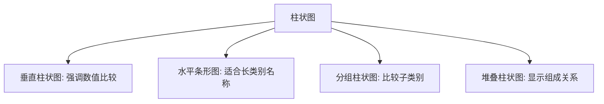

---
{"dg-publish":true,"tags":["商业分析","数据可视化","图表设计","商业智能"],"创建日期":"2024-04-28","permalink":"/知识共享/002_商业分析/01_学习内容/02_数据收集与处理/2.3 数据可视化技术/","dgPassFrontmatter":true}
---

# 数据可视化技术

## 引言

数据可视化是将数据转化为视觉表现形式的艺术与科学，它能够帮助分析师和决策者快速理解数据中的模式、趋势和异常。在信息爆炸的时代，数据可视化已成为商业分析不可或缺的能力，它使复杂的数据集变得直观易懂，加速洞察的形成和共享。本文将系统介绍数据可视化的基本原理、常用技术、最佳实践以及在商业分析中的应用，帮助分析师掌握这一强大工具，有效传达数据故事。

## 数据可视化基础

### 数据可视化的价值与目标

数据可视化在商业分析中具有多重价值：

1. **加速理解**：利用人类视觉系统的强大处理能力，快速识别模式
2. **发现洞察**：揭示数据中隐藏的关系、趋势和异常
3. **支持决策**：将复杂数据转化为可操作的见解
4. **有效沟通**：清晰传达分析结果和数据故事
5. **促进参与**：增强受众对数据和分析的兴趣和理解

### 视觉感知原理

有效的数据可视化基于人类视觉感知原理：

1. **预注意处理**：某些视觉属性（如颜色、大小、形状）可以被即时感知
2. **格式塔原则**：人类倾向于将视觉元素组织成有意义的模式
   - 接近性：靠近的元素被感知为一组
   - 相似性：相似的元素被感知为关联的
   - 连续性：人们倾向于沿着最平滑的路径感知
   - 闭合性：倾向于将不完整的图形视为完整的

3. **视觉层次**：通过对比和组织创建视觉引导路径
4. **认知负荷**：减少处理信息所需的心理努力

### 数据可视化类型分类

数据可视化可按多种维度分类：

**按数据关系分类**：
- **比较型**：展示数据点之间的差异（如柱状图、散点图）
- **组成型**：显示部分与整体的关系（如饼图、堆叠图）
- **分布型**：展示数据值的分布（如直方图、箱线图）
- **关系型**：揭示变量之间的相关性（如散点图、热力图）
- **趋势型**：展示随时间变化的模式（如折线图、面积图）

**按复杂度分类**：
- **基础图表**：单一图形，表达简单关系
- **组合图表**：多种图形元素结合，展示多维关系
- **高级可视化**：交互式、动态或多维可视化

## 常用可视化图表

### 比较数据的图表

展示类别间差异和比较的图表：

1. **柱状图（条形图）**：
   - 适用：类别间数值比较
   - 变体：分组柱状图、堆叠柱状图、人口金字塔
   - 最佳实践：从大到小排序（非时间序列）、限制类别数量

2. **雷达图（蜘蛛网图）**：
   - 适用：多维度数据比较、绩效评估
   - 优势：可同时比较多个维度
   - 局限：难以精确比较、维度过多时难以解读

### 组成关系图表

展示部分与整体关系的图表：

1. **饼图与环形图**：
   - 适用：显示构成比例，类别较少（≤7）
   - 最佳实践：按大小排序、百分比标签、避免3D效果
   - 局限：难以精确比较、不适合时间序列

2. **堆叠图表**：
   - 适用：显示整体及其组成部分随时间的变化
   - 变体：堆叠柱状图、堆叠面积图
   - 最佳实践：将较稳定的类别放在底部

3. **树形图**：
   - 适用：层次数据结构、空间利用效率高
   - 优势：同时显示规模和层次关系
   - 应用：产品类别销售、预算分配

### 分布与关系图表

展示数据分布和变量关系的图表：

1. **直方图**：
   - 适用：连续数据分布、频率分析
   - 关键考量：适当的箱宽选择
   - 应用：客户年龄分布、产品价格分布

2. **散点图**：
   - 适用：两个变量之间的关系
   - 变体：气泡图（添加第三维度）
   - 最佳实践：添加趋势线、相关系数

3. **箱线图**：
   - 适用：数据分布比较、异常值识别
   - 组成：中位数、四分位数、异常值
   - 应用：销售业绩比较、产品性能评估

### 时间序列图表

展示数据随时间变化的图表：

1. **折线图**：
   - 适用：连续时间数据、趋势分析
   - 变体：多系列折线图、阶梯图
   - 最佳实践：适当的时间刻度、避免过多线条

2. **面积图**：
   - 适用：强调累积效应或组成变化
   - 变体：堆叠面积图、百分比堆叠面积图
   - 应用：市场份额变化、流量构成分析

3. **烛台图**：
   - 适用：金融数据、价格波动
   - 显示：开盘价、收盘价、最高价、最低价
   - 应用：股票分析、价格趋势

### 地理空间可视化

在地理背景下展示数据的图表：

1. **地图散点图**：
   - 适用：显示地理位置分布
   - 变体：气泡地图（添加数值维度）
   - 应用：客户分布、门店位置

2. **热力地图**：
   - 适用：地理区域密度或强度
   - 优势：直观展示空间模式
   - 应用：销售热点、客户密度

3. **分层统计地图**：
   - 适用：按地理区域聚合的数据
   - 变体：填色地图、等值线地图
   - 应用：区域销售业绩、市场渗透率

## 可视化设计原则

### 数据墨水比与图表简洁性

爱德华·塔夫特提出的数据墨水比原则：

1. **数据墨水比**：用于表示数据的墨水与总墨水的比例
2. **去除图表垃圾**：删除不传达数据的视觉元素
   - 避免不必要的网格线、边框
   - 减少装饰性元素
   - 简化图例和标签

3. **简洁设计策略**：
   - 使用适量的数据标签
   - 减少重复信息
   - 避免过度使用颜色和图案

### 颜色使用原则

有效的颜色应用策略：

1. **颜色类型与用途**：
   - 分类色彩：区分不同类别（质性数据）
   - 序列色彩：表示数值高低（量性数据）
   - 发散色彩：突出正负偏差或对比

2. **颜色选择考量**：
   - 色盲友好：约8%男性存在色盲
   - 文化因素：不同文化对颜色有不同解读
   - 品牌一致性：与组织视觉标识一致

3. **最佳实践**：
   - 限制颜色数量（≤7种）
   - 使用对比度区分重要信息
   - 考虑黑白打印效果

### 标注与上下文

增强可视化理解的标注策略：

1. **标题与副标题**：
   - 清晰传达可视化主题和见解
   - 使用行动导向的标题传达关键信息

2. **轴标签与刻度**：
   - 清晰标注度量单位
   - 选择合适的刻度间隔和格式
   - 考虑起点（零基线或非零基线）

3. **数据标签策略**：
   - 选择性标注关键点
   - 使用适当的精度和格式
   - 避免标签重叠和过度拥挤

4. **注释与参考线**：
   - 突出关键事件和异常
   - 添加行业基准或目标线
   - 提供必要的背景信息

## 高级可视化技术

### 多维数据可视化

展示3个以上维度数据的技术：

1. **小倍数图**：
   - 原理：将数据分割成多个子集，用相同格式展示
   - 优势：便于跨类别比较模式
   - 应用：区域销售趋势、季节性分析

2. **平行坐标图**：
   - 原理：将多维空间映射到平行垂直轴
   - 优势：可展示多个维度间的关系
   - 应用：产品特性比较、多指标性能分析

3. **散点图矩阵**：
   - 原理：多个变量两两组合的散点图
   - 优势：全面展示变量间关系
   - 应用：相关性分析、特征选择

### 交互式可视化

增加用户参与的交互技术：

1. **常用交互技术**：
   - 过滤：根据条件筛选数据
   - 钻取：从概览到细节
   - 缩放与平移：探索大型数据集
   - 排序：改变数据顺序

2. **工具提示与悬停信息**：
   - 按需提供详细信息
   - 减少图表复杂度
   - 增强数据探索体验

3. **动态更新与实时数据**：
   - 数据驱动的自动更新
   - 时间轴控制数据变化
   - 动画展示趋势发展

### 高级图表类型

特定场景下的专业可视化：

1. **桑基图**：
   - 适用：流量、能量或价值流动
   - 优势：展示复杂系统中的转化和分配
   - 应用：用户流量分析、营销漏斗

2. **热力图与相关矩阵**：
   - 适用：二维数据强度或相关性
   - 优势：直观展示模式和关系
   - 应用：相关性分析、网站点击热图

3. **网络图与关系图**：
   - 适用：实体间连接和关系
   - 变体：力导向图、弦图
   - 应用：社交网络分析、产品关联

## 商业分析中的应用

### 销售与市场分析可视化

营销和销售领域的典型可视化应用：

1. **销售仪表板设计**：
   - 关键元素：收入趋势、销售漏斗、产品业绩
   - 组织原则：从总体到细节、优先级排序
   - 最佳实践：关键指标突出、适当比较基准

2. **市场细分分析**：
   - 适用图表：树形图、气泡图、散点图矩阵
   - 关键洞察：客户群体特征、价值分布、行为模式
   - 交互需求：按细分维度筛选和深入分析

3. **竞争分析可视化**：
   - 适用图表：雷达图、堆叠面积图、气泡图
   - 关键洞察：市场份额变化、竞争格局演变
   - 设计考量：强调相对位置和差异化因素

### 财务分析可视化

财务数据的可视化策略：

1. **预算与实际比较**：
   - 适用图表：并排柱状图、子弹图、瀑布图
   - 关键维度：时间、部门、产品线
   - 设计考量：突出差异、添加阈值指示

2. **财务趋势分析**：
   - 适用图表：折线图、小倍数图、面积图
   - 关键指标：收入、成本、利润、现金流
   - 最佳实践：添加季节性调整、显示增长率

3. **投资组合分析**：
   - 适用图表：树形图、散点图、热力图
   - 关键维度：风险、收益、时间框架
   - 交互需求：时间范围调整、情景模拟

### 运营与绩效可视化

业务运营数据的可视化方法：

1. **KPI仪表板设计**：
   - 组织原则：SMART指标、信息层次结构
   - 图表选择：仪表盘、子弹图、趋势指示器
   - 最佳实践：对比目标、历史和基准

2. **流程与效率分析**：
   - 适用图表：流程图、甘特图、热力图
   - 关键洞察：瓶颈识别、资源利用、周期时间
   - 设计考量：时间维度突出、状态明确标示

3. **质量与风险监控**：
   - 适用图表：控制图、帕累托图、风险矩阵
   - 关键指标：缺陷率、响应时间、合规性
   - 最佳实践：突出阈值和警报、提供上下文

## 数据可视化工具与平台

### 商业智能与可视化工具

主流数据可视化工具比较：

1. **Tableau**：
   - 优势：强大的探索性分析、拖放界面、广泛的数据连接
   - 适用场景：深度分析、复杂可视化、企业级部署
   - 学习曲线：中等到高等

2. **Power BI**：
   - 优势：Office集成、成本效益高、快速开发
   - 适用场景：Microsoft环境、基本到中级分析
   - 学习曲线：低到中等

3. **QlikView/Qlik Sense**：
   - 优势：联想分析引擎、内存处理、灵活性
   - 适用场景：交互式探索、大数据集、定制应用
   - 学习曲线：中等

### 编程工具与库

基于代码的可视化解决方案：

1. **Python生态系统**：
   - 主要库：Matplotlib, Seaborn, Plotly, Bokeh
   - 优势：灵活性高、自动化能力、与数据科学流程集成
   - 适用场景：数据科学项目、自定义分析、可重复报告

2. **R语言可视化**：
   - 主要库：ggplot2, Shiny, plotly, highcharter
   - 优势：统计专长、灵活布局、声明式语法
   - 适用场景：统计分析、学术研究、定制报告

3. **JavaScript可视化库**：
   - 主要库：D3.js, Chart.js, Highcharts, ECharts
   - 优势：网页集成、交互性强、定制化程度高
   - 适用场景：web应用、交互式仪表板、公共展示

### 可视化平台选择

选择合适工具的考量因素：

1. **组织因素**：
   - 用户技能水平和学习意愿
   - IT基础设施和安全要求
   - 成本预算和扩展需求

2. **技术需求**：
   - 数据源和连接要求
   - 性能和数据量考量
   - 集成和部署需求

3. **功能要求**：
   - 可视化类型和复杂度
   - 交互性和协作需求
   - 自定义和品牌要求

## 可视化最佳实践

### 可视化项目流程

有效的可视化开发方法：

1. **需求分析**：
   - 确定目标受众和使用场景
   - 明确关键问题和决策支持需求
   - 识别关键指标和维度

2. **设计与开发迭代**：
   - 草图和概念验证
   - 基于反馈的迭代改进
   - 用户体验测试

3. **部署与维护**：
   - 文档和使用指南
   - 数据更新策略
   - 性能监控和优化

### 常见陷阱与避免策略

数据可视化中的常见错误：

1. **误导性设计**：
   - 非零基线创造错误印象
   - 不合比例的视觉元素
   - 选择性数据展示

2. **过度复杂化**：
   - 信息过载导致认知负担
   - 过多装饰元素分散注意力
   - 不必要的维度和变量

3. **不当简化**：
   - 缺乏必要上下文
   - 过度聚合导致信息丢失
   - 忽视数据限制和不确定性

### 数据讲故事技巧

将可视化转化为有说服力的叙事：

1. **叙事结构设计**：
   - 建立明确的开端、中间和结尾
   - 围绕关键洞察组织内容
   - 使用"张力-解决"模式引导思考

2. **受众参与策略**：
   - 与受众相关的切入点
   - 适当的复杂度和专业术语
   - 引导式探索与发现

3. **行动导向设计**：
   - 明确的"下一步"建议
   - 支持决策的情境和比较
   - 可行的指标和目标

## 案例研究：零售销售分析仪表板

### 项目背景与需求

某零售连锁企业需要一个综合销售分析仪表板，帮助管理层理解销售趋势、产品表现和店铺业绩。

### 设计思路与图表选择

1. **主要KPI概览**：
   - 卡片式指标：总销售额、客单价、毛利率
   - 趋势指示器：同比和环比变化
   - 小型火花线：显示历史趋势

2. **销售趋势分析**：
   - 主图：按日/周/月的多系列折线图
   - 交互：时间范围选择器、季节性调整开关
   - 参考线：去年同期、预算目标

3. **产品类别分析**：
   - 主图：堆叠柱状图展示类别贡献
   - 补充：热力图显示增长率矩阵
   - 明细：可展开的树形图展示产品层级

4. **门店业绩比较**：
   - 主图：水平条形图按业绩排序
   - 补充：地图展示区域分布和性能
   - 明细：门店对比散点图（销售额vs利润率）

### 实施效果与价值

1. **业务洞察**：
   - 识别了季节性模式和促销效果
   - 发现了高增长但低利润的产品类别
   - 揭示了店铺表现的区域差异

2. **决策支持**：
   - 优化了促销时机和产品组合
   - 改进了库存管理策略
   - 支持了基于数据的资源分配

3. **效率提升**：
   - 减少报告准备时间85%
   - 提高数据一致性和可信度
   - 增强跨部门协作和理解

## 思考问题

1. 在您的工作中，哪些数据适合通过可视化方式呈现？为什么？
2. 如何确定特定分析问题的最佳可视化类型？
3. 数据可视化如何帮助发现传统报表可能遗漏的洞察？
4. 在设计面向不同层级受众的可视化时，应如何调整复杂度和深度？
5. 如何平衡视觉吸引力和数据准确性？
6. 交互式可视化相比静态可视化有哪些优势和局限性？
7. 如何评估一个数据可视化的有效性？
8. 在数据不完整或有不确定性的情况下，可视化应如何处理？
9. 如何利用可视化讲述一个引人入胜且有说服力的数据故事？
10. 随着数据规模和复杂性增加，可视化技术面临哪些挑战和机遇？

## 参考文献

1. Tufte, E. R. (2001). The Visual Display of Quantitative Information (2nd ed.). Graphics Press.
2. Few, S. (2009). Now You See It: Simple Visualization Techniques for Quantitative Analysis. Analytics Press.
3. Cairo, A. (2016). The Truthful Art: Data, Charts, and Maps for Communication. New Riders.
4. Knaflic, C. N. (2015). Storytelling with Data: A Data Visualization Guide for Business Professionals. Wiley.
5. Munzner, T. (2014). Visualization Analysis and Design. CRC Press. 