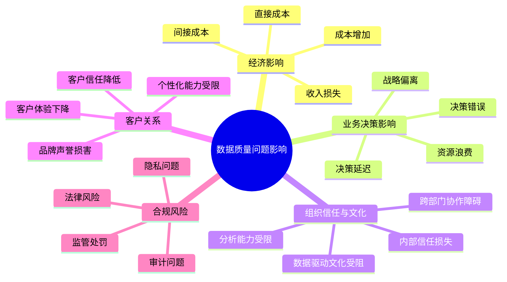
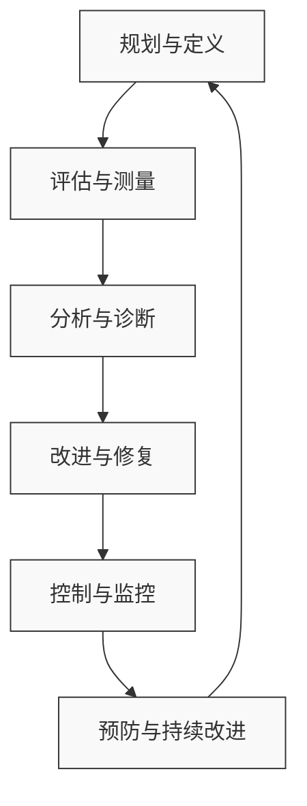

---
{"dg-publish":true,"tags":["商业分析","数据质量","数据治理","数据管理","数据清洗"],"创建日期":"2024-04-28","permalink":"/知识共享/002_商业分析/01_学习内容/02_数据收集与处理/2.4 数据质量管理/","dgPassFrontmatter":true}
---

# 数据质量管理

## 引言

在数据驱动决策的时代，数据质量已成为组织成功的关键因素。低质量数据会导致错误的分析结果、不准确的预测和错误的业务决策，最终可能造成巨大的经济损失和声誉损害。据研究估计，组织因数据质量问题每年损失的成本平均达到收入的15-25%。本文将系统介绍数据质量管理的核心概念、框架、方法和最佳实践，帮助商业分析师有效识别、评估和提升数据质量，为可靠的业务分析奠定坚实基础。

## 数据质量基础

### 数据质量的定义与维度

数据质量是指数据满足其预期用途所需要求的程度。高质量的数据能够准确反映现实世界实体，并支持组织有效地做出决策。

**数据质量的核心维度**：

1. **准确性**：数据正确反映真实世界实体或事件的程度
   - 示例：客户地址与实际居住地一致
   - 测量：与真实来源比对的错误率

2. **完整性**：数据集中所需数据项的存在和非空值的程度
   - 示例：客户记录包含所有必要字段(姓名、地址、联系方式等)
   - 测量：必填字段的空值百分比

3. **一致性**：数据在不同系统或数据集之间保持一致的程度
   - 示例：客户在CRM和ERP系统中的信息匹配
   - 测量：跨系统数据不一致的比例

4. **及时性**：数据能够及时反映当前状态的程度
   - 示例：库存数据反映实时库存水平
   - 测量：数据更新延迟时间

5. **唯一性**：没有不必要的重复记录的程度
   - 示例：客户数据库中没有重复的客户记录
   - 测量：重复记录的百分比

6. **有效性**：数据符合特定业务规则或约束的程度
   - 示例：日期格式正确，数值在合理范围内
   - 测量：不符合业务规则的记录比例

7. **可靠性**：数据来源和采集方法的可信度
   - 示例：数据来自可靠的第一手源头
   - 测量：源系统可靠性评分

8. **相关性**：数据适用于特定分析或决策需求的程度
   - 示例：收集的数据点与业务问题直接相关
   - 测量：数据使用率和用户满意度

这些维度相互关联，共同构成了全面的数据质量框架。

### 数据质量问题的影响

低质量数据对组织的影响是多方面的，从运营效率到战略决策都可能受到严重影响：

1. **经济影响**：
   - **直接成本**：数据错误纠正、客户投诉处理、合规性罚款
   - **间接成本**：生产力下降、机会成本、决策延迟
   - **收入损失**：客户体验下降导致的客户流失、错过销售机会
   - **成本增加**：库存管理不当、资源分配不当、运营效率降低

2. **业务决策影响**：
   - **决策延迟**：由于数据不可信导致的决策犹豫
   - **决策错误**：基于不准确数据的错误结论
   - **战略偏离**：错误的市场洞察导致错误的战略方向
   - **资源浪费**：基于错误数据的项目投资

3. **组织信任与文化影响**：
   - **内部信任损失**：员工对数据系统的不信任
   - **数据驱动文化受阻**：无法建立依赖数据的决策文化
   - **跨部门协作障碍**：由于数据质量问题导致的沟通障碍
   - **分析能力受限**：高级分析项目因数据质量问题而失败

4. **客户关系影响**：
   - **客户体验下降**：错误或不完整的客户数据导致的服务失误
   - **个性化能力受限**：无法基于准确数据提供个性化体验
   - **客户信任降低**：错误的客户沟通和互动
   - **品牌声誉损害**：数据错误导致的公开失误

5. **合规风险**：
   - **监管处罚**：不符合数据质量相关法规要求
   - **审计问题**：无法提供准确可靠的报告数据
   - **法律风险**：基于错误数据的业务决策引发的法律纠纷
   - **隐私问题**：数据质量控制不足导致的隐私保护缺陷

### 数据质量问题的常见根源

识别和理解数据质量问题的根本原因是解决这些问题的第一步：

1. **数据输入问题**：
   - **人为错误**：手动输入错误、错误理解、简写或缩写不一致
   - **缺乏验证**：输入时缺少适当的验证规则和检查
   - **批量导入错误**：数据迁移或批量上传过程中的格式不匹配
   - **默认值滥用**：过度依赖系统默认值而非实际数据

2. **系统和技术问题**：
   - **系统集成缺陷**：不同系统间的数据转换和映射错误
   - **系统设计缺陷**：数据模型设计不当、字段限制不合理
   - **技术故障**：系统崩溃、网络问题导致的数据丢失或损坏
   - **数据类型不匹配**：不同系统对相同数据使用不同的数据类型

3. **流程与管理问题**：
   - **缺乏标准流程**：数据处理和管理缺少明确的标准和流程
   - **责任不清**：数据所有权和责任界定不明确
   - **控制不足**：缺少适当的数据审查和控制机制
   - **变更管理不当**：系统或流程变更未考虑数据质量影响

4. **组织文化因素**：
   - **质量意识不足**：组织对数据质量重要性认识不足
   - **激励不当**：员工绩效指标不包含数据质量考核
   - **短期导向**：过度关注速度和数量而非质量
   - **技能缺口**：员工缺乏必要的数据管理技能和培训

5. **时间和演变因素**：
   - **数据老化**：随时间推移数据变得过时而未更新
   - **需求变化**：业务需求变化导致现有数据结构不再适用
   - **业务变更**：组织结构、流程或系统变更导致的数据不一致
   - **标准演变**：行业标准或编码方案变更

6. **外部因素**：
   - **第三方数据问题**：从外部源获取的低质量数据
   - **法规变化**：监管要求变化导致的数据合规问题
   - **市场动态**：市场变化使现有数据分类或属性过时
   - **客户行为变化**：客户互动方式变化导致数据捕获挑战

## 数据质量管理框架

### 数据质量管理的生命周期

有效的数据质量管理需要一个结构化、循环的生命周期方法：

1. **规划与定义阶段**：
   - 识别关键数据资产和业务流程依赖
   - 定义数据质量维度和特定指标
   - 建立数据质量目标和可接受阈值
   - 确定利益相关者和责任分配
   - 开发数据质量策略和路线图

2. **评估与测量阶段**：
   - 收集数据样本和元数据
   - 应用数据质量规则和检查
   - 测量各维度的质量指标
   - 识别问题模式和潜在根源
   - 量化数据质量问题的业务影响

3. **分析与诊断阶段**：
   - 进行根本原因分析
   - 评估数据流和处理流程
   - 检查系统控制和集成点
   - 分析数据质量问题的趋势和模式
   - 确定优先解决的问题领域

4. **改进与修复阶段**：
   - 开发短期数据清洗和修复方案
   - 实施长期系统和流程改进
   - 开发数据质量控制点和验证规则
   - 更新数据标准和管理政策
   - 实施技术和流程解决方案

5. **控制与监控阶段**：
   - 建立持续的数据质量监控
   - 实施数据质量报告和仪表板
   - 创建数据质量问题警报机制
   - 定期审查和验证数据质量控制
   - 测量改进效果和投资回报

6. **预防与持续改进阶段**：
   - 开展数据质量意识培训
   - 将数据质量嵌入到业务流程
   - 建立数据治理框架和最佳实践
   - 实施预防性质量保证措施
   - 持续改进和适应新挑战

这个生命周期是迭代的，组织应该持续循环经历这些阶段以实现持续的数据质量改进。

### 数据质量管理的组织框架

有效的数据质量管理需要适当的组织结构和责任分配：

1. **治理层**：
   - **数据治理委员会**：跨职能团队，设定总体数据策略和优先级
   - **首席数据官(CDO)**：负责数据资产的战略价值和质量
   - **业务数据所有者**：对特定领域数据质量负最终责任
   - **数据风险与合规官**：确保满足数据相关的监管要求

2. **管理层**：
   - **数据质量经理**：协调数据质量活动和资源
   - **数据治理管理者**：实施数据治理政策和流程
   - **数据架构师**：确保数据模型和结构支持质量要求
   - **流程负责人**：确保业务流程中嵌入数据质量控制

3. **执行层**：
   - **数据管理员**：日常数据维护和质量控制
   - **数据分析师**：评估和监控数据质量指标
   - **数据工程师**：构建和维护数据质量工具和流程
   - **业务用户代表**：提供业务视角和需求

4. **支持职能**：
   - **IT支持**：维护支持数据质量的技术基础设施
   - **培训与变革管理**：提升组织数据质量意识和能力
   - **项目管理**：管理数据质量改进项目
   - **审计与合规**：独立评估数据质量控制的有效性

### DAMA数据质量管理框架

DAMA(数据管理协会)提供了一个全面的数据质量管理框架，被广泛应用于行业实践：

1. **政策与标准**：
   - 数据质量政策的制定和传达
   - 数据质量标准和指南的开发
   - 数据质量管理计划的制定
   - 职责和问责制的确立

2. **质量要求**：
   - 业务对数据质量的要求定义
   - 质量维度的优先级设定
   - 质量指标和目标的确定
   - 数据质量服务级别协议(SLA)制定

3. **测量与评估**：
   - 数据质量评估方法的定义
   - 计划性评估和随机抽查的实施
   - 质量测量工具的应用
   - 质量基线的建立和跟踪

4. **改进计划**：
   - 数据质量改进机会的识别
   - 成本效益分析和优先级排序
   - 短期和长期改进计划的制定
   - 改进项目的资源分配和管理

5. **集成与实施**：
   - 将数据质量管理集成到数据生命周期
   - 在系统开发中嵌入数据质量控制
   - 数据质量工具的实施和集成
   - 数据质量流程的标准化

6. **沟通与文化**：
   - 数据质量意识和培训计划
   - 数据质量报告和透明度
   - 数据质量成功案例的宣传
   - 数据质量文化的培养

7. **监控与持续改进**：
   - 持续的数据质量监控系统
   - 定期的数据质量审计
   - 质量趋势分析和报告
   - 基于反馈的持续改进循环

## 数据质量评估方法

### 数据质量评估的类型

数据质量评估可以采用多种方法，根据目的和范围选择适当的评估类型：

1. **基线评估**：
   - **目的**：建立数据质量的初始基准和参考点
   - **范围**：通常覆盖关键数据集的多个维度
   - **频率**：在开始数据质量项目或重大系统变更时
   - **输出**：详细的质量评分和改进机会清单

2. **持续监控**：
   - **目的**：检测数据质量随时间的变化和潜在问题
   - **范围**：关注关键质量指标和预定义规则
   - **频率**：实时、每日或每周自动执行
   - **输出**：质量趋势、异常警报和仪表板

3. **目标评估**：
   - **目的**：深入分析特定数据质量问题或领域
   - **范围**：针对特定数据集、系统或质量维度
   - **频率**：按需进行，通常在发现问题后
   - **输出**：问题根本原因分析和具体改进建议

4. **项目前评估**：
   - **目的**：在数据密集型项目前评估数据准备情况
   - **范围**：与项目相关的关键数据集
   - **频率**：在项目计划阶段进行
   - **输出**：数据就绪度评估和必要的清洗计划

5. **合规审计**：
   - **目的**：验证是否符合数据相关法规和政策
   - **范围**：受监管数据和相关流程
   - **频率**：定期或根据监管要求
   - **输出**：合规报告、风险评估和补救计划

6. **供应商数据评估**：
   - **目的**：评估第三方数据的质量和适用性
   - **范围**：外部获取的数据集
   - **频率**：在获取数据前和合同更新时
   - **输出**：供应商数据质量评分和改进要求

### 数据分析与评估技术

评估数据质量需要多种分析技术，从基本的统计分析到高级的异常检测：

1. **描述性统计分析**：
   - **完整性检查**：空值、缺失值、默认值的比例统计
   - **唯一性分析**：重复记录识别和唯一键验证
   - **分布分析**：直方图、箱线图展示数据分布
   - **基本统计量**：平均值、中位数、标准差、最大/最小值计算

2. **有效性与一致性检查**：
   - **数据类型验证**：确保数据符合预期的数据类型
   - **范围检查**：验证数值是否在有效范围内
   - **格式验证**：检查日期、电话、邮箱等的格式正确性
   - **引用完整性**：验证外键与主键的关系
   - **跨字段一致性**：检查相关字段之间的逻辑关系

3. **准确性评估技术**：
   - **第三方验证**：与外部权威源比对
   - **主数据比对**：与主数据管理系统比对
   - **历史数据比对**：与历史记录比较识别异常变化
   - **业务规则验证**：应用特定业务逻辑规则
   - **抽样验证**：随机抽样进行人工核查

4. **模式和异常检测**：
   - **聚类分析**：识别数据中的自然分组和离群点
   - **离群值检测**：统计方法或机器学习识别异常值
   - **相关性分析**：验证数据元素间的预期关系
   - **时间序列分析**：识别时间模式和异常趋势
   - **模糊匹配**：识别近似重复或相似记录

## 数据质量改进策略

### 数据清洗技术

解决已存在数据问题的清洗方法：

1. **标准化和规范化**：
   - 格式标准化：统一日期、货币、电话号码等格式
   - 编码规范化：统一国家代码、产品编码等
   - 名称规范化：统一组织名称、地址表示
   - 实施技术：正则表达式、查找替换、转换函数

2. **错误检测与纠正**：
   - 拼写错误检测：基于字典和编辑距离
   - 值域检查：基于业务规则识别错误
   - 上下文验证：基于相关字段检验合理性
   - 实施工具：模糊匹配算法、约束验证

3. **缺失值处理**：
   - 分析缺失模式：识别系统性缺失原因
   - 填充方法选择：均值/中位数填充、预测填充、多重插补
   - 数据补充：从其他来源获取缺失信息
   - 实施考量：填充对分析的影响评估

4. **重复记录处理**：
   - 重复识别算法：精确匹配、模糊匹配
   - 记录合并策略：主记录选择、信息整合
   - 唯一标识符管理：建立可靠的实体识别机制
   - 实施挑战：平衡准确率和召回率

### 数据质量控制流程

建立预防性数据质量控制：

1. **数据输入控制**：
   - 表单验证：即时验证用户输入
   - 智能默认值：减少手动输入错误
   - 参考数据检查：与主数据实时比对
   - 实施案例：客户数据输入验证系统

2. **业务流程集成**：
   - 流程内质量检查点设计
   - 审批工作流中的数据验证
   - 数据变更控制和审计
   - 实施案例：采购到付款流程中的数据控制

3. **自动化质量监控**：
   - 定期自动检查：根据规则集自动验证
   - 异常检测算法：识别偏离正常模式的数据
   - 质量警报系统：实时通知关键问题
   - 实施案例：销售数据异常监控系统

### 数据质量修复流程

系统化的数据质量问题修复方法：

1. **问题分类与优先级**：
   - 严重性评估：基于业务影响
   - 范围确定：影响的数据范围和系统
   - 优先级分配：基于严重性和业务重要性
   - 修复排期：制定解决计划

2. **根因分析技术**：
   - 鱼骨图分析：识别问题的各种可能原因
   - 五个为什么：深入探究根本原因
   - 过程映射：识别数据流中的问题点
   - 案例研究：客户数据重复问题的根因分析

3. **修复实施与验证**：
   - 修复脚本开发：数据纠正程序
   - 变更管理：确保修复不引入新问题
   - 结果验证：确认修复的有效性
   - 文档记录：记录问题、原因和解决方案

## 数据质量工具与技术

### 数据质量软件解决方案

市场上主要数据质量工具及其功能：

1. **集成数据质量平台**：
   - 代表产品：Informatica Data Quality, IBM InfoSphere QualityStage
   - 主要功能：数据分析、标准化、匹配与合并、监控
   - 适用场景：企业级数据治理项目
   - 优势与局限：功能全面但成本高、学习曲线陡

2. **专业数据清洗工具**：
   - 代表产品：Trifacta, OpenRefine
   - 主要功能：交互式数据转换、异常识别、清洗自动化
   - 适用场景：分析前数据准备、单次数据项目
   - 优势与局限：易用性高但集成能力有限

3. **开源数据验证框架**：
   - 代表项目：Great Expectations, Deequ
   - 主要功能：数据验证、质量测试、监控
   - 适用场景：数据管道质量控制、DevOps集成
   - 优势与局限：成本低但需技术能力支持

4. **工具选择考量**：
   - 数据规模和复杂度
   - 技术环境和集成需求
   - 团队技能和能力
   - 预算和总体拥有成本

### 数据分析与数据质量

数据分析技术在质量管理中的应用：

1. **探索性数据分析(EDA)**：
   - 分布可视化：直方图、箱线图分析异常
   - 关系分析：散点图、相关矩阵发现数据关系
   - 时间趋势：识别数据随时间的变化模式
   - 应用案例：零售数据质量EDA报告

2. **统计方法**：
   - 异常检测：Z-分数、IQR方法识别离群值
   - 缺失模式分析：MCAR/MAR/MNAR识别
   - 一致性测试：数据项间关系验证
   - 应用案例：金融交易数据异常检测

3. **机器学习在数据质量中的应用**：
   - 异常检测算法：隔离森林、自编码器
   - 预测性填充：使用预测模型填充缺失值
   - 实体解析：使用ML改进记录链接和去重
   - 应用案例：客户数据实体解析系统

### 数据质量自动化

质量管理流程自动化策略：

1. **自动化范围识别**：
   - 适合自动化的重复性质量检查
   - 需要人工判断的复杂质量问题
   - 自动-人工混合流程设计
   - 投资回报评估框架

2. **数据质量流水线**：
   - 持续数据质量检测
   - 与ETL/数据集成流程集成
   - 自动修复常见问题
   - 质量门禁和审批流程

3. **自动化实现技术**：
   - 脚本和调度工具：Python, Cron, Airflow
   - 规则引擎：Drools, JESS
   - API集成：系统间数据验证接口
   - 实施案例：每日数据质量检查自动化

## 数据质量治理与实践

### 数据质量策略制定

制定企业数据质量策略的方法：

1. **策略组成要素**：
   - 质量目标和原则
   - 角色和责任定义
   - 标准和流程规范
   - 技术和工具选择
   - 实施路线图

2. **策略制定过程**：
   - 需求收集：业务部门数据质量需求
   - 现状评估：当前数据质量水平和问题
   - 差距分析：目标与现状的差距
   - 优先级排序：基于业务价值和实施难度
   - 资源规划：人力、技术和预算需求

3. **实施成功因素**：
   - 高层支持：管理层认可和推动
   - 业务参与：数据所有者的积极参与
   - 明确价值：清晰定义业务价值
   - 现实期望：渐进式改进而非一蹴而就
   - 持续沟通：在整个组织中宣传重要性

### 跨组织数据质量管理

处理组织边界内外的数据质量挑战：

1. **内部跨部门协作**：
   - 共同标准建立：跨职能的数据标准
   - 部门间数据责任界定
   - 质量问题升级和解决机制
   - 协作成功案例：销售和财务数据协调

2. **外部数据质量管理**：
   - 供应商数据质量SLA：服务级别协议
   - 第三方数据评估框架
   - 外部数据整合质量控制
   - 案例研究：零售商供应商数据质量管理

3. **数据交换标准与协议**：
   - 数据格式和交换标准
   - 质量验证协议
   - 错误处理和纠正流程
   - 实施案例：医疗保健数据交换标准

### 数据质量文化构建

在组织中培养数据质量意识：

1. **数据质量意识培养**：
   - 培训计划：不同角色的定制培训
   - 最佳实践分享：成功案例宣传
   - 质量指标可视化：透明展示质量状况
   - 实施案例：银行数据质量意识项目

2. **激励机制**：
   - 质量目标纳入绩效考核
   - 表彰数据质量改进成就
   - 质量问题报告鼓励机制
   - 案例分析：客服中心数据质量改进激励

3. **持续改进文化**：
   - 质量回顾会议
   - 经验教训分享
   - 创新思维鼓励
   - 实践社区建设

## 行业案例与最佳实践

### 零售行业数据质量管理

零售业数据质量挑战与解决方案：

1. **关键质量挑战**：
   - 产品数据管理：大量SKU的属性准确性
   - 客户数据整合：全渠道客户视图构建
   - 库存准确性：实物库存与系统数据一致性
   - 销售数据时效性：实时决策支持

2. **解决方案案例**：
   - 沃尔玛产品数据治理：供应商数据门户
   - 亚马逊客户360视图：身份解析技术
   - 宜家库存准确性项目：RFID和周期盘点
   - 案例分析：零售商产品主数据质量改进

3. **效益与经验**：
   - 准确产品数据提升销售转化率12%
   - 客户数据整合减少营销成本20%
   - 库存准确性提高减少缺货率30%
   - 最佳实践总结：零售数据质量管理框架

### 金融服务业数据质量管理

金融行业特有的数据质量需求：

1. **监管与合规需求**：
   - 反洗钱(AML)数据质量要求
   - 客户了解(KYC)数据完整性
   - 巴塞尔协议/BCBS 239数据报告准确性
   - 案例：大型银行监管报告数据质量框架

2. **金融特有数据质量问题**：
   - 客户记录重复：合并账户难题
   - 交易数据准确性：财务影响巨大
   - 风险数据及时性：实时风险监控
   - 案例：信用卡欺诈检测中的数据质量

3. **行业最佳实践**：
   - 摩根大通主数据管理办法
   - 花旗银行数据质量评分卡
   - 汇丰银行数据治理框架
   - 经验总结：金融机构数据质量成功要素

### 医疗保健数据质量管理

医疗行业数据质量的特殊考虑：

1. **医疗数据质量挑战**：
   - 患者识别准确性：身份匹配的关键性
   - 临床数据完整性：治疗决策的依据
   - 隐私与安全平衡：保护敏感信息
   - 多系统数据整合：形成完整患者记录

2. **解决方案案例**：
   - 梅奥诊所患者主索引系统
   - 凯撒医疗电子健康记录数据标准
   - 克利夫兰诊所数据质量改进计划
   - 案例分析：医院患者数据整合项目

3. **效益与影响**：
   - 患者安全提升：减少药物错误率15%
   - 运营效率改善：减少重复检查25%
   - 研究数据质量：提高临床研究可靠性
   - 最佳实践：医疗保健数据质量框架

## 数据质量的未来趋势

### 新兴技术对数据质量的影响

技术发展对数据质量管理的改变：

1. **人工智能与自动化**：
   - 自学习数据质量规则
   - 智能异常检测算法
   - 自动化数据修复建议
   - 趋势预测：AI数据管家的兴起

2. **区块链与数据可信度**：
   - 数据来源可验证性
   - 不可篡改的数据历史
   - 分布式数据质量共识
   - 案例：供应链数据真实性验证

3. **大数据环境中的质量管理**：
   - 海量数据的质量评估方法
   - 实时流数据的质量控制
   - 非结构化数据的质量验证
   - 未来展望：大数据质量管理框架

### 数据伦理与质量

数据伦理考量与数据质量的交叉：

1. **偏见与公平性**：
   - 识别和减轻数据偏见
   - 代表性抽样确保公平
   - 算法公平性评估
   - 案例：招聘数据系统中的偏见识别

2. **透明度与可解释性**：
   - 数据质量评估的可解释性
   - 质量改进决策的透明度
   - 数据谱系与溯源
   - 实践框架：负责任的数据质量管理

3. **隐私保护与数据最小化**：
   - 隐私设计中的数据质量考量
   - 数据匿名化与质量平衡
   - 数据最小化策略
   - 案例：GDPR合规的数据质量实践

## 实施数据质量管理的行动计划

### 数据质量成熟度评估

评估组织数据质量管理能力：

1. **成熟度模型框架**：
   - 初始级：反应式、问题驱动
   - 重复级：基本流程、局部一致
   - 定义级：标准化流程、全组织应用
   - 管理级：量化管理、预测性控制
   - 优化级：持续改进、创新导向

2. **评估方法**：
   - 自评问卷设计
   - 基准比较分析
   - 能力差距识别
   - 案例：制造企业数据质量成熟度评估

3. **提升路径规划**：
   - 目标状态定义
   - 阶段性里程碑设置
   - 能力建设计划
   - 实施案例：零售银行数据质量提升路径

### 数据质量快速启动计划

快速启动数据质量项目的方法：

1. **范围界定**：
   - 选择高价值数据域
   - 确定关键质量维度
   - 设定现实的初始目标
   - 案例：客户数据质量快速评估

2. **快速成果策略**：
   - 先易后难的问题排序
   - 可见度高的改进点优先
   - 自动化低悬果实
   - 实施案例：产品数据30天改进计划

3. **扩展与规模化**：
   - 经验教训文档
   - 成功模式复制
   - 工具和方法标准化
   - 案例：从部门到企业的质量管理扩展

## 思考问题

1. 您组织中最关键的数据质量挑战是什么？如何系统性地评估这些问题的业务影响？
2. 如何平衡数据质量提升的成本与低质量数据带来的风险和损失？
3. 在构建数据质量文化时，如何有效克服"不是我的问题"的组织惰性？
4. 对于没有专门数据质量工具的团队，如何使用现有资源建立基本的质量管理流程？
5. 在多源数据集成场景中，如何协调不同来源的数据标准和质量要求？
6. 数据量急剧增加的情况下，传统数据质量方法面临哪些挑战？如何应对？
7. 如何设计既能发现已知数据问题又能识别未知数据异常的质量控制系统？
8. 在敏捷开发环境中，如何将数据质量活动融入快速迭代的开发周期？
9. 自动化和AI将如何改变未来5年的数据质量管理实践？
10. 如何评估数据质量改进举措的投资回报率(ROI)？哪些指标最有说服力？

## 参考文献

1. Batini, C., & Scannapieco, M. (2016). Data and Information Quality: Dimensions, Principles and Techniques. Springer.
2. Loshin, D. (2010). The Practitioner's Guide to Data Quality Improvement. Morgan Kaufmann.
3. McGilvray, D. (2008). Executing Data Quality Projects: Ten Steps to Quality Data and Trusted Information. Morgan Kaufmann.
4. Redman, T. C. (2001). Data Quality: The Field Guide. Digital Press.
5. Herzog, T. N., Scheuren, F. J., & Winkler, W. E. (2007). Data Quality and Record Linkage Techniques. Springer.
6. DAMA International. (2017). DAMA-DMBOK: Data Management Body of Knowledge (2nd ed.). Technics Publications.
7. Olson, J. E. (2003). Data Quality: The Accuracy Dimension. Morgan Kaufmann.
8. Sadiq, S. (Ed.). (2013). Handbook of Data Quality: Research and Practice. Springer. 