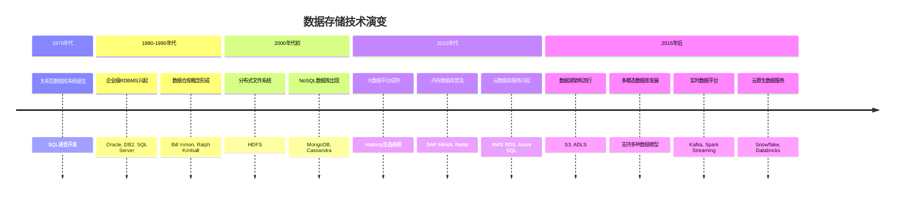
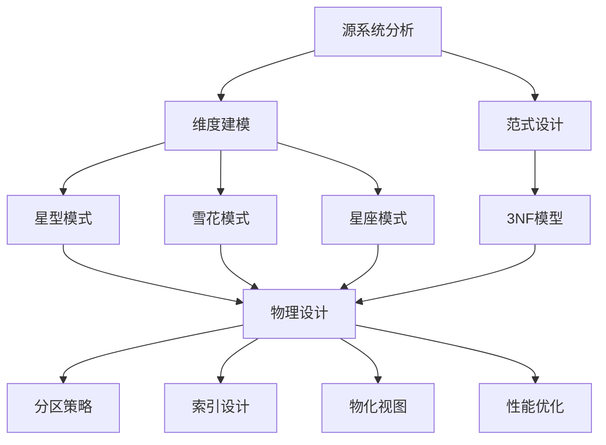
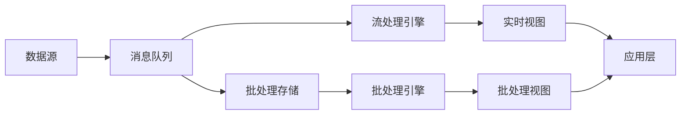
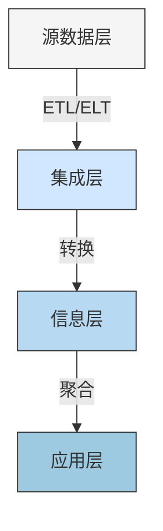

---
{"dg-publish":true,"tags":["商业分析","数据存储","数据管理","数据仓库","数据湖"],"创建日期":"2024-04-28","permalink":"/知识共享/002_商业分析/01_学习内容/02_数据收集与处理/2.5 数据存储与管理/","dgPassFrontmatter":true}
---

# 数据存储与管理

## 引言

数据存储与管理是商业分析体系中的关键基础设施，它决定了企业如何有效地组织、存储、访问和维护数据资产。随着数据量呈指数级增长，数据类型日益多样化，以及分析需求不断提高，选择合适的数据存储架构和管理策略变得尤为重要。本文将系统介绍现代数据存储技术、数据管理原则以及最佳实践，帮助商业分析师理解数据基础设施如何支持高效的数据驱动决策。

## 数据存储基础概念

### 数据存储的演变

数据存储技术的历史发展轨迹：

**技术演进的关键驱动因素**：

1. **数据量增长**：从GB级到PB、EB级的扩展
2. **数据多样性**：从结构化到半结构化、非结构化数据
3. **处理速度要求**：从批处理到实时分析
4. **成本优化**：降低存储和计算成本
5. **可扩展性需求**：弹性支持业务增长

### 数据存储分类

数据存储技术可按多个维度分类：

**按数据模型分类**：

1. **关系型存储**：
   - 基于表格的行列结构
   - 严格的模式定义
   - 支持SQL查询和ACID事务
   - 典型产品：Oracle, MySQL, PostgreSQL, SQL Server

2. **NoSQL存储**：
   - 键值存储：简单的键值对(Redis, DynamoDB)
   - 文档存储：JSON/BSON文档(MongoDB, Couchbase)
   - 列族存储：列式组织(Cassandra, HBase)
   - 图数据库：节点与边结构(Neo4j, Amazon Neptune)

3. **多模态存储**：
   - 支持多种数据模型的统一系统
   - 灵活适应不同应用需求
   - 典型产品：ArangoDB, Azure Cosmos DB, OrientDB

**按部署模式分类**：

1. **本地部署**：
   - 在组织内部数据中心运行
   - 完全控制硬件和软件
   - 适合严格的安全和合规要求

2. **云端部署**：
   - IaaS上的自管理数据库
   - 托管数据库服务(DBaaS)
   - 云原生数据平台
   - 优势：弹性扩展、按需付费、减少运维

3. **混合部署**：
   - 结合本地和云端的优势
   - 数据分层策略
   - 灾备和业务连续性考量

**按处理类型分类**：

1. **事务处理(OLTP)**：
   - 优化读写并发的短事务
   - 高吞吐量、低延迟
   - 实时操作数据存储

2. **分析处理(OLAP)**：
   - 优化复杂分析查询
   - 处理大量历史数据
   - 支持聚合、多维分析

3. **混合事务分析(HTAP)**：
   - 同时支持OLTP和OLAP工作负载
   - 实时分析事务数据
   - 消除数据移动的延迟

### 关键技术要素

评估数据存储系统的关键技术维度：

1. **性能指标**：
   - 吞吐量：单位时间处理的操作数
   - 延迟：操作响应时间
   - 并发能力：同时服务的用户/查询数
   - 扫描效率：处理大量数据的能力

2. **扩展性特征**：
   - 垂直扩展(Scale-up)：增加单节点资源
   - 水平扩展(Scale-out)：增加节点数量
   - 自动扩展能力：根据负载动态调整
   - 无中断扩展：不影响服务可用性

3. **数据可靠性**：
   - 持久性保证：数据不丢失的机制
   - 备份与恢复能力：RPO(恢复点目标)和RTO(恢复时间目标)
   - 数据复制策略：同步/异步复制
   - 故障转移机制：自动容错能力

4. **管理复杂性**：
   - 配置与监控便捷性
   - 自动化程度：自我管理、自我修复能力
   - 维护要求：升级、调优的复杂度
   - 学习曲线：所需专业知识水平

## 企业数据存储架构

### 数据仓库

数据仓库是结构化、面向主题的分析数据集成环境：

1. **核心特点**：
   - 面向主题：围绕业务领域组织
   - 集成的：整合多源数据，统一格式
   - 不可更新：历史快照，通常只追加
   - 时变性：跟踪数据随时间的变化

2. **常见架构模型**：
   - 企业数据仓库(EDW)：集中式全企业视图
   - 数据集市：部门级的专题数据集
   - 虚拟数据仓库：不移动数据，通过视图整合
   - 混合架构：结合多种模型的实用方法

3. **ETL/ELT过程**：
   - 传统ETL：提取→转换→加载(清洗后入库)
   - 现代ELT：提取→加载→转换(入库后处理)
   - 流程设计考量：数据量、实时性、计算资源
   - 工具生态：Informatica, Talend, SSIS, Airflow

4. **仓库设计方法**：

   - 顶层架构设计：分层策略(源数据、集成、维度、报表)
   - 维度建模：事实表和维度表设计
   - 历史数据处理：SCD(缓慢变化维)类型设计
   - 最佳实践：命名规范、文档管理、元数据治理

5. **主要实现技术**：
   - 传统解决方案：Teradata, Oracle, IBM DB2
   - 云原生平台：Snowflake, Amazon Redshift, Google BigQuery
   - MPP架构：Vertica, Greenplum, Azure Synapse
   - 选型考量：数据量、查询复杂度、预算、IT能力

### 数据湖

数据湖是存储大量原始格式数据的存储库：

1. **核心特点**：
   - 保存原始格式：最大限度保留数据价值
   - 模式灵活：支持模式上读(schema-on-read)
   - 多种数据类型：结构化、半结构化、非结构化
   - 全历史存储：保留所有历史数据

2. **典型架构组件**：
   - 存储层：对象存储(S3, ADLS)或分布式文件系统(HDFS)
   - 处理引擎：Spark, Hive, Presto, Databricks
   - 目录服务：数据编目和发现(AWS Glue, Delta Lake)
   - 安全控制：身份管理、访问控制、加密

3. **数据组织策略**：
   - 分区设计：基于时间、地区等划分
   - 文件格式选择：Parquet, ORC, Avro, JSON
   - 目录结构：逻辑组织方式
   - 数据生命周期管理：热/冷/归档分层

4. **管理挑战与解决方案**：
   - 防止数据沼泽：缺乏组织的混乱数据湖
   - 元数据管理：记录数据属性、来源、质量
   - 数据谱系：跟踪数据流转和转换
   - 治理框架：权限、隐私、合规管理

5. **主要实现技术**：
   - 开源框架：Apache Hadoop生态系统
   - 云服务：AWS Lake Formation, Azure Data Lake, GCP Cloud Storage
   - Delta Lake/Iceberg/Hudi：事务性数据湖技术
   - 集成平台：Databricks Lakehouse, Cloudera CDP

### 数据仓库vs数据湖vs湖仓一体

不同数据存储架构的对比：

| 特性 | 数据仓库 | 数据湖 | 湖仓一体(Lakehouse) |
|-----|--------|------|-----------------|
| 数据模型 | 预定义模式 | 灵活/无模式 | 混合模式，schema-on-read/write |
| 数据类型 | 主要是结构化 | 所有类型 | 所有类型 |
| 用途 | 结构化报表、BI | 探索性分析、数据科学 | 统一分析与AI |
| 用户群体 | 业务分析师 | 数据科学家、工程师 | 全谱分析用户 |
| 数据质量 | 高(严格ETL) | 变化大(原始数据) | 分层质量管理 |
| 性能 | 优化查询速度 | 原始处理能力 | 结合两者优势 |
| 成本 | 较高($/TB) | 较低($/TB) | 中等 |
| 敏捷性 | 结构变更慢 | 高度灵活 | 平衡结构与灵活 |
| 代表技术 | Snowflake, Redshift | S3+EMR, ADLS+Databricks | Delta Lake, Databricks |

**选择指南**：
- 数据仓库适合：成熟的报表需求、严格的数据质量要求
- 数据湖适合：多样数据探索、数据科学实验、保存原始数据
- 湖仓一体适合：寻求统一平台、同时需要传统分析和AI/ML

### 实时数据平台

支持实时数据处理和分析的架构：

1. **核心组件**：
   - 数据捕获层：变更数据捕获(CDC)、日志采集
   - 消息队列：Kafka, Pulsar, Kinesis
   - 流处理引擎：Spark Streaming, Flink, Kafka Streams
   - 实时存储：内存数据库、时间序列数据库

2. **常见架构模式**：
   - Lambda架构：批处理+流处理的双路径
   - Kappa架构：统一的流处理路径
   - 流批一体：流处理为主，批处理为辅的方法

3. **关键技术考量**：
   - 延迟要求：毫秒级、秒级或分钟级
   - 处理语义：至少一次、最多一次、恰好一次
   - 状态管理：如何维护流处理状态
   - 故障恢复：无数据丢失的恢复策略

4. **商业分析应用**：
   - 实时仪表板：销售、运营实时监控
   - 异常检测：欺诈识别、系统监控
   - 实时个性化：动态内容推荐
   - 时间敏感决策：库存管理、动态定价

5. **实现技术选择**：
   - 开源技术栈：Kafka+Flink/Spark+Elasticsearch
   - 云服务：AWS Kinesis, Azure Event Hubs, Google Dataflow
   - 商业平台：Confluent, Databricks, Snowflake Streaming

## 数据管理核心原则

### 数据架构设计

企业数据架构的关键考量：

1. **关键设计原则**：
   - 分层架构：明确的数据层次和责任边界
   - 解耦设计：减少组件间依赖
   - 可扩展性：适应未来需求增长
   - 数据一致性：跨系统的统一视图

2. **数据分层策略**：

   - 源数据层：原始数据的复制
   - 集成/规范层：清洗、标准化的数据
   - 信息/维度层：业务实体和主数据
   - 应用/发布层：面向特定使用场景

3. **数据移动策略**：
   - 批量加载：大规模定期传输
   - 变更捕获：实时监控数据变更
   - 数据同步：保持系统间一致
   - 虚拟化集成：不复制数据，统一访问 

### 数据集成与交换

连接不同数据系统的方法和技术：

1. **数据集成架构模式**：
   - 点对点集成：系统间直接连接
   - 中心辐射型：中央枢纽(Hub-and-Spoke)
   - 服务总线：消息中间件连接
   - 数据虚拟化：统一访问层

2. **集成技术**：
   - API集成：RESTful, GraphQL, SOAP接口
   - 文件传输：SFTP, S3, Blob Storage
   - 消息队列：发布/订阅模式
   - 数据复制：CDC, 数据库复制
   - ETL/ELT工具：数据转换和加载

3. **数据交换标准**：
   - 通用格式：JSON, XML, CSV, Parquet
   - 行业标准：HL7(医疗), FPML(金融), EDI(供应链)
   - 元数据交换：CWM, DCAT, JSON-LD
   - API规范：OpenAPI, AsyncAPI

4. **集成挑战与解决方案**：
   - 语义差异：数据字典和映射表
   - 实时性要求：分级服务水平协议(SLA)
   - 大规模集成：分布式处理和缓冲
   - 错误处理：补偿机制和恢复流程

### 数据生命周期管理

管理数据从创建到归档的全生命周期：

1. **生命周期阶段**：
   - 创建/获取：初始数据生成或采集
   - 存储/维护：数据持久化和日常管理
   - 使用/共享：提供数据访问和分析
   - 归档/销毁：长期存档或安全删除

2. **数据分级存储**：
   - 热数据：频繁访问，高性能存储
   - 温数据：偶尔访问，标准存储
   - 冷数据：很少访问，低成本存储
   - 归档数据：合规需要，归档存储
   - 策略制定：基于访问频率和业务价值

3. **数据保留政策**：
   - 法规要求：行业特定的保留期限
   - 业务需求：业务运营和分析需要
   - 成本考量：存储成本vs数据价值
   - 实施机制：自动归档和清理

4. **数据备份与恢复**：
   - 备份策略：全量备份、增量备份、差异备份
   - 恢复目标：RPO(恢复点)和RTO(恢复时间)
   - 备份基础设施：本地、异地、云端
   - 备份测试：定期验证恢复能力

### 数据安全与隐私

保护数据资产的安全控制措施：

1. **数据安全框架**：
   - 识别：数据分类和敏感数据发现
   - 保护：访问控制、加密、数据屏蔽
   - 检测：安全监控和异常识别
   - 响应：安全事件处理流程
   - 恢复：数据恢复和业务连续性

2. **关键安全控制**：
   - 身份和访问管理(IAM)：授权和认证
   - 数据加密：静态加密、传输加密、应用层加密
   - 数据脱敏：匿名化、假名化、数据屏蔽
   - 审计日志：跟踪数据访问和变更

3. **隐私合规**：
   - 全球隐私法规：GDPR, CCPA, HIPAA等
   - 隐私设计原则：默认隐私、目的限制
   - 数据主体权利：访问、纠正、删除
   - 数据治理：记录处理活动、影响评估

4. **合规风险管理**：
   - 敏感数据发现：自动识别敏感信息
   - 合规监控：持续评估合规状态
   - 第三方风险：供应商和服务提供商安全
   - 安全文化：员工意识和培训

## 数据管理技术与解决方案

### 元数据管理

管理关于数据的数据：

1. **元数据类型**：
   - 技术元数据：结构、格式、存储位置
   - 业务元数据：定义、所有权、使用上下文
   - 运营元数据：处理历史、数据谱系、质量指标
   - 管控元数据：分类、敏感度、访问权限

2. **元数据仓库**：
   - 集中式存储所有元数据
   - 元模型设计：描述元数据关系
   - 元数据标准：DCMI, ISO 19115, CSDGM
   - 元数据交换格式：CWM, XMI, JSON-LD

3. **数据目录工具**：
   - 功能：数据发现、搜索、注释
   - 主要能力：自动元数据抽取、协作标记
   - 工具示例：Alation, Collibra, AWS Glue Catalog
   - 实施考量：自动化程度、用户体验、集成能力

4. **元数据管理最佳实践**：
   - 自动采集：减少手动维护
   - 主动治理：元数据质量和完整性
   - 业务友好：非技术用户易于使用
   - 演进能力：适应新数据类型和平台

### 主数据管理(MDM)

管理跨系统关键业务实体的主源：

1. **MDM核心概念**：
   - 定义：建立企业核心实体的单一版本真相
   - 主数据类型：客户、产品、供应商、位置等
   - 关键功能：匹配、合并、协调、分发
   - 业务价值：一致的视图、准确决策、合规性

2. **MDM架构模式**：
   - 注册式：仅维护标识符和链接
   - 合并式：创建和维护黄金记录
   - 集中式：单一主存储，系统引用
   - 混合式：结合多种模式的灵活实现

3. **MDM实施流程**：
   - 范围定义：优先主数据域
   - 数据模型设计：属性和关系
   - 数据治理：所有权和流程
   - 技术选型：平台和集成
   - 变更管理：沟通和培训

4. **MDM技术选择**：
   - 企业级平台：Informatica MDM, IBM MDM, TIBCO MDM
   - 云服务：Reltio, Profisee, Semarchy
   - 定制解决方案：基于数据平台构建
   - 选型因素：规模、复杂度、预算、集成需求

### 数据建模与设计

设计数据结构的方法和技术：

1. **数据建模层次**：
   - 概念模型：实体关系图(ERD)、UML
   - 逻辑模型：详细的实体属性和关系
   - 物理模型：特定数据库实现细节

2. **建模方法论**：
   - 结构化方法：自上而下设计
   - 敏捷建模：迭代和增量设计
   - 领域驱动设计：基于业务领域
   - 数据仓库建模：维度模型、雪花/星型模式

3. **建模工具**：
   - 图形化工具：ERwin, ER/Studio, PowerDesigner
   - 协作平台：Lucidchart, dbdiagram.io
   - 代码式工具：SchemaSpv, dbt
   - 反向工程：从现有数据库生成模型

4. **现代建模挑战**：
   - 灵活模式：NoSQL和半结构化数据
   - 大数据模式：扁平化和非规范化
   - 多模型设计：关系+文档+图混合
   - 进化性模式：适应变化的需求

### 云数据平台

云环境中的数据管理解决方案：

1. **主要云厂商数据服务**：

| 服务类型 | AWS | Azure | Google Cloud |
|---------|-----|-------|--------------|
| 关系数据库 | RDS, Aurora | SQL Database, MySQL | Cloud SQL, Spanner |
| NoSQL数据库 | DynamoDB, DocumentDB | Cosmos DB | Firestore, Bigtable |
| 数据仓库 | Redshift | Synapse Analytics | BigQuery |
| 数据湖 | S3 + Lake Formation | Data Lake Storage | Cloud Storage |
| 数据集成 | Glue, DMS | Data Factory | Dataflow, Dataprep |
| 流处理 | Kinesis | Event Hubs, Stream Analytics | Pub/Sub, Dataflow |
| 分析服务 | EMR, Athena | HDInsight, Databricks | Dataproc, Dataflow |

2. **云数据平台优势**：
   - 弹性扩展：按需扩容和缩减
   - 成本优化：按使用付费，无闲置容量
   - 管理简化：减少运维负担
   - 创新速度：快速获取新功能和服务

3. **云端架构模式**：
   - 全云架构：所有数据服务在云端
   - 混合云：本地和云服务结合
   - 多云策略：跨多个云平台分散
   - 边缘计算集成：边缘与云结合的数据处理

4. **云数据管理挑战**：
   - 数据安全：数据保护和访问控制
   - 数据迁移：从本地迁移到云端
   - 性能优化：网络延迟和吞吐量
   - 成本管理：预测和控制云支出
   - 锁定风险：减少对单一云厂商依赖

## 行业应用与最佳实践

### 零售业数据存储实践

零售行业特定的数据存储架构：

1. **关键数据域**：
   - 客户数据：详细资料、购买历史、偏好
   - 产品数据：SKU、属性、图像、描述
   - 交易数据：销售记录、库存变动
   - 全渠道数据：线上线下整合视图

2. **典型架构示例**：
   - 实时库存管理系统：主数据+NoSQL+消息队列
   - 全渠道客户数据平台：数据湖+客户360视图
   - 产品推荐引擎：图数据库+实时处理
   - 案例分析：电子商务平台数据架构演进

3. **行业特定挑战**：
   - 季节性流量波动的扩展性
   - 产品数据的复杂性和多样性
   - 实时定价和库存优化需求
   - 全渠道体验的数据一致性

4. **最佳实践**：
   - 商品分类的灵活数据模型
   - 客户行为数据的横向扩展存储
   - 高峰期的自动弹性架构
   - 产品、价格和库存的缓存策略

### 金融服务数据管理

金融行业的数据存储需求与解决方案：

1. **行业特殊要求**：
   - 严格的合规和安全标准
   - 交易数据的完整性和不可变性
   - 复杂分析与风险管理
   - 实时欺诈检测需求

2. **典型架构案例**：
   - 交易处理系统：主机+分布式事务数据库
   - 风险分析平台：数据仓库+时间序列数据库
   - 客户财务概况：主数据管理+数据虚拟化
   - 案例分析：大型银行的数据现代化之旅

3. **监管考量**：
   - 数据留存要求：7-10年历史数据
   - 数据主权：地理位置限制
   - 审计跟踪：不可篡改的操作记录
   - 报告义务：复杂聚合和合规报告

4. **最佳实践**：
   - 多层级安全架构：防御纵深
   - 数据谱系全程追踪：交易级别
   - 混合存储策略：速度与成本平衡
   - 灾备和业务连续性：多站点复制

### 医疗保健数据架构

医疗行业的数据管理特点：

1. **行业数据特征**：
   - 高度敏感的个人健康信息
   - 结构化与非结构化数据混合
   - 长期患者数据保存需求
   - 互操作性与数据交换需求

2. **典型架构模式**：
   - 电子健康记录系统：事务数据库+文档存储
   - 医学影像存档：对象存储+专用PACS
   - 医疗分析平台：临床数据仓库+数据湖
   - 案例分析：大型医疗系统的互联互通

3. **特殊考量**：
   - HIPAA合规：数据保护和访问控制
   - 患者识别：主索引和身份管理
   - 医疗标准：HL7 FHIR, DICOM, SNOMED CT
   - 紧急访问：平衡安全与可用性

4. **最佳实践**：
   - 同意管理框架：患者授权跟踪
   - 隐私保护设计：数据最小化原则
   - 临床术语标准化：语义互操作性
   - 纵向患者记录：全生命周期视图

## 数据存储与管理的未来趋势

### 新兴数据管理技术

影响数据存储未来的关键技术：

1. **自动化与AI驱动存储**：
   - 自我优化数据库：自动索引和分区
   - AI驱动资源分配：预测性扩展
   - 自动异常检测和修复
   - 示例技术：Oracle Autonomous Database, Azure SQL智能性能

2. **多模态数据平台**：
   - 融合多种数据模型的统一平台
   - 无需ETL的多模式查询
   - 事务与分析工作负载共存
   - 示例技术：CockroachDB, YugabyteDB, FaunaDB

3. **无服务器数据服务**：
   - 自动扩展和收缩的数据平台
   - 按使用量付费的精确计费
   - 零管理运维负担
   - 示例技术：Aurora Serverless, Fauna, Firebase

4. **边缘数据存储**：
   - 数据本地化处理减少延迟
   - 中心与边缘协同的混合架构
   - 离线能力和同步策略
   - 应用场景：IoT、零售、制造

### 数据存储创新方向

未来5-10年的关键发展趋势：

1. **区块链与分布式账本**：
   - 不可篡改数据存储
   - 分布式共识算法
   - 智能合约自动执行
   - 应用领域：供应链、金融、医疗记录

2. **量子存储**：
   - 量子计算支持的数据处理
   - 超高密度存储能力
   - 复杂算法的即时计算
   - 研究方向：加密、搜索优化

3. **存储类内存技术**：
   - 持久内存：Intel Optane, NVDIMM
   - 近内存计算：处理移向数据
   - 存储层次结构重构
   - 性能影响：延迟减少数量级

4. **知识图谱与图存储**：
   - 实体关系的本体表示
   - 语义查询和推理能力
   - 复杂关系的自然表达
   - 应用场景：推荐系统、风险分析

### 数据架构演进趋势

数据基础设施的组织变革：

1. **数据网格(Data Mesh)**：
   - 领域驱动的数据所有权
   - 数据产品化思维
   - 分散治理与自服务架构
   - 成功案例：大型企业数据民主化

2. **数据编排(Data Fabric)**：
   - 集成的元数据和语义层
   - 智能数据发现和访问
   - 自动化数据集成
   - 应用场景：复杂企业环境

3. **云原生数据架构**：
   - 容器化数据服务
   - Kubernetes编排管理
   - 声明式配置与GitOps
   - 微服务数据管理策略

4. **事件驱动架构**：
   - 以事件为中心的数据模型
   - 实时数据流与处理
   - 低耦合、高扩展性系统
   - 架构模式：CQRS、事件溯源

## 构建有效数据存储策略

### 需求分析与架构规划

制定数据存储战略的系统化方法：

1. **需求收集框架**：
   - 功能需求：数据类型、容量、处理模式
   - 非功能需求：性能、可用性、安全性
   - 业务需求：成本约束、时间表、法规
   - 收集技术：访谈、研讨会、用例分析

2. **数据存储评估标准**：
   - 性能基准：吞吐量、延迟、并发能力
   - 可扩展性模型：增长预测和瓶颈分析
   - 总拥有成本(TCO)：硬件、软件、运维、培训
   - 风险评估：供应商锁定、技术成熟度

3. **架构设计方法**：
   - 情景规划：不同业务场景的架构响应
   - 增量实施计划：分阶段落地路线图
   - 概念验证(POC)：关键技术验证
   - 架构治理：标准、审查和合规性

4. **实施关键成功因素**：
   - 业务与技术对齐：共同目标认同
   - 持续沟通：期望管理和进度透明
   - 敏捷适应：根据反馈调整方向
   - 技能发展：培养团队必要能力

### 系统选型与评估

选择适合的数据存储技术：

1. **技术评估方法**：
   - 评估矩阵：加权标准对比
   - 概念验证：实际测试关键功能
   - 参考客户访谈：实际使用经验
   - Gartner/Forrester等分析报告

2. **开源vs商业解决方案**：
   - 开源优势：成本、灵活性、社区
   - 商业优势：支持、稳定性、功能成熟度
   - 混合策略：核心商业+周边开源
   - 决策框架：需求匹配、风险承受度、预算

3. **云vs本地vs混合**：
   - 决策因素：成本模型、控制需求、合规要求
   - 评估方法：TCO分析、风险评估
   - 迁移考量：数据移动成本、技能要求
   - 混合策略：工作负载适当分配

4. **供应商管理策略**：
   - 多供应商vs单一供应商
   - 合同谈判要点：SLA、扩展条款
   - 退出策略：避免锁定的预案
   - 长期伙伴关系管理

### 数据运营(DataOps)

管理数据平台的敏捷方法：

1. **DataOps核心原则**：
   - 自动化：减少手动干预
   - 测试驱动：质量内置于流程
   - 协作：打破团队孤岛
   - 监控：持续观察和反馈

2. **CI/CD for Data**：
   - 数据管道版本控制
   - 自动化测试：数据质量、性能
   - 基础设施即代码(IaC)
   - 发布管理和回滚策略

3. **监控与可观察性**：
   - 关键指标：延迟、吞吐量、错误率
   - 日志管理：集中式日志分析
   - 分布式跟踪：端到端可见性
   - 告警与事件响应流程

4. **容量规划与优化**：
   - 使用模式分析：负载特征理解
   - 预测建模：增长趋势预测
   - 性能调优：查询优化、资源分配
   - 成本控制：资源回收、自动缩放

## 思考问题

1. 贵组织目前的数据架构是什么样的？它如何满足或不满足当前的业务需求？
2. 在选择数据仓库和数据湖之间，您会考虑哪些关键因素？哪些情况下两者结合使用更有意义？
3. 如何评估云数据平台迁移的投资回报率(ROI)？哪些隐性成本容易被忽视？
4. 对于实时数据需求不断增长的组织，您建议采用什么样的架构策略？
5. 数据安全和数据可访问性之间如何取得平衡？有哪些技术可以同时满足这两方面？
6. 如何有效管理结构化和非结构化数据的混合环境？这对传统数据管理实践提出了哪些挑战？
7. 主数据管理(MDM)实施中最常见的失败原因是什么？如何提高成功率？
8. 对于中小型企业，如何设计既经济可行又能满足业务增长的数据架构？
9. "数据网格"和"数据湖仓"架构有何根本区别？它们解决了哪些不同的问题？
10. 未来5年，您认为哪些数据管理技术趋势将对商业分析产生最大影响？为什么？

## 参考文献

1. Kimball, R., & Ross, M. (2013). The Data Warehouse Toolkit: The Definitive Guide to Dimensional Modeling (3rd ed.). Wiley.
2. Inmon, W. H., Linstedt, D., & Levins, M. (2019). Data Architecture: A Primer for the Data Scientist (2nd ed.). Academic Press.
3. Kleppmann, M. (2017). Designing Data-Intensive Applications. O'Reilly Media.
4. Dewson, R. (2018). Beginning SQL Server for Developers (5th ed.). Apress.
5. Deyhim, P. (2019). Data Lake Architecture: Designing the Data Lake and Avoiding the Garbage Dump. Technics Publications.
6. Dama International. (2017). DAMA-DMBOK: Data Management Body of Knowledge (2nd ed.). Technics Publications.
7. Ladley, J. (2019). Data Governance: How to Design, Deploy, and Sustain an Effective Data Governance Program (2nd ed.). Academic Press.
8. O'Neil, C. (2016). Weapons of Math Destruction: How Big Data Increases Inequality and Threatens Democracy. Crown. 