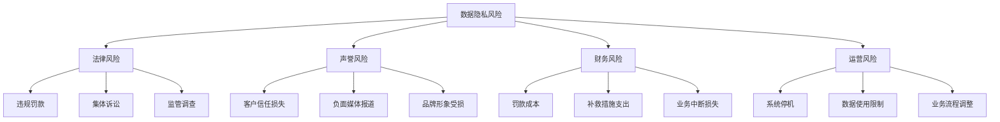

---
{"dg-publish":true,"tags":["商业分析","数据隐私","数据合规","数据保护","GDPR"],"创建日期":"2024-04-28","permalink":"/知识共享/002_商业分析/01_学习内容/02_数据收集与处理/2.6 数据隐私与合规/","dgPassFrontmatter":true}
---

# 数据隐私与合规

## 引言

随着数据驱动决策的普及和数据收集规模的扩大，数据隐私与合规已成为商业分析不可忽视的关键维度。全球各地区日益严格的数据保护法规、消费者隐私意识的提高以及数据泄露事件带来的巨大风险，使得企业必须在有效利用数据的同时，确保合法合规的数据实践。本文将系统介绍数据隐私与合规的核心概念、全球主要法规要求、隐私保护技术以及企业实施合规数据分析的最佳实践，帮助商业分析师在合规框架内最大化数据价值。

## 数据隐私基础

### 数据隐私的定义与重要性

数据隐私是指个人对自己信息的控制权以及组织对个人数据的适当处理。

**数据隐私的核心概念**：

1. **个人数据**：能够识别或关联到特定自然人的任何信息
2. **数据主体**：个人数据所关联的自然人
3. **数据控制者**：决定数据处理目的和方式的实体
4. **数据处理者**：代表控制者处理数据的实体
5. **知情同意**：数据主体对其数据使用明确、自愿的授权

**隐私保护的重要性**：

1. **法律合规**：避免违规处罚和监管行动
2. **声誉保护**：维护品牌信任和客户忠诚度
3. **道德责任**：尊重个人权利和社会期望
4. **业务连续性**：避免数据事件导致的业务中断
5. **竞争优势**：将隐私作为产品差异化因素

**隐私相关风险**：

### 个人可识别信息(PII)

了解何种数据需要特殊保护：

1. **直接标识符**：
   - 姓名、身份证号、护照号
   - 社会保险/安全号码
   - 生物特征数据(指纹、面部识别)
   - 精确地理位置数据

2. **间接标识符**：
   - 电子邮件地址、电话号码
   - IP地址、设备标识符
   - 出生日期、邮政编码
   - 就业、教育或财务信息

3. **特殊类别数据**：
   - 种族或民族
   - 政治观点、宗教或哲学信仰
   - 工会会员资格
   - 健康、性生活或性取向数据
   - 遗传和生物特征数据
   - 犯罪记录

4. **组合识别**：
   - 单独看似匿名的数据点组合可能识别个人
   - 示例：年龄+性别+邮编可能唯一识别某人
   - 数据富集和相关性分析的隐私风险

### 隐私与数据使用的平衡

在分析价值与隐私保护间寻找平衡：

1. **价值与风险权衡**：
   - 数据分析的业务价值评估
   - 隐私风险的量化评估
   - 基于风险的数据使用决策框架

2. **合法使用基础**：
   - 同意：明确、自愿的用户许可
   - 合同履行：实现合同义务所需
   - 法律义务：遵守法律要求
   - 合法权益：平衡控制者与数据主体权益
   - 公共利益：为公共利益或官方职责
   - 生命权益：保护数据主体或他人的重要利益

3. **数据最小化原则**：
   - 仅收集必要的数据
   - 设定适当的保留期限
   - 根据用途限制数据访问
   - 实现目的后删除或匿名化

4. **责任与透明度**：
   - 记录数据处理活动
   - 清晰沟通数据使用目的
   - 提供数据主体控制选项
   - 定期审核数据使用实践

## 全球数据保护法规

### 欧盟GDPR概述

通用数据保护条例的核心要素：

1. **适用范围**：
   - 地域范围：处理欧盟居民数据的所有组织
   - 物质范围：自动化处理的个人数据
   - 豁免：纯个人或家庭活动

2. **核心原则**：
   - 合法、公平和透明
   - 目的限制
   - 数据最小化
   - 准确性
   - 存储限制
   - 完整性和保密性
   - 问责制

3. **数据主体权利**：
   - 被告知权(透明度)
   - 访问权
   - 更正权
   - 删除权("被遗忘权")
   - 处理限制权
   - 数据可携权
   - 反对权
   - 自动化决策相关权利

4. **组织义务**：
   - 记录处理活动
   - 数据保护影响评估(DPIA)
   - 隐私设计与默认隐私
   - 处理器合同
   - 数据保护官(DPO)
   - 数据泄露通知
   - 数据传输限制

5. **处罚与执行**：
   - 最高罚款：2000万欧元或全球营业额4%
   - 各成员国数据保护机构(DPA)执行
   - 欧洲数据保护委员会(EDPB)协调

### 美国数据隐私法规

美国分散式的隐私法律框架：

1. **联邦法规**：
   - HIPAA(健康保险便携与责任法案)：医疗数据
   - GLBA(Gramm-Leach-Bliley Act)：金融数据
   - COPPA(儿童在线隐私保护法)：13岁以下儿童
   - FCRA(公平信用报告法)：消费者信用信息
   - FTC Act第5条：不公平或欺骗性实践

2. **州级法规**：
   - CCPA/CPRA(加州消费者隐私法/隐私权法案)
   - CDPA(弗吉尼亚消费者数据保护法)
   - CPA(科罗拉多隐私法案)
   - CTDPA(康涅狄格数据隐私法)
   - UCPA(犹他消费者隐私法)

3. **CCPA/CPRA主要要求**：
   - 消费者权利：知情、访问、删除、改正、限制敏感数据使用
   - 企业义务：隐私声明、退出选项、合理安全措施
   - 适用范围：年收入超$25M或处理大量个人数据的企业
   - 执行：加州总检察长和隐私保护局

4. **各州法规比较**：
   - 权利范围差异：如"删除权"定义不同
   - 豁免差异：雇员数据、B2B数据处理
   - 同意要求：选择退出vs选择加入模型
   - 数据评估要求：不同的影响评估门槛

### 亚太地区隐私法规

亚太地区主要数据保护框架：

1. **中国**：
   - 《个人信息保护法》(PIPL)
   - 《数据安全法》
   - 《网络安全法》
   - 关键点：跨境数据传输限制、敏感个人信息保护、数据本地化要求

2. **日本**：
   - 《个人信息保护法》(APPI)
   - 与GDPR的充分性决定
   - 关键点：匿名化数据规定、第三方传输要求

3. **韩国**：
   - 《个人信息保护法》(PIPA)
   - 《信息通信网络法》
   - 关键点：严格的同意要求、主动通知义务

4. **印度**：
   - 《数字个人数据保护法》
   - 关键点：数据本地化、跨境传输限制

5. **亚太跨境隐私规则**(CBPR)：
   - APEC框架下的认证系统
   - 促进区域内数据自由流动
   - 参与经济体间的互认机制

### 行业特定规定

特定行业的数据隐私要求：

1. **医疗保健**：
   - HIPAA(美国)：受保护健康信息(PHI)
   - 主要义务：隐私规则、安全规则、违规通知
   - 国际同等规定：欧盟医疗数据法规、澳大利亚My Health Records Act

2. **金融服务**：
   - GLBA(美国)：金融隐私规则
   - PSD2(欧盟)：支付服务指令
   - 主要义务：隐私通知、数据共享限制、安全措施

3. **电信与互联网**：
   - ePrivacy指令(欧盟)：电子通信隐私
   - TCPA(美国)：电话消费者保护法
   - 主要义务：Cookie同意、营销限制、通信内容保密

4. **儿童数据保护**：
   - COPPA(美国)：13岁以下儿童在线隐私
   - GDPR加强保护(欧盟)：16岁以下(可降至13岁)
   - 主要义务：验证年龄、获取父母同意、特殊保护措施

## 数据隐私管理框架

### 隐私影响评估

评估数据处理活动的隐私风险：

1. **PIA基本概念**：
   - 定义：系统评估处理活动对个人隐私的风险
   - 目的：识别风险、确定控制措施、确保合规
   - 触发条件：高风险处理、新技术、系统性监控
   - 法律要求：GDPR第35条、各国法规要求

2. **PIA执行流程**：

3. **关键评估要素**：
   - 处理活动的性质、范围和背景
   - 处理目的和必要性
   - 收集数据类型和数据流
   - 数据保留期限
   - 数据共享和传输
   - 技术和组织安全措施
   - 数据主体权利保障

4. **PIA方法与工具**：
   - CNIL(法国)PIA框架与工具
   - ICO(英国)PIA指南
   - NIST隐私框架
   - ISO/IEC 29134隐私影响评估指南

### 数据映射与隐私目录

建立数据处理活动记录：

1. **数据映射目的**：
   - 了解组织内的数据流
   - 创建处理活动记录(GDPR第30条要求)
   - 识别隐私风险和合规缺口
   - 支持数据主体权利响应

2. **数据映射内容**：
   - 收集的数据类别
   - 数据处理目的
   - 数据存储位置和系统
   - 数据保留期限
   - 内部和外部数据共享
   - 安全控制措施
   - 处理的法律依据

3. **数据映射方法**：
   - 自上而下：基于业务流程识别
   - 自下而上：基于系统和数据库发现
   - 混合方法：结合流程与系统分析
   - 持续验证：定期更新和验证映射

4. **技术支持**：
   - 数据发现工具：自动扫描和分类
   - 隐私管理平台：集中记录和报告
   - 流程图和可视化工具：清晰展示数据流
   - 数据字典和元数据存储库：标准化描述

### 同意管理

获取和管理有效的数据处理同意：

1. **有效同意的要素**：
   - 自由给予：无胁迫或不平等权力关系
   - 具体性：特定、明确的目的说明
   - 知情性：清晰透明的信息提供
   - 明确肯定性：积极行动而非默认同意
   - 可撤销性：撤回同意的简单机制

2. **同意管理流程**：
   - 同意通知设计：清晰语言、分层信息
   - 同意获取机制：复选框、隐私中心
   - 同意记录：时间戳、版本、内容
   - 同意验证：确保有效处理前验证
   - 同意更新：政策变更时重新获取
   - 撤回机制：简单易用的撤回选项

3. **特殊同意情况**：
   - Cookie和跟踪技术同意
   - 营销通信同意
   - 敏感数据处理同意
   - 儿童数据处理的父母同意
   - 隐式同意的有限应用场景

4. **同意管理平台(CMP)**：
   - 功能：偏好中心、同意记录、选项管理
   - 技术实现：Cookie横幅、隐私中心、API集成
   - 主要产品：OneTrust, TrustArc, Cookiebot
   - 实施考量：用户体验、合规证明、集成能力

### 第三方风险管理

管理供应商和合作伙伴的隐私风险：

1. **第三方隐私风险**：
   - 供应商数据处理活动
   - 跨境数据传输
   - 第三方数据安全措施
   - 第四方风险(供应商的供应商)
   - 合同义务和责任界定

2. **供应商评估流程**：
   - 预筛选：初步风险评估
   - 问卷调查：详细了解数据实践
   - 文档审查：隐私政策、认证、报告
   - 实地评估：高风险供应商的现场审核
   - 持续监控：定期重新评估和验证

3. **数据处理协议(DPA)**：
   - GDPR第28条要求
   - 关键条款：处理范围、安全措施、子处理器
   - 数据传输机制：标准合同条款(SCCs)
   - 审计权和协助义务
   - 违规通知和责任条款

4. **国际数据传输机制**：
   - 标准合同条款(SCCs)：欧盟委员会批准模板
   - 绑定公司规则(BCRs)：集团内部规则
   - 充分性决定：被认定有足够保护的国家
   - 认证机制：APEC CBPR, EU-US数据隐私框架 

## 隐私增强技术与方法

### 数据匿名化与假名化

保护数据隐私的关键技术方法：

1. **匿名化与假名化定义**：
   - **匿名化**：不可逆转地修改数据，使个人无法被识别
   - **假名化**：替换身份标识符，但保留可能的重新识别途径
   - 法律区别：匿名数据不受大多数隐私法规约束，假名化数据仍受保护

2. **常见匿名化技术**：
   - **数据掩蔽**：隐藏或混淆特定字段
   - **数据泛化**：减少数据精度(如邮编改为地区)
   - **数据置换**：重新排列数据集中的值
   - **数据合成**：创建保留统计特性但不含真实个体的数据
   - **删除唯一标识符**：移除直接识别信息

3. **k-匿名性与相关模型**：
   - **k-匿名性**：每条记录与至少k-1条其他记录不可区分
   - **l-多样性**：敏感属性在每个等价类中至少有l个不同值
   - **t-接近度**：敏感值分布接近总体分布
   - **差分隐私**：添加经校准的随机噪声以保护个体隐私

4. **重识别风险评估**：
   - 攻击向量：背景知识、数据关联、概率推断
   - 风险因素：数据唯一性、外部可用数据、数据精度
   - 评估方法：唯一性分析、模拟攻击、专家审查
   - 风险缓解：增加噪声、减少属性、降低精度

### 隐私保护的数据分析

在保护隐私的前提下进行有效分析：

1. **隐私保护数据挖掘**：
   - 目标：从数据中提取知识同时保护个体隐私
   - 方法：安全多方计算、本地差分隐私、联邦学习

2. **差分隐私在分析中的应用**：
   - 定义：保证添加或删除一个个体对分析结果影响有限
   - 实现：添加校准的随机噪声到查询结果
   - 应用场景：统计报告、机器学习模型、探索性分析
   - 注意事项：隐私预算管理、精度与隐私平衡、噪声校准

3. **数据分析安全环境**：
   - 安全封闭环境：隔离的分析平台，限制数据导出
   - 数据审计与访问控制：活动日志，基于角色的权限
   - 输出检查：分析结果脱敏审核
   - 专用工作站：限制网络访问的分析环境

4. **隐私保护分析技术比较**：

| 技术 | 隐私保护级别 | 数据效用 | 计算复杂性 | 适用场景 |
|------|------------|---------|-----------|---------|
| 差分隐私 | 高 | 中 | 中 | 统计查询，集合分析 |
| 同态加密 | 高 | 高 | 高 | 特定运算，敏感数据 |
| 联邦学习 | 中 | 高 | 高 | 分布式数据，机器学习 |
| 安全多方计算 | 高 | 高 | 高 | 跨组织分析，敏感运算 |
| 合成数据 | 可变 | 可变 | 中 | 开发测试，模型训练 |

### 隐私保护数据共享

安全共享数据的方法：

1. **数据共享模型**：
   - 直接共享：经处理的数据副本传输
   - 受控访问：数据留在原处，提供有限访问
   - 结果共享：仅分享分析结果，不共享原始数据
   - 合成数据：共享保留统计特性的合成版本

2. **数据共享协议**：
   - 共享范围和目的限制
   - 再共享和使用限制
   - 安全要求：加密、访问控制
   - 风险责任分配
   - 合规争议解决机制

3. **加密数据共享**：
   - 传输加密：保护数据在移动中的安全
   - 存储加密：保护静态数据安全
   - 同态加密：允许对加密数据进行计算
   - 客户端加密：数据在源头加密，接收方持有密钥

4. **数据交换技术**：
   - 安全数据湖技术
   - 数据清洗室(Data Clean Rooms)
   - API网关与权限控制
   - 区块链用于数据共享治理
   - 隐私计算平台

### 隐私设计原则

将隐私保护融入系统设计：

1. **隐私设计七原则**：
   - 主动预防：事前预防胜过事后补救
   - 默认保护：默认提供最高隐私保护
   - 设计嵌入：隐私嵌入设计，非附加功能
   - 全功能：避免不必要的权衡取舍
   - 端到端安全：全生命周期保护
   - 可见透明：组件和操作保持可见
   - 用户为中心：尊重用户利益，提供用户友好选项

2. **隐私工程实践**：
   - 威胁建模：识别潜在隐私威胁
   - 数据最小化策略：限制收集、处理和存储
   - 分离技术：逻辑或物理分离身份与数据
   - 安全存储：加密、访问控制和审计日志
   - 动态权限：基于环境和需求的权限调整

3. **隐私UI/UX设计**：
   - 隐私通知设计：清晰可读，分层信息
   - 同意界面：明确选项，避免黑暗模式
   - 隐私设置：直观控制，易于访问
   - 数据透明度功能：访问、导出、删除简便
   - 用户反馈机制：报告问题，提供建议

## 商业分析中的合规数据使用

### 数据收集阶段的合规考量

合规数据收集策略：

1. **合法数据收集基础**：
   - 收集前定义明确目的
   - 建立适当的法律基础（同意、合同等）
   - 考虑当地法规对收集方法的限制
   - 设计符合要求的同意机制

2. **数据收集最小化**：
   - 仅收集必要数据点
   - 使用模糊化或汇总（当可行时）
   - 避免过度收集"以防万一"
   - 定期审查收集实践相关性

3. **通知与透明度**：
   - 收集点的清晰隐私通知
   - 说明收集目的和处理活动
   - 披露第三方共享和跨境传输
   - 提供选择加入/退出选项（适用时）

4. **特殊数据类别**：
   - 识别敏感数据和特殊类别信息
   - 实施额外保护（如明确同意）
   - 增强安全措施保护敏感数据
   - 考虑当地法规对特定数据的限制

### 数据处理与分析的合规性

合规的分析实践：

1. **目的限制**：
   - 仅为收集时声明的目的处理数据
   - 进行目的兼容性评估（新用途）
   - 记录处理目的和合法基础
   - 建立用途变更时的流程（如通知）

2. **数据分析安全措施**：
   - 根据风险应用技术安全措施
   - 实施访问控制和用户权限
   - 确保安全的分析环境
   - 定期安全评估和审计

3. **自动化决策与分析**：
   - 识别符合GDPR第22条的自动决策
   - 提供人工干预和申诉机制
   - 评估自动决策的差别影响
   - 算法透明度和可解释性考虑

4. **分析中的公平与偏见**：
   - 识别可能导致偏见的数据和模型
   - 实施偏见测试和缓解策略
   - 记录模型设计决策和假设
   - 持续监测模型输出的差别影响

### 数据共享与报告

合规报告和见解共享：

1. **内部报告合规**：
   - 根据"知情需要"限制详细数据访问
   - 应用适当级别的数据聚合
   - 实施报告访问控制机制
   - 确保在未经授权平台上不共享

2. **外部数据共享**：
   - 评估共享法律基础
   - 匿名化或假名化（可行时）
   - 制定数据共享协议
   - 使用安全传输渠道

3. **报告脱敏**：
   - 应用统计披露控制
   - 移除或掩蔽个人标识符
   - 防止小样本重识别风险
   - 审查自由文本字段中的意外标识符

4. **合规报告设计**：
   - 创建针对不同受众的报告版本
   - 设计具有适当细节级别的仪表板
   - 提供元数据和使用限制
   - 包含必要的隐私注释和免责声明

### 数据保留与处置

负责任的数据生命周期管理：

1. **数据保留策略**：
   - 基于目的、价值和法规要求设置保留期限
   - 区分不同数据类型的保留需求
   - 记录保留决策的理由
   - 定期审查和更新保留政策

2. **匿名化与归档**：
   - 长期存储前应用匿名化技术
   - 为历史数据创建安全归档
   - 实施归档访问控制
   - 维护归档数据处理记录

3. **安全数据处置**：
   - 数据删除程序和验证
   - 物理媒体的安全销毁
   - 第三方处理者的删除确认
   - 不可恢复删除证明

4. **特殊情况考虑**：
   - 法律保全要求
   - 数据主体请求例外
   - 技术系统限制
   - 备份和灾难恢复系统

## 案例研究：零售分析中的数据隐私

### 项目背景

大型零售连锁店寻求优化客户体验和个性化推荐，同时确保数据隐私合规。该项目涉及多种数据源，包括：

1. **顾客交易数据**：购买历史、金额、频率
2. **忠诚计划信息**：客户资料、偏好
3. **在线行为数据**：网站浏览、移动应用使用
4. **店内交互**：通过Wi-Fi跟踪、摄像头分析

项目面临的主要挑战：
- 多司法管辖区的客户（GDPR、CCPA等）
- 多渠道数据收集（店内、在线、移动）
- 高度个性化期望与隐私保护平衡
- 第三方供应商和合作伙伴集成

### 隐私设计决策

项目团队制定的关键隐私保护策略：

1. **数据分层处理**：
   - 第1层：完全识别数据（严格访问，高安全性）
   - 第2层：假名化数据（分析使用，有限访问）
   - 第3层：聚合匿名数据（广泛内部使用）
   - 第4层：完全匿名统计（可外部共享）

2. **同意架构**：
   - 分层同意选项：基本、增强、全面
   - 渠道特定同意：店内、网站、移动应用
   - 目的特定选项：个性化、营销、分析
   - 简单同意管理界面

3. **技术实施**：
   - 客户数据平台与隐私管理集成
   - 基于同意的动态数据过滤
   - 假名化标识符替代直接识别符
   - 自动化数据生命周期管理

4. **治理结构**：
   - 跨职能隐私指导委员会
   - 业务、法律、IT、分析代表
   - 定期隐私影响评估
   - 持续监测与合规审查

### 实施与结果

项目实施的关键阶段和成果：

1. **基础设施调整**：
   - 建立集中式同意存储库
   - 实施数据分类和标记系统
   - 设计自动化数据处理规则
   - 配置分析工具的隐私保护设置

2. **分析方法适应**：
   - 开发基于细分的替代建模
   - 创建差分隐私查询接口
   - 设计合规的A/B测试框架
   - 建立隐私报告检查流程

3. **业务成果**：
   - 5%提高个性化推荐转化率
   - 80%客户选择基本或增强数据共享
   - 15%减少客户隐私相关投诉
   - 成功应对两次监管调查

4. **收获的经验**：
   - 早期隐私合规规划节省后期成本
   - 透明度增强客户信任和数据共享意愿
   - 隐私设计可与业务目标协同
   - 治理结构对于维持合规至关重要

### 合规文档与流程

项目建立的关键合规文档和流程：

1. **项目隐私影响评估**：
   - 处理活动详细映射
   - 风险评估和缓解计划
   - 数据保护措施文档
   - 定期审查和更新记录

2. **数据处理记录**：
   - 处理目的和活动
   - 数据类别和流动
   - 保留期限和安全措施
   - 第三方处理者详情

3. **合规监测计划**：
   - 关键风险指标和合规指标
   - 定期审计和检查时间表
   - 事件响应和上报程序
   - 持续改进机制

## 思考问题

1. 如何在不降低商业分析价值的情况下实施数据最小化原则？

2. 数据匿名化和假名化各自的优势和局限性是什么？哪些场景适合使用哪种技术？

3. 在多国业务的组织中，如何有效管理不同国家和地区的隐私合规要求？

4. 什么情况下组织应该进行数据保护影响评估(DPIA)？评估过程应包含哪些关键步骤？

5. 自动化决策和人工智能应用如何符合"可解释性"和"透明度"的隐私原则？

6. 作为商业分析师，您如何平衡数据驱动决策的需求与保护个人隐私的责任？

## 参考资料

1. Cavoukian, A. (2011). *Privacy by Design: The 7 Foundational Principles*.

2. European Union Agency for Cybersecurity (ENISA). (2021). *Pseudonymisation Techniques and Best Practices*.

3. Information Commissioner's Office (ICO). (2021). *Anonymisation, Pseudonymisation and Privacy Enhancing Technologies Guidance*.

4. Dwork, C. (2008). *Differential Privacy: A Survey of Results*. International Conference on Theory and Applications of Models of Computation.

5. 中国国家互联网信息办公室. (2021). *个人信息保护法释义*.

6. Solove, D. J., & Schwartz, P. M. (2019). *Privacy Law Fundamentals*. International Association of Privacy Professionals.

7. Voigt, P., & Von dem Bussche, A. (2017). *The EU General Data Protection Regulation (GDPR): A Practical Guide*. Springer.

8. 欧盟数据保护委员会. (2020). *Guidelines 4/2019 on Article 25 Data Protection by Design and by Default*. 