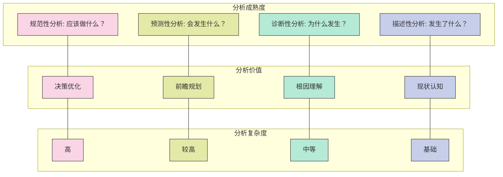

---
{"dg-publish":true,"tags":["商业分析","描述性分析","统计分析","数据可视化"],"创建日期":"2024-05-05","permalink":"/知识共享/002_商业分析/01_学习内容/03_分析方法与工具/3.1 描述性分析方法/","dgPassFrontmatter":true}
---

# 3.1 描述性分析方法

> [!quote] 概述
> 本文系统介绍描述性分析的基本概念、方法和应用场景。描述性分析是商业分析的基础环节，旨在通过统计学方法和数据可视化技术，将原始数据转化为可理解的业务信息，帮助决策者了解"发生了什么"。本文详细阐述了各类描述性统计指标、分析技术和可视化方法，并通过实例展示其在业务分析中的应用。

## 1. 描述性分析基础

### 1.1 描述性分析的定义与价值

描述性分析是商业分析的基础层次，它关注的核心问题是"已经发生了什么"。作为分析金字塔的底层，描述性分析为更高级的诊断性、预测性和规范性分析奠定基础。

**定义对比**：

根据国际商业分析师协会(IIBA)：
> "描述性分析是对历史数据进行总结，以理解已发生事件的分析方法。"

根据Gartner研究机构：
> "描述性分析回答'发生了什么'的问题，通过历史数据的汇总和归类，提供过去和当前状态的视图。"

根据麦肯锡全球研究所：
> "描述性分析是商业分析最基础的形式，将原始数据转化为业务背景下的信息。"

**描述性分析的核心价值**：

1. **建立事实基础**：提供客观的数据支持，消除决策中的猜测
2. **发现趋势与模式**：识别业务数据中的周期性、季节性和长期趋势
3. **异常监测**：及时发现数据异常，识别潜在问题或机会
4. **绩效衡量**：通过KPI跟踪和业务计分卡监控业务表现
5. **沟通基础**：为各级利益相关者提供共同的事实依据

### 1.2 描述性分析在分析体系中的位置

描述性分析是完整分析体系的基础层次，与其他类型分析形成递进关系：

**描述性分析与其他分析类型的关系**：

- **与诊断性分析的关系**：描述性分析识别"什么"，而诊断性分析解释"为什么"
- **与预测性分析的关系**：描述性分析总结过去，而预测性分析预估未来
- **与规范性分析的关系**：描述性分析提供现状，而规范性分析推荐行动

### 1.3 描述性分析的适用场景

描述性分析适用于多种商业场景，特别是需要了解历史表现和当前状态的情况：

**核心适用场景**：

1. **业务绩效监控**：跟踪销售、运营、财务等关键绩效指标
2. **市场分析**：了解市场份额、竞争格局和客户细分
3. **运营效率评估**：分析生产力、流程效率和资源利用率
4. **用户行为分析**：了解客户使用模式、偏好和满意度
5. **合规报告**：满足监管要求的标准化报告
6. **预算与财务规划**：基于历史模式进行资源分配

**行业特定应用**：

- **零售业**：销售趋势分析、库存水平监控、门店绩效比较
- **金融服务**：交易模式分析、风险指标监控、客户组合分析
- **制造业**：生产效率追踪、质量控制指标、供应链性能
- **医疗保健**：患者流量分析、资源利用率、临床指标监控
- **电子商务**：网站流量分析、转化率监控、客户旅程映射

## 2. 描述性统计技术

### 2.1 中心趋势测量

中心趋势测量旨在找到数据集的"典型"或"中心"值，是最基础的描述性统计指标：

**主要指标**：

1. **平均值(算术平均数)**
   - **计算方法**：所有值的总和除以值的数量
   - **公式**：$\bar{x} = \frac{\sum_{i=1}^{n} x_i}{n}$
   - **应用场景**：销售额平均值、客户平均支出、平均停留时间等
   - **优势**：直观、易于理解，考虑所有数据点
   - **局限性**：受极端值影响大

2. **中位数**
   - **计算方法**：将所有值按顺序排列后的中间值
   - **公式**：排序后的第$(n+1)/2$个值(当n为奇数)或中间两个值的平均(当n为偶数)
   - **应用场景**：收入分析、房价分析、响应时间等存在偏态分布的情况
   - **优势**：不受极端值影响，适合偏态分布
   - **局限性**：忽略了极端值的影响，可能丢失信息

3. **众数**
   - **计算方法**：出现频率最高的值
   - **公式**：$\text{Mode} = \{x_i | f(x_i) \geq f(x_j) \text{ for all } j\}$
   - **应用场景**：客户偏好分析、产品选择、购买频率等类别数据
   - **优势**：适用于类别数据，反映最常见的情况
   - **局限性**：可能存在多个众数，信息有限

**商业应用示例**：

- **零售业**：分析不同门店的平均销售额，使用中位数销售额剔除季节性波动影响
- **人力资源**：使用薪资中位数而非平均值，以避免极少数高管薪资影响整体分析
- **客户服务**：分析客户反馈评分的众数，了解最常见的客户体验

### 2.2 离散程度测量

离散程度测量用于评估数据的变异性或分散程度，帮助理解数据的稳定性和一致性：

**主要指标**：

1. **极差(Range)**
   - **计算方法**：最大值与最小值之差
   - **公式**：$R = \max(x) - \min(x)$
   - **应用场景**：初步了解数据的分散程度，适用于快速评估
   - **优势**：计算简单，易于理解
   - **局限性**：仅考虑极端值，忽略中间分布

2. **方差(Variance)**
   - **计算方法**：每个数据点与平均值差的平方和的平均值
   - **公式**：$\sigma^2 = \frac{\sum_{i=1}^{n} (x_i - \bar{x})^2}{n}$
   - **应用场景**：详细分析数据的波动性，风险评估
   - **优势**：考虑所有数据点，准确反映整体变异
   - **局限性**：单位是原数据的平方，难以直观解读

3. **标准差(Standard Deviation)**
   - **计算方法**：方差的平方根
   - **公式**：$\sigma = \sqrt{\frac{\sum_{i=1}^{n} (x_i - \bar{x})^2}{n}}$
   - **应用场景**：市场波动性、质量控制、风险评估
   - **优势**：与原数据单位相同，更易解读
   - **局限性**：受极端值影响

4. **变异系数(Coefficient of Variation)**
   - **计算方法**：标准差除以平均值
   - **公式**：$CV = \frac{\sigma}{\bar{x}} \times 100\%$
   - **应用场景**：比较不同单位或量级的数据集变异性
   - **优势**：无单位，便于跨数据集比较
   - **局限性**：平均值接近零时不适用

**商业应用示例**：

- **投资分析**：使用标准差评估不同投资组合的风险水平
- **质量控制**：监控生产过程中的标准差，确保产品一致性
- **市场研究**：使用变异系数比较不同市场的价格波动情况
- **预算规划**：分析历史支出的变异性，为应急资金设定合理水平

### 2.3 分布形态分析

分布形态分析帮助理解数据的整体结构和特征，为进一步分析提供基础：

**主要指标**：

1. **百分位数(Percentiles)**
   - **计算方法**：将有序数据分割成100个等份的值
   - **常用百分位**：四分位数(25%、50%、75%)、十分位数等
   - **应用场景**：薪资分布、产品价格范围、绩效评估
   - **公式**：$P_k$ 为排序后位于第 $k \times n/100$ 位置的值

2. **偏度(Skewness)**
   - **计算方法**：衡量分布的不对称程度
   - **公式**：$Skewness = \frac{\sum_{i=1}^{n} (x_i - \bar{x})^3}{n \times \sigma^3}$
   - **解读**：
     - 正偏度：右侧拖尾(大多数值较小)
     - 负偏度：左侧拖尾(大多数值较大)
     - 零偏度：对称分布
   - **应用场景**：收入分布、反应时间、投资回报分析

3. **峰度(Kurtosis)**
   - **计算方法**：衡量分布尾部"厚重"程度
   - **公式**：$Kurtosis = \frac{\sum_{i=1}^{n} (x_i - \bar{x})^4}{n \times \sigma^4}$
   - **解读**：
     - 高峰度：极端值出现频率高于正态分布
     - 低峰度：极端值出现频率低于正态分布
   - **应用场景**：金融市场波动、风险评估、异常检测

**商业应用示例**：

- **收入分析**：评估员工薪资的偏度，识别薪酬结构问题
- **销售预测**：利用销售数据的分布特征进行更准确的预测
- **风险管理**：分析投资回报的峰度，评估极端事件概率
- **客户细分**：使用消费分布特征区分不同客户群体

### 2.4 相关性分析

相关性分析用于衡量两个或多个变量之间的线性关系强度：

**主要方法**：

1. **皮尔逊相关系数(Pearson Correlation Coefficient)**
   - **计算方法**：测量两个连续变量间的线性关系
   - **公式**：$r = \frac{\sum_{i=1}^{n} (x_i - \bar{x})(y_i - \bar{y})}{\sqrt{\sum_{i=1}^{n} (x_i - \bar{x})^2 \sum_{i=1}^{n} (y_i - \bar{y})^2}}$
   - **取值范围**：-1(完全负相关)到+1(完全正相关)，0表示无线性相关
   - **应用场景**：销售与广告支出、价格与需求量、员工满意度与生产力

2. **斯皮尔曼等级相关系数(Spearman's Rank Correlation)**
   - **计算方法**：测量两个变量的排序关系
   - **特点**：不要求数据呈线性关系，适用于有序数据
   - **应用场景**：客户满意度与忠诚度、产品排名与价格排名

3. **交叉表与卡方检验(Contingency Tables & Chi-square Test)**
   - **计算方法**：分析两个类别变量之间的关联
   - **应用场景**：市场细分分析、客户特征与购买行为关系、产品特性与故障率

**商业应用示例**：

- **营销效果分析**：评估广告支出与销售额之间的相关性
- **产品开发**：分析产品特性与客户满意度的关系
- **价格策略**：了解价格调整与销售量的相关程度
- **人力资源**：探索培训投入与员工绩效的关联

## 3. 数据可视化方法

### 3.1 单变量可视化技术

单变量可视化技术用于展示单个变量的分布和特性：

**主要图表类型**：

1. **柱状图(Bar Chart)**
   - **适用数据**：类别变量或离散变量
   - **优势**：直观展示各类别频率或数量比较
   - **商业应用**：产品销量比较、渠道绩效分析、客户细分占比
   - **最佳实践**：
     - 按数值大小排序，提高可读性
     - 使用一致的颜色编码，突出关键信息
     - 添加数据标签，提供精确值

2. **直方图(Histogram)**
   - **适用数据**：连续变量
   - **优势**：展示数据分布形态、频率和密度
   - **商业应用**：客户年龄分布、交易金额分析、响应时间分布
   - **最佳实践**：
     - 选择适当的区间数量(通常10-20个)
     - 考虑使用密度曲线增强理解
     - 标注关键统计量(平均值、中位数等)

3. **箱线图(Box Plot)**
   - **适用数据**：连续变量
   - **优势**：同时展示中心趋势、离散程度和异常值
   - **组成部分**：最小值、第一四分位数、中位数、第三四分位数、最大值和离群点
   - **商业应用**：销售业绩分布、运营指标比较、成本变异分析
   - **最佳实践**：
     - 使用并排箱线图进行组间比较
     - 清晰标注异常值
     - 配合均值指示，增加信息量

4. **饼图与环形图(Pie & Donut Charts)**
   - **适用数据**：组成比例数据
   - **优势**：直观展示整体中的部分占比
   - **商业应用**：市场份额、预算分配、收入来源构成
   - **局限性**：难以精确比较多个类别
   - **最佳实践**：
     - 限制类别数量(建议不超过7个)
     - 按大小排序类别
     - 只在强调占比关系时使用 

### 3.2 多变量可视化技术

多变量可视化技术用于展示两个或多个变量之间的关系和模式：

**主要图表类型**：

1. **散点图(Scatter Plot)**
   - **适用数据**：两个连续变量
   - **优势**：直观展示变量间的相关性和模式
   - **商业应用**：价格与销量关系、广告支出与转化率、员工满意度与生产力
   - **增强技术**：
     - 添加趋势线展示关系方向
     - 使用气泡大小表示第三个变量
     - 使用颜色编码展示分组信息
   - **最佳实践**：
     - 保持适当的纵横比，不扭曲相关性
     - 标注异常点和关键数据点
     - 考虑添加置信区间

2. **热图(Heat Map)**
   - **适用数据**：三个变量的关系或相关矩阵
   - **优势**：使用颜色强度表示数值大小，适合大量数据点
   - **商业应用**：产品特性相关性、客户细分分析、时间模式识别
   - **最佳实践**：
     - 使用直观的颜色编码(通常红/蓝或单色渐变)
     - 添加数值标签增强精确度
     - 对行列进行排序，突出模式

3. **多系列图表(Multi-series Charts)**
   - **类型**：多系列线图、堆叠柱状图、分组柱状图等
   - **适用数据**：同一指标在不同类别或时间段的比较
   - **商业应用**：不同产品线销售趋势、区域绩效比较、市场份额变化
   - **最佳实践**：
     - 限制系列数量(通常不超过5-7个)
     - 使用一致的颜色编码
     - 考虑交互式功能，允许筛选特定系列

4. **平行坐标图(Parallel Coordinates Plot)**
   - **适用数据**：多维数据集的探索
   - **优势**：同时展示多个变量的关系和模式
   - **商业应用**：产品特性比较、客户多维度特征分析、复杂性能指标
   - **最佳实践**：
     - 适当排序坐标轴以显示相关模式
     - 使用交互式筛选突出特定模式
     - 对数据进行标准化处理，使比较更有意义

### 3.3 时间序列可视化

时间序列可视化专注于展示数据随时间变化的趋势、模式和异常：

**主要图表类型**：

1. **线图(Line Chart)**
   - **适用数据**：连续时间序列数据
   - **优势**：清晰展示趋势、周期性模式和异常点
   - **商业应用**：销售趋势、网站流量、股价变动、客户增长
   - **最佳实践**：
     - 选择适当的时间刻度(日、周、月、季、年)
     - 标注关键事件点
     - 考虑使用移动平均线减少噪声

2. **面积图(Area Chart)**
   - **适用数据**：累积时间序列数据
   - **优势**：强调数值大小和比例变化
   - **商业应用**：市场份额变化、产品组合贡献、收入构成趋势
   - **类型**：
     - 普通面积图：展示单一系列的变化
     - 堆叠面积图：展示整体与部分的关系
     - 百分比面积图：强调比例变化
   - **最佳实践**：
     - 限制类别数量，避免视觉混乱
     - 使用半透明效果增强可读性
     - 在堆叠图中将重要类别放在底部

3. **烛台图(Candlestick Chart)**
   - **适用数据**：高、低、开、收四个数值点的时间序列
   - **优势**：同时展示价格范围和方向变化
   - **商业应用**：股票分析、商品价格、汇率波动
   - **最佳实践**：
     - 使用一致的颜色编码(通常红色表示下跌，绿色表示上涨)
     - 搭配成交量或其他指标使用
     - 标注关键的转折点

4. **瀑布图(Waterfall Chart)**
   - **适用数据**：累积效应的分解
   - **优势**：展示起始值到终值的变化过程
   - **商业应用**：收入增长分析、成本结构变化、预算变动解释
   - **最佳实践**：
     - 使用不同颜色区分正负贡献
     - 清晰标注中间值和最终值
     - 排序变化因素，增强可读性

### 3.4 地理空间可视化

地理空间可视化用于展示具有地理属性的数据分布和关系：

**主要图表类型**：

1. **地图热图(Choropleth Map)**
   - **适用数据**：按地理区域聚合的指标
   - **优势**：直观展示地理分布模式和区域差异
   - **商业应用**：销售区域分析、市场渗透率、客户密度分布
   - **最佳实践**：
     - 使用渐变色方案，避免视觉扭曲
     - 标准化数据(如人均值)，避免受地区大小影响
     - 提供清晰的图例和比例尺

2. **气泡地图(Bubble Map)**
   - **适用数据**：具有位置和大小属性的点数据
   - **优势**：同时展示位置、数量和分类信息
   - **商业应用**：门店绩效、配送中心覆盖、客户集中度
   - **最佳实践**：
     - 调整气泡大小，避免重叠和视觉混乱
     - 使用颜色表示分类或额外维度
     - 提供交互功能，如悬停详情和缩放

3. **流线图(Flow Map)**
   - **适用数据**：从一个地点到另一个地点的流动
   - **优势**：展示移动方向、数量和路径
   - **商业应用**：供应链流动、客户迁移、贸易流动分析
   - **最佳实践**：
     - 使用线条粗细表示流量大小
     - 应用适当的弯曲度，避免线条重叠
     - 考虑使用交互式筛选，聚焦特定路径

## 4. 描述性分析工具与技术

### 4.1 仪表板设计

有效的仪表板是展示描述性分析结果的关键工具，需要遵循特定的设计原则：

**仪表板设计原则**：

1. **明确目标受众和用途**
   - 高管仪表板：聚焦关键绩效指标和战略视图
   - 运营仪表板：详细的日常指标和行动导向信息
   - 分析仪表板：探索性数据视图和深度钻取能力

2. **遵循"从上到下，从左到右"的信息流**
   - 最重要的信息放在左上角
   - 相关信息分组布局
   - 保持视觉层次结构一致

3. **减少认知负荷**
   - 限制单个仪表板中的图表数量(通常5-9个)
   - 消除无关装饰和干扰元素
   - 使用一致的颜色编码和格式

4. **提供上下文**
   - 包含比较基准(如预算、目标、历史平均)
   - 添加趋势指示器和变化百分比
   - 包含必要的注释和解释

5. **支持不同层次的探索**
   - 提供摘要视图和详细视图
   - 设计直观的导航和筛选机制
   - 支持按需深入分析的功能

**仪表板组件类型**：

1. **KPI卡片**：展示关键指标的当前值和变化
2. **趋势图表**：显示关键指标的时间变化
3. **比较图表**：对不同类别、时期或部门进行比较
4. **分布图表**：展示数据的分布特征
5. **详情表格**：提供支持数据和细节
6. **筛选器与交互控件**：支持自定义视图和探索 

### 4.2 报表自动化

报表自动化是提高描述性分析效率和一致性的关键技术：

**主要自动化方法**：

1. **定时数据刷新**
   - 设置固定周期(日、周、月)的自动数据更新
   - 确保依赖于报表的决策基于最新信息
   - 降低手动更新的错误风险

2. **参数化报表**
   - 使用动态参数控制数据范围、维度和筛选条件
   - 一份报表模板服务于多种业务场景
   - 支持自助式报表定制

3. **警报与异常通知**
   - 设置KPI阈值触发自动提醒
   - 主动发现数据异常和业务问题
   - 提供实时响应机制

4. **报表分发自动化**
   - 按计划自动生成和分发报表
   - 个性化报表内容和格式
   - 多渠道分发(电子邮件、内部门户、协作平台)

**工具选择考量**：

- **企业BI平台**：Power BI, Tableau, Qlik, MicroStrategy
- **开源解决方案**：Apache Superset, Redash, Metabase
- **编程环境**：Python(Pandas, Matplotlib), R(ggplot2, Shiny)
- **电子表格增强**：Excel进阶功能, Google Sheets脚本

### 4.3 描述性分析的局限性

了解描述性分析的固有局限性有助于正确应用和解释分析结果：

**主要局限性**：

1. **只关注过去事件**
   - 描述"已经发生什么"，不直接预测未来
   - 可能在快速变化的环境中失去相关性
   - 需要与预测分析结合使用

2. **相关性不等于因果关系**
   - 识别变量间的关联，但不能确定因果
   - 可能导致错误的决策依据
   - 需要配合诊断性分析找出根本原因

3. **聚合可能掩盖重要细节**
   - 高级汇总可能掩盖细分层面的问题
   - 平均值可能掩盖双峰分布等复杂模式
   - 需要适当深入分析，避免错误结论

4. **数据质量依赖**
   - 遵循"垃圾进，垃圾出"原则
   - 数据缺失或错误会严重影响结果可靠性
   - 需要严格的数据治理和质量控制

**克服局限性的策略**：

- **结合多种分析类型**：将描述性分析与诊断性、预测性分析结合
- **适当深入分析**：在汇总层面发现问题后深入细分
- **多角度验证**：使用不同数据源和方法交叉验证发现
- **定期更新分析**：确保分析反映最新的业务环境

## 5. 行业应用案例

### 5.1 零售业：沃尔玛的描述性分析应用

**背景**：沃尔玛作为全球最大的零售商，每天处理数百万笔交易和客户互动，需要强大的描述性分析能力来支持决策。

**分析方法与工具**：

1. **销售绩效仪表板**
   - 多层次KPI监控：公司、区域、门店、部门、SKU级别
   - 同比和环比比较，突出异常和趋势
   - 集成天气数据等外部因素的影响分析

2. **库存优化分析**
   - 周转率和库存水平热图
   - 季节性模式识别和自动调整
   - 过度/不足库存预警系统

3. **客户行为分析**
   - 购物篮分析识别产品关联性
   - 顾客购买频率和价值分布
   - 促销响应模式分析

**业务影响**：
- 库存周转率提高12%，库存成本降低8%
- 促销有效性提升22%，减少无效促销投入
- 门店布局优化增加客单价4.5%

**关键成功因素**：
- 整合线上和线下数据源
- 为门店经理提供自助分析工具
- 建立统一的指标定义和计算方法

### 5.2 金融服务：摩根大通的风险监控系统

**背景**：2008年金融危机后，摩根大通加强了风险监控系统，大量依靠描述性分析识别潜在风险信号。

**分析方法与工具**：

1. **市场风险仪表板**
   - 关键风险指标(VaR、Beta、压力测试结果)可视化
   - 风险暴露热图按资产类别和地区
   - 风险指标超过阈值的自动警报

2. **客户信用风险分析**
   - 信用评分分布和迁移分析
   - 违约率趋势和季节性模式
   - 行业和地区集中度风险分析

3. **流动性风险监控**
   - 资产负债期限缺口分析
   - 流动性覆盖率实时监控
   - 资金来源多样性指标

**业务影响**：
- 提前识别风险暴露，降低非预期损失约17%
- 优化资本分配，提高风险调整后回报率5%
- 监管合规水平提高，减少合规成本和罚款

**关键成功因素**：
- 实时数据集成和处理能力
- 多层次风险指标体系设计
- 自动化预警和上报机制

### 5.3 医疗保健：克利夫兰诊所的运营效率分析

**背景**：克利夫兰诊所面临医疗成本上升和资源有限的挑战，利用描述性分析优化运营流程和资源分配。

**分析方法与工具**：

1. **患者流量分析**
   - 分时段患者到达模式可视化
   - 不同科室和服务的等待时间分布
   - 预约与实际到诊率比较

2. **资源利用率仪表板**
   - 医生、护士和设备的实时利用率
   - 手术室周转时间和空闲分析
   - 床位占用率和周转率监控

3. **临床流程分析**
   - 关键临床路径的时间分析
   - 治疗方案一致性评估
   - 患者满意度与医疗结果的分布分析

**业务影响**：
- 平均等待时间减少23%，提高患者满意度
- 手术室利用率提高15%，增加收入同时降低成本
- 床位周转率提高8%，提升接诊能力

**关键成功因素**：
- 整合电子医疗记录和运营数据
- 针对不同医疗专业设计的仪表板
- 将分析结果融入日常工作流程

## 6. 实践与自我评估

### 6.1 描述性分析练习场景

**练习1：零售销售分析**

假设你是一家零售连锁店的商业分析师，获得了过去12个月的销售数据，包括日期、门店、产品类别、销售额和数量。

**任务**：
1. 计算每个门店的月度销售额、平均交易价值和销售增长率
2. 分析产品类别的销售分布和季节性模式
3. 识别表现最好和最差的门店，并分析可能原因
4. 设计一个销售绩效仪表板，展示关键发现

**提示**：
- 考虑使用多种中心趋势和离散度指标
- 使用热图展示季节性模式
- 结合柱状图和线图展示趋势和比较
- 添加适当的上下文和比较基准

**练习2：客户行为分析**

假设你是一家电子商务公司的分析师，有一个包含客户人口统计、购买历史和网站互动数据的数据集。

**任务**：
1. 分析客户价值分布(RFM分析)
2. 计算和可视化客户留存率及其变化趋势
3. 分析购买频率、客单价和产品类别偏好的相关性
4. 设计一个客户洞察仪表板，指导营销决策

**提示**：
- 使用箱线图展示客户价值分布
- 考虑热图展示客户特征与购买行为的关系
- 使用分组柱状图比较不同客户群体
- 添加时间趋势分析，识别模式变化

### 6.2 自我评估问题

通过回答以下问题，评估你对描述性分析方法的理解：

1. 什么情况下中位数比平均值更适合作为中心趋势度量？举例说明。
2. 为什么变异系数对比较不同单位的数据集很有用？
3. 如何识别数据中的偏度，它对业务分析有何影响？
4. 描述正相关、负相关和零相关各自在商业环境中的一个例子。
5. 什么时候散点图比其他图表更有效？什么时候它不是最佳选择？
6. 如何在仪表板设计中平衡信息全面性和简洁性？
7. 描述性分析如何与其他类型的分析(诊断性、预测性、规范性)结合，形成完整的分析流程？
8. 自动化报表的主要优势和潜在风险是什么？
9. 如何确保描述性分析结果易于被非技术人员理解？
10. 描述一个你在工作中应用描述性分析解决的问题，你使用了哪些方法和工具？

## 7. 延伸阅读与资源

### 7.1 推荐书籍

- Few, S. (2012). *Show Me the Numbers: Designing Tables and Graphs to Enlighten*. Analytics Press.
- Knaflic, C. N. (2015). *Storytelling with Data: A Data Visualization Guide for Business Professionals*. Wiley.
- Tufte, E. R. (2001). *The Visual Display of Quantitative Information*. Graphics Press.
- Wickham, H., & Grolemund, G. (2017). *R for Data Science*. O'Reilly Media.
- Weber, J. H. (2018). *Dashboard Design Principles and Best Practices*. Packt Publishing.

### 7.2 在线资源

- Tableau公共画廊: [https://public.tableau.com/gallery](https://public.tableau.com/gallery)
- Power BI社区: [https://community.powerbi.com](https://community.powerbi.com)
- Data Visualization Society: [https://www.datavisualizationsociety.org](https://www.datavisualizationsociety.org)
- Chartio的数据可视化指南: [https://chartio.com/learn/data-visualization](https://chartio.com/learn/data-visualization)
- FiveThirtyEight数据可视化博客: [https://fivethirtyeight.com/tag/data-visualization](https://fivethirtyeight.com/tag/data-visualization)

### 7.3 工具与技术资源

- **商业智能工具**
  - Tableau: [https://www.tableau.com/learn](https://www.tableau.com/learn)
  - Microsoft Power BI: [https://powerbi.microsoft.com/learning](https://powerbi.microsoft.com/learning)
  - Qlik Sense: [https://www.qlik.com/us/learn](https://www.qlik.com/us/learn)

- **编程环境**
  - Python数据分析: Pandas, Matplotlib, Seaborn
  - R数据可视化: ggplot2, plotly, highcharter
  - JavaScript可视化库: D3.js, Chart.js, Highcharts

- **在线课程**
  - Coursera: Data Visualization with Tableau
  - edX: Data Analysis for Decision Making
  - DataCamp: Data Visualization for Everyone

## 8. 相关概念链接

- [[知识共享/002_商业分析/01_学习内容/02_数据收集与处理/2.1 数据收集与处理基础\|02_数据收集与处理/2.1 数据收集与处理基础]]
- [[知识共享/002_商业分析/01_学习内容/02_数据收集与处理/2.3 数据可视化技术\|02_数据收集与处理/2.3 数据可视化技术]]
- [[知识共享/002_商业分析/01_学习内容/03_分析方法与工具/3.2 诊断性分析方法\|03_分析方法与工具/3.2 诊断性分析方法]]
- [[知识共享/002_商业分析/01_学习内容/03_分析方法与工具/3.5 Excel高级分析技巧\|03_分析方法与工具/3.5 Excel高级分析技巧]]
- [[知识共享/002_商业分析/01_学习内容/03_分析方法与工具/3.8 数据可视化最佳实践\|03_分析方法与工具/3.8 数据可视化最佳实践]] 